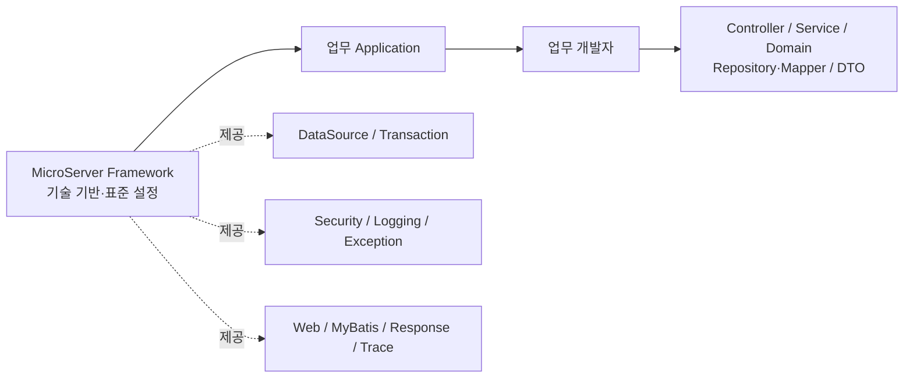
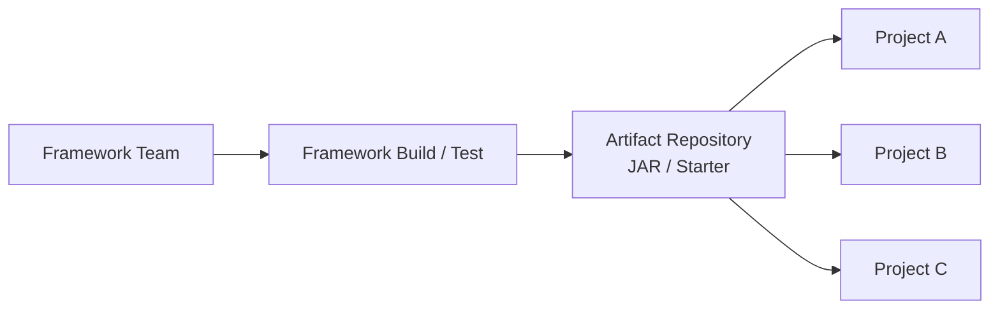
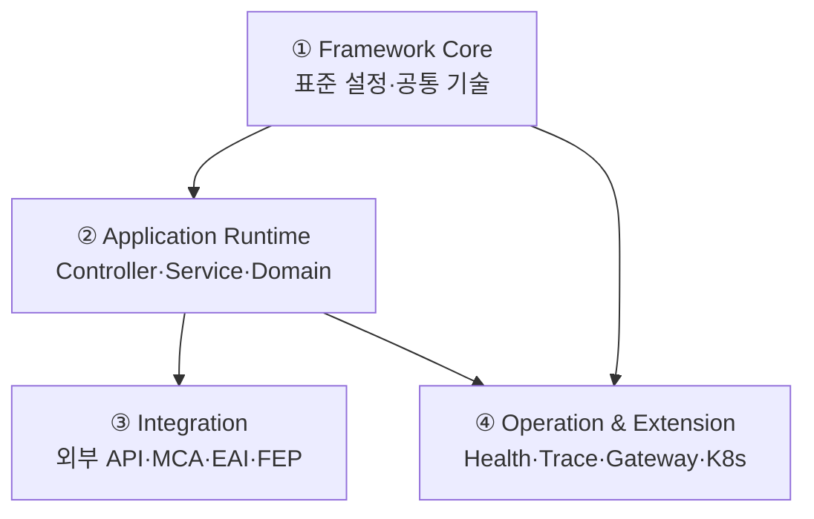
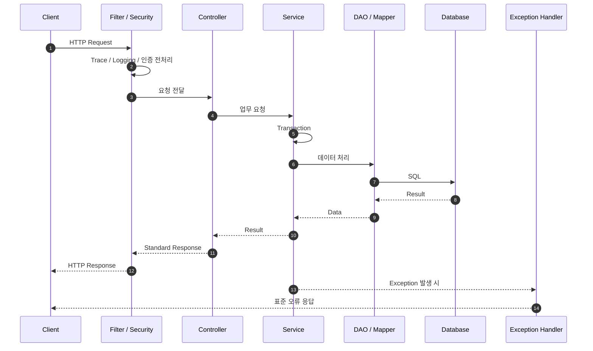

# 마이크로서버란?

## 1. MicroServer를 한 문장으로 정의하면

**MicroServer는 금융 SI 프로젝트에서 반복되는 기술 기반과 공통 기능을 표준화하여, 업무 개발자가 업무 로직에 집중할 수 있도록 제공하는 Spring Boot 기반 금융 SI 표준 Framework / Reference Architecture입니다.**

단순한 샘플 프로젝트나 공통 Utility 모음이 아닙니다. 프로젝트마다 반복해서 구성하던 DataSource, Transaction, Security, Logging, Exception, Web/MyBatis 공통 설정, 공통 Response, Trace, Cache, 금융 연계 기반 등을 프레임워크가 책임지고, 업무 프로젝트는 고객·계좌·상품·주문과 같은 Domain 개발에 집중하도록 만드는 것이 핵심입니다.



> **핵심 원칙**  
> 업무 개발자는 업무를 개발하고, 기술 기반과 표준 설정은 MicroServer가 책임합니다.

---

## 2. 왜 MicroServer를 만드는가

금융 SI 프로젝트는 프로젝트가 달라도 비슷한 기술 요소를 반복해서 구현하는 경우가 많습니다.

- 프로젝트 기본 구조와 Build 정책
- DataSource / Transaction / MyBatis
- 인증·인가와 Security Filter
- 요청/응답 Logging, Trace ID
- 공통 Exception / Response
- 공통 코드와 기준정보 Cache
- 외부 API 및 MCA / EAI / FEP 연계
- 운영을 위한 Health Check, Logging, 배포 기준

이 기능을 프로젝트마다 새로 만들면 개발 방식이 달라지고, 품질 편차와 유지보수 비용이 커집니다. MicroServer는 반복되는 기술을 **표준 프레임워크 자산**으로 만들고 다음 프로젝트에서 다시 사용할 수 있도록 합니다.

---

## 3. MicroServer의 주요 특장점

### 3.1 업무와 기술 기반을 분리합니다

업무 개발자는 프레임워크 내부 설정을 몰라도 표준 기능을 사용할 수 있어야 합니다.

```text
업무 개발자                         MicroServer Framework
─────────────────                 ─────────────────────────
Controller                         DataSource / Transaction
Service                            Security
Domain                             Logging / Trace
Repository / Mapper                Exception / Response
DTO                                Web / MyBatis 공통 설정
업무 Validation / Rule             Cache / Integration 기반
```

### 3.2 공통 프레임워크를 JAR로 제공합니다

최종적으로 공통 프레임워크와 업무 프로젝트는 물리적으로 분리하고, 업무 프로젝트는 버전이 부여된 JAR/Starter를 의존성으로 사용하는 구조를 지향합니다.



이 구조는 프레임워크의 임의 수정 방지, 버전 관리, 프로젝트별 재사용, 변경 영향 분리에 유리합니다.

### 3.3 기본 제공 + 제한적 확장을 원칙으로 합니다

모든 프로젝트가 설정 클래스를 다시 만드는 방식이 아니라 **Convention over Configuration**을 기본으로 합니다. 일반적인 경우에는 MicroServer 기본 설정을 사용하고, 특수한 프로젝트 요구가 있을 때만 명확한 확장 지점에서 Override합니다.

### 3.4 금융 SI의 연계 구조까지 고려합니다

일반 REST API뿐 아니라 전문 기반 MCA / EAI / FEP 연계를 업무 Service에서 분리합니다. 업무 Service는 “무엇을 요청할지”에 집중하고 전문 생성, Parsing, Encoding, Timeout, 통신 Adapter는 Integration 영역이 담당합니다.

### 3.5 처음부터 거대한 MSA를 만들지 않습니다

기본 Spring Boot MVC 구조와 공통 기능을 먼저 안정화한 뒤 WebClient, Gateway, WebFlux, Service Discovery, Kubernetes를 **필요성이 확인되는 순서로 확장**합니다.

---

## 4. MicroServer는 어떻게 구성되는가

MicroServer의 핵심 구조는 크게 네 영역으로 이해하면 쉽습니다.



| 영역 | 핵심 내용 |
|---|---|
| Framework Core | DataSource, Transaction, Security, Logging, Exception, Response, Filter/AOP, Cache 기반 |
| Application Runtime | Controller, Service, Domain, Repository/Mapper, DTO 등 실제 업무 기능 |
| Integration | 외부 REST, 전문 Builder/Parser, MCA/EAI/FEP Adapter |
| Operation & Extension | Health Check, Trace, Gateway, WebFlux, Service Discovery, Kubernetes 등 단계적 확장 |

---

## 5. 요청은 어떻게 처리되는가

일반적인 업무 API는 다음 흐름을 기본으로 합니다.



Controller는 요청과 응답, Service는 업무 흐름과 Transaction, DAO/Mapper는 데이터 접근에 집중합니다. Filter와 AOP는 Logging, Trace 등 횡단 관심사를 업무 코드 밖으로 분리합니다.

---

## 6. 아키텍처의 핵심 원칙

MicroServer 아키텍처는 다음 순서로 이해하면 됩니다.

1. **Framework와 Domain을 분리한다.** 공통 기술은 프레임워크가, 업무 기능은 업무 프로젝트가 책임집니다.
2. **Framework 내부도 책임 단위로 분리한다.** 공통 Core, Runtime, Admin/운영, Integration 등을 목적에 맞게 모듈화합니다.
3. **요청 처리 책임을 계층별로 명확히 한다.** Filter → Controller → Service → DAO/Mapper의 역할을 섞지 않습니다.
4. **데이터·보안·예외·로그를 표준화한다.** 프로젝트마다 다른 구현이 생기지 않도록 기본 정책을 제공합니다.
5. **금융 연계를 업무 코드와 분리한다.** 전문과 통신의 복잡성을 Integration Layer가 감쌉니다.
6. **운영과 확장은 단계적으로 적용한다.** 기본 구조를 완성한 뒤 필요한 기술만 확장합니다.

아래의 **마이크로서버 아키텍처 상세** 메뉴는 이 여섯 원칙의 중요도와 이해 순서에 맞춰 구성합니다.
