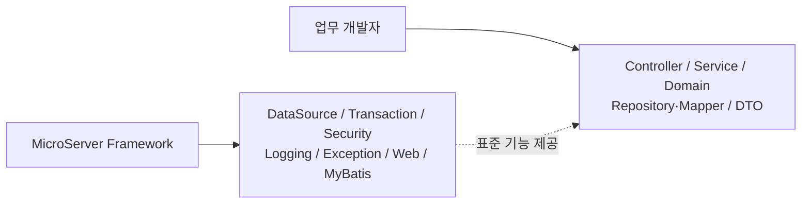

# 핵심 설계 원칙

## 1. 가장 중요한 목표

MicroServer의 출발점은 기술을 많이 넣는 것이 아니라 **업무 개발자가 업무에 집중할 수 있는 개발 경험**을 만드는 것입니다.



## 2. 책임 분리

업무 개발자는 고객·계좌·상품·주문 등 비즈니스 요구사항을 구현합니다. 반대로 DataSource 설정, Transaction Manager, Security Filter Chain, Logging, Web/MyBatis 공통 설정 등은 프레임워크의 책임으로 둡니다.

업무 프로젝트마다 `DataSourceConfig`, `SecurityConfig`, `WebConfig`, `MyBatisConfig`를 반복해서 작성하는 구조는 지양합니다.

## 3. Convention over Configuration

기본 설정은 MicroServer가 제공합니다. 업무 프로젝트는 Starter/JAR 의존성을 추가하면 표준 기능을 사용할 수 있는 방향을 지향합니다.

```gradle
dependencies {
    implementation("com.company.microserver:microserver-starter:<version>")
}
```

특수 요구사항은 제한된 확장 지점에서만 Override하도록 설계합니다.

## 4. 핵심 원칙 요약

- **Separation of Concerns**: 업무와 기술 공통을 분리합니다.
- **Framework Encapsulation**: 내부 설정 복잡성을 업무 개발자에게 노출하지 않습니다.
- **Standardization**: 프로젝트마다 다른 공통 구현을 줄입니다.
- **Extensibility**: 기본값은 강하게 제공하되 필요한 확장 지점은 열어둡니다.
- **Step-by-step**: 설계만 크게 만들지 않고 실제 실행·테스트를 통해 단계적으로 완성합니다.
