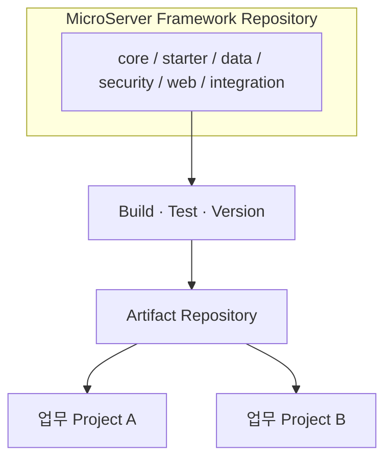

# Framework와 업무 Domain 분리

## 1. 왜 물리적으로 분리하는가

초기 학습/구축 과정에서는 하나의 Gradle Multi-Project 안에서 공통 모듈과 실행 모듈을 함께 만들 수 있습니다. 그러나 **재사용 가능한 표준 Framework**라는 최종 목표를 생각하면 공통 Framework와 업무 Domain 프로젝트는 별도 Repository/배포 주기로 분리하는 것이 적합합니다.



## 2. 분리했을 때 얻는 효과

- 업무 개발자에게 프레임워크 내부 소스를 불필요하게 노출하지 않습니다.
- 프로젝트별 임의 수정으로 표준이 갈라지는 것을 줄입니다.
- Framework와 업무 기능의 배포 주기를 분리할 수 있습니다.
- 어떤 프로젝트가 어떤 Framework 버전을 사용했는지 추적하기 쉽습니다.
- 검증된 JAR을 여러 프로젝트에서 재사용할 수 있습니다.

## 3. 멀티모듈과 별도 Repository의 역할

둘은 서로 반대 개념이 아닙니다.

```text
Framework Repository
└─ Gradle Multi-Project
   ├─ microserver-core
   ├─ microserver-web
   ├─ microserver-data
   ├─ microserver-security
   └─ microserver-starter

Business Repository
└─ 실제 업무 애플리케이션
   └─ microserver-starter:<version> 사용
```

즉 **Framework 내부는 멀티모듈**, **Framework와 업무 프로젝트 사이는 Artifact 의존성**으로 분리하는 방향입니다.
