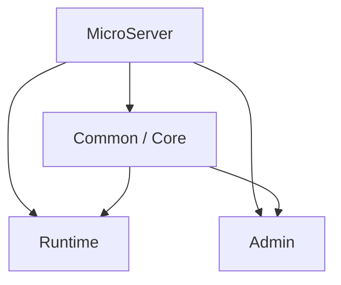

# Framework 모듈 및 프로젝트 구조

## 1. 멀티모듈의 목적

Gradle Multi-Project는 디렉터리를 나누기 위한 것이 아니라 **프레임워크 내부 책임과 의존성을 명확히 하기 위한 수단**입니다.

초기 구축에서는 `module-common`, `runtime`, `admin`과 같은 단순한 구조에서 시작해 실제 구현 결과를 보며 세분화합니다.

## 2. 초기 역할

| 모듈 | 역할 |
|---|---|
| Common/Core | Response, Exception, Logging, Trace, Filter/AOP, Utility, Data/Security 기반 |
| Runtime | 실제 Spring Boot 실행 및 업무 기능 검증 |
| Admin | 공통 코드·설정·운영 관리 기능의 확장 후보 |

구축이 진행되면 Core 내부를 `data`, `security`, `web`, `integration`, `starter` 등으로 분리할 수 있습니다. 분리는 기능 수가 아니라 **변경 이유와 책임**을 기준으로 결정합니다.

## 3. 의존성 원칙

- 하위 기술 모듈이 업무 모듈을 참조하지 않습니다.
- 실행 애플리케이션은 필요한 공통 모듈을 사용합니다.
- 공통 모듈끼리 순환 의존성을 만들지 않습니다.
- 실행이 필요 없는 공통 모듈은 일반 Java Library JAR로 구성합니다.
