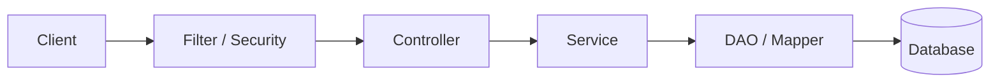
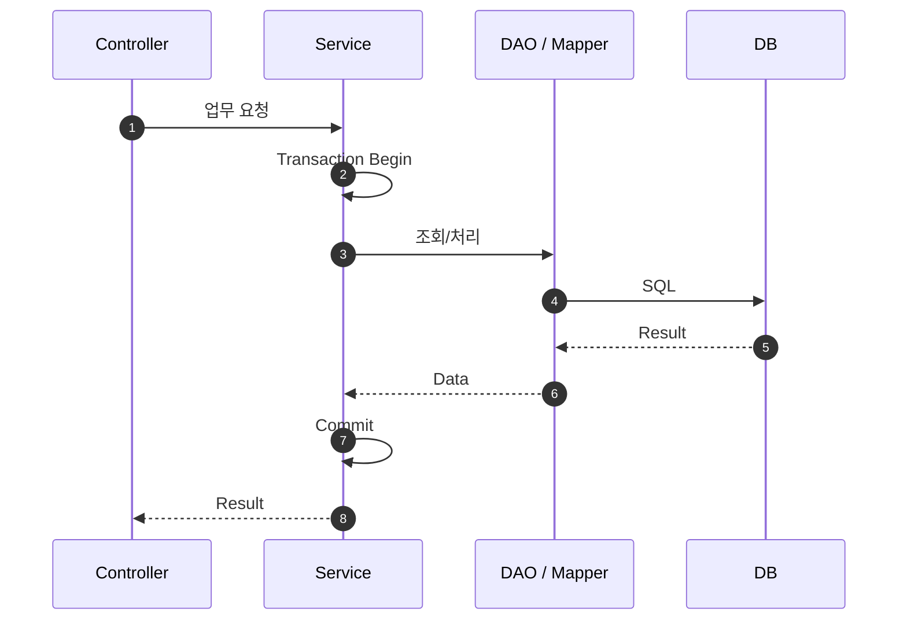

# 요청 처리 및 애플리케이션 계층 구조

## 1. 기본 요청 흐름

## 2. 계층별 책임

### Controller

HTTP 요청 Mapping, 입력 Validation, Service 호출, 응답 반환에 집중합니다. 복잡한 업무 규칙과 SQL 처리를 두지 않습니다.

### Service

업무 처리의 중심입니다. 여러 DAO/외부 연계를 조합하고 **Transaction의 기본 단위**를 관리합니다.

### DAO / Mapper

Database 접근과 SQL 실행에 집중합니다. 업무 흐름을 판단하지 않습니다.

### DTO / Domain

계층 사이의 데이터 전달과 업무 개념을 표현합니다. 외부 API 계약과 내부 Domain 모델은 필요에 따라 분리합니다.

## 3. 정상 처리 시퀀스

예외가 발생하면 Service Transaction은 Rollback되고, 공통 Exception Handler가 표준 오류 응답을 생성하는 방향으로 구성합니다.
