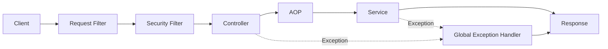

# 공통 처리 구조

## 1. 업무 코드에서 횡단 관심사를 분리합니다

요청/응답 Logging, Trace ID, Header 검증, 실행시간, 공통 예외와 응답 처리를 Controller/Service마다 반복하지 않습니다.

## 2. Filter와 AOP의 역할

- **Filter**: HTTP 요청의 가장 앞단에서 Trace, Logging, Header, 인증 전처리처럼 모든 요청에 적용되는 처리를 담당합니다.
- **AOP**: 특정 Annotation, Service 메서드, 업무 실행시간 등 Spring Bean 실행 지점의 횡단 관심사를 담당합니다.

둘의 역할을 중복시키지 않습니다.

## 3. 표준 예외와 응답

Service/Controller에서 발생한 예외는 공통 Handler로 모아 오류 코드, 메시지, Trace ID를 포함한 일관된 응답으로 변환합니다. 정상 응답도 프로젝트 표준 계약을 기준으로 제공합니다.
