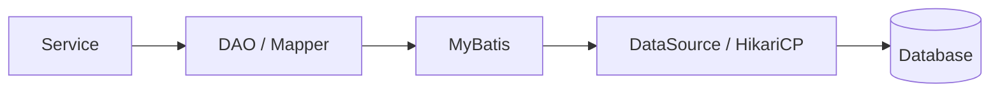
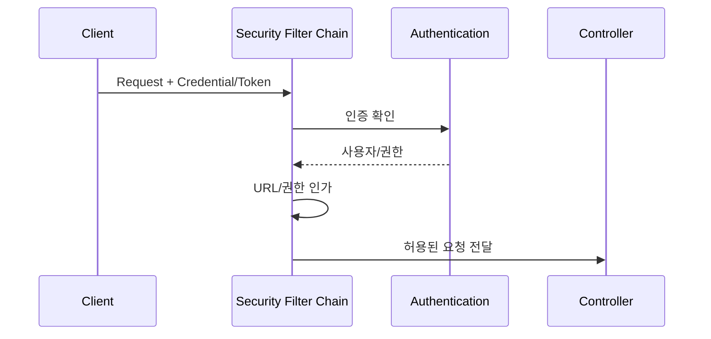

# 데이터 및 보안 아키텍처

## 1. 데이터 접근

업무 Service가 DataSource를 직접 다루지 않고 DAO/Mapper를 통해 접근합니다.

DataSource, SqlSessionFactory/Template, TransactionManager 등의 공통 설정은 Framework가 제공합니다. 초기에는 단일 DataSource를 완성한 뒤 Framework DB, Domain DB, Legacy DB 등 Multi DataSource가 필요한 경우 확장합니다.

## 2. Transaction

Transaction의 기본 업무 단위는 Service 계층입니다. 여러 DAO 작업을 하나의 업무 단위로 묶고 실패 시 Rollback할 수 있어야 합니다.

## 3. Security

Spring Security를 기반으로 인증과 인가를 중앙화합니다.

비밀번호, DB 접속정보, Token Secret 등 민감정보는 소스에 평문으로 포함하지 않는 것을 원칙으로 합니다.

## 4. 업무 개발자 관점

내부적으로 DataSource와 Security 구성이 복잡하더라도 업무 개발자는 기본 Domain DataSource와 인증된 사용자 정보를 **표준 방식으로 자연스럽게 사용**할 수 있어야 합니다.
