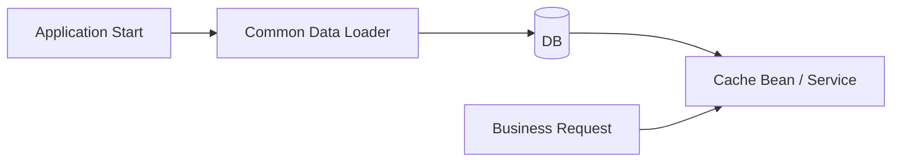
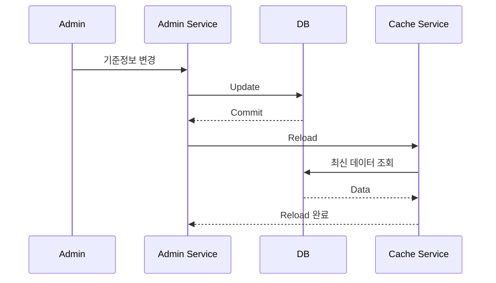

# 공통 데이터 및 캐시 구조

## 1. 목적

공통 코드, 메뉴/권한 기준정보, 전문 정의처럼 자주 조회되지만 변경 빈도가 낮은 데이터는 매 요청마다 DB에서 읽지 않고 애플리케이션 메모리에서 재사용할 수 있습니다.

## 2. 적용 원칙

- 먼저 단순 Bean/Service 기반으로 구현하고 필요 시 Cache abstraction으로 확장합니다.
- 변경 빈도, 데이터 크기, 일관성 요구사항을 보고 캐시 대상을 선정합니다.
- Reload 방식은 재기동, 관리자 수동 Reload, 주기/Event 기반 순으로 필요에 따라 확장합니다.
- 다중 인스턴스 환경에서는 인스턴스 간 일관성 문제를 별도로 검토합니다.

## 3. 관리자 변경 후 Reload 예

