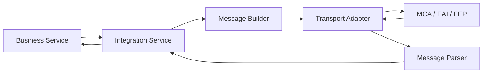
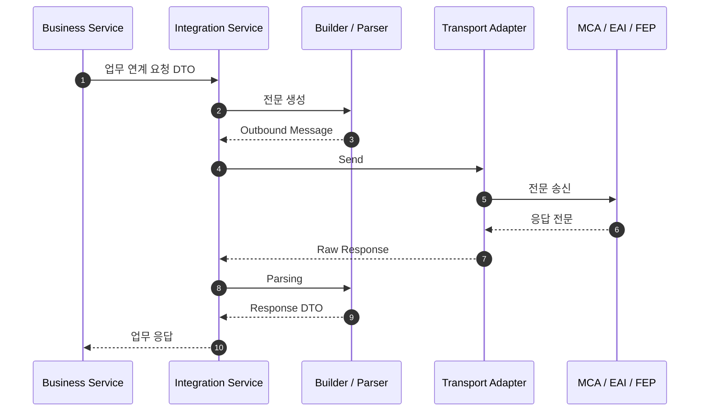

# 금융 시스템 연계 아키텍처

## 1. 업무와 통신을 분리합니다

금융 SI에서는 MCA, EAI, FEP, 계정계 및 대외기관 연계가 빈번합니다. 전문 길이, Padding, Encoding, Socket/HTTP 통신을 업무 Service에 직접 넣지 않고 Integration Layer로 분리합니다.

## 2. 역할

- **Business Service**: 어떤 업무를 요청할지 결정
- **Integration Service**: 연계 흐름과 오류/Timeout 정책 관리
- **Message Builder / Parser**: 전문 정의에 따라 송수신 데이터 변환
- **Transport Adapter**: 실제 통신 방식 캡슐화

## 3. 전체 송수신 시퀀스

Trace ID를 연계 로그까지 전달하여 한 요청의 전체 흐름을 추적할 수 있도록 하는 방향을 지향합니다.
