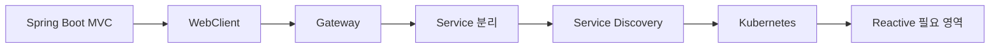

# 확장 및 운영 아키텍처

## 1. 확장은 필요할 때 적용합니다

MicroServer의 초기 목표는 복잡한 MSA 플랫폼을 먼저 만드는 것이 아닙니다. Spring Boot MVC 기반의 실행 구조와 공통 기능을 안정화한 뒤 실제 요구사항에 따라 확장합니다.

## 2. 주요 확장 후보

- **WebClient**: 외부/내부 REST 호출, Timeout·Connection Pool·Error Mapping·Trace 전달
- **Spring Cloud Gateway**: Routing, 인증 전달, Header/Trace, Rate Limit 등 공통 진입점
- **WebFlux**: Reactive가 실제로 필요한 고동시성/Streaming 영역에서 선택적으로 검토
- **Service Discovery**: 서비스 수와 동적 배치 요구가 커질 때 검토
- **Kubernetes**: 배포 자동화, Scale-out, Health 기반 운영이 필요한 단계에서 적용

## 3. 운영 관점

Health Check, Logging, Trace, 장애 격리, 환경별 설정, 배포/롤백은 기능 개발 이후의 부가 작업이 아니라 아키텍처의 일부로 봅니다. 다만 구체적인 서버·배포·운영 절차는 상위 NAV의 별도 `서버 환경 구성 / 배포 환경 구성 / 운영 환경 구성`에서 상세히 다루는 것이 적합합니다.
