# Team-Microserver 아키텍처 방향

## 1. 문서 개요

본 문서는 **Team-Microserver 프로젝트의 전체 아키텍처 구성 방향과 각 영역의 역할 및 책임을 정의**한다.

Team-Microserver는 금융 SI 프로젝트에서 반복적으로 필요한 기술 기능을 공통 프레임워크로 제공하고, 업무 개발자는 공통 기술의 세부 구현보다 **도메인 및 비즈니스 로직 개발에 집중할 수 있는 구조**를 지향한다.

이를 위해 프로젝트는 Gradle Multi-Project 구조를 기반으로 구성하며, 공통 기능은 독립적인 서브프로젝트에서 개발한 후 **JAR 형태의 라이브러리로 빌드하여 애플리케이션에 제공**한다.

또한 요청 처리, 보안, 로깅, 예외 처리, 데이터 접근, 캐시, 애플리케이션 기동 기능 등 프로젝트 전반에서 반복되는 기능은 공통 영역에서 표준화하고, 실제 업무 처리는 Controller / Service / DAO 계층으로 명확하게 분리한다.

---

## 2. 아키텍처 핵심 방향

Team-Microserver의 아키텍처는 다음 방향을 중심으로 구성한다.

| 구분 | 아키텍처 방향 |
| --- | --- |
| 프로젝트 구조 | Gradle 기반 Multi-Project Build |
| 공통 기능 | 서브프로젝트로 분리하고 JAR 형태로 제공 |
| 업무 기능 | Domain 영역으로 분리하여 업무 개발 집중 |
| 요청 선처리 | Servlet Filter 기반 공통 처리 |
| 횡단 관심사 | Spring AOP 기반으로 비즈니스 로직과 분리 |
| 업무 계층 | Controller / Service / DAO(Persistence) 역할 분리 |
| Transaction | Service를 기본 Transaction 경계로 사용 |
| 데이터 접근 | DAO / Mapper를 통한 데이터 접근 |
| 데이터 구조 | Multi DataSource 기반 확장 구조 |
| 보안 | Spring Security 기반 인증 및 권한 접근 통제 |
| API | Request DTO + ResponseEntity 기반 표준 응답 |
| API 문서 | springdoc-openapi + Swagger UI |
| 예외 | 공통 Exception + Global Exception Handler |
| 로깅 | Filter 기반 요청 선처리 및 공통 요청 추적 |
| 요청 Body | 재사용이 필요한 경우 Cached Request Wrapper 적용 |
| 초기 데이터 | Spring Bean으로 메모리 로딩하여 캐시 처리 |
| Agent 실행 | 공통 Agent JAR + ApplicationRunner 기반 기동 |
| Reactive 확장 | WebFlux / Reactor Context 기반 Non-Blocking 구조 |

---

# 3. 전체 아키텍처

Team-Microserver는 크게 **공통 기술 영역과 도메인 업무 영역을 분리**한다.

공통 영역은 여러 애플리케이션에서 재사용 가능한 기술 기능을 제공하고, 업무 영역은 실제 프로젝트의 비즈니스 기능을 구현한다.

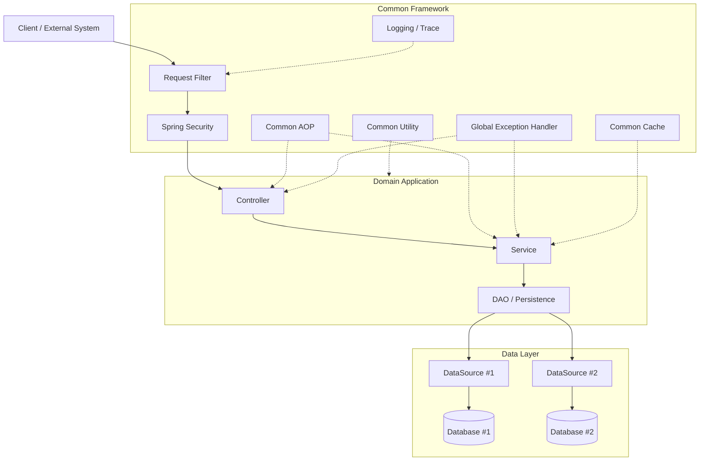

핵심 원칙은 **공통 기술 처리가 업무 코드 안으로 침투하지 않도록 하는 것**이다.

업무 개발자는 요청 로그, 공통 예외 응답, 인증 처리, 요청 추적 등의 기능을 각 업무마다 반복 구현하지 않고, 공통 프레임워크에서 제공하는 기능을 사용한다.

---

# 4. Gradle Multi-Project 아키텍처

## 4.1 기본 방향

Team-Microserver는 하나의 대형 프로젝트에 모든 기능을 포함시키지 않고 **Gradle Multi-Project Build**로 구성한다.

Root Project는 전체 Build의 공통 Plugin Version, Repository, Group / Version 등의 정책을 관리하고, `settings.gradle`에서 실제 Subproject를 선언한다. 기능 구현은 역할별 Subproject에서 수행한다.

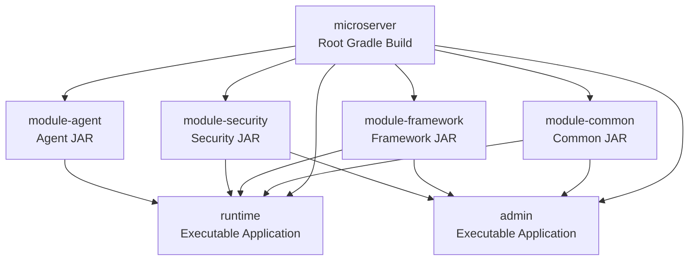

`settings.gradle` 개념 예:

```groovy
rootProject.name = 'microserver'

include 'module-common'
include 'runtime'
include 'admin'
```

> 위 모듈명은 아키텍처 역할을 설명하기 위한 기준이며 실제 프로젝트 구성 과정에서 세부 모듈은 조정할 수 있다.

### Maven과 비교

Maven에서는 같은 역할을 Parent `pom.xml`의 `<modules>`와 Parent Build 설정으로 구성한다.

```xml
<modules>
    <module>module-common</module>
    <module>runtime</module>
    <module>admin</module>
</modules>
```

이번 프로젝트에서는 Gradle을 실제 Build 기준으로 사용하고, Maven 설정은 대응 개념 이해를 위한 비교 예제로 제공한다.

---

## 4.2 공통 영역의 JAR 제공 방식

공통 기능은 애플리케이션과 직접 결합하지 않고 독립적인 Gradle Subproject로 개발한다.

공통 Library Module은 `java-library` Plugin을 기준으로 구성한다.

```groovy
plugins {
    id 'java-library'
}
```

실행 Module에서는 공통 Module을 Project Dependency로 사용한다.

```groovy
dependencies {
    implementation project(':module-common')
}
```

Maven에서는 같은 목적을 다음처럼 표현할 수 있다.

```xml
<packaging>jar</packaging>

<dependency>
    <groupId>io.github.teammicroserver</groupId>
    <artifactId>module-common</artifactId>
    <version>${project.version}</version>
</dependency>
```

Build된 공통 JAR는 Runtime, Admin 또는 다른 업무 애플리케이션에서 Dependency로 사용한다.

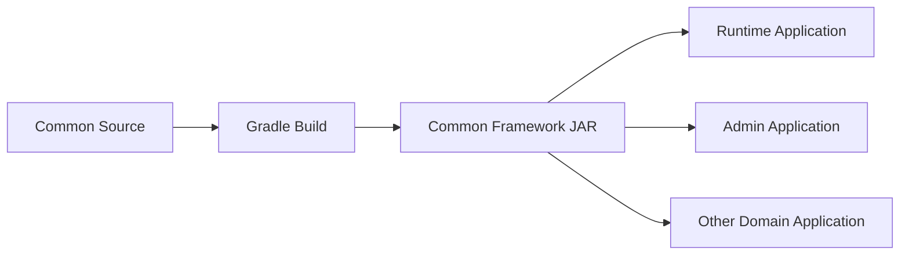

개발 중에는 JAR 파일을 수동 복사하지 않고 Gradle Project Dependency가 Build 순서와 Classpath를 관리한다. 필요해지면 공통 JAR을 별도 Artifact Repository에 Publish하는 구조로 확장한다.

### 공통 JAR의 주요 대상

- 공통 Response
- 공통 Exception
- Logging
- Filter
- AOP
- Validation
- Utility
- Security 공통 기능
- Cache 지원 기능
- 공통 Configuration
- Agent 실행 기반

공통 JAR는 특정 업무 도메인의 Entity나 업무 규칙을 직접 참조하지 않는 것을 원칙으로 한다.

---

# 5. 공통 영역과 Domain 영역 분리

## 5.1 분리 목적

Team-Microserver에서 가장 중요한 아키텍처 원칙 중 하나는 **공통 기술 영역과 업무 Domain 영역을 분리하는 것**이다.

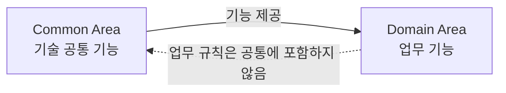

공통 영역은 프로젝트의 기술 기반을 담당한다.

- 요청 선처리
- 보안
- 공통 응답
- 예외 처리
- Logging
- Cache
- Utility
- 데이터 접근 기반
- Agent 실행 기반

Domain 영역은 실제 비즈니스 기능을 담당한다.

- 업무 API
- 업무 Service
- 업무 규칙
- 업무 데이터 처리
- 외부 시스템 호출을 포함한 업무 흐름

이렇게 영역을 분리하면 업무 개발자는 프레임워크 내부 구현을 매번 신경 쓰지 않고 **Controller / Service / DAO를 중심으로 도메인 개발에 집중**할 수 있다.

---

# 6. 요청 처리 아키텍처

## 6.1 전체 요청 흐름

일반적인 Servlet 기반 Web Application의 요청은 다음 구조로 처리한다.

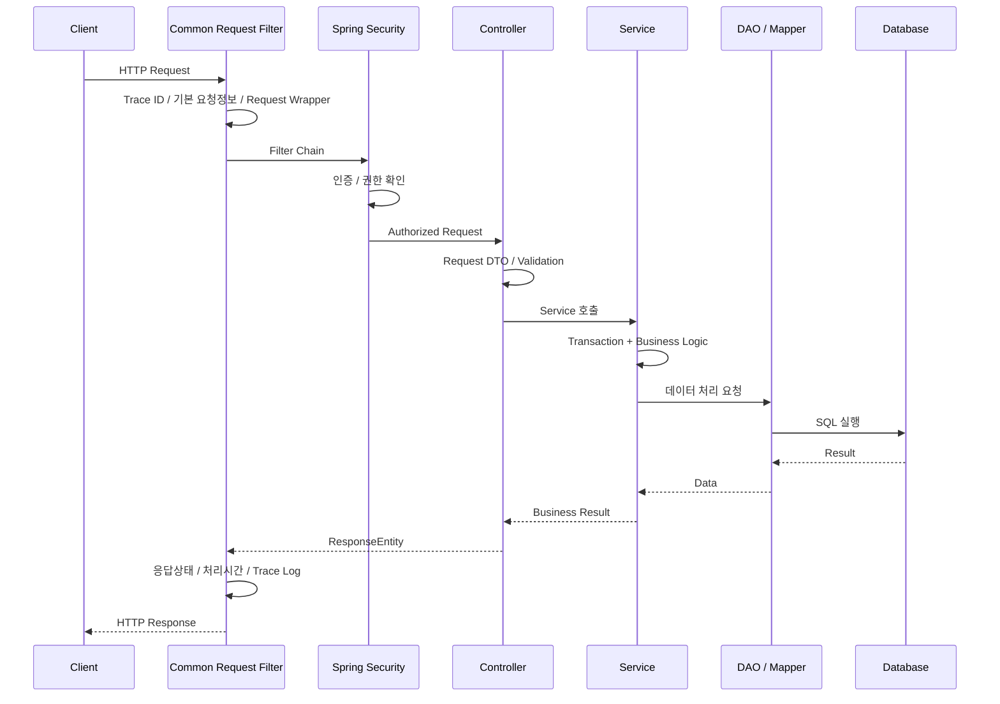

Filter, Spring Security, Controller, Service, DAO는 각각 다른 책임을 갖는다.

각 계층이 자신의 역할만 수행하도록 하여 요청 처리 흐름을 단순하게 유지하고 유지보수성을 높인다.

---

# 7. Filter 기반 요청 선처리

## 7.1 Filter의 역할

HTTP 요청이 Controller에 전달되기 전에 공통적으로 처리해야 하는 기능은 Servlet Filter에서 처리한다.

대표적인 기능은 다음과 같다.

- Trace ID 생성 또는 전달
- 요청 URI / HTTP Method 기록
- Client IP 확인
- 주요 Header 확인
- 요청 시작 시간 기록
- 요청/응답 Logging
- Request Wrapper 적용
- 공통 요청 Context 생성
- Encoding 등 기본 요청 처리

Filter는 **HTTP 요청 자체에 대한 공통 선처리**를 담당하고, 업무 로직은 처리하지 않는다.

---

## 7.2 Filter와 Security Filter Chain

Spring Security 역시 Filter Chain 기반으로 동작한다.

따라서 Team-Microserver의 공통 Filter는 기능에 따라 Spring Security 전후의 실행 순서를 명확하게 정의한다.

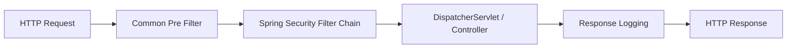

예를 들어 Trace ID 생성과 요청 기본정보 수집은 인증 전에도 필요할 수 있으므로 앞단에서 수행하고, 사용자 식별 정보가 필요한 로깅은 인증 완료 이후의 정보를 함께 활용하도록 설계할 수 있다.

---

# 8. Request Body 재사용 구조

## 8.1 요청 Body의 특성

Servlet 기반 `HttpServletRequest`의 Body는 InputStream 기반이므로 기본적으로 **한 번 읽은 요청 Body를 임의로 계속 다시 읽는 방식으로 사용해서는 안 된다.**

Filter에서 Request Body를 읽어 Logging한 후 원본 Request를 그대로 Controller에 전달하면 Controller의 `@RequestBody` 처리에 영향을 줄 수 있다.

따라서 Request Body를 선처리 단계와 Controller 양쪽에서 사용할 필요가 있는 경우 **Request Wrapper를 사용하여 Body를 Cache하는 구조**를 적용한다.

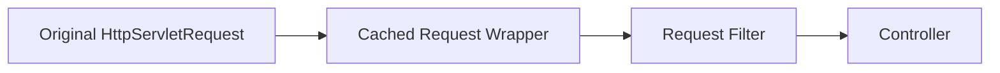

### 구현 방향

일반적인 요청 Logging에서는 Spring의 `ContentCachingRequestWrapper`를 활용할 수 있다.

다만 `ContentCachingRequestWrapper`는 **실제로 읽힌 Content를 Cache하는 방식**이므로, Filter가 Controller보다 먼저 Body 전체를 읽어야 하는 구조라면 요청 Body를 별도 byte 배열로 보관하고 다시 읽을 수 있도록 하는 Custom Wrapper가 필요할 수 있다.

따라서 Team-Microserver에서는 다음 두 가지 경우를 구분한다.

| 사용 목적 | 적용 방향 |
| --- | --- |
| 요청 기본정보 / 처리 후 Body Logging | `ContentCachingRequestWrapper` 활용 |
| Filter 단계에서 Body를 먼저 읽고 이후 Controller에서도 다시 사용 | Re-readable Custom Request Wrapper 적용 |

대용량 File Upload, Streaming 요청 등은 요청 Body 전체를 메모리에 복사하면 안 되므로 대상에서 제외하거나 별도 정책을 적용한다.

---

# 9. AOP 기반 횡단 관심사 분리

## 9.1 AOP 적용 목적

Filter가 HTTP Request 수준의 선처리를 담당한다면, AOP는 **Controller나 Service Method 실행 전후에 반복되는 횡단 관심사(Cross-Cutting Concern)**를 담당한다.

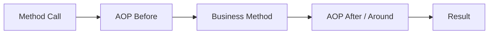

### AOP 적용 대상 예시

- Method 실행 시간 측정
- 업무 호출 추적
- 공통 Audit
- 특정 Annotation 기반 공통 처리
- 공통 권한 또는 정책 검증 보조
- 공통 성능 측정
- 공통 업무 이벤트 기록

핵심은 이러한 기능을 Service의 비즈니스 코드에 직접 반복 작성하지 않는 것이다.

---

## 9.2 Filter와 AOP의 역할 구분

Filter와 AOP는 서로 역할이 다르다.

| 구분 | Filter | AOP |
| --- | --- | --- |
| 기준 | HTTP Request | Spring Bean Method |
| 적용 위치 | Controller 진입 이전 | Controller / Service 등 Method 호출 전후 |
| 주요 목적 | 요청 선처리, 요청 추적, Logging | 횡단 관심사 분리 |
| 업무 로직 | 처리하지 않음 | 업무 로직 자체는 처리하지 않음 |

AOP에 핵심 비즈니스 로직을 구현하지 않는다.

AOP는 **비즈니스 처리를 보조하는 공통 관심 기능**에 한정한다.

---

# 10. Controller / Service / DAO Layer 아키텍처

Team-Microserver의 업무 애플리케이션은 기본적으로 Controller / Service / DAO(Persistence) 영역으로 구분한다.

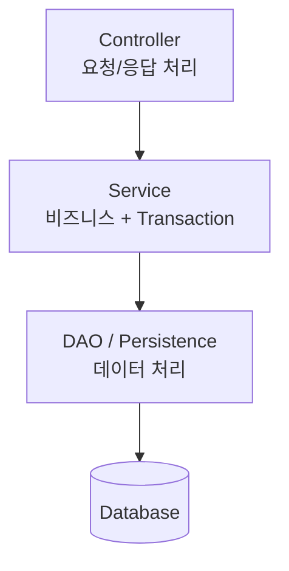

각 Layer의 역할을 명확하게 제한하는 것이 중요하다.

---

## 10.1 Controller

Controller는 **HTTP 요청과 응답의 경계 영역**이다.

주요 역할은 다음과 같다.

- URL Mapping
- HTTP Method Mapping
- Request DTO 수신
- 기본 Validation
- Header / Parameter 처리
- 인증된 사용자 정보 전달
- Service 호출
- Service 결과를 API Response로 변환
- `ResponseEntity` 반환

Controller에서는 전체 비즈니스 로직을 처리하지 않는다.

또한 가능한 한 Controller에서 직접 DAO를 호출하지 않는다.

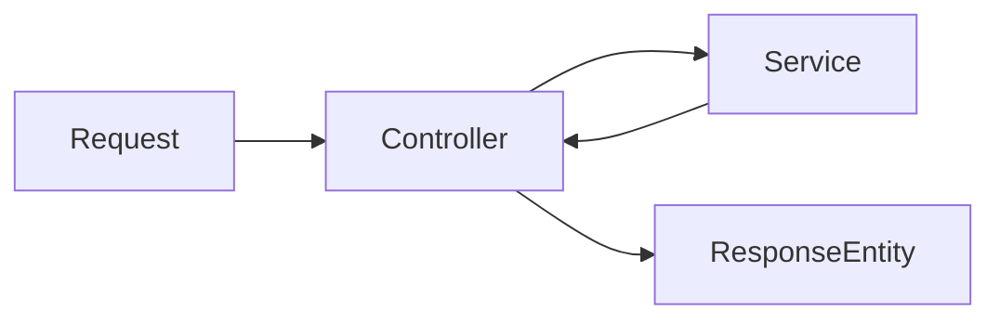

Controller의 역할은 **요청을 해석하고 Service에 업무 처리를 위임한 후 결과를 HTTP 응답으로 반환하는 것**이다.

---

## 10.2 Service

Service는 **전체 비즈니스 처리의 중심 영역**이다.

하나의 업무 기능을 완료하기 위해 여러 DAO를 호출하거나 외부 시스템을 호출해야 하는 경우 전체 처리 흐름은 Service에서 제어한다.

주요 역할은 다음과 같다.

- 업무 규칙 처리
- 전체 업무 Flow 제어
- 여러 DAO 호출
- 외부 연계 호출
- 데이터 조합
- 업무 Validation
- Transaction 처리

### Transaction 기본 단위

Team-Microserver에서는 **Service Method를 Transaction의 기본 경계**로 사용한다.

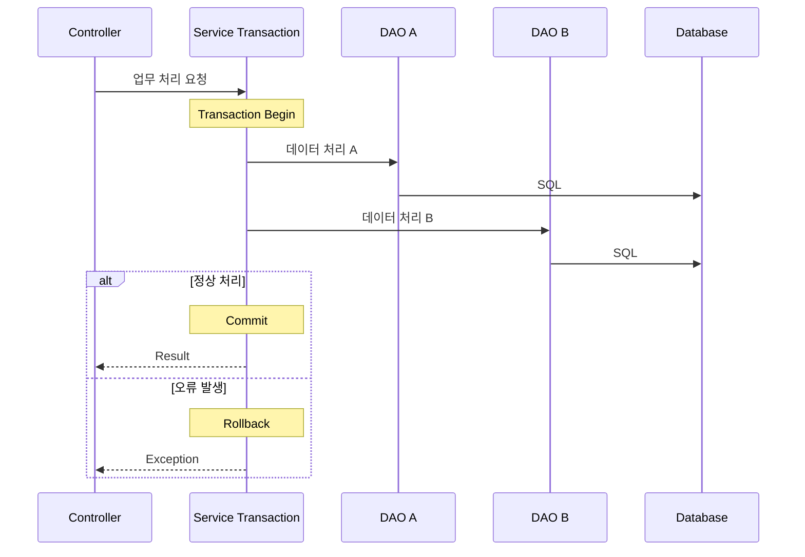

Controller에서 Transaction을 직접 관리하지 않고, DAO 단위로 Transaction을 잘게 나누는 것도 기본 방향으로 사용하지 않는다.

**하나의 업무가 완료되는 논리적인 단위를 Service Transaction으로 정의**한다.

---

## 10.3 DAO / Persistence

DAO 영역은 데이터 저장소에 접근하는 역할을 담당한다.

주요 역할은 다음과 같다.

- Database 조회
- Insert / Update / Delete
- MyBatis Mapper 호출
- SQL 실행
- 데이터 결과 Mapping

DAO에서는 비즈니스 Flow를 제어하지 않는다.

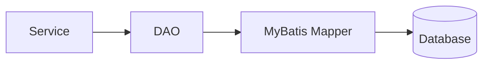

복잡한 업무 판단은 Service에서 처리하고 DAO는 **데이터 접근에 집중**한다.

---

# 11. 레이어별 책임 원칙

각 영역의 책임을 정리하면 다음과 같다.

| 영역 | 주요 책임 | 지양할 내용 |
| --- | --- | --- |
| Filter | HTTP 요청 선처리, Trace, Logging | 업무 로직 |
| Security | 인증, 인가, 접근 통제 | 업무 Flow |
| Controller | 요청/응답, Validation, Service 호출 | 전체 업무 처리, 직접 DAO 호출 |
| Service | 비즈니스 로직, Transaction, 업무 Flow | HTTP 세부 처리 |
| DAO | 데이터 접근, SQL / Mapper 실행 | 비즈니스 Flow |
| AOP | Logging, Audit 등 횡단 관심사 | 핵심 업무 로직 |
| Common | 프로젝트 공통 기술 기능 | 특정 업무 규칙 |
| Domain | 실제 업무 기능 | 공통 프레임워크 구현 |

---

# 12. 애플리케이션 초기 데이터 Cache 아키텍처

## 12.1 기본 방향

업무 처리 중 반복적으로 조회되며 변경 빈도가 낮은 주요 데이터는 애플리케이션 시작 시 Database에서 조회하여 **Spring Bean으로 메모리에 Loading한 후 Cache 형태로 사용**할 수 있도록 구성한다.

대상 예시는 다음과 같다.

- 공통코드
- 시스템 환경 정보
- 업무 설정 정보
- 기관 정보
- 전문 Mapping 정보
- Routing 정보
- 자주 참조되는 기준정보

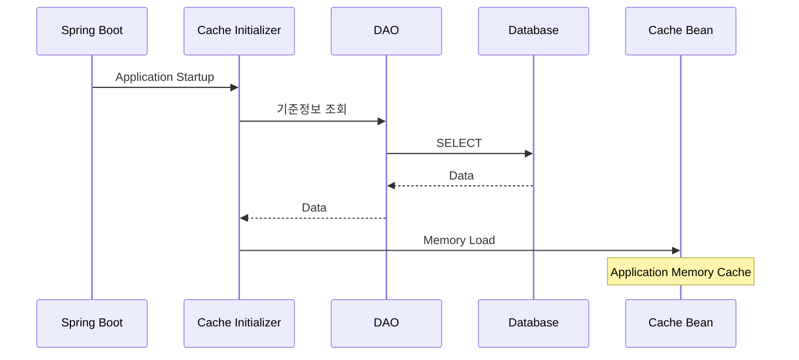

---

## 12.2 Cache Bean 사용 구조

업무 Service에서는 매번 동일한 기준정보를 Database에서 조회하지 않고 Cache Bean을 통해 조회한다.

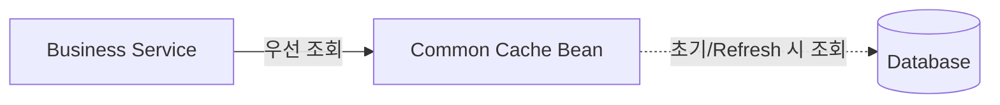

Cache는 단순히 성능만을 위한 기능이 아니라 자주 참조되는 기준정보의 접근 방식을 표준화하는 역할도 한다.

다만 주문, 거래내역 등 실시간으로 변경되는 Transaction 데이터까지 무조건 메모리에 적재하지 않는다.

### Cache 대상 선정 기준

- 조회 빈도가 높다.
- 데이터 양이 관리 가능한 수준이다.
- 변경 빈도가 낮다.
- 모든 요청에서 반복적으로 필요하다.
- 일정 시점의 Snapshot 사용이 업무적으로 허용된다.

변경이 발생하는 데이터는 Refresh 기능 또는 주기적 Reload 정책을 별도로 구성한다.

---

# 13. ApplicationRunner 기반 Agent 실행 아키텍처

## 13.1 목적

Team-Microserver는 일반적인 HTTP 요청 기반 Web Application뿐만 아니라, 애플리케이션 기동 후 **Agent 또는 Daemon과 유사하게 지속적인 기능을 수행하는 실행 구조**도 지원할 수 있도록 구성한다.

이 기능 역시 업무 애플리케이션마다 반복 구현하지 않고 공통 모듈에서 제공한다.

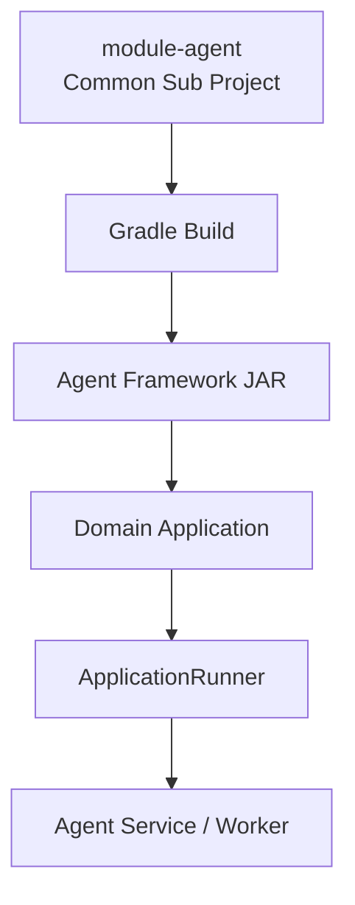

---

## 13.2 ApplicationRunner의 역할

공통 Agent JAR에서 `ApplicationRunner` 구현체를 제공하고, 업무 애플리케이션이 해당 JAR를 Dependency로 추가하면 Spring Boot 기동 과정에서 Agent 초기화 기능이 실행되도록 한다.

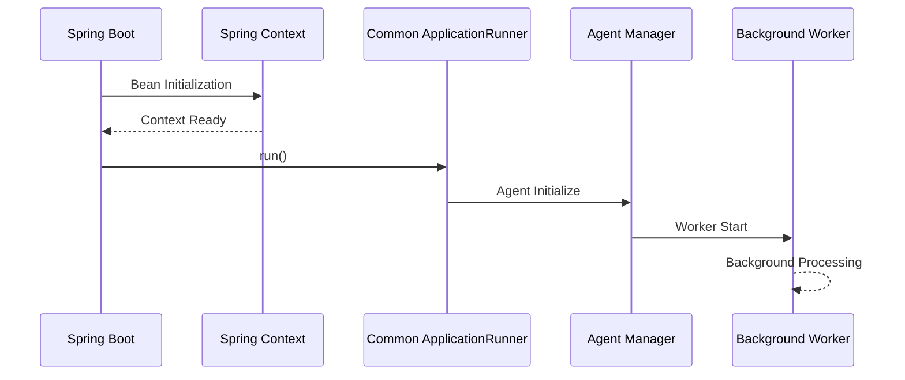

`ApplicationRunner` 자체에서 무한 반복문을 실행하여 Spring Boot의 기동 Thread를 점유하는 방식은 사용하지 않는다.

ApplicationRunner는 **Agent를 시작하는 Bootstrap 역할**을 담당하고 실제 지속 실행 작업은 별도의 Worker, `TaskExecutor`, `TaskScheduler` 또는 Lifecycle 관리 구조에서 수행하는 것을 원칙으로 한다.

---

## 13.3 Agent JAR 제공 방식

Agent 기능은 공통 프레임워크와 동일하게 JAR로 제공한다.

업무 애플리케이션은 필요한 경우 Agent JAR만 Dependency로 추가하여 기능을 활성화할 수 있다.

이를 통해 다음과 같은 구조를 만들 수 있다.

- Queue Consumer
- 전문 수신 Agent
- 배치성 Worker
- 특정 Directory/File 감시
- 외부 시스템 Polling
- 비동기 업무 처리 Worker
- 상태 Monitoring Agent

Agent가 애플리케이션의 핵심 업무와 직접 결합되지 않도록 **Agent Framework와 실제 Agent 업무 구현을 분리**한다.

---

# 14. Multi DataSource 데이터 아키텍처

## 14.1 기본 방향

금융 SI 프로젝트에서는 하나의 애플리케이션이 여러 Database 또는 여러 Schema에 접근해야 하는 경우가 많다.

Team-Microserver의 데이터 아키텍처는 초기부터 **Multi DataSource 구성이 가능한 구조**를 기본 방향으로 한다.

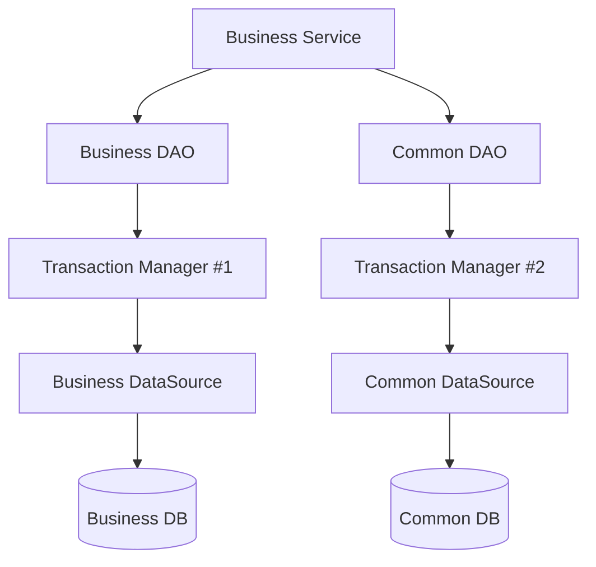

### 구성 방향

DataSource별로 다음 요소를 명확하게 분리한다.

- DataSource
- SqlSessionFactory
- Mapper Package
- TransactionManager
- Configuration
- Connection Pool 설정

업무 DAO가 어떤 DataSource를 사용하는지 명확하게 식별할 수 있도록 패키지와 Configuration을 분리한다.

---

## 14.2 Transaction 고려사항

하나의 Service에서 복수 DataSource를 사용하는 경우 각각의 TransactionManager 경계를 명확히 해야 한다.

단일 로컬 Transaction만으로 서로 다른 Database의 원자성을 자동으로 보장할 수 있다고 가정하지 않는다.

여러 Database를 하나의 Transaction으로 묶어야 하는 요구사항이 발생하면 XA/JTA, 보상 Transaction 또는 업무 특성에 맞는 별도 분산 Transaction 전략을 검토한다.

---

# 15. Spring Security 기반 보안 아키텍처

## 15.1 기본 원칙

Team-Microserver의 모든 Web 보안 처리는 **Spring Security를 중심으로 구성**한다.

Controller마다 직접 Login 여부를 확인하거나 각 업무에서 임의의 권한 검사 로직을 반복 구현하지 않는다.

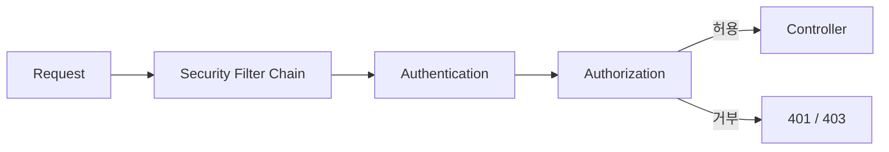

### 주요 보안 기능

- 사용자 인증
- Role 기반 권한
- URL 접근 통제
- Method 단위 권한 통제
- 인증 실패 처리
- 접근 거부 처리
- Security Context 관리
- Password Encoding
- CORS / CSRF 정책
- Security Header
- 중요 정보 보호

---

## 15.2 권한 처리 방향

접근 권한은 가능한 한 중앙화된 Security Configuration과 Method Security를 통해 관리한다.

업무 로직 자체에 필요한 도메인 규칙과 보안 프레임워크의 접근 통제는 구분한다.

예를 들어 다음은 Spring Security의 영역이다.

- 로그인 사용자 여부
- 관리자 Role 여부
- 특정 API 접근 권한
- 특정 Method 실행 권한

반면 다음과 같은 판단은 업무 Domain의 영역이다.

- 해당 계좌의 실제 소유자인가
- 해당 거래를 취소할 수 있는 업무 상태인가
- 해당 사용자가 특정 계약의 담당자인가

즉, **시스템 접근 권한은 Security에서 처리하고 업무 데이터에 대한 비즈니스 판단은 Service에서 처리**한다.

---

# 16. API 응답 아키텍처

## 16.1 ResponseEntity 기반 응답

REST API 응답은 Spring의 `ResponseEntity`를 기반으로 HTTP Status와 Body를 명확하게 표현한다.

Body는 프로젝트 표준 Response 객체로 구조화한다.

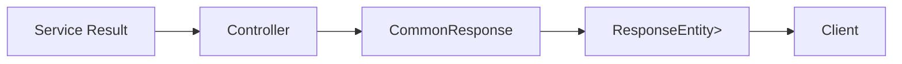

예시적인 응답 구조는 다음과 같이 구성할 수 있다.

```json
{
  "success": true,
  "code": "0000",
  "message": "SUCCESS",
  "data": {
    "userId": "user01",
    "userName": "홍길동"
  },
  "traceId": "..."
}
```

프로젝트가 진행되면서 실제 Response 필드와 Naming은 공통 Response 가이드에서 최종 확정한다.

---

## 16.2 요청 정보 구조화

요청 데이터 역시 Controller에서 Map이나 원시 Parameter를 무분별하게 사용하는 대신 **Request DTO로 구조화**한다.

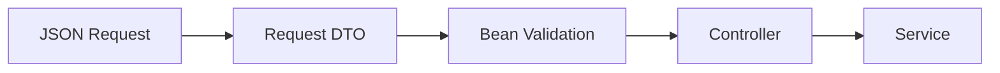

Request DTO를 사용하면 다음 정보를 명확하게 정의할 수 있다.

- 필드명
- 데이터 Type
- 필수 여부
- Validation 규칙
- 설명
- Example
- Enum 또는 허용 값

---

# 17. springdoc-openapi / Swagger 기반 API 명세

사용자가 말한 Spring 기반 Swagger 문서화 도구는 **springdoc-openapi**를 의미한다.

Team-Microserver에서는 `springdoc-openapi`를 이용하여 Controller와 Request/Response DTO 정보를 **OpenAPI Specification으로 자동 생성**하고, Swagger UI에서 사람이 이해하기 쉬운 형태로 제공한다.

```mermaid
flowchart LR
    CONTROLLER["Controller"]
    REQUEST["Request DTO"]
    RESPONSE["Response DTO"]
    SPRINGDOC["springdoc-openapi"]
    OPENAPI["OpenAPI Spec<br/>/v3/api-docs"]
    SWAGGER["Swagger UI"]

    CONTROLLER --> SPRINGDOC
    REQUEST --> SPRINGDOC
    RESPONSE --> SPRINGDOC
    SPRINGDOC --> OPENAPI
    OPENAPI --> SWAGGER
```

이를 통해 API 사용자는 소스코드를 직접 확인하지 않아도 다음 정보를 확인할 수 있다.

- API URI
- HTTP Method
- API 설명
- Request Parameter
- Request Body 구조
- 각 필드의 Type과 설명
- 필수 여부
- Response 구조
- HTTP Status
- 오류 Response
- Example 데이터

API 문서는 단순히 URL 목록을 제공하는 것이 아니라 **요청과 응답의 데이터 계약(Data Contract)을 구조화하여 보여주는 문서**로 관리한다.

---

# 18. 공통 예외 처리 아키텍처

## 18.1 기본 방향

예외는 Controller나 Service에서 매번 `try-catch`하여 임의의 Response로 변경하지 않는다.

업무 또는 시스템 처리 중 발생한 예외는 가능한 한 상위로 `throw`하고 **공통 Exception Handler에서 일관되게 처리**한다.

```mermaid
sequenceDiagram
    participant CT as Controller
    participant SV as Service
    participant DAO as DAO
    participant EH as Global Exception Handler
    participant CL as Client

    CT->>SV: Service Call
    SV->>DAO: Data Access
    DAO-->>SV: Exception
    SV-->>CT: throw
    CT-->>EH: throw
    EH->>EH: Exception Mapping
    EH->>EH: Error Code / Message
    EH-->>CL: Standard Error Response
```

---

## 18.2 Service / Controller의 예외 처리 원칙

Controller와 Service에서는 다음과 같은 형태의 불필요한 Catch를 지양한다.

```java
try {
    service.process();
} catch (Exception e) {
    return ...
}
```

특별한 복구 로직이 없다면 예외를 Catch하지 않고 상위로 전달한다.

Catch가 필요한 경우는 다음과 같이 **명확한 목적이 있는 경우**로 제한한다.

- 예외를 다른 업무 Exception으로 변환해야 하는 경우
- Retry 또는 Recovery가 필요한 경우
- 외부 시스템 오류를 내부 표준 오류로 변환하는 경우
- 추가 정보를 보완하여 다시 Throw해야 하는 경우

---

## 18.3 Global Exception Handler

Controller / Service 영역에서 전달된 예외는 `@RestControllerAdvice` 기반 Global Exception Handler에서 처리한다.

주요 역할은 다음과 같다.

- Exception Type 식별
- 공통 Error Code Mapping
- 사용자 메시지 결정
- HTTP Status 결정
- 오류 Logging
- Trace ID 연결
- 표준 오류 Response 생성

단, Spring Security Filter Chain에서 발생한 인증/인가 오류는 Controller 영역에 도달하기 전에 발생할 수 있으므로 `AuthenticationEntryPoint`, `AccessDeniedHandler` 등 Security 전용 처리 구조와 공통 오류 Response를 연계한다.

Filter 자체에서 발생한 예외 역시 ControllerAdvice가 직접 처리하는 영역과 다르므로 필요하면 별도의 공통 예외 Bridge 구조를 둔다.

---

# 19. Logging 아키텍처

## 19.1 요청 기본 Logging

모든 요청에 대해 업무 개발자가 Controller마다 로그를 작성하지 않아도 되도록 Filter에서 기본 요청 정보를 기록한다.

### 기본 로그 대상

- Trace ID
- 요청 시작 시간
- HTTP Method
- Request URI
- Query Parameter
- Client IP
- 필요한 Header
- 사용자 식별정보
- HTTP Status
- 처리 시간

```mermaid
sequenceDiagram
    participant C as Client
    participant F as Logging Filter
    participant APP as Application

    C->>F: Request
    F->>F: Trace ID 생성
    F->>F: Request 기본정보 Logging
    F->>APP: Wrapped Request
    APP-->>F: Response
    F->>F: Status / Elapsed Time Logging
    F-->>C: Response
```

사용자 Password, 인증 Token, 주민번호, 계좌번호 등 민감정보는 전체 값을 그대로 Logging하지 않고 Masking 또는 제외 정책을 적용한다.

---

## 19.2 Trace ID

하나의 요청이 Controller, Service, DAO 및 외부 시스템 연계까지 이동하더라도 동일한 Trace ID로 추적할 수 있도록 한다.

Servlet 기반 환경에서는 요청 Thread와 연결된 Logging Context를 사용할 수 있지만, 비동기 처리와 Reactive 환경으로 확장할 때는 Thread가 변경될 수 있으므로 Context 전달 방식을 별도로 고려한다.

---

# 20. 애플리케이션 기동 아키텍처

애플리케이션이 실행될 때 다음 순서로 공통 기반 기능을 초기화하는 방향을 갖는다.

```mermaid
flowchart TD
    START["Spring Boot Start"]
    CONTEXT["Spring Context 생성"]
    COMMON["Common JAR Bean 등록"]
    SECURITY["Security 구성"]
    DATASOURCE["DataSource 구성"]
    CACHE["기준정보 Cache Load"]
    RUNNER["ApplicationRunner 실행"]
    AGENT["Agent / Worker 시작"]
    READY["Application Ready"]

    START --> CONTEXT
    CONTEXT --> COMMON
    COMMON --> SECURITY
    SECURITY --> DATASOURCE
    DATASOURCE --> CACHE
    CACHE --> RUNNER
    RUNNER --> AGENT
    AGENT --> READY
```

실제 Spring 내부 Lifecycle의 모든 이벤트 순서를 위 그림과 동일하게 강제한다는 의미는 아니며, **Team-Microserver가 관리할 주요 초기화 책임과 의존 관계를 논리적으로 표현한 구조**다.

Cache, Agent 등 초기화 순서가 중요한 기능은 Bean 의존성 또는 명시적인 초기화 Orchestration을 통해 순서를 관리한다.

---

# 21. Servlet 기반 기본 구조와 WebFlux 확장 방향

## 21.1 기본 아키텍처

Team-Microserver의 기본 Web Application은 우선 **Spring MVC / Servlet 기반 구조**로 구축한다.

Servlet 환경에서는 하나의 HTTP 요청이 일반적으로 Servlet Request와 요청 처리 Thread를 중심으로 실행된다.

현재 공통 Filter, Spring Security Servlet Filter Chain, Controller, Request Wrapper 등의 구조도 이 환경을 기준으로 구성한다.

---

## 21.2 WebFlux 확장 시의 변화

향후 확장 아키텍처에서 Spring WebFlux를 적용하는 경우 단순히 Controller 반환 Type만 `Mono` 또는 `Flux`로 변경하는 수준으로 접근하지 않는다.

Spring WebFlux는 Reactive Stack이며 Non-Blocking 처리와 Reactive Streams를 기반으로 동작한다.

```mermaid
flowchart TB
    subgraph SERVLET["Spring MVC / Servlet"]
        SREQ["HttpServletRequest"]
        SFILTER["Servlet Filter"]
        THREAD["Request Thread / ThreadLocal Context"]
        SMVC["Controller / Service"]
        SREQ --> SFILTER --> THREAD --> SMVC
    end

    subgraph REACTIVE["Spring WebFlux / Reactive"]
        RREQ["ServerWebExchange"]
        WFILTER["WebFilter"]
        PIPE["Mono / Flux Pipeline"]
        CONTEXT["Reactor Context"]
        WEBSESSION["WebSession"]
        RREQ --> WFILTER --> PIPE
        CONTEXT -.-> PIPE
        WEBSESSION -.-> PIPE
    end
```

---

## 21.3 Reactor Context

Reactive 처리에서는 실행 도중 Thread가 변경될 수 있기 때문에 요청 추적 정보를 단순 `ThreadLocal`에만 의존하는 구조는 적합하지 않다.

Trace ID, 요청 Context 등 Reactive 처리 체인 전체에 전달해야 하는 정보는 **Reactor Context를 중심으로 전달**하는 방향을 사용한다.

```mermaid
flowchart LR
    WEBFILTER["WebFilter"]
    CONTEXT["Reactor Context<br/>Trace ID / Context Data"]
    MONO["Mono / Flux"]
    WEBCLIENT["WebClient"]
    RESULT["Response"]

    WEBFILTER --> CONTEXT
    CONTEXT --> MONO
    MONO --> WEBCLIENT
    WEBCLIENT --> RESULT
```

이를 통해 비동기 처리 과정에서 Thread가 변경되더라도 동일한 Reactive 흐름 안에서 Context 정보를 전달할 수 있다.

---

## 21.4 Session과 Context의 구분

Servlet의 `HttpSession`과 WebFlux의 `WebSession`, Reactor Context는 서로 다른 개념이다.

- `WebSession`은 사용자 요청 간에 유지해야 하는 Session 데이터를 관리한다.
- `Reactor Context`는 Reactive 처리 흐름에서 Trace ID 등 Context 정보를 전달하는 데 사용한다.

따라서 WebFlux 확장 시 **"Servlet Session을 그대로 재사용한다"는 관점보다 필요한 상태의 종류에 따라 WebSession과 Reactor Context를 구분하여 사용**한다.

특히 Stateless API를 기본으로 구성하는 경우 사용자 상태는 Token 기반 인증을 우선 고려하고, 반드시 필요한 상태만 Session에 유지하도록 한다.

---

# 22. 확장 아키텍처 방향

Team-Microserver는 초기부터 모든 확장 기술을 구현하지 않는다.

먼저 Servlet 기반의 안정적인 공통 프레임워크와 금융 업무 기반을 완성하고, 이후 실제 프로젝트 요구에 따라 다음 구조로 확장한다.

```mermaid
flowchart LR
    CORE["Team-Microserver Core"]
    WEBCLIENT["WebClient"]
    GATEWAY["Spring Cloud Gateway"]
    WEBFLUX["Spring WebFlux"]
    DISCOVERY["Service Discovery"]
    K8S["Kubernetes"]

    CORE --> WEBCLIENT
    WEBCLIENT --> GATEWAY
    GATEWAY --> WEBFLUX
    WEBFLUX --> DISCOVERY
    DISCOVERY --> K8S
```

각 기술은 단순히 기능 목록으로 추가하는 것이 아니라 기존 아키텍처와 어떤 관계를 갖는지 기준으로 적용한다.

---

## 22.1 WebClient 확장

외부 REST API 연계는 서비스가 증가할수록 공통 HTTP Client 구성이 중요해진다.

WebClient를 적용할 때는 단순 API 호출뿐 아니라 다음 기능을 공통화한다.

- Base URL
- 공통 Header
- 인증 Token 전달
- Timeout
- 오류 Mapping
- Trace ID 전달
- 요청/응답 Logging
- Retry 정책

향후 WebFlux를 적용하지 않더라도 Servlet 기반 애플리케이션에서 외부 Reactive Client 용도로 WebClient를 선택적으로 사용할 수 있다.

---

## 22.2 Spring Cloud Gateway 확장

서비스가 여러 애플리케이션으로 분리되면 Client가 각 서비스의 URL과 인증 방식을 직접 알게 하지 않고 Gateway를 통해 접근하도록 구성할 수 있다.

Gateway에서는 다음 기능을 공통화할 수 있다.

- Routing
- 공통 인증 연계
- 요청 Header 처리
- Trace ID 전달
- 공통 Logging
- 서비스별 접근 정책
- Traffic 제어

즉, 애플리케이션 내부의 Filter가 개별 서비스 요청을 관리한다면 Gateway는 **여러 서비스 앞단의 공통 요청 경계** 역할을 수행한다.

---

## 22.3 Spring WebFlux 확장

대규모 동시 연결, Streaming, 비동기 I/O와 같이 Non-Blocking 방식이 실제로 필요한 기능에는 Spring WebFlux 적용을 검토한다.

WebFlux 적용 시에는 다음 영역을 함께 검토한다.

- Servlet Filter → WebFilter
- HttpServletRequest → ServerWebExchange
- ThreadLocal Context → Reactor Context
- 동기 Return → Mono / Flux
- Blocking 외부 호출 → Reactive Client
- Blocking 데이터 접근 사용 여부

단순히 최신 기술이기 때문에 전체 업무를 WebFlux로 전환하지 않는다.

Reactive 방식의 장점이 명확한 영역부터 선택적으로 적용한다.

---

## 22.4 Service Discovery 확장

서비스가 여러 Instance로 분산되면 특정 IP와 Port를 업무 코드에 직접 설정하는 방식은 운영 부담이 커진다.

Service Discovery를 도입하면 서비스가 자신의 위치를 Registry에 등록하고 호출자는 논리적인 Service Name을 기준으로 대상을 찾는 구조로 확장할 수 있다.

이를 통해 서비스 Scale-out이나 Instance 변경 시 업무 코드의 변경을 최소화할 수 있다.

---

## 22.5 Kubernetes 확장

최종적으로 애플리케이션 배포 환경을 Container / Kubernetes 기반으로 확장할 수 있도록 한다.

이 단계에서는 단순히 Docker Image를 만드는 것이 아니라 애플리케이션 구조도 운영 환경에 맞게 정리한다.

- Configuration 외부화
- Secret 분리
- Health Check
- Stateless Application
- Scale-out
- Graceful Shutdown
- Logging 표준 출력 연계
- Container Resource 관리

특히 애플리케이션 내부 Memory Cache를 사용하는 경우 여러 Pod가 동시에 실행될 때 데이터 동기화 문제가 발생할 수 있다.

따라서 Scale-out 환경에서는 로컬 Cache의 역할을 다시 검토하고 필요하면 Redis와 같은 외부 분산 Cache 또는 이벤트 기반 Refresh 구조로 확장한다.

---

# 23. 아키텍처 적용 우선순위

Team-Microserver는 처음부터 모든 구조를 한 번에 적용하지 않는다.

프로젝트 구축 로드맵과 연계하여 다음 순서로 아키텍처를 완성한다.

```mermaid
flowchart TD
    STEP1["1. Spring Boot / Gradle 기반"]
    STEP2["2. Multi Module 구조"]
    STEP3["3. Common JAR"]
    STEP4["4. Controller / Service / DAO"]
    STEP5["5. Filter / AOP / Exception / Logging"]
    STEP6["6. Multi DataSource"]
    STEP7["7. Spring Security"]
    STEP8["8. 표준 API / springdoc-openapi"]
    STEP9["9. Cache / Agent"]
    STEP10["10. 금융 시스템 연계"]
    STEP11["11. Reactive / Cloud 확장"]

    STEP1 --> STEP2
    STEP2 --> STEP3
    STEP3 --> STEP4
    STEP4 --> STEP5
    STEP5 --> STEP6
    STEP6 --> STEP7
    STEP7 --> STEP8
    STEP8 --> STEP9
    STEP9 --> STEP10
    STEP10 --> STEP11
```

이 순서를 통해 기본 구조가 충분히 안정된 이후 다음 기능을 추가한다.

---

# 24. 최종 아키텍처 방향

Team-Microserver의 최종 아키텍처는 다음 원칙으로 정리한다.

### 공통 기능은 프레임워크에서 해결한다

Filter, AOP, Security, Exception, Logging, Cache, Utility 등 반복되는 기술 기능은 공통 영역에서 구현하고 JAR 형태로 제공한다.

### 업무 개발자는 Domain에 집중한다

업무 개발자는 Controller / Service / DAO 구조 안에서 업무 기능을 구현하고 공통 기술 기능을 다시 구현하지 않는다.

### Service가 업무 처리의 중심이다

Controller는 요청과 응답에 집중하고, 전체 비즈니스 처리와 Transaction 경계는 Service에서 관리한다.

### DAO는 데이터 처리에 집중한다

Database 접근과 SQL 실행은 DAO / Persistence 영역으로 분리한다.

### 요청 공통 처리는 Filter에서 수행한다

요청 추적, 기본 Logging, Request Wrapper 등 HTTP Request 수준의 공통 기능을 앞단에서 처리한다.

### 횡단 관심사는 AOP로 분리한다

업무 Method 전후에 필요한 공통 기능은 AOP로 분리하여 비즈니스 코드의 집중도를 높인다.

### 데이터는 Multi DataSource 확장을 고려한다

하나의 Database에 종속된 구조가 아니라 여러 DataSource와 TransactionManager를 명확하게 분리할 수 있도록 구성한다.

### 보안은 Spring Security로 중앙화한다

인증과 인가를 각 업무에서 임의로 구현하지 않고 Spring Security를 통해 일관되게 제어한다.

### API는 명확한 계약으로 제공한다

Request DTO와 표준 ResponseEntity 구조를 사용하고 springdoc-openapi / Swagger UI를 통해 요청과 응답 구조를 명확하게 문서화한다.

### 예외는 공통 Handler로 모은다

복구 목적이 없는 `try-catch`를 Controller와 Service에 반복하지 않고 Exception을 전달하여 공통 Handler에서 처리한다.

### 초기 기준정보는 Cache로 활용한다

반복 조회되는 주요 기준정보는 애플리케이션 기동 시 메모리 Bean으로 Loading하여 효율적으로 활용하고 필요한 Refresh 정책을 함께 설계한다.

### Agent 기능도 공통 JAR로 제공한다

ApplicationRunner는 Agent 초기화를 위한 Bootstrap으로 사용하고 실제 장기 실행 작업은 별도의 Worker/Lifecycle 구조에서 수행한다.

### Reactive 확장은 실행 모델까지 변경한다

WebFlux로 확장할 때는 Servlet 구조를 그대로 옮기는 것이 아니라 WebFilter, Reactor Context, WebSession, Non-Blocking I/O 등 Reactive 실행 모델에 맞게 공통 기능을 재설계한다.

---

## 25. 아키텍처 한눈에 보기

```mermaid
flowchart TB
    CLIENT["Client"]

    subgraph ENTRY["Request / Security"]
        FILTER["Common Filter<br/>Trace / Log / Request Cache"]
        SECURITY["Spring Security<br/>Authentication / Authorization"]
    end

    subgraph DOMAIN["Domain Layer"]
        CONTROLLER["Controller<br/>Request / Response"]
        SERVICE["Service<br/>Business / Transaction"]
        DAO["DAO / Persistence<br/>Data Access"]
    end

    subgraph COMMON["Common JAR"]
        AOP["AOP"]
        EXCEPTION["Exception Handler"]
        CACHE["Memory Cache"]
        UTIL["Utility"]
        AGENT["Agent Framework"]
    end

    subgraph DATA["Data"]
        DS1["DataSource #1"]
        DS2["DataSource #2"]
        DB1[("DB #1")]
        DB2[("DB #2")]
    end

    subgraph DOC["API Contract"]
        OPENAPI["springdoc-openapi"]
        SWAGGER["Swagger UI"]
    end

    CLIENT --> FILTER
    FILTER --> SECURITY
    SECURITY --> CONTROLLER
    CONTROLLER --> SERVICE
    SERVICE --> DAO

    DAO --> DS1 --> DB1
    DAO --> DS2 --> DB2

    AOP -.-> SERVICE
    EXCEPTION -.-> CONTROLLER
    EXCEPTION -.-> SERVICE
    CACHE -.-> SERVICE
    UTIL -.-> DOMAIN
    AGENT -.-> SERVICE

    CONTROLLER -.-> OPENAPI
    OPENAPI --> SWAGGER
```

> **Team-Microserver의 아키텍처는 공통 기술 영역과 Domain 업무 영역의 책임을 명확히 분리하고, 공통 기능을 재사용 가능한 JAR 형태로 제공하여 업무 개발자가 비즈니스 구현에 집중할 수 있는 금융 SI 표준 개발 구조를 구축하는 것을 목표로 한다.**
