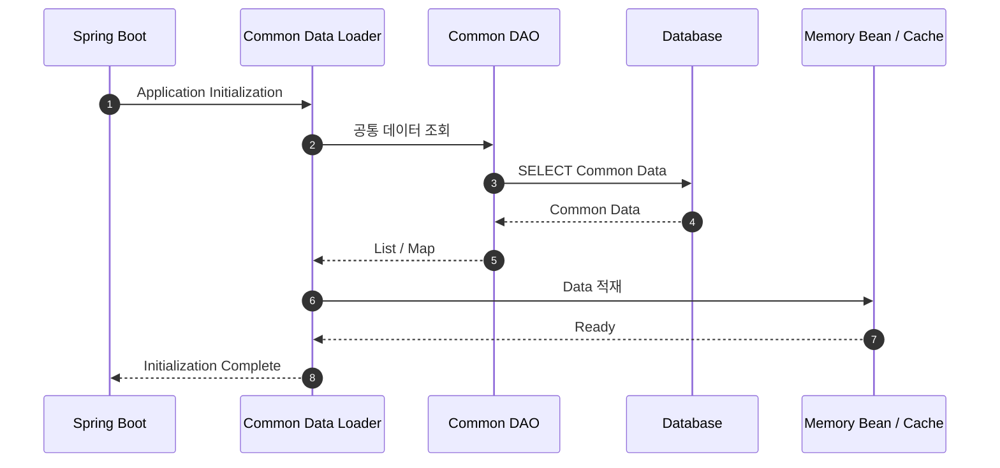
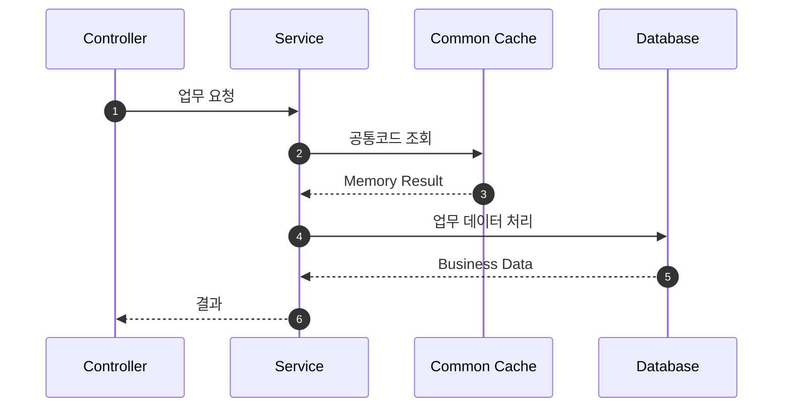
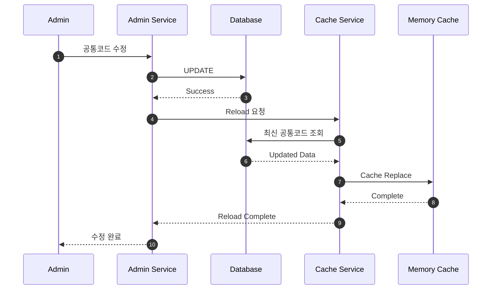

# 공통 데이터 및 캐시 구조

## 1. 문서 목적

금융 애플리케이션에는 대부분의 요청에서 반복적으로 사용하지만 자주 변경되지 않는 데이터가 존재합니다.

예:

- 공통 코드
- 시스템 설정
- 채널 정보
- 메뉴 정보
- 권한 기준정보
- 전문 Layout
- 업무 구분 정보

이 데이터를 매 요청마다 Database에서 조회하면 불필요한 DB I/O가 증가합니다.

Microserver는 필요한 주요 데이터를 **애플리케이션 실행 시 Spring Bean 또는 Cache 영역으로 로딩하여 메모리에서 활용**하는 구조를 검토합니다.

---

## 2. 캐시 대상 선정 원칙

모든 데이터를 메모리에 올리는 것은 적절하지 않습니다.

다음 기준으로 대상을 선정합니다.

| 기준 | 캐시 적합도 |
|---|---|
| 조회 빈도가 높음 | 높음 |
| 변경 빈도가 낮음 | 높음 |
| 데이터 크기가 작음 | 높음 |
| 실시간 정합성이 절대적으로 필요 | 낮음 |
| 매우 큰 데이터 | 낮음 |

---

## 3. 애플리케이션 기동 시 로딩 흐름



---

## 4. 요청 처리 시 캐시 사용



공통 코드 때문에 매번 Database를 호출하지 않고 메모리 값을 사용합니다.

---

## 5. Bean 기반 초기 구현

초기에는 복잡한 Cache 제품보다 Spring Bean 기반 구조로 시작할 수 있습니다.

개념:

```text
CommonDataLoader
      ↓
CommonCodeCache Bean
      ↓
Map<String, CommonCode>
      ↓
Service에서 조회
```

이 방식은 구조가 단순하고 학습하기 쉽다는 장점이 있습니다.

---

## 6. Cache Service 분리

업무 Service가 내부 Map 구조를 직접 알 필요는 없습니다.

```text
Business Service
      ↓
CommonCodeService
      ↓
CommonCodeCache
```

Cache 구현 방식이 나중에 Redis 등으로 변경되어도 업무 Service의 영향 범위를 줄일 수 있습니다.

---

## 7. Cache Reload

공통 데이터는 운영 중 변경될 수 있으므로 Reload 전략이 필요합니다.

가능한 방식:

### 애플리케이션 재기동

가장 단순하지만 운영 중 즉시 반영하기 어렵습니다.

### 관리자 수동 Reload

관리자가 데이터를 변경한 후 특정 Cache를 다시 로딩합니다.

### 주기적 Reload

일정 시간마다 Database와 동기화합니다.

### Event 기반 Reload

데이터 변경 이벤트가 발생할 때 필요한 Cache만 갱신합니다.

---

## 8. 관리자 변경 후 Reload 시퀀스



---

## 9. 캐시 데이터 일관성

캐시 사용 시 가장 중요한 문제는 Database와 메모리 값의 불일치입니다.

따라서 데이터별로 다음을 정의해야 합니다.

- 누가 변경할 수 있는가
- 변경 즉시 반영이 필요한가
- TTL이 필요한가
- Reload 실패 시 어떻게 할 것인가
- 이전 Cache를 유지할 것인가
- 애플리케이션 여러 인스턴스의 Cache를 어떻게 동기화할 것인가

---

## 10. 분산 환경 확장

애플리케이션 인스턴스가 한 개일 때는 Local Memory Cache가 단순합니다.

하지만 인스턴스가 여러 개라면 각각의 메모리 값이 달라질 수 있습니다.

```text
Runtime Pod 1 → Local Cache A
Runtime Pod 2 → Local Cache B
Runtime Pod 3 → Local Cache C
```

이 경우 필요에 따라 다음 구조를 검토할 수 있습니다.

```text
Runtime Pod 1 ─┐
Runtime Pod 2 ─┼→ Redis / Distributed Cache
Runtime Pod 3 ─┘
```

초기에는 단순한 Bean Cache로 시작하고 실제 운영 구조에 따라 확장합니다.

---

## 11. 장애 대응

애플리케이션 시작 시 필수 Cache 로딩이 실패했을 때 정책도 정해야 합니다.

- 필수 데이터가 없으면 기동 실패
- 기본값으로 기동
- 재시도
- 일부 기능만 제한

금융 업무의 기준정보라면 잘못된 데이터로 기동하는 것보다 기동 실패가 더 안전한 경우도 있으므로 데이터 성격별 정책이 필요합니다.

---

## 12. 설계 원칙

- 모든 데이터를 캐싱하지 않는다.
- 업무 Service가 Cache 내부 구현을 직접 알지 않게 한다.
- 변경 및 Reload 정책을 함께 설계한다.
- Cache 실패 시 동작을 정의한다.
- 단일 인스턴스에서 시작하여 필요할 때 분산 Cache로 확장한다.
