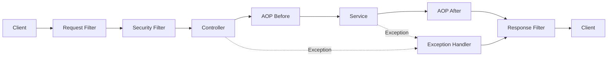
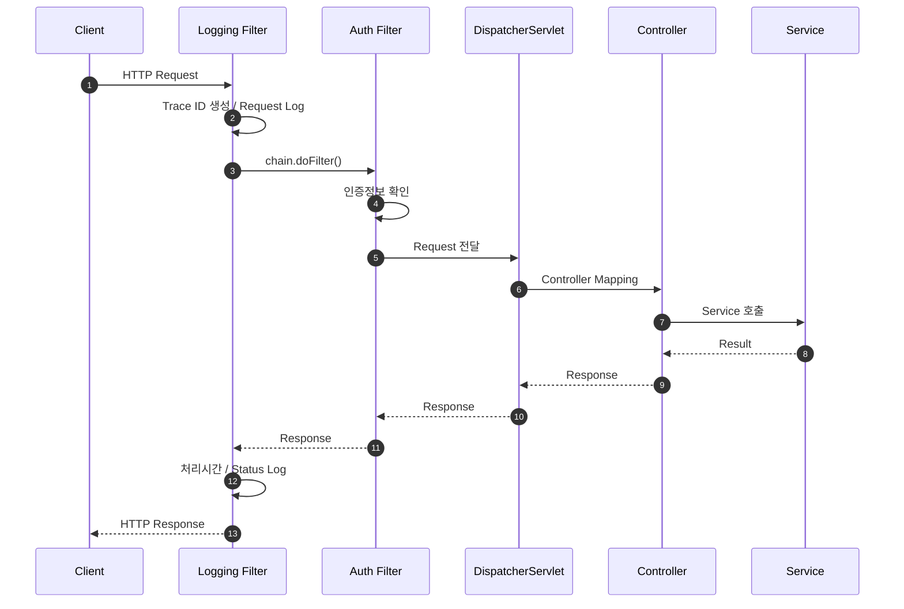
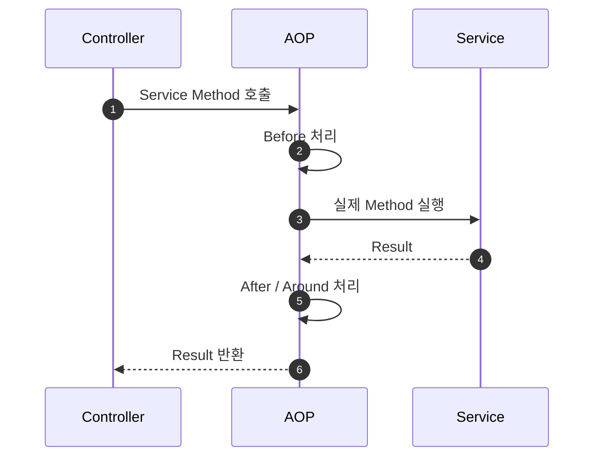
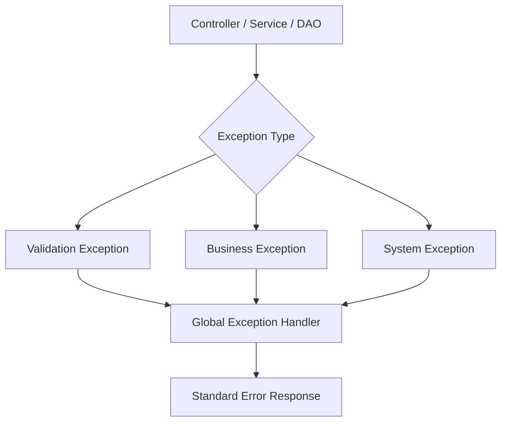

# 공통 처리 구조

## 1. 문서 목적

금융 SI 애플리케이션에서는 모든 요청에 공통으로 적용되는 기능이 많습니다.

예:

- 요청/응답 Logging
- Trace ID
- Channel 정보 확인
- 인증 전처리
- 공통 Header 검증
- 실행시간 측정
- 공통 예외 처리
- 표준 Response 생성

이 기능들을 각 Controller나 Service에 반복해서 작성하면 업무 코드가 복잡해집니다.

Microserver는 **Filter와 AOP를 이용하여 공통 관심사와 비즈니스 로직을 분리**합니다.

---

## 2. 전체 공통 처리 흐름



---

## 3. Filter의 역할

Filter는 Servlet 요청이 Controller에 도달하기 전에 실행됩니다.

요청 흐름:

```text
Client
  ↓
Filter 1
  ↓
Filter 2
  ↓
Security Filter Chain
  ↓
DispatcherServlet
  ↓
Controller
```

응답은 반대 방향으로 전달됩니다.

```text
Controller
  ↓
DispatcherServlet
  ↓
Security Filter Chain
  ↓
Filter 2
  ↓
Filter 1
  ↓
Client
```

---

## 4. Filter 적용 대상

Microserver에서 Filter 적용을 검토할 기능은 다음과 같습니다.

### Request Trace

요청마다 고유 Trace ID를 생성합니다.

```text
Request
→ TRACE_ID 생성
→ MDC 저장
→ 전체 요청 처리
→ Response
→ MDC 정리
```

### Logging

다음 정보를 공통으로 남길 수 있습니다.

- Trace ID
- URI
- HTTP Method
- Client IP
- Channel
- User ID
- 처리시간
- HTTP Status

### Header 처리

업무별 Controller에서 반복하지 않도록 공통 Header를 확인할 수 있습니다.

### 인증 전처리

Spring Security와 역할을 구분하여 필요한 공통 인증 정보를 구성할 수 있습니다.

---

## 5. Filter Chain 시퀀스



---

## 6. OncePerRequestFilter 활용 방향

요청당 한 번만 수행되어야 하는 Filter는 `OncePerRequestFilter`를 활용할 수 있습니다.

주요 대상:

- Trace ID 생성
- 인증 Token 처리
- Request Logging
- 공통 Header 검사

Forward / Error Dispatch 등으로 동일 요청이 다시 처리되는 경우 불필요한 중복 수행을 줄이는 데 유리합니다.

---

## 7. AOP의 역할

AOP는 HTTP Request 자체보다는 **메소드 실행 전후의 횡단 관심사**를 처리하는 데 사용합니다.

예:

- Service 실행시간 측정
- 특정 Annotation 기반 Logging
- 감사 로그
- 주요 Method 호출 추적
- 업무 전/후 공통 처리



---

## 8. Filter와 AOP의 구분

| 구분 | Filter | AOP |
|---|---|---|
| 기준 | HTTP Request / Response | Method 실행 |
| 위치 | Servlet / Web 진입부 | Spring Bean Method |
| 주요 목적 | 요청 선처리 | 횡단 관심사 |
| 예 | Trace, Header, 인증 전처리 | 실행시간, 감사, 메소드 로그 |
| 업무 로직 | 구현하지 않음 | 구현하지 않음 |

둘을 무분별하게 섞지 않고 책임을 명확히 구분합니다.

---

## 9. 공통 Exception 처리

예외는 가능한 한 공통 Handler에서 일관된 응답으로 변환합니다.



예외를 단순 메시지 문자열로만 처리하지 않고 오류 코드, 사용자 메시지, Trace ID 등을 포함할 수 있는 구조를 검토합니다.

---

## 10. 공통 Response 처리

정상 응답도 공통 형식을 사용하여 API별 응답 구조 편차를 줄입니다.

개념 예:

```json
{
  "header": {
    "resultCode": "0000",
    "resultMessage": "정상처리되었습니다.",
    "traceId": "..."
  },
  "data": {}
}
```

실제 필드 명칭은 API 표준을 확정하는 단계에서 결정합니다.

---

## 11. 설계 원칙

- Filter에서 비즈니스 처리를 하지 않는다.
- AOP에서 업무의 핵심 판단을 하지 않는다.
- 기술 공통 처리는 공통 Module에 둔다.
- 모든 요청을 추적할 수 있도록 Trace 기준을 갖는다.
- 예외와 응답 구조를 표준화한다.
- Filter 순서가 중요한 경우 등록 순서를 명확히 관리한다.

이 구조를 통해 업무 개발자는 Controller와 Service의 업무 처리에 집중할 수 있게 합니다.
