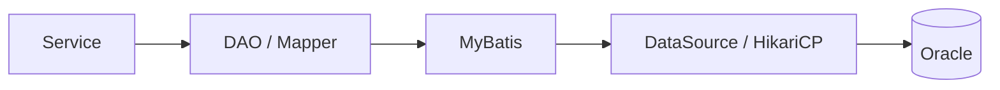
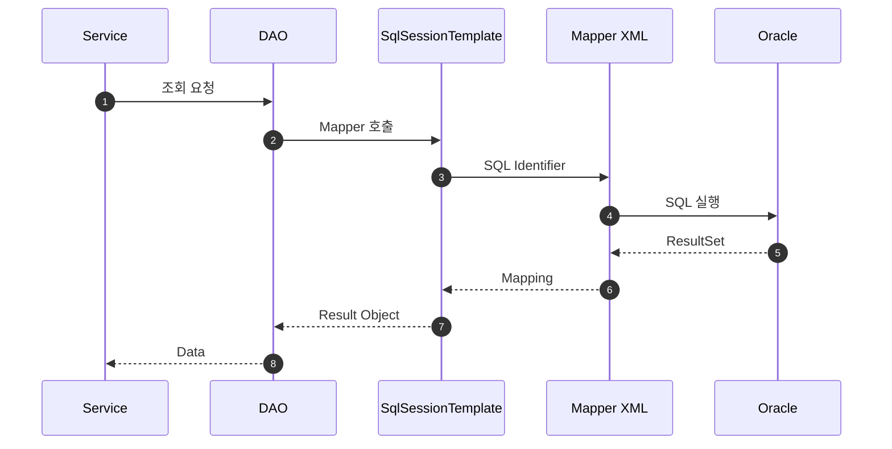
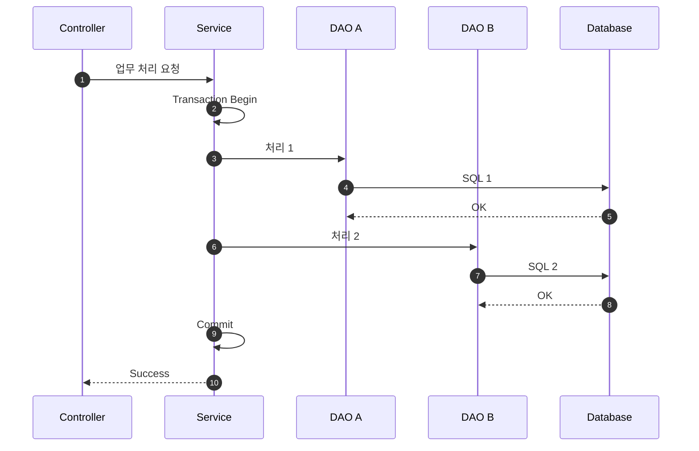
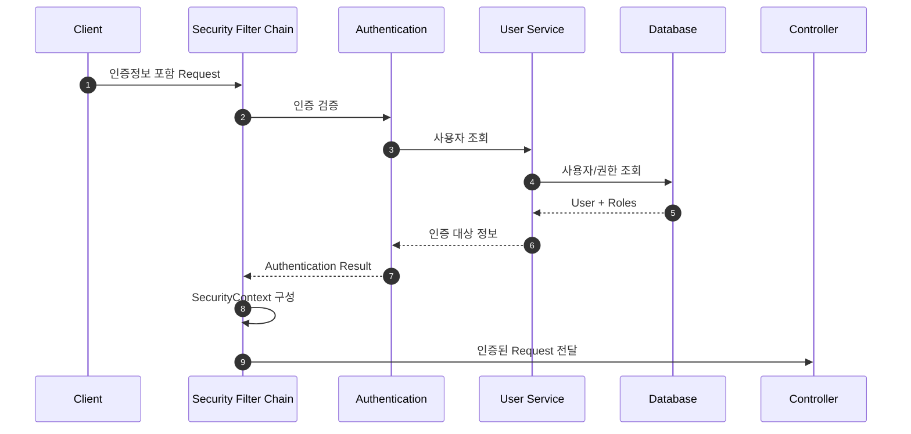
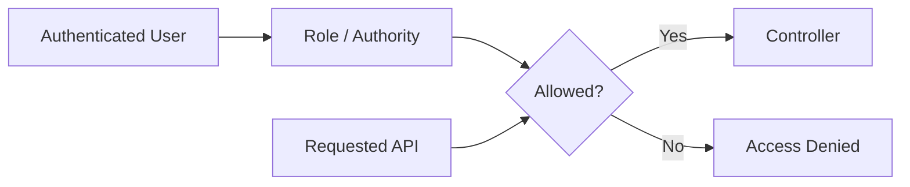

# 데이터 및 보안 아키텍처

## 1. 문서 목적

Database와 Security는 금융 SI 애플리케이션에서 가장 기본적이면서도 영향 범위가 큰 영역입니다.

Microserver는 두 기능을 업무 코드에 직접 흩어놓지 않고 **공통 설정과 정책을 통해 일관되게 적용**하는 방향으로 설계합니다.

---

# Part 1. 데이터 아키텍처

## 2. 데이터 접근 기본 구조



Service가 DataSource를 직접 사용하지 않고 DAO / Mapper를 통해 접근하도록 합니다.

---

## 3. DataSource 구성 방향

DataSource는 공통 Configuration에서 Bean으로 구성하고 업무 Module에서 재사용하는 방향을 검토합니다.

주요 설정 영역:

- JDBC URL
- Driver
- User
- Password
- Connection Pool
- Timeout
- Pool Size
- Transaction Isolation

민감한 접속정보는 소스에 평문으로 포함하지 않는 것을 원칙으로 합니다.

---

## 4. MyBatis 처리 흐름



SQL과 Java 업무 로직을 분리하여 유지보수성을 확보합니다.

---

## 5. Multi DataSource

금융 프로젝트에서는 목적별로 여러 Database를 사용하는 경우가 있습니다.

```text
Application
├─ Common DataSource
├─ Business DataSource
└─ External / Legacy DataSource
```

각 DataSource는 다음 요소를 독립적으로 가질 수 있습니다.

- HikariConfig
- DataSource Bean
- SqlSessionFactory
- SqlSessionTemplate
- TransactionManager
- Mapper Scan 범위

초기 단계에서는 단일 DataSource를 먼저 완성한 후 Multi DataSource로 확장합니다.

---

## 6. Transaction 아키텍처

Transaction의 기본 단위는 Service입니다.



오류 시:

```text
SQL 1 성공
  ↓
SQL 2 실패
  ↓
Exception
  ↓
Transaction Rollback
  ↓
SQL 1까지 원복
```

---

# Part 2. Security 아키텍처

## 7. Security 기본 방향

Spring Security를 이용하여 인증과 인가를 공통화합니다.

핵심 영역:

- Authentication
- Authorization
- Role / Permission
- Security Context
- 인증 실패 처리
- 접근 거부 처리

---

## 8. 인증 요청 흐름



구체적인 인증 방식은 실제 구축 단계에서 선택합니다.

예:

- ID / Password
- Session
- JWT
- OAuth2 / OIDC
- 외부 인증 연계

---

## 9. 인가 흐름

인증이 “누구인가”를 확인하는 것이라면 인가는 “무엇을 할 수 있는가”를 판단합니다.



---

## 10. 보안 정보 관리

다음 정보는 평문 하드코딩을 피합니다.

- DB Password
- API Key
- Client Secret
- 외부 시스템 Credential
- 암복호화 Key

적용 후보:

- 환경변수
- 환경별 외부 Configuration
- Jasypt
- Kubernetes Secret
- 전용 Secret 관리 솔루션

환경에 따라 적절한 방식을 선택합니다.

---

## 11. Data와 Security의 접점

사용자 및 권한 정보는 Database에 저장될 수 있으며 Security 구성과 밀접하게 연계됩니다.

```text
Security Filter
    ↓
User Authentication Service
    ↓
User / Role DAO
    ↓
User / Role Tables
```

따라서 Security Module이 업무 DAO에 무분별하게 의존하지 않도록 공통 사용자/권한 Repository의 책임을 명확히 설계해야 합니다.

---

## 12. 설계 원칙

- DataSource 설정을 업무 코드에 직접 구현하지 않는다.
- Transaction은 업무 단위로 관리한다.
- 다중 DataSource는 명시적으로 분리한다.
- 인증과 인가를 구분한다.
- 보안 정보는 평문 하드코딩하지 않는다.
- Security 정책을 Controller마다 반복하지 않는다.
- 인증/권한 변경이 업무 로직에 미치는 영향을 최소화한다.
