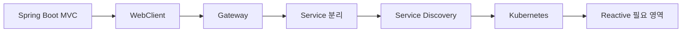
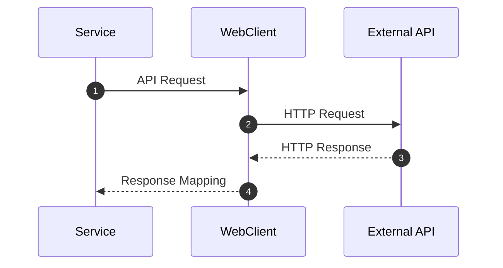
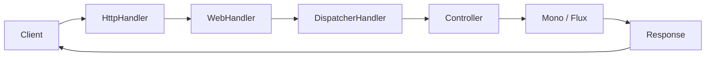
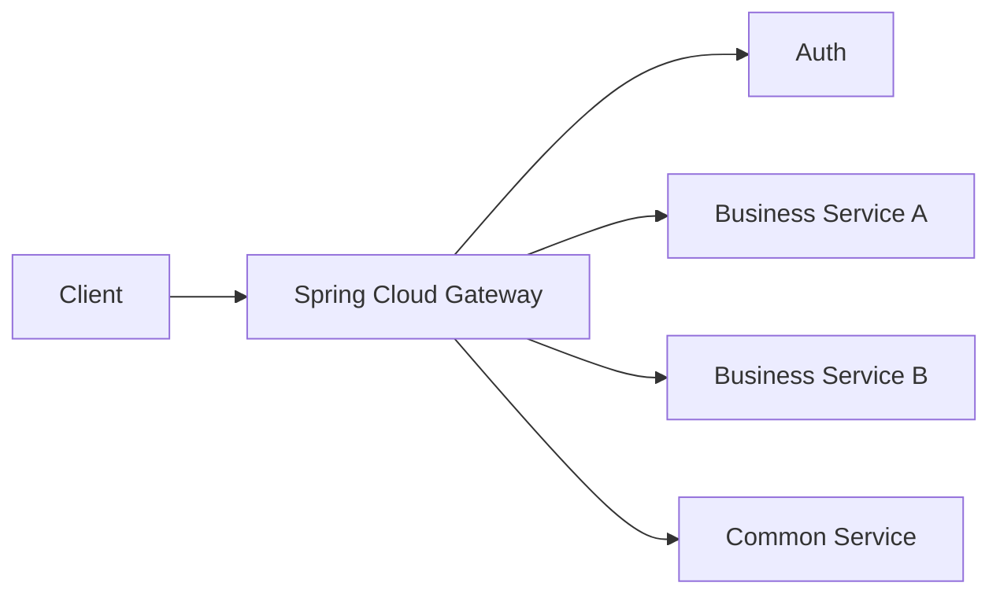
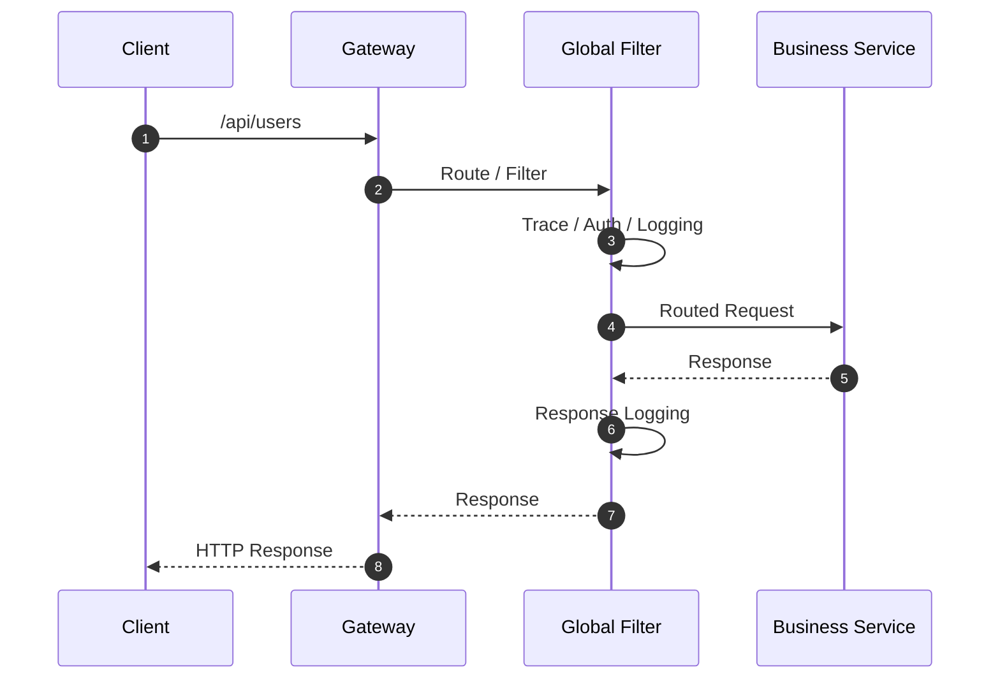
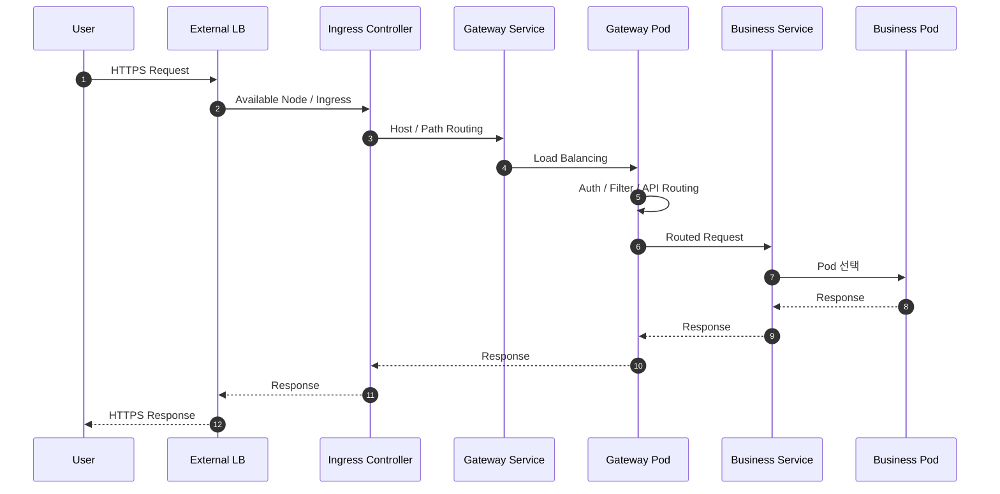

# 확장 및 운영 아키텍처

## 1. 문서 목적

Microserver의 초기 목표는 복잡한 MSA 플랫폼을 먼저 만드는 것이 아닙니다.

Spring Boot 애플리케이션의 기본 구조와 공통 기능을 안정적으로 구축한 뒤, 실제 요구사항에 따라 다음 기술을 단계적으로 적용합니다.

- WebClient
- Spring WebFlux
- Spring Cloud Gateway
- Service Discovery
- Kubernetes
- Health Check
- 운영 Logging / Tracing

---

## 2. 단계적 확장 방향



실제 프로젝트에서는 순서가 달라질 수 있지만 기술 도입은 필요성이 확인된 경우에 진행합니다.

---

## 3. WebClient

외부 REST API 또는 내부 서비스 호출이 필요한 경우 WebClient를 사용할 수 있습니다.

기본 호출 흐름:



WebClient를 사용한다고 해서 전체 애플리케이션을 반드시 Reactive로 구성해야 하는 것은 아닙니다.

적용 시 다음을 검토합니다.

- Timeout
- Connection Pool
- Retry
- Error Mapping
- Logging
- Trace Header 전달

---

## 4. Spring WebFlux

WebFlux는 Reactive 요청 처리가 필요한 영역에서 검토합니다.

대표적인 요청 흐름:



Reactive에서는 Thread가 고정되지 않을 수 있으므로 기존 `ThreadLocal` 기반 MDC 사용 방식도 다시 검토해야 합니다.

Trace 정보는 Reactor Context와 연계하는 구조가 필요할 수 있습니다.

---

## 5. Spring Cloud Gateway

서비스가 분리되면 외부 요청의 공통 진입점이 필요할 수 있습니다.

Gateway 주요 역할:

- Path / Host 기반 Routing
- 인증 Token 검증 또는 전달
- Header 처리
- Logging
- Trace
- Rate Limit
- URL Rewrite
- 공통 오류 처리



Gateway에 비즈니스 로직을 넣지 않는 것이 중요합니다.

---

## 6. Gateway 요청 시퀀스



---

## 7. Kubernetes 환경의 외부 요청 흐름

Kubernetes 환경에서는 Ingress와 Gateway의 책임을 구분합니다.

```text
사용자
  ↓
External Load Balancer
  ↓
Ingress Controller
  ↓
Kubernetes Service
  ↓
Spring Cloud Gateway
  ↓
Kubernetes Service
  ↓
Business Application Pod
```

Ingress는 **클러스터 진입점**, Gateway는 **애플리케이션/API 관문**으로 구분하는 것이 이해하기 쉽습니다.

---

## 8. Kubernetes 상세 트래픽 흐름



---

## 9. Service Discovery

서비스가 동적으로 생성/삭제되는 환경에서는 Service Discovery가 필요할 수 있습니다.

다만 Kubernetes에서는 Kubernetes Service 자체가 서비스 탐색 역할을 제공하므로 별도 Eureka와의 관계를 실제 운영환경 기준으로 판단해야 합니다.

따라서 Service Discovery 기술은 목적 없이 중복 적용하지 않습니다.

---

## 10. Health Check

운영환경에서는 애플리케이션이 단순히 Process가 떠 있는지만 확인해서는 부족합니다.

다음 상태를 구분할 필요가 있습니다.

- 애플리케이션 Process 실행 여부
- 요청을 받을 준비가 되었는지
- Database 연결 가능 여부
- 필수 Cache 로딩 여부
- 외부 연계 상태

Kubernetes 환경에서는 Liveness / Readiness 개념과 연계할 수 있습니다.

---

## 11. 장애 격리

서비스 분리 후에는 장애가 다른 서비스로 전파되지 않도록 해야 합니다.

고려 항목:

- Timeout
- Retry
- Circuit Breaker
- Connection Pool
- Bulkhead
- Rate Limit

모든 장애에 Retry를 적용하면 오히려 장애를 확대할 수 있으므로 업무 특성을 기준으로 적용합니다.

---

## 12. Trace 연계

분산 환경에서는 하나의 요청이 여러 서비스를 거치므로 동일 요청을 추적할 수 있는 식별자가 중요합니다.

```text
Client
  TRACE_ID=AAA
      ↓
Gateway
  TRACE_ID=AAA
      ↓
Business Service
  TRACE_ID=AAA
      ↓
Integration Service
  TRACE_ID=AAA
```

Gateway에서 생성한 Trace ID 또는 상위에서 전달된 Trace ID를 하위 호출에 계속 전달하도록 구성합니다.

---

## 13. 확장 판단 기준

새 기술을 적용하기 전에 다음을 확인합니다.

1. 현재 구조에서 해결하기 어려운 문제가 존재하는가
2. 도입으로 얻는 이점이 명확한가
3. 운영 복잡도를 감당할 수 있는가
4. 장애 대응 방법을 알고 있는가
5. 팀에서 유지보수할 수 있는가
6. 기존 금융 인프라와 호환되는가

---

## 14. 확장 목표

Microserver는 처음부터 복잡한 플랫폼을 만드는 것이 아니라 다음 방향으로 성장합니다.

```text
단일 Spring Boot 애플리케이션
        ↓
공통 Module 표준화
        ↓
내부/외부 서비스 연계
        ↓
서비스 분리 필요성 발생
        ↓
Gateway / Service 구조 확장
        ↓
Container / Kubernetes 운영
```

이렇게 함으로써 학습 목적과 실전 적용 가능성을 함께 확보하는 것을 목표로 합니다.
