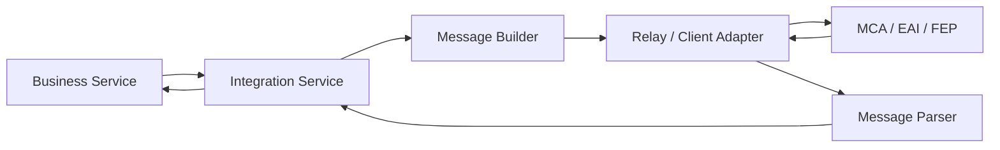
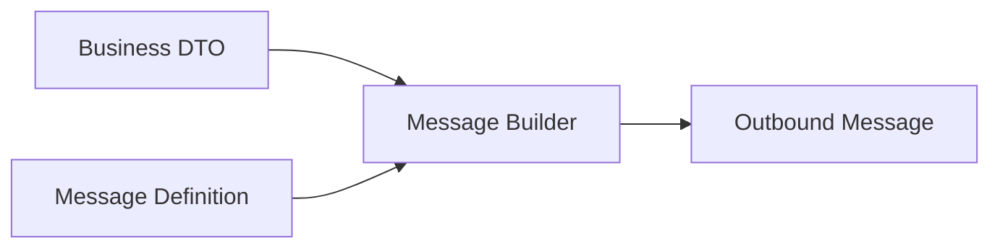
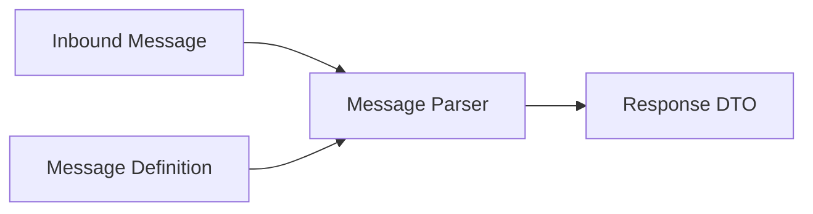
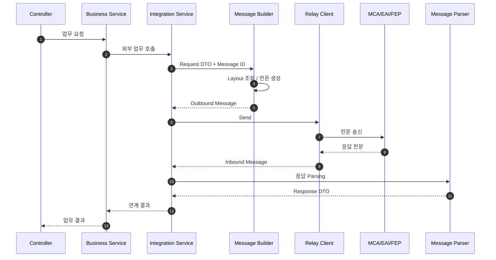
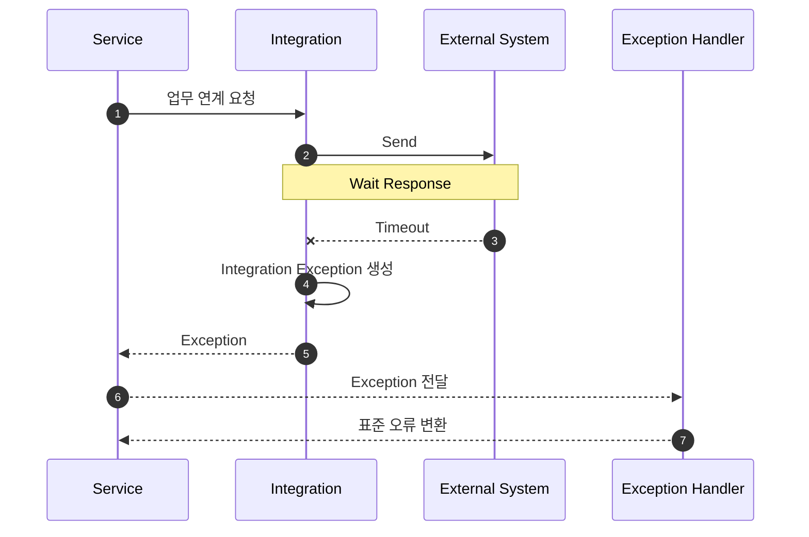

# 금융 시스템 연계 아키텍처

## 1. 문서 목적

금융 SI 애플리케이션은 Database만 사용하는 독립 시스템이 아니라 다양한 내부 및 외부 시스템과 연결됩니다.

대표적인 연계 영역은 다음과 같습니다.

- MCA
- EAI
- FEP
- 계정계
- 카드 / 여신 / 고객 시스템
- 인증기관
- 대외기관

Microserver는 이러한 연계 로직을 업무 Service에 직접 구현하지 않고 **공통 Integration Layer를 통해 분리**하는 구조를 지향합니다.

---

## 2. 기본 연계 구조



---

## 3. 업무 Service와 연계 영역 분리

잘못된 구조:

```text
Business Service
├─ Socket 연결
├─ Header 생성
├─ 전문 Field Padding
├─ Byte Encoding
├─ Send
├─ Receive
└─ Response Parsing
```

이렇게 되면 업무 로직과 통신 로직이 강하게 결합됩니다.

권장 방향:

```text
Business Service
      ↓
Integration Service
      ↓
Message Builder / Parser
      ↓
Transport Adapter
      ↓
MCA / EAI / FEP
```

업무 Service는 “무슨 업무를 요청하는지”만 알고, 전문 길이/필드 순서/통신 방식은 Integration 영역에서 담당합니다.

---

## 4. 전문 Message 구조

금융 전문은 일반 JSON API와 달리 고정 길이, 필드 순서, Encoding 규칙 등을 사용하는 경우가 있습니다.

개념 예:

```text
+-----------+-----------+--------------+----------------+
| Header    | Biz Code  | Customer No  | Amount         |
+-----------+-----------+--------------+----------------+
| 100 Byte  | 4 Byte    | 10 Byte      | 15 Byte        |
+-----------+-----------+--------------+----------------+
```

Microserver는 전문 정의를 기준으로 Message를 생성하고 응답을 다시 Object로 변환하는 구조를 검토합니다.

---

## 5. Message Builder

Builder는 업무 데이터를 실제 송신 전문으로 변환합니다.



처리 예:

1. 전문 Layout 조회
2. Field 순서 확인
3. 값 Mapping
4. 길이 보정
5. Padding
6. Encoding
7. Header 구성
8. 최종 Message 생성

---

## 6. Message Parser

수신 전문은 반대 과정으로 해석합니다.



---

## 7. 전체 송수신 시퀀스



---

## 8. MCA / EAI / FEP 역할

### MCA

일반적으로 내부 업무 시스템 또는 계정계 접근을 위한 표준 연계 계층으로 활용될 수 있습니다.

### EAI

내부 애플리케이션 간 데이터 및 서비스 연계를 통합하는 Middleware 역할을 수행할 수 있습니다.

### FEP

외부 금융기관 또는 대외기관과의 전문 통신을 담당하는 영역으로 활용될 수 있습니다.

실제 Protocol과 전문 규격은 각 금융사의 환경에 따라 다르므로 공통 Framework는 특정 제품에 강하게 종속되지 않는 방향을 지향합니다.

---

## 9. 장애 처리

외부 연계는 다음 오류를 고려해야 합니다.

- Connection 실패
- Timeout
- 전문 생성 오류
- 전문 Parsing 오류
- 외부 시스템 오류 응답
- 중복 요청
- 응답 지연
- Connection Pool 고갈

Integration Layer에서 기술 오류를 표준 예외로 변환하여 업무 Service에 전달하는 구조가 필요합니다.

---

## 10. Timeout 처리 흐름



---

## 11. Logging / Trace

외부 연계는 장애 추적을 위해 업무 요청과 연계 요청을 동일 Trace 기준으로 연결하는 것이 중요합니다.

예:

```text
TRACE_ID      : ABC123
BUSINESS_ID   : USER-REG-001
MESSAGE_ID    : MCA-10001
REMOTE_SYSTEM : CORE
ELAPSED       : 152ms
RESULT        : SUCCESS
```

민감한 전문 데이터는 그대로 로그에 남기지 않고 Masking 정책을 적용해야 합니다.

---

## 12. 전문 정의 캐싱

전문 Layout이 Database에 저장되는 경우 요청마다 조회하지 않고 메모리 Cache에서 참조하는 구조를 사용할 수 있습니다.

```text
Application Start
      ↓
Message Definition Load
      ↓
Memory Cache
      ↓
Message Builder / Parser
```

전문 정의 변경 시 Cache Reload 정책도 함께 설계해야 합니다.

---

## 13. 설계 원칙

- 업무 Service에서 전문 생성/Parsing을 직접 하지 않는다.
- 외부 통신 상세를 Adapter로 분리한다.
- 전문 정의와 업무 데이터의 Mapping 책임을 명확히 한다.
- Timeout과 외부 장애를 표준화한다.
- 연계 로그에 Trace를 유지한다.
- 민감정보는 Masking한다.
- 특정 Middleware 제품에 과도하게 종속되지 않는 Interface를 검토한다.
