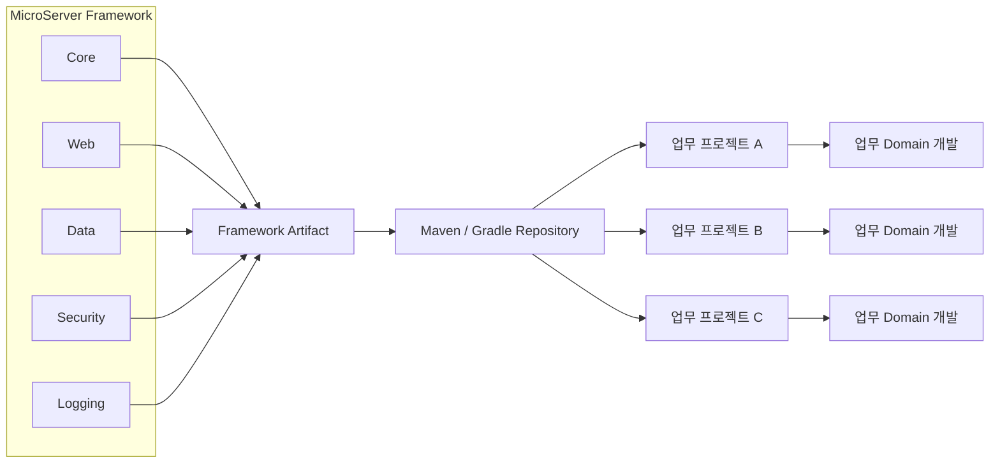

# Team-Microserver 공통 프레임워크와 업무 도메인 분리 전략

## 1. 문서 목적

Team-Microserver는 일반 업무 개발자가 프레임워크 내부 구현과 공통 인프라 설정을 직접 다루지 않고,
업무 기능 개발에 집중할 수 있는 구조를 목표로 한다.

이 문서는 다음 질문에 대한 아키텍처 방향을 정리한다.

> 공통 기능을 `common` 모듈로 두고 전체 프로젝트를 멀티모듈로 구성하는 것이 좋은가,
> 아니면 공통 프레임워크와 업무 도메인 프로젝트를 별도 프로젝트로 분리하는 것이 좋은가?

결론부터 말하면, Team-Microserver의 목표에는 **공통 프레임워크와 업무 도메인 프로젝트를 물리적으로 분리하고,
공통 기능은 JAR 형태의 라이브러리로 배포하는 방식**이 더 적합하다.

---

## 2. 핵심 설계 목표

Team-Microserver가 지향하는 개발 방식은 다음과 같다.

```text
Framework Team
    │
    ├─ 공통 Framework 개발
    │   ├─ DataSource
    │   ├─ Transaction
    │   ├─ Security
    │   ├─ Logging
    │   ├─ Web 공통 설정
    │   ├─ MyBatis / JPA 설정
    │   ├─ Exception
    │   └─ Utility
    │
    ├─ Test / Version 관리
    │
    └─ JAR 배포
            ↓
     Maven / Gradle Repository
            ↓
Business Developer
    │
    └─ 업무 Domain 프로젝트 개발
        ├─ Controller
        ├─ Service
        ├─ Domain
        ├─ Repository / Mapper
        └─ DTO
```

일반 업무 개발자는 공통 프레임워크 내부 소스와 세부 설정을 알 필요 없이,
표준화된 기능을 의존성으로 받아 사용하는 것을 기본 원칙으로 한다.

---

## 3. 멀티모듈의 목적

Gradle Multi-Project 또는 Maven Multi-Module은 다음과 같은 목적에 적합하다.

- 하나의 제품 또는 시스템을 여러 책임 단위로 나누어 관리
- 모듈 간 의존성을 명확하게 표현
- 공통 코드를 재사용
- 모듈별 Build / Test 구조 구성
- 하나의 Repository 안에서 여러 모듈을 함께 개발

예를 들어 다음 구조는 전형적인 멀티모듈 구조다.

```text
microserver
├─ common
├─ runtime
├─ admin
└─ business
```

이 구조는 모든 모듈을 같은 조직이나 같은 개발팀이 함께 관리할 때는 효율적이다.

하지만 Team-Microserver가 목표로 하는 것은 조금 다르다.

---

## 4. Team-Microserver에서 단일 멀티모듈 구조가 가지는 한계

전체 프로젝트를 다음처럼 하나의 Repository로 구성한다고 가정한다.

```text
microserver
├─ framework-common
├─ framework-runtime
├─ admin
└─ business-domain
```

일반 개발자에게 이 Repository 전체를 전달하면 다음 문제가 발생할 수 있다.

### 4.1 공통 프레임워크 소스가 업무 개발자에게 노출된다

업무 개발자는 공통 프레임워크를 단순히 사용하는 것이 아니라,
소스까지 직접 접근하고 수정할 수 있게 된다.

이 경우 다음과 같은 문제가 발생할 수 있다.

- 프로젝트별 임의 수정
- 표준 기능 훼손
- 공통 설정 변경
- 버전 기준 불명확
- 프로젝트마다 다른 Framework 파생본 생성
- 장애 발생 시 책임 범위 불명확

### 4.2 공통 Framework와 업무 Domain의 배포 주기가 결합된다

Framework 수정과 업무 기능 수정이 같은 Repository와 Build 구조에 묶이면
서로 다른 변경 주기를 독립적으로 운영하기 어려워진다.

### 4.3 Framework 버전 관리가 어려워진다

업무 프로젝트별로 어떤 Framework 버전을 사용했는지 명확하게 관리하려면
소스 포함 방식보다 Artifact 버전 방식이 훨씬 유리하다.

---

## 5. 권장 구조

Team-Microserver에서는 **Framework 프로젝트와 업무 Domain 프로젝트를 분리하는 방식**을 기본 방향으로 한다.

```text
Team-Microserver
│
├─ microserver-framework
│   │
│   ├─ framework-core
│   ├─ framework-web
│   ├─ framework-data
│   ├─ framework-security
│   └─ framework-support
│
│      Build / Test
│          ↓
│
│      JAR Artifact
│          ↓
│
├─ Artifact Repository
│   ├─ Nexus
│   ├─ Artifactory
│   ├─ GitHub Packages
│   └─ 기타 사내 Maven Repository
│
│          ↓
│
└─ business-project
    ├─ domain-customer
    ├─ domain-account
    ├─ domain-product
    └─ application
```

여기서 중요한 점은 **멀티모듈을 사용하지 않는다는 의미가 아니다.**

Framework 프로젝트 내부에서도 필요하면 멀티모듈을 사용하고,
업무 프로젝트 내부에서도 시스템 규모에 따라 멀티모듈을 사용할 수 있다.

즉,

> 멀티모듈은 프로젝트 내부 구조를 나누기 위한 수단이고,
> Framework와 업무 프로젝트의 배포 경계를 결정하는 수단은 아니다.

---

## 6. Framework 프로젝트 예시

Framework 팀이 관리하는 Repository는 다음과 같이 구성할 수 있다.

```text
microserver-framework
├─ framework-core
├─ framework-web
├─ framework-data
├─ framework-security
├─ framework-logging
├─ framework-cache
└─ framework-integration
```

이 Repository는 Framework 개발자가 관리한다.

일반 업무 개발자에게는 이 소스를 직접 배포하지 않고,
Build된 Artifact를 제공한다.

예:

```text
microserver-core-1.0.0.jar
microserver-web-1.0.0.jar
microserver-data-1.0.0.jar
microserver-security-1.0.0.jar
```

또는 Starter 방식으로 한 단계 더 추상화할 수도 있다.

```text
microserver-starter-web
microserver-starter-data
microserver-starter-security
```

---

## 7. 업무 Domain 프로젝트 예시

일반 개발자는 별도의 업무 Repository에서 개발한다.

```text
customer-service
├─ src
│   └─ main
│       └─ java
│           └─ com.company.customer
│               ├─ controller
│               ├─ service
│               ├─ domain
│               ├─ repository
│               ├─ mapper
│               └─ dto
│
└─ build.gradle
```

`build.gradle`에서는 Framework Artifact만 의존성으로 선언한다.

```gradle
dependencies {
    implementation("com.company.microserver:microserver-starter-web:1.0.0")
    implementation("com.company.microserver:microserver-starter-data:1.0.0")
    implementation("com.company.microserver:microserver-starter-security:1.0.0")
}
```

업무 개발자는 내부 구현을 몰라도 Framework가 제공하는 표준 기능을 사용할 수 있다.

---

## 8. 개발자 역할 분리

### Framework 개발자

Framework 개발자는 다음 영역을 담당한다.

- DataSource
- Transaction
- Security
- Logging
- Exception
- Web 공통 설정
- MyBatis / JPA 공통 설정
- Cache
- 공통 Utility
- 외부 연계 공통 기능
- Framework 버전 및 호환성 관리

### 업무 개발자

업무 개발자는 다음 영역에 집중한다.

- Controller
- Service
- Domain
- Repository
- Mapper
- DTO
- 업무 Validation
- 업무 프로세스
- 화면 / API 요구사항 구현

이 구분이 Team-Microserver의 핵심 개발 경험이다.

---

## 9. 권장 Repository 구성

향후 Repository를 다음과 같이 분리하는 방안을 우선 검토한다.

```text
Team-Microserver
│
├─ microserver-framework
│   └─ Framework Source
│
├─ microserver-sample
│   └─ Framework 사용 예제
│
├─ microserver-admin
│   └─ Framework 관리 기능
│
├─ business-customer
│   └─ 고객 업무 Domain
│
├─ business-account
│   └─ 계좌 업무 Domain
│
└─ business-product
    └─ 상품 업무 Domain
```

실제 업무 프로젝트의 규모에 따라 `business-*` 프로젝트 내부를 다시 멀티모듈로 구성할 수 있다.

---

## 10. 멀티모듈과 별도 Repository의 역할 구분

| 구분 | 목적 |
|---|---|
| Multi-Module | 하나의 프로젝트 내부 책임 및 Build 단위 분리 |
| 별도 Repository | 개발 주체, Source 관리, Release 주기 분리 |
| JAR Artifact | Framework 기능 배포 |
| Maven / Gradle Repository | Framework 버전 관리 및 배포 |
| Business Repository | 실제 업무 기능 개발 |

따라서 Team-Microserver에서는 이 개념들을 서로 대체 관계로 보지 않는다.

```text
Repository 분리
        +
각 Repository 내부 Multi-Module
        +
Artifact Repository를 통한 Framework 배포
```

이 세 가지를 조합하는 방식이 가장 적합하다.

---

## 11. 권장 아키텍처



---

## 12. 최종 설계 원칙

Team-Microserver에서는 다음 원칙을 기본으로 한다.

1. **공통 Framework와 업무 Domain Source를 분리한다.**
2. **공통 Framework는 Framework 전담 영역에서 개발한다.**
3. **업무 개발자에게 Framework Source를 직접 수정하도록 요구하지 않는다.**
4. **Framework는 JAR / Starter 형태로 배포한다.**
5. **Framework Artifact는 명확한 Version을 가진다.**
6. **업무 프로젝트는 Framework Artifact를 Dependency로 사용한다.**
7. **업무 개발자는 업무 Domain 개발에 집중한다.**
8. **Multi-Module은 각 Repository 내부의 구조화 수단으로 사용한다.**
9. **Framework와 업무 프로젝트의 분리는 Repository / Release 경계로 관리한다.**
10. **특수한 경우에만 제한적으로 Framework 설정을 Override할 수 있도록 한다.**

---

## 13. 한 문장으로 정리

> **Team-Microserver는 공통 Framework를 소스로 배포하는 구조가 아니라, 독립된 Framework 프로젝트에서 표준 기능을 개발하고 버전이 부여된 JAR Artifact로 제공하며, 일반 업무 개발자는 이를 의존성으로 사용해 Domain 업무 개발에 집중하는 구조를 지향한다.**

---

## 14. 향후 검토 항목

향후 Framework 구현 단계에서는 다음 항목을 추가 검토한다.

- Framework Artifact Naming 규칙
- Group ID / Artifact ID 규칙
- Semantic Versioning 적용
- SNAPSHOT / Release 운영 방식
- Nexus / Artifactory / GitHub Packages 중 Repository 선정
- Spring Boot Starter 구조 적용 여부
- Auto Configuration 적용 범위
- Framework Configuration Override 정책
- Framework API 호환성 관리
- 업무 프로젝트 Template 제공 방식
- Framework Upgrade 및 Migration 정책
