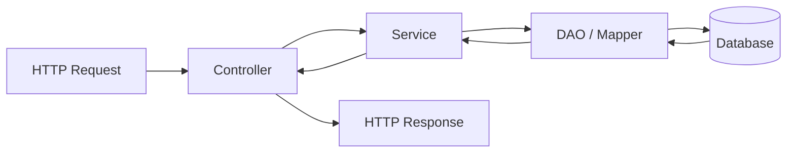
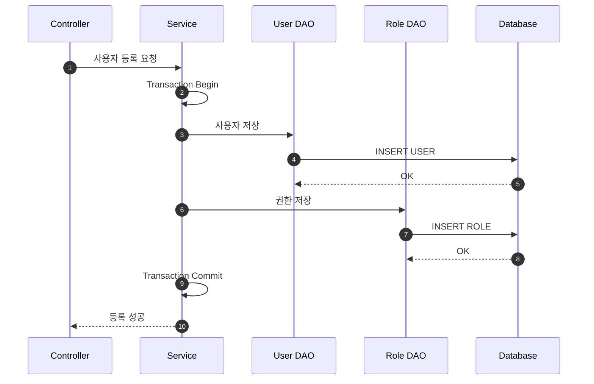
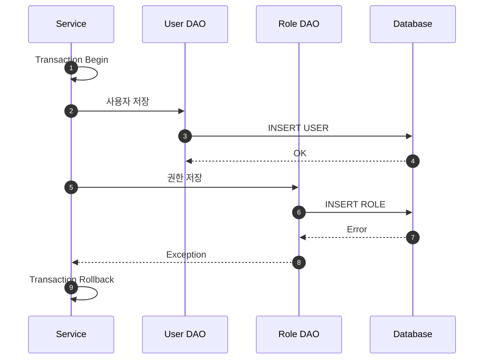
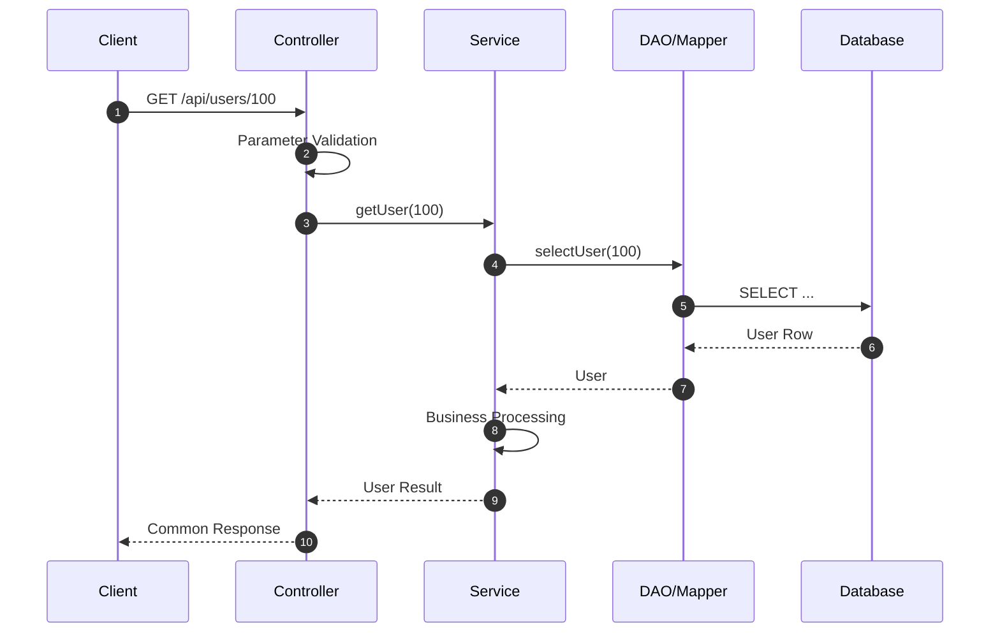
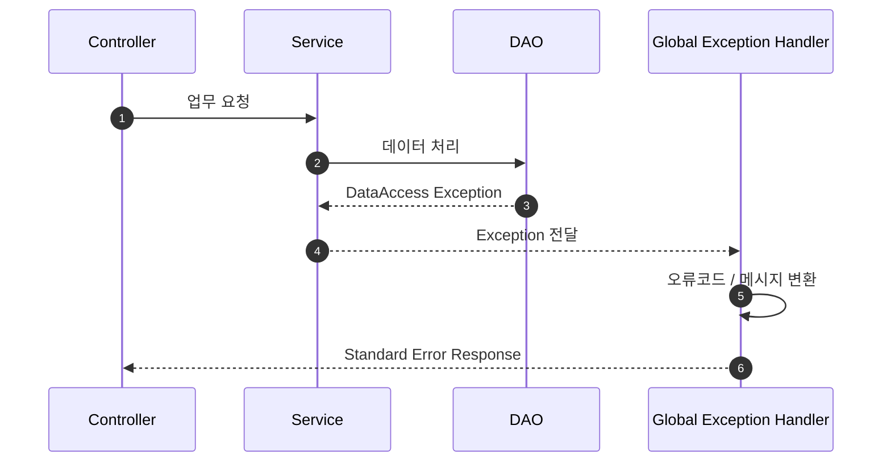

# 애플리케이션 계층 구조

## 1. 문서 목적

Microserver는 애플리케이션 내부의 역할을 명확히 하기 위해 기본적으로 다음 계층을 구분합니다.

```text
Controller
    ↓
Service
    ↓
DAO / Persistence
    ↓
Database
```

각 Layer는 자신에게 부여된 책임만 수행하고, 다른 Layer의 책임을 직접 처리하지 않는 것을 기본 원칙으로 합니다.

---

## 2. 요청 처리 구조



---

## 3. Controller 역할

Controller는 **외부 요청과 애플리케이션 내부 Service를 연결하는 진입 계층**입니다.

주요 역할:

- URL / HTTP Method Mapping
- Request Parameter Binding
- Request Body Binding
- 기본 Validation
- 로그인 사용자 등 요청 Context 전달
- Service 호출
- 표준 Response 반환

Controller가 직접 SQL을 호출하거나 복잡한 업무 로직을 수행하지 않도록 합니다.

### Controller가 가져야 할 코드

```text
요청 받기
→ 입력 검증
→ Service 호출
→ 결과 반환
```

### Controller가 가지지 않아야 할 코드

```text
복잡한 계산
다수의 DAO 직접 호출
Transaction 제어
전문 Parsing
외부 시스템 통신 상세 로직
```

---

## 4. Service 역할

Service는 **전체 비즈니스 처리의 중심**입니다.

주요 역할:

- 비즈니스 규칙 수행
- 여러 DAO 호출 조합
- 여러 공통 Service 호출
- 외부 연계 호출
- 데이터 정합성 관리
- Transaction 시작 및 종료

예를 들어 “사용자 등록” 업무가 있다고 가정하면 Service는 다음 흐름을 담당합니다.

```text
사용자 중복 확인
    ↓
사용자 기본정보 저장
    ↓
기본 권한 생성
    ↓
처리 이력 저장
```

이 전체가 하나의 업무 단위라면 하나의 Transaction으로 처리하는 것이 자연스럽습니다.

---

## 5. Transaction 기본 단위

Transaction은 Service 계층을 기본 단위로 합니다.



두 번째 저장에서 오류가 발생하면 전체 업무를 Rollback합니다.



---

## 6. DAO / Persistence 역할

DAO / Persistence 계층은 Database 접근에 집중합니다.

주요 역할:

- SQL 실행
- Mapper 호출
- 조회
- 등록
- 수정
- 삭제
- Query Parameter 전달
- Query Result 반환

DAO에서 업무 조건을 판단하거나 여러 업무 흐름을 조합하지 않는 것이 좋습니다.

---

## 7. DTO / Domain 객체

Layer 간 데이터 전달을 위해 DTO를 사용할 수 있습니다.

개념적으로는 다음처럼 구분할 수 있습니다.

```text
Request DTO
    ↓
Controller
    ↓
Service DTO / Domain
    ↓
DAO Parameter
    ↓
Database Result
    ↓
Response DTO
```

모든 단계에서 무조건 별도 객체를 만들기보다 프로젝트 복잡도와 데이터 성격을 보고 결정합니다.

---

## 8. 정상 요청 시퀀스



---

## 9. 예외 발생 시 흐름



업무 Layer마다 동일한 `try/catch`를 반복하지 않고 공통 예외 처리 체계를 사용하는 것이 기본 방향입니다.

---

## 10. Layer 설계 원칙

- Controller는 얇게 유지한다.
- 비즈니스 처리의 중심은 Service이다.
- Transaction은 Service 기준으로 관리한다.
- DAO는 데이터 접근에 집중한다.
- 업무 로직과 기술 공통 로직을 분리한다.
- 계층 간 호출 방향을 일관되게 유지한다.

이 구조를 기본으로 구축한 후 실제 프로젝트 요구사항에 따라 세부 패턴을 확장합니다.
