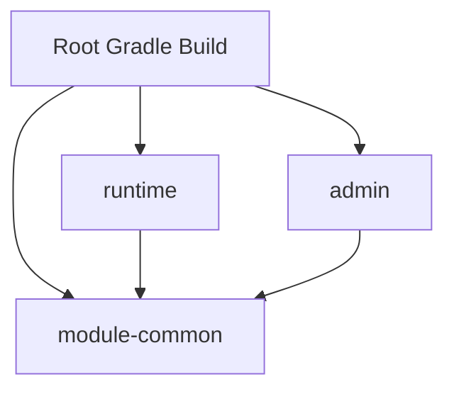
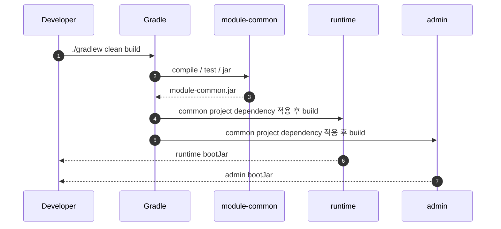
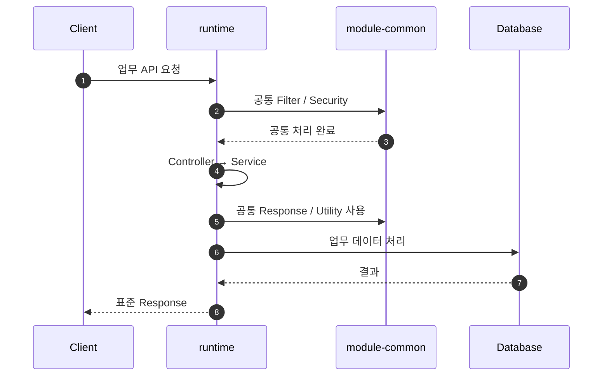

# 멀티모듈 및 프로젝트 구조

## 1. 문서 목적

MicroServer는 **Gradle Multi-Project Build**를 기본 프로젝트 구조로 사용합니다.

목표는 단순히 Directory를 여러 개로 나누는 것이 아니라 다음을 달성하는 것입니다.

- 공통 기능과 업무 기능 분리
- 재사용 가능한 공통 JAR 제공
- 애플리케이션별 책임 분리
- 기능 변경 영향 범위 축소
- 향후 프로젝트에서 필요한 공통 기능의 재사용
- Module 간 Build Dependency를 명확하게 관리

이번 프로젝트에서는 Gradle을 실제 Build 기준으로 사용하되,
기존 Java 프로젝트에서 많이 사용하는 Maven Multi Module 구조와 대응 관계도 함께 이해합니다.

---

## 2. 기본 구조

초기 구조는 다음 방향을 기준으로 구성합니다.

```text
microserver/
├─ settings.gradle
├─ build.gradle
│
├─ module-common/
│  └─ build.gradle
│
├─ runtime/
│  └─ build.gradle
│
└─ admin/
   └─ build.gradle
```

역할은 다음과 같이 구분합니다.

```text
settings.gradle
→ 전체 Project / Subproject 구조 선언

Root build.gradle
→ 공통 Plugin Version, Group, Version, Repository 등 Build 정책

각 Subproject build.gradle
→ Module별 Plugin / Dependency / Task 구성
```

---

## 3. Maven 구조와 비교

Maven을 사용한다면 같은 구조는 대략 다음과 같습니다.

```text
microserver/
├─ pom.xml
├─ module-common/
│  └─ pom.xml
├─ runtime/
│  └─ pom.xml
└─ admin/
   └─ pom.xml
```

대응 관계:

| 역할 | Gradle | Maven |
|---|---|---|
| 전체 Module 선언 | `settings.gradle` | Parent `pom.xml`의 `<modules>` |
| 공통 Build 정책 | Root `build.gradle` | Parent `pom.xml` |
| Module 설정 | 각 Module `build.gradle` | 각 Module `pom.xml` |
| Module Dependency | `implementation project(...)` | `<dependency>` |
| 전체 Build | `./gradlew build` | `./mvnw package` |

---

## 4. 모듈별 역할

### 4.1 module-common

여러 애플리케이션에서 공통으로 사용하는 기술 기능을 제공합니다.

예상 범위:

- 공통 Response
- Exception / Exception Handler
- Logging
- MDC / Trace
- Filter
- AOP
- Utility
- DataSource 공통 기반
- Security 공통 기반
- 공통 코드 / Cache 기반
- 전문 Message Builder / Parser

`module-common`은 **Gradle Java Library Subproject**로 구성하고 JAR 형태로 Build할 수 있도록 합니다.

실행 애플리케이션이 아니므로 Spring Boot 실행 Plugin을 무조건 적용하지 않습니다.

### 4.2 runtime

실제 업무 기능을 수행하는 Spring Boot 실행 애플리케이션입니다.

주요 역할:

- 업무 Controller
- 업무 Service
- 업무 DAO / Mapper
- 외부 시스템 호출
- 업무 Transaction
- 업무별 Configuration

`runtime`은 `module-common`을 Project Dependency로 사용합니다.

```groovy
dependencies {
    implementation project(':module-common')
}
```

### 4.3 admin

공통 기준정보와 운영 기능을 관리하기 위한 별도 Spring Boot 애플리케이션입니다.

예:

- 공통 코드 관리
- 메뉴 관리
- 사용자 관리
- 권한 관리
- 전문 정의 관리
- 게시판 / 운영 관리

`admin`도 `module-common`을 사용하지만 `runtime`에는 의존하지 않는 것을 기본으로 합니다.

---

## 5. Module Dependency 방향

Module 간 의존성은 가능한 한 단방향으로 구성합니다.



중요한 원칙:

```text
runtime      → module-common     O
admin        → module-common     O
module-common → runtime          X
module-common → admin            X
```

공통 Module이 특정 업무 Module에 의존하기 시작하면 재사용성과 독립성이 크게 떨어집니다.

---

## 6. `settings.gradle`의 역할

Gradle Multi-Project Build에서는 `settings.gradle`에서 Subproject를 선언합니다.

```groovy
rootProject.name = 'microserver'

include 'module-common'
include 'runtime'
include 'admin'
```

Maven의 다음 설정과 같은 목적입니다.

```xml
<modules>
    <module>module-common</module>
    <module>runtime</module>
    <module>admin</module>
</modules>
```

Gradle에서는 프로젝트 구조 정의를 별도의 Settings Script로 분리한다는 점이 특징입니다.

---

## 7. 공통 JAR Build 흐름



개발 단계에서는 공통 JAR 파일을 수동으로 복사하지 않습니다.

```groovy
implementation project(':module-common')
```

과 같은 Project Dependency를 사용하면 Gradle이 Build 순서와 Classpath를 관리합니다.

필요해지면 이후 공통 JAR을 사내 Repository에 Publish하는 구조로 확장할 수 있습니다.

---

## 8. Gradle Task와 Maven Reactor 비교

Maven은 Parent POM과 Reactor를 기준으로 Module Build 순서를 계산합니다.

```bash
./mvnw clean package
```

Gradle은 Project Dependency와 Task Graph를 기준으로 필요한 Task의 실행 순서를 결정합니다.

```bash
./gradlew clean build
```

두 방식 모두 전체 프로젝트와 Module Dependency를 관리하지만 내부 Build 모델은 다릅니다.

Gradle 학습에서는 다음 명령을 자주 사용합니다.

```bash
./gradlew projects
./gradlew tasks
./gradlew :module-common:build
./gradlew :runtime:build
./gradlew :runtime:bootRun
```

---

## 9. Package 구조 방향

각 Module 내부에서도 계층별 책임을 명확하게 합니다.

예:

```text
runtime/
└─ src/main/java
   └─ .../runtime
      ├─ controller
      ├─ service
      ├─ dao
      ├─ mapper
      ├─ dto
      ├─ domain
      ├─ integration
      └─ config
```

공통 Module 예:

```text
module-common/
└─ src/main/java
   └─ .../common
      ├─ response
      ├─ exception
      ├─ logging
      ├─ filter
      ├─ security
      ├─ datasource
      ├─ cache
      └─ util
```

---

## 10. 업무 요청 시 Module 호출 예



공통 Module은 업무 흐름을 주도하지 않고, `runtime`이나 `admin`이 필요한 공통 기능을 제공하는 형태가 기본입니다.

---

## 11. Module 분리 기준

새 Module은 다음 기준을 만족할 때 분리합니다.

- 여러 애플리케이션에서 반복 사용된다.
- 독립적인 책임을 갖는다.
- 독립적으로 테스트할 가치가 있다.
- 변경 주기가 다른 영역과 명확하게 다르다.
- 별도 배포 또는 버전 관리 필요성이 있다.

단순히 Class 수가 많다는 이유로 Module을 분리하지 않습니다.

---

## 12. 향후 확장 가능 구조

필요성이 생기면 다음 Module을 추가할 수 있습니다.

```text
microserver/
├─ module-common
├─ module-integration
├─ module-security
├─ runtime
├─ admin
└─ gateway
```

하지만 초기 단계에서는 과도한 Module 분리를 피하고,
**공통 / 업무 실행 / 관리자**의 기본 책임부터 명확히 구축합니다.

---

## 13. 프로젝트 Build Tool 운영 원칙

이번 MicroServer의 실제 Source Build 기준은 Gradle입니다.

```text
Gradle
→ 실제 프로젝트 설정 / Build / Test / Run / Multi-Project 구성

Maven
→ 대응 설정과 기존 프로젝트 이해를 위한 비교 자료
```

따라서 이후 기술 가이드에서도 Gradle 설정을 먼저 제시하고,
중요한 설정은 Maven에서는 어떻게 표현되는지 비교 예제를 함께 제공합니다.
