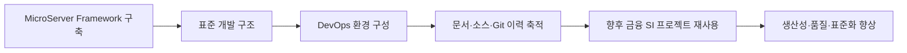

# 마이크로서버 구축 프로젝트 목표

## 1. 프로젝트의 목표

이 프로젝트의 목표는 **금융 SI 프로젝트에 재사용할 수 있는 MicroServer 표준 Framework / Reference Architecture를 직접 구축하고, 이를 개발·배포·운영할 수 있는 DevOps 환경까지 함께 정립하여 향후 유사 프로젝트를 더 빠르고 일관되게 수행할 수 있는 기술 자산을 만드는 것**입니다.



## 2. 무엇을 구축하는가

### 표준 Framework

DataSource, Transaction, Security, Logging, Exception, Response, Cache, Integration 등 반복되는 기술 기반을 표준화합니다.

### 표준 업무 개발 구조

업무 개발자가 Controller, Service, Domain, Repository/Mapper, DTO와 업무 Rule에 집중할 수 있는 구조를 만듭니다.

### DevOps 기반

개발환경만 만드는 데서 끝내지 않고 Build, 서버 실행환경, 배포, CI/CD, Health Check, Logging/Monitoring, Rollback 등 실제 프로젝트 운영 흐름으로 확장합니다.

### 재사용 가능한 기술 자산

최종 소스만 남기는 것이 아니라 **왜 이렇게 설계했고, 어떻게 만들었고, 어떻게 검증했는지**를 Markdown 문서와 Git 이력으로 함께 남깁니다.

## 3. 프로젝트 수행 방식

이번 프로젝트는 완성된 기존 프레임워크를 복사하는 방식이 아닙니다.

```text
요구/기술 검토
   ↓
설계
   ↓
Dependency / Configuration
   ↓
구현
   ↓
실행 및 테스트
   ↓
Markdown 문서화
   ↓
Git Commit & Push
```

빈 Spring Boot 프로젝트에서 시작하여 실제 기능을 하나씩 구현하고 검증합니다. 기존 MicroServer 자료는 중요한 참고자료로 사용하되, 현재 기술 스택과 VS Code 중심 개발환경에 맞게 다시 구성합니다.

## 4. 최종적으로 얻고자 하는 것

- 다음 금융 SI 프로젝트의 시작점으로 사용할 수 있는 표준 Framework
- 프로젝트마다 반복되는 기술 설정과 공통 기능의 재사용
- Framework 개발자와 업무 개발자의 명확한 역할 분리
- 개발 → Build → 배포 → 운영까지 연결되는 DevOps 기준
- 신규 개발자가 따라 할 수 있는 실전 구축 가이드
- 소스코드와 설계 의사결정을 추적할 수 있는 Git 기반 기술 이력

> 이 프로젝트의 결과물은 하나의 애플리케이션이 아니라 **다음 프로젝트를 더 잘 수행하기 위한 개발 플랫폼과 구축 방법론**입니다.
