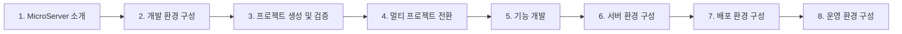
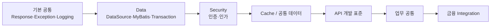
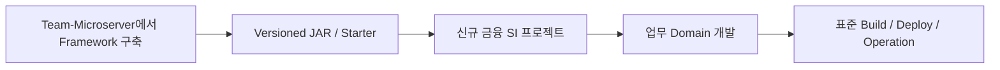

# 마이크로서버 구축 프로젝트 로드맵

## 1. 로드맵의 기준

로드맵은 기술 목록이 아니라 우리가 실제로 진행해 온 방식과 앞으로 구축할 순서를 기준으로 합니다.

**개발환경을 표준화하고 → 실행 가능한 단일 프로젝트를 만들고 → 멀티 프로젝트/Framework 구조로 전환하고 → 공통·업무 기능을 구현하고 → 서버·배포·운영 환경까지 완성**합니다.

## 2. 전체 로드맵

## 3. 단계별 목표

| 단계 | 핵심 목표 | 주요 결과물 |
|---|---|---|
| 1. MicroServer 소개 | 무엇을 만들고 왜 만드는지, 아키텍처 원칙 이해 | 소개/아키텍처/프로젝트 목표·로드맵 |
| 2. 개발 환경 구성 | 개발자 PC의 표준 도구와 경로 구성 | JDK, VS Code, Git, Gradle, MkDocs, DB 개발환경 |
| 3. 프로젝트 생성 및 검증 | 빈 프로젝트에서 실행 가능한 기준점 확보 | Spring Boot 프로젝트, Wrapper, Build/Run 검증 |
| 4. 멀티 프로젝트 전환 | Framework 내부 책임과 모듈 의존성 분리 | Gradle Multi-Project, Common/Runtime 등 |
| 5. 기능 개발 | 재사용 가능한 Framework와 업무 개발 표준 구현 | Response, Exception, Logging, Data, Security, Cache, API, 금융 연계 |
| 6. 서버 환경 구성 | 애플리케이션이 실행될 서버 기준 정립 | Linux/JDK Runtime, Network/Port, DB, Reverse Proxy, Profile |
| 7. 배포 환경 구성 | 반복 가능하고 안전한 배포 체계 구성 | Build Package, 환경별 배포, CI/CD, 무중단 배포, Rollback |
| 8. 운영 환경 구성 | 장애를 발견하고 추적·복구할 수 있는 운영 기준 마련 | Logging, Monitoring, Health Check, 장애 대응, 운영 표준 |

## 4. 우리가 이미 적용하고 있는 진행 방식

이번 프로젝트는 문서와 구현을 따로 진행하지 않습니다.

현재까지도 Windows/macOS 개발환경, VS Code/JDK 설정, Spring Boot 프로젝트 생성·검증, Gradle 구조, MkDocs 문서환경 등을 이 방식으로 정리해 왔으며 이후 Framework 기능도 같은 방식으로 진행합니다.

## 5. 기능 개발의 권장 순서

기능 개발 단계에서는 모든 기능을 동시에 만들지 않습니다.

구체적인 순서는 실제 구현 과정에서 의존성과 검증 결과에 따라 조정할 수 있습니다.

## 6. Framework 재사용으로 연결되는 최종 흐름

로드맵의 최종 목적은 Team-Microserver 자체를 완성하는 데 그치지 않고, **다음 프로젝트가 MicroServer와 DevOps 표준을 출발점으로 사용할 수 있게 하는 것**입니다.

## 7. 단계 완료 원칙

각 단계는 다음 조건을 만족하면 완료로 봅니다.

1. 실제 환경에서 실행 또는 검증되었습니다.
2. 설정과 구현 이유를 가이드 문서로 남겼습니다.
3. 다른 개발자가 같은 절차를 재현할 수 있습니다.
4. 소스 변경사항을 Git Commit & Push 했습니다.
5. 다음 단계가 현재 결과물을 기반으로 이어질 수 있습니다.
