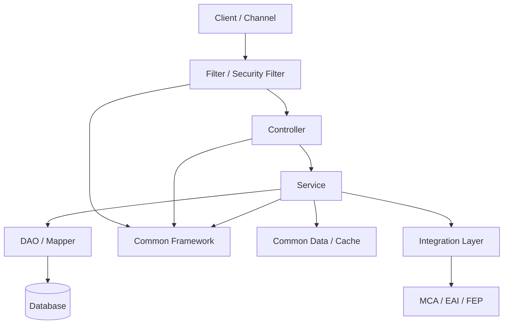
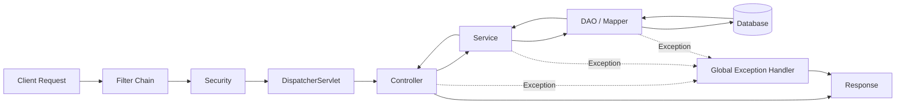
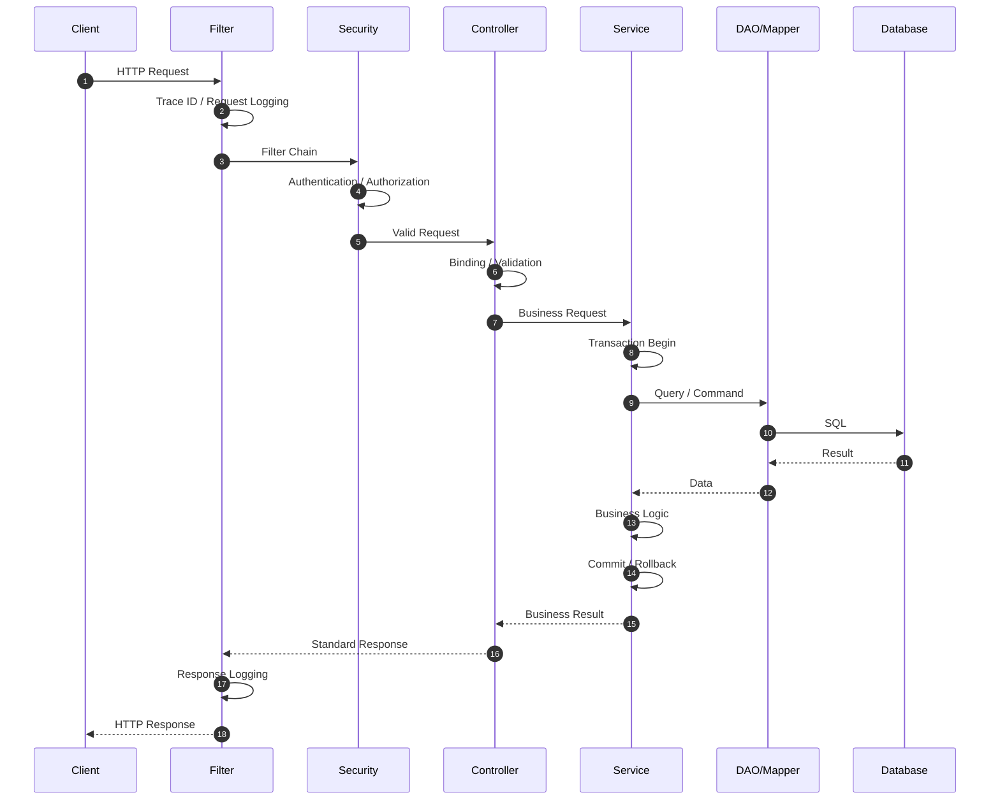
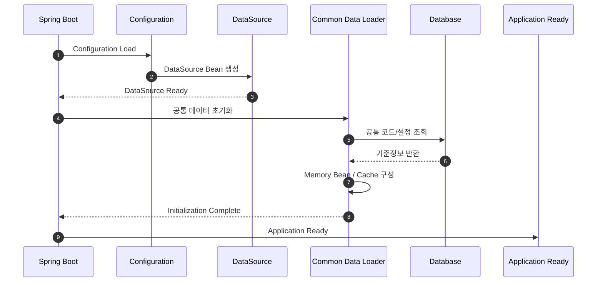

# 아키텍처 방향 개요

## 1. 문서 목적

Microserver는 금융 SI 프로젝트에서 반복적으로 요구되는 기술 기반을 공통화하고, 업무 개발자가 비즈니스 로직에 집중할 수 있도록 하는 **Spring Boot 기반 공통 개발 플랫폼**을 지향합니다.

아키텍처의 핵심은 많은 기술을 처음부터 적용하는 것이 아니라 다음 원칙에 따라 단계적으로 구조를 완성하는 것입니다.

- 프로젝트의 기본 실행 구조를 먼저 만든다.
- 업무 기능과 기술 공통 기능을 분리한다.
- 재사용 가치가 높은 기능은 공통 모듈로 제공한다.
- 요청 선처리, 로깅, 예외 처리와 같은 횡단 관심사는 업무 코드에서 분리한다.
- Controller / Service / DAO 영역의 책임을 명확히 한다.
- Transaction의 기본 업무 단위는 Service 계층으로 관리한다.
- 자주 사용하는 공통 데이터는 애플리케이션 실행 시 메모리로 로딩하여 활용한다.
- 금융 시스템 연계는 업무 로직과 분리된 연계 계층을 통해 처리한다.
- Gateway, WebFlux, Kubernetes 등은 기본 구조가 안정된 후 필요에 따라 확장한다.

이 문서는 이러한 전체 방향을 한눈에 이해하기 위한 상위 아키텍처 가이드입니다.

---

## 2. 아키텍처가 해결하려는 문제

금융 SI 프로젝트에서는 프로젝트가 달라져도 다음 기능이 반복적으로 구현되는 경우가 많습니다.

- 인증 및 권한
- 요청/응답 Logging
- Trace ID 관리
- 공통 예외 처리
- 공통 응답 형식
- DataSource 및 Transaction
- 공통 코드
- 메뉴 / 사용자 / 권한 관리
- 전문 Message 생성 및 Parsing
- MCA / EAI / FEP 연계

이러한 기능이 각 업무에 흩어지면 다음 문제가 발생합니다.

1. 동일 기능의 반복 개발
2. 프로젝트별 구현 방법의 차이
3. 업무 코드와 기술 코드의 혼재
4. 공통 기능 수정 시 영향 범위 증가
5. 개발자별 코드 품질 편차
6. 프로젝트 종료 후 기술 자산 재사용의 어려움

Microserver는 반복되는 기술 요소를 **공통 기반으로 분리하고 표준화**하여 이러한 문제를 줄이는 것을 목표로 합니다.

---

## 3. 논리 아키텍처

Microserver의 기본 논리 구조는 다음과 같이 구분합니다.



각 영역은 다음 책임을 가집니다.

| 영역 | 주요 책임 |
|---|---|
| Client / Channel | Web, Mobile, Admin 등 사용자 요청 |
| Filter / Security | 요청 선처리, Trace, 인증 전처리 |
| Controller | 요청 Mapping, Validation, 응답 반환 |
| Service | 비즈니스 로직, 업무 흐름, Transaction |
| DAO / Mapper | Database 접근 |
| Common Framework | Logging, Exception, Response, Utility 등 |
| Cache | 공통 코드 및 주요 기준정보 |
| Integration Layer | 전문 생성/해석 및 외부 시스템 호출 |
| MCA / EAI / FEP | 대내외 시스템 연계 |

---

## 4. 전체 요청 처리 흐름

일반적인 업무 API 요청은 다음 흐름을 따릅니다.



요청 단계별 역할은 다음과 같습니다.

1. **Filter Chain**
   - 요청 식별자 생성
   - 공통 Header 처리
   - 요청 Logging
   - 채널 정보 확인
   - 필요한 공통 선처리

2. **Security**
   - 인증 정보 확인
   - 권한 확인
   - 인증 컨텍스트 구성

3. **Controller**
   - URL Mapping
   - Parameter / Request Body 바인딩
   - Validation
   - Service 호출

4. **Service**
   - 실제 비즈니스 처리
   - 여러 DAO / 외부 서비스 호출 조합
   - Transaction 관리

5. **DAO / Mapper**
   - SQL 실행
   - 데이터 조회 및 저장

6. **Global Exception Handler**
   - 예외 유형별 표준 처리
   - 공통 오류 응답 변환

---

## 5. 요청 처리 시퀀스



이 흐름은 Microserver에서 가장 기본적인 요청 처리 모델이 됩니다.

---

## 6. 애플리케이션 시작 흐름

요청 처리뿐 아니라 애플리케이션 시작 과정도 공통 구조로 관리합니다.



애플리케이션이 Ready 상태가 되기 전에 필요한 주요 기준정보를 준비하여 요청 처리 시 반복적인 조회를 줄이는 방향을 검토합니다.

---

## 7. 아키텍처 구축 순서

Microserver는 다음 순서로 발전시킵니다.

```text
Spring Boot 기본 프로젝트
        ↓
Maven Multi Module 구성
        ↓
공통 Module 구성
        ↓
Controller / Service / DAO 기본 구조
        ↓
공통 Response / Exception / Logging
        ↓
Filter / AOP
        ↓
DataSource / MyBatis / Transaction
        ↓
Spring Security
        ↓
공통 데이터 / Cache
        ↓
업무 공통 기능
        ↓
전문 / MCA / EAI / FEP
        ↓
Gateway / WebFlux / Kubernetes
```

처음부터 모든 기능을 넣지 않고 **한 단계씩 동작을 확인하면서 다음 기능을 추가**하는 것이 기본 원칙입니다.

---

## 8. 설계 원칙

### 8.1 업무와 기술 공통의 분리

업무 Service가 Logging, 전문 Parsing, 인증 검증과 같은 기술 로직을 직접 구현하지 않도록 합니다.

### 8.2 단일 책임

각 Layer와 Module은 명확한 책임을 갖도록 구성합니다.

### 8.3 재사용 가능성

공통 기능은 특정 업무에 종속되지 않도록 설계하여 JAR 또는 공통 Module 형태로 재사용할 수 있도록 합니다.

### 8.4 단계적 확장

MSA, Reactive, Gateway, Kubernetes 등은 실제 필요성이 확인되는 시점에 적용합니다.

### 8.5 운영 관점 포함

개발 편의성뿐 아니라 Logging, 장애 추적, Configuration, Security, 배포 및 운영까지 고려합니다.

---

## 9. 관련 아키텍처 문서

세부 아키텍처는 다음 문서에서 각각 설명합니다.

- 구축 원칙 및 개발 방식
- 멀티모듈 및 프로젝트 구조
- 애플리케이션 계층 구조
- 공통 처리 구조
- 데이터 및 보안 아키텍처
- 공통 데이터 및 캐시 구조
- 금융 시스템 연계 아키텍처
- 확장 및 운영 아키텍처
