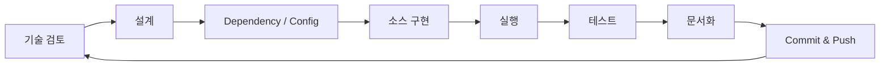
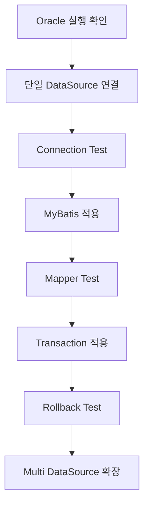
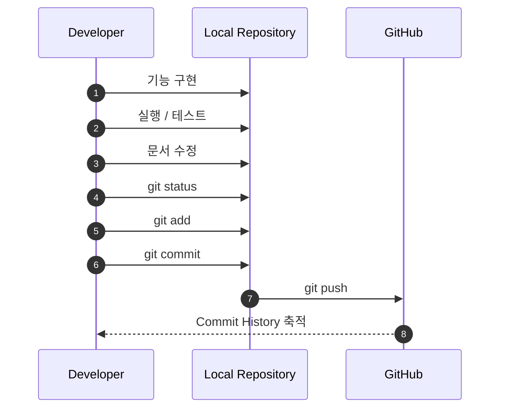

# 구축 원칙 및 개발 방식

## 1. 문서 목적

Microserver는 완성된 소스를 한 번에 만드는 프로젝트가 아니라 **작은 단위의 기능을 구현하고 검증하면서 프레임워크를 성장시키는 프로젝트**입니다.

따라서 개발 결과뿐 아니라 다음 내용도 함께 관리합니다.

- 왜 이 기능이 필요한가
- 어떤 구조로 설계했는가
- 실제 어떤 코드를 추가했는가
- 어떻게 테스트했는가
- 어떤 문제가 있었는가
- Git에는 어떤 단위로 반영했는가

이 문서는 Microserver 전체 구축 과정에서 공통으로 적용할 개발 원칙을 정의합니다.

---

## 2. 기본 개발 사이클

각 기능은 다음 순서로 진행합니다.



### Step 1. 기술 및 요구사항 검토

구현하기 전에 먼저 기능의 목적과 적용 범위를 정리합니다.

예:

- DataSource를 왜 공통 모듈에 두는가
- Filter에서 무엇을 처리할 것인가
- AOP와 Filter의 책임을 어떻게 구분할 것인가
- Transaction을 어느 계층에서 시작할 것인가

### Step 2. 설계

Class, Package, Module 및 호출 관계를 먼저 정의합니다.

### Step 3. Dependency / Configuration

필요한 Maven Dependency와 `application.yml` 등의 설정을 추가합니다.

### Step 4. 구현

한 번에 여러 기능을 넣지 않고 테스트 가능한 최소 단위로 구현합니다.

### Step 5. 실행 및 테스트

애플리케이션을 실행하고 정상 동작을 검증합니다.

### Step 6. 문서화

실제 구현된 구조와 실행 결과를 기준으로 가이드를 보완합니다.

### Step 7. Git Commit & Push

하나의 의미 있는 작업이 끝날 때 Git 이력을 남깁니다.

---

## 3. 기능을 작은 단위로 나누는 방법

예를 들어 Database 영역을 한 번에 완성하려 하지 않습니다.



이 방식의 장점은 문제가 발생했을 때 원인을 쉽게 좁힐 수 있다는 것입니다.

DataSource, MyBatis, Transaction, Multi DataSource를 한 번에 적용하면 오류가 발생했을 때 어느 설정이 문제인지 확인하기 어렵습니다.

---

## 4. 구현과 문서의 동기화

Microserver에서는 문서가 실제 소스와 다른 상태로 남지 않도록 합니다.

기능 변경 시 최소한 다음 항목을 함께 확인합니다.

| 구분 | 확인 항목 |
|---|---|
| Source | Class / Package / Method 변경 |
| Configuration | application.yml, XML, Bean 설정 |
| Test | 실행 및 단위/통합 테스트 |
| Documentation | Markdown 설명 및 예제 |
| Git | Commit 메시지와 변경 목적 |

---

## 5. Git 작업 흐름



Commit은 가능한 한 한 가지 목적을 갖도록 합니다.

예:

```text
feat: create spring boot base project
feat: add common response structure
feat: configure oracle datasource
feat: add request trace filter
docs: add datasource architecture guide
```

---

## 6. 설계 선행, 구현 후 보정

설계를 먼저 하지만 초기 설계를 절대적인 것으로 보지 않습니다.

실제 구현을 진행하면 다음과 같은 변경이 생길 수 있습니다.

- Module 책임 조정
- Package 구조 변경
- Bean 구성 변경
- 공통 기능 분리
- API 응답 구조 변경

따라서 개발 흐름은 다음과 같이 순환합니다.

```text
초기 설계
  ↓
구현
  ↓
실행 / 검증
  ↓
문제점 발견
  ↓
설계 보정
  ↓
문서 수정
```

---

## 7. 기술 버전 적용 원칙

기술 버전은 프로젝트 생성 시점에 다시 검토합니다.

검토 기준은 다음과 같습니다.

- Spring Boot와의 호환성
- Java 지원 버전
- 유지보수 기간
- 주요 보안 취약점 여부
- 금융 SI 환경 적용 가능성
- 기존 시스템 및 Middleware와의 연계 가능성

버전 자체보다 **호환되고 장기간 운영 가능한 조합**을 선택하는 것이 중요합니다.

---

## 8. 개발환경 독립성

소스와 문서는 Git을 통해 공유하지만 PC별 로컬 환경은 분리합니다.

```text
GitHub Repository
      │
      ├─ macOS 개발환경
      │    ├─ JDK
      │    ├─ Maven
      │    ├─ Python / .venv
      │    └─ Docker
      │
      └─ Windows 개발환경
           ├─ JDK
           ├─ Maven
           ├─ Python / .venv
           └─ Docker
```

`.venv`, 빌드 결과물, IDE 로컬 설정 등은 Git에 포함하지 않는 것을 기본 원칙으로 합니다.

---

## 9. 완료 기준

한 단계가 완료되었다고 판단하려면 최소한 다음을 만족해야 합니다.

- 애플리케이션이 정상 실행된다.
- 대상 기능이 실제로 동작한다.
- 정상/오류 Case를 확인했다.
- 주요 설정과 소스 구조가 문서화되었다.
- Git Commit이 남아 있다.
- 다른 개발환경에서도 재현 가능한 수준으로 설명되어 있다.

이 기준을 지키면서 Microserver를 한 단계씩 완성합니다.
