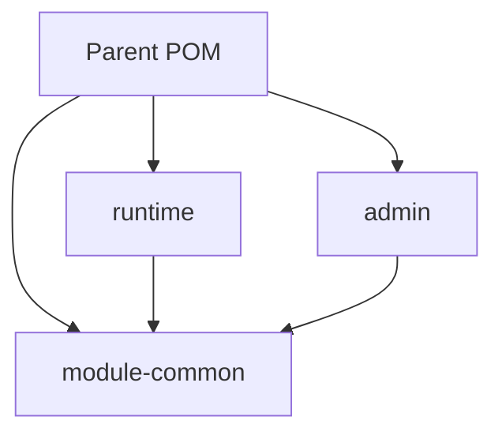
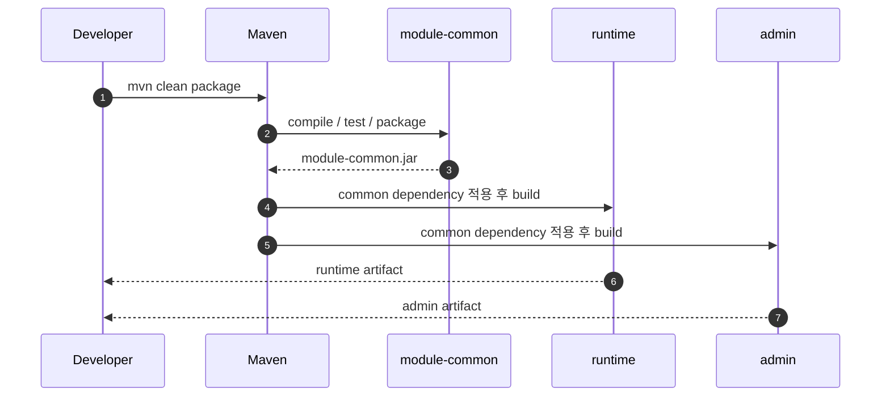
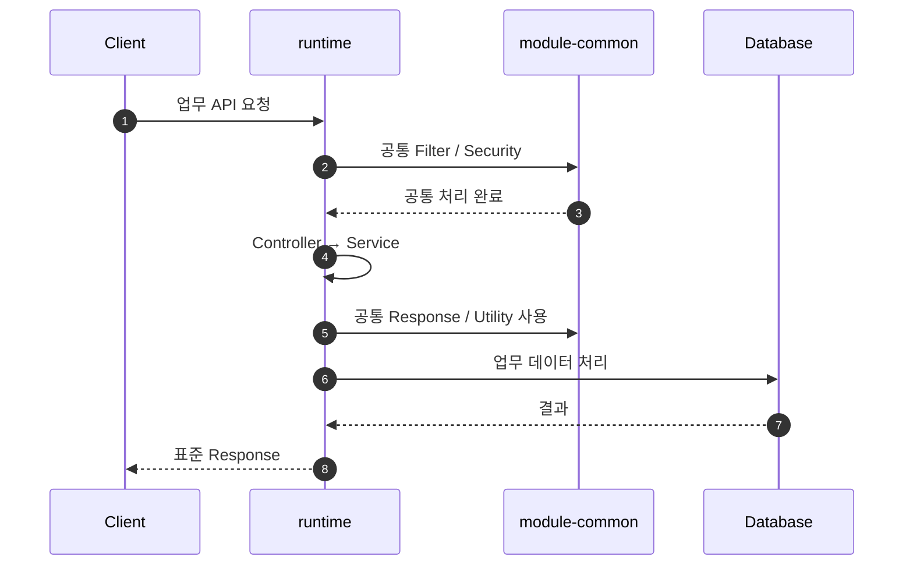

# 멀티모듈 및 프로젝트 구조

## 1. 문서 목적

Microserver는 Maven Multi Module 프로젝트를 기본 구조로 사용합니다.

목표는 단순히 프로젝트를 여러 개로 나누는 것이 아니라 다음을 달성하는 것입니다.

- 공통 기능과 업무 기능 분리
- 재사용 가능한 공통 JAR 제공
- 애플리케이션별 책임 분리
- 기능 변경 영향 범위 축소
- 향후 프로젝트에서 필요한 공통 기능의 재사용

---

## 2. 기본 구조

초기 구조는 다음 방향을 기준으로 구성합니다.

```text
microserver/
├─ pom.xml
│
├─ module-common/
│  └─ pom.xml
│
├─ runtime/
│  └─ pom.xml
│
└─ admin/
   └─ pom.xml
```

Parent `pom.xml`은 전체 Module과 공통 Dependency Version을 관리합니다.

---

## 3. 모듈별 역할

### 3.1 module-common

여러 애플리케이션에서 공통으로 사용하는 기술 기능을 제공합니다.

예상 범위:

- 공통 Response
- Exception / Exception Handler
- Logging
- MDC / Trace
- Filter
- AOP
- Utility
- DataSource 공통 기반
- Security 공통 기반
- 공통 코드 / 캐시 기반
- 전문 Message Builder / Parser

`module-common`은 독립적인 Maven Module로 빌드하며 JAR 형태로 다른 Module에 제공할 수 있도록 합니다.

### 3.2 runtime

실제 업무 기능을 수행하는 실행 애플리케이션입니다.

주요 역할:

- 업무 Controller
- 업무 Service
- 업무 DAO / Mapper
- 외부 시스템 호출
- 업무 Transaction
- 업무별 Configuration

### 3.3 admin

공통 기준정보를 관리하기 위한 관리자 애플리케이션입니다.

예:

- 공통 코드 관리
- 메뉴 관리
- 사용자 관리
- 권한 관리
- 전문 정의 관리
- 게시판 / 운영 관리

---

## 4. Module Dependency 방향

Module 간 의존성은 가능한 한 단방향으로 구성합니다.



`module-common`이 `runtime` 또는 `admin`에 의존하지 않도록 하는 것이 중요합니다.

공통 모듈이 특정 업무 Module에 의존하기 시작하면 재사용성이 크게 떨어집니다.

---

## 5. 공통 JAR 빌드 흐름



개발 단계에서는 Reactor Build를 통해 Module 간 Dependency를 자동으로 연결하고, 필요한 경우 공통 JAR을 별도 저장소에 배포하는 구조로 발전시킬 수 있습니다.

---

## 6. Parent POM의 역할

Parent POM은 다음 항목을 중앙 관리하는 역할을 합니다.

- Java Version
- Spring Boot Version
- Plugin Version
- Dependency Version
- Module 선언
- 공통 Build Plugin
- Encoding

예시 개념:

```xml
<modules>
    <module>module-common</module>
    <module>runtime</module>
    <module>admin</module>
</modules>
```

세부 설정은 실제 프로젝트 생성 단계에서 하나씩 구성합니다.

---

## 7. Package 구조 방향

각 Module 내부에서도 계층별 책임을 명확하게 합니다.

예:

```text
runtime/
└─ src/main/java
   └─ .../runtime
      ├─ controller
      ├─ service
      ├─ dao
      ├─ mapper
      ├─ dto
      ├─ domain
      ├─ integration
      └─ config
```

공통 모듈 예:

```text
module-common/
└─ src/main/java
   └─ .../common
      ├─ response
      ├─ exception
      ├─ logging
      ├─ filter
      ├─ security
      ├─ datasource
      ├─ cache
      └─ util
```

---

## 8. 업무 요청 시 Module 호출 예



공통 모듈은 업무 흐름을 주도하지 않고, runtime이 필요한 공통 기능을 제공하는 형태가 기본입니다.

---

## 9. Module 분리 기준

새 Module은 다음 기준을 만족할 때 분리합니다.

- 여러 애플리케이션에서 반복 사용된다.
- 독립적인 책임을 갖는다.
- 독립적으로 테스트할 가치가 있다.
- 변경 주기가 다른 영역과 명확하게 다르다.
- 별도 배포 또는 버전 관리 필요성이 있다.

단순히 Class 수가 많다는 이유로 Module을 분리하지 않습니다.

---

## 10. 향후 확장 가능 구조

필요성이 생기면 다음 Module을 추가할 수 있습니다.

```text
microserver/
├─ module-common
├─ module-integration
├─ module-security
├─ runtime
├─ admin
└─ gateway
```

하지만 초기 단계에서는 과도한 Module 분리를 피하고, **공통 / 업무 실행 / 관리자**의 기본 책임부터 명확히 구축합니다.
