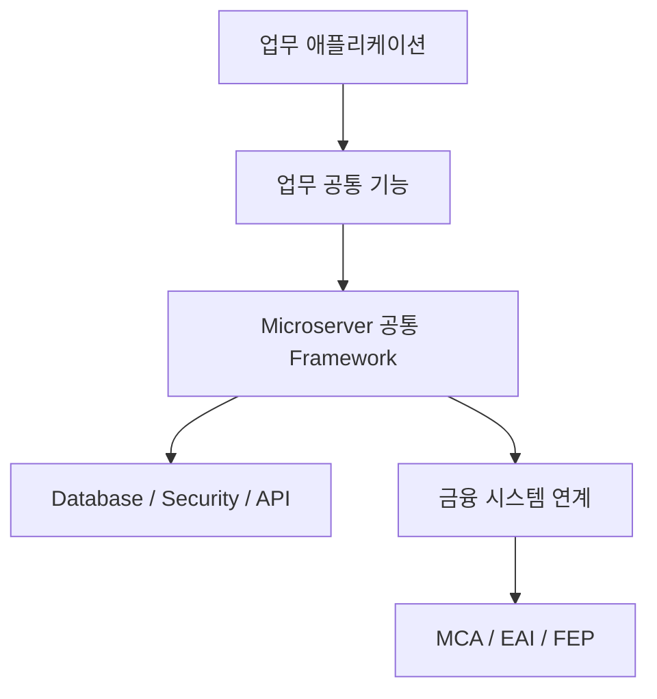

# Microserver 프로젝트 소개

## 1. 개요

**Microserver**는 금융 SI 프로젝트에서 반복적으로 구현되는 공통 기능과 개발 구조를 표준화하고,  
실제 프로젝트에서 재사용할 수 있는 **Spring Boot 기반의 금융 SI 공통 개발 기반**을 직접 구축하는 프로젝트입니다.

금융 SI 프로젝트에서는 프로젝트가 달라지더라도 다음과 같은 기능이 반복적으로 필요합니다.

- 프로젝트 및 개발환경 구성
- 공통 응답 및 예외 처리
- Logging 및 요청 추적
- Database / DataSource 연동
- 사용자 인증 및 권한 관리
- API 개발 표준
- 공통 코드 및 관리자 기능
- MCA / EAI / FEP 등 금융 시스템 연계
- 운영 및 확장을 고려한 애플리케이션 구조

Microserver 프로젝트는 이러한 기능을 개별 프로젝트마다 처음부터 다시 구현하는 대신,  
**표준화된 구조와 재사용 가능한 공통 기능으로 축적하는 것**을 목표로 합니다.

또한 완성된 프레임워크를 단순히 사용하는 방식이 아니라,  
프로젝트 생성부터 각 기능을 하나씩 직접 구현하고 검증하면서 **프레임워크가 만들어지는 전 과정을 기술 문서와 소스코드로 함께 관리**합니다.

---

## 2. 추진 배경

금융 SI 프로젝트는 고객사와 업무 영역에 따라 세부 요구사항은 달라지지만,  
기술적인 기반 영역에서는 유사한 요구가 반복되는 경우가 많습니다.

예를 들면 다음과 같습니다.

- 사용자 인증과 권한 처리
- 공통 오류 및 예외 처리
- 요청/응답 Logging
- Database 연결과 Transaction 처리
- 공통 코드 및 사용자 관리
- 외부 및 내부 시스템 연계
- 전문 Message 생성과 Parsing
- API 표준화
- 환경별 Configuration 관리

이러한 기능을 프로젝트마다 개별적으로 구현하면 다음과 같은 문제가 발생할 수 있습니다.

1. 동일하거나 유사한 기능의 반복 개발
2. 프로젝트별 구현 방식의 차이
3. 신규 개발자의 학습 비용 증가
4. 공통 기능 변경 시 영향 범위 확대
5. 운영 및 유지보수 방식의 비표준화
6. 프로젝트 종료 후 기술 자산의 재사용 어려움

Microserver는 이러한 문제를 줄이기 위해  
**반복되는 기술 요소를 공통화하고, 구현 방식과 개발 절차를 함께 표준화하는 프로젝트**로 진행합니다.

---

## 3. 프로젝트의 핵심 방향

Microserver는 단순한 샘플 프로젝트나 기술 예제 모음이 아닙니다.

프로젝트를 실제로 처음부터 구축하면서 다음의 세 가지 결과물을 동시에 만들어 갑니다.

### 3.1 실행 가능한 소스코드

Spring Boot 프로젝트를 직접 생성하고 기능을 하나씩 추가하여  
최종적으로 실제 실행과 테스트가 가능한 애플리케이션을 구축합니다.

### 3.2 재사용 가능한 공통 기능

금융 SI 프로젝트에서 반복적으로 필요한 기능을 공통 모듈 또는 표준 구현 형태로 구성합니다.

### 3.3 단계별 기술 문서

각 기능을 왜 도입했는지, 어떻게 설계했는지, 어떤 설정과 소스코드가 필요한지,  
어떻게 실행하고 검증하는지를 Markdown 문서로 기록합니다.

즉, Microserver는 다음과 같은 구조로 성장합니다.


이 과정을 반복하여 **소스코드와 기술 문서가 함께 발전하는 프로젝트**로 운영합니다.

---

## 4. 구축 대상

Microserver에서 단계적으로 구축할 주요 영역은 다음과 같습니다.

### 4.1 프로젝트 기반

프로젝트를 개발하기 위한 기본 환경과 Spring Boot 애플리케이션의 기반을 구성합니다.

- Git / GitHub
- JDK
- VS Code
- Maven
- Python / MkDocs 문서 환경
- Oracle / Docker 로컬 환경
- Spring Boot 프로젝트 생성
- Package 및 Configuration 기본 구조
- 애플리케이션 최초 실행

### 4.2 프로젝트 공통 구조

업무 기능과 공통 기능을 분리하고 재사용할 수 있도록 프로젝트 구조를 설계합니다.

- Maven Multi Module 구조
- Common Module
- Runtime Module
- Admin Module
- 공통 라이브러리 구성

초기 단계에서는 복잡한 분산 구조부터 시작하지 않고,  
**Spring Boot 기반의 멀티모듈 구조와 공통 기능을 먼저 안정적으로 구축**합니다.

### 4.3 시스템 공통 기능

여러 업무에서 반복적으로 사용하는 기술 공통 기능을 구현합니다.

- 공통 Response
- 전역 Exception 처리
- Logging
- MDC / Request 추적
- Filter
- Utility
- 환경 설정
- 민감정보 암복호화

### 4.4 Database

업무 시스템에서 필요한 데이터 접근 기반을 구축합니다.

- Oracle 연동
- DataSource
- MyBatis
- Transaction
- Multi DataSource

### 4.5 Security

금융 시스템에서 중요한 인증 및 권한 관리 기반을 구축합니다.

- Spring Security
- 사용자 관리
- Role / 권한 모델
- Authentication
- Authorization

### 4.6 API 개발 표준

업무 API를 일관된 방식으로 개발할 수 있도록 기본 개발 표준을 구성합니다.

- Controller
- Service
- Repository / Mapper
- Validation
- OpenAPI / Swagger

### 4.7 업무 공통 기능

여러 업무에서 공통으로 사용할 수 있는 관리 기능을 구현합니다.

- 공통 코드
- 메뉴 관리
- 사용자 관리
- 게시판
- 관리자 기능

### 4.8 금융 시스템 연계

금융 SI에서 자주 접하는 대내외 연계 구조를 단계적으로 구현합니다.

- 전문 구조
- Message Builder
- Message Parser
- MCA 연계
- EAI 연계
- FEP 연계

### 4.9 확장 아키텍처

기본 프레임워크가 안정적으로 구축된 이후 확장 기술을 검토하고 적용합니다.

- WebClient
- Spring WebFlux
- Spring Cloud Gateway
- Service Discovery
- Kubernetes

확장 기술은 처음부터 모두 적용하지 않고,  
**기본 구조와 공통 기능을 먼저 완성한 후 필요성과 적용 효과를 확인하면서 단계적으로 확장**합니다.

---

## 5. 프로젝트 구축 방식

Microserver는 기능별 결과만 기록하는 것이 아니라  
**구축 과정 자체를 프로젝트의 중요한 기술 자산으로 관리**합니다.

각 단계는 기본적으로 다음 순서로 진행합니다.

```text
1. 기술 및 요구사항 검토
2. 적용 목적 정리
3. 설계 방향 결정
4. 필요한 Dependency 및 Configuration 구성
5. 소스코드 구현
6. 실행 및 테스트
7. 결과 확인
8. 기술 문서 작성 또는 보완
9. Git Commit
10. Git Push
```

예를 들어 DataSource 기능을 구축한다면 단순히 최종 설정만 기록하지 않습니다.

왜 DataSource 구성이 필요한지부터 시작하여 Dependency, Configuration, 연결 테스트,  
문제 해결 과정까지 문서화하고, 실제 동작이 확인된 소스코드와 함께 Git에 반영합니다.

이 방식은 나중에 결과물만 보는 것이 아니라  
**Microserver가 어떤 판단과 과정을 거쳐 구축되었는지 추적할 수 있도록 하기 위한 것**입니다.

---

## 6. 개발 환경 원칙

### 6.1 표준 IDE

이번 Microserver 프로젝트의 기본 IDE는 **Visual Studio Code(VS Code)** 로 구성합니다.

기존 MicroServer 문서 중 Eclipse / STS 기반으로 작성된 내용은 참고자료로 활용하되,  
이번 프로젝트의 개발 및 가이드는 VS Code 기준으로 다시 작성합니다.

### 6.2 운영체제

개발환경은 특정 운영체제에 종속되지 않도록 구성하며 다음 환경을 고려합니다.

- Windows
- macOS

Git 저장소의 프로젝트와 문서는 동일하게 사용하고,  
Python 가상환경이나 로컬 개발 도구와 같이 PC에 종속되는 환경은 각 장비에서 별도로 구성합니다.

### 6.3 버전 관리

라이브러리와 Framework 버전은 기존 문서의 값을 그대로 사용하는 것을 원칙으로 하지 않습니다.

각 구축 단계에서 다음 내용을 확인한 후 적용합니다.

- 현재 사용 가능한 안정 버전
- Spring Boot 및 관련 라이브러리 호환성
- 금융 SI 프로젝트 적용 가능성
- 장기 유지보수성

---

## 7. 기본 아키텍처 방향

Microserver는 업무 개발 영역과 공통 기술 영역을 분리하여  
개발자가 비즈니스 로직에 집중할 수 있는 구조를 지향합니다.

개념적으로는 다음과 같은 영역으로 구분합니다.



각 영역은 가능한 한 책임을 명확하게 분리합니다.

- **업무 애플리케이션**: 실제 비즈니스 로직
- **업무 공통 기능**: 여러 업무에서 재사용하는 기능
- **공통 Framework**: 시스템 전반에서 사용하는 기술 공통 기능
- **Database / Security / API**: 애플리케이션 실행을 위한 핵심 기반
- **금융 시스템 연계**: 대내외 금융 시스템과의 인터페이스

구체적인 모듈 구조와 아키텍처는 별도의 아키텍처 가이드에서 단계적으로 정의합니다.


---

## 8. 기대 결과

Microserver 프로젝트를 통해 최종적으로 다음과 같은 결과물을 확보하는 것을 목표로 합니다.

### 표준 개발 기반

새로운 금융 SI 프로젝트를 시작할 때 참고하거나 재사용할 수 있는 기본 프로젝트 구조를 확보합니다.

### 공통 기술 자산

반복적으로 개발되는 인증, 로깅, 예외 처리, Database, API, 전문 연계 등의 기능을  
재사용 가능한 기술 자산으로 축적합니다.

### Reference Architecture

금융 SI 프로젝트의 구조를 설계할 때 참고할 수 있는 아키텍처와 구현 사례를 확보합니다.

### 실전형 기술 문서

단순한 개념 설명이 아니라 실제 구축 과정과 소스코드를 연결한 실전형 가이드를 제공합니다.

### 구축 이력

Git Commit History를 통해 프레임워크가 어떤 단계로 구축되었는지 확인할 수 있도록 합니다.

---

## 9. 프로젝트가 지향하는 최종 모습

Microserver의 최종 목표는 모든 금융 프로젝트에 동일한 구조를 강제하는 거대한 프레임워크를 만드는 것이 아닙니다.

프로젝트마다 필요한 기술과 구조는 달라질 수 있으므로,  
Microserver는 금융 SI 프로젝트를 시작할 때 사용할 수 있는 **검증된 공통 기반과 Reference Architecture를 제공하는 것**을 지향합니다.

```text
새로운 금융 SI 프로젝트
        ↓
Microserver Reference
        ↓
필요한 공통 기능 선택
        ↓
프로젝트 특성에 맞게 확장
        ↓
업무 개발에 집중
```

궁극적으로는 프로젝트를 새로 시작할 때 반복되는 기술 기반을 다시 만드는 시간을 줄이고,  
개발자가 실제 금융 업무와 고객 요구사항 구현에 더 집중할 수 있도록 하는 것이 Microserver 프로젝트의 방향입니다.

---

## 다음 문서

다음 단계에서는 **Microserver의 구축 목표**를 보다 구체적으로 정의합니다.
