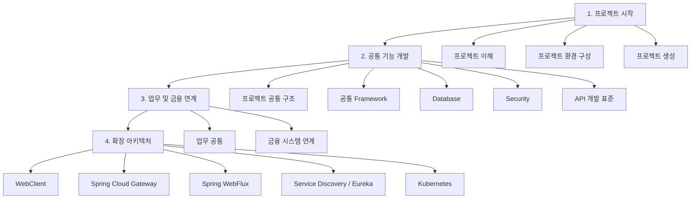

# Team-Microserver 프로젝트 로드맵

## 1. 문서 개요

본 문서는 **Team-Microserver 프로젝트의 전체 구축 순서와 단계별 진행 방향을 정의**한다.

프로젝트 로드맵은 실제 기술문서의 목차와 동일한 흐름으로 구성한다.  
따라서 로드맵의 각 단계는 MkDocs 문서 사이트의 메뉴와 직접 연결되며, 프로젝트를 처음 접하는 개발자도 **현재 어떤 단계에 있으며 다음에 무엇을 구축해야 하는지** 쉽게 확인할 수 있도록 한다.

Team-Microserver의 전체 구축 과정은 다음 네 단계로 진행한다.

```text
1. 프로젝트 시작
      ↓
2. 공통 기능 개발
      ↓
3. 업무 및 금융 연계
      ↓
4. 확장 아키텍처
```

`참고자료` 영역은 별도의 구축 단계가 아니라 프로젝트 전 과정에서 공통으로 사용하는 개발 및 문서 관리 기준으로 운영한다.

---

## 2. 전체 로드맵



전체 로드맵은 **기반을 먼저 구축하고 그 위에 기능을 단계적으로 확장하는 방식**으로 진행한다.

| 단계 | MkDocs 메뉴 | 핵심 목표 |
| --- | --- | --- |
| STEP 1 | 프로젝트 시작 | 프로젝트 방향 정의, 개발환경 구성, Spring Boot 프로젝트 생성 |
| STEP 2 | 공통 기능 개발 | 프레임워크 기본 구조와 공통 기술 기능 구축 |
| STEP 3 | 업무 및 금융 연계 | 공통 업무 기능과 금융 시스템 연계 기반 구축 |
| STEP 4 | 확장 아키텍처 | 분산·비동기·클라우드 환경으로 아키텍처 확장 |
| 상시 | 참고자료 | Commit, 문서 작성, 장애 해결 기준 관리 |

---

# 3. STEP 1. 프로젝트 시작

## 3.1 목표

프로젝트의 목적과 아키텍처 방향을 이해하고, 개발에 필요한 환경을 구성한 후 **실행 가능한 최초의 Spring Boot 프로젝트를 완성**한다.

이 단계가 완료되면 모든 개발자가 동일한 개발환경과 프로젝트 구조를 기준으로 이후 기능 개발을 시작할 수 있어야 한다.

---

## 3.2 프로젝트 이해

### 목차 연계

```text
프로젝트 시작
└─ 프로젝트 이해
   ├─ 프로젝트 소개
   ├─ 구축 목표
   ├─ 프로젝트 로드맵
   └─ 아키텍처 방향
```

### 주요 목표

프로젝트 구현에 앞서 Team-Microserver가 무엇을 구축하는 프로젝트인지 전체 방향을 이해한다.

### 주요 내용

- 프로젝트의 목적과 배경 이해
- 최종 구축 목표 정의
- 전체 구축 단계 확인
- 아키텍처 기본 방향 및 설계 원칙 정의

### 완료 기준

- 프로젝트의 목적과 구축 범위를 설명할 수 있다.
- 전체 개발 순서와 각 단계의 관계를 이해한다.
- 공통 기능, 업무 기능, 금융 연계, 확장 아키텍처의 역할을 구분할 수 있다.
- 이후 구현 과정에서 적용할 기본 아키텍처 원칙이 정의되어 있다.

---

## 3.3 프로젝트 환경 구성

### 목차 연계

```text
프로젝트 시작
└─ 프로젝트 환경 구성
   ├─ 개발 장비 구성
   ├─ Git / GitHub 환경 구성
   ├─ Python / MkDocs
   │  ├─ Windows 환경 구성
   │  └─ macOS 환경 구성
   ├─ Java 개발환경
   │  ├─ JDK 설치 및 설정
   │  ├─ VS Code 개발환경 구성
   │  └─ Maven 설치 및 설정
   └─ Database 개발환경
      └─ Oracle / Docker 로컬 환경
```

### 주요 목표

Team-Microserver를 개발하고 문서화하기 위한 **표준 로컬 개발환경을 구성**한다.

### 주요 내용

#### 개발 장비

- 개발 장비 구성 기준
- Windows / macOS 개발환경 고려
- 프로젝트 실행에 필요한 기본 자원 확인

#### Git / GitHub

- Git 설치 및 기본 설정
- GitHub Repository 연결
- Clone / Commit / Push 기본 흐름
- 소스코드와 문서 형상관리 기반 구성

#### Python / MkDocs

- Python 설치
- 가상환경 구성
- MkDocs 설치
- Material for MkDocs 구성
- 로컬 문서 사이트 실행
- Windows / macOS 환경별 설정

#### Java 개발환경

- JDK 설치 및 환경변수 설정
- Visual Studio Code 설치
- Java / Spring 개발 Extension 구성
- Maven 설치 및 설정
- Build 및 실행환경 확인

#### Database 개발환경

- Docker 기반 Oracle 로컬 환경 구성
- Database 접속 확인
- 이후 DataSource 및 MyBatis 개발을 위한 준비

### 완료 기준

다음 명령과 작업을 개발 PC에서 정상적으로 수행할 수 있어야 한다.

```text
Git Clone / Commit / Push
MkDocs Serve
Java 실행
Maven Build
VS Code Debug
Oracle 접속
```

---

## 3.4 프로젝트 생성

### 목차 연계

```text
프로젝트 시작
└─ 프로젝트 생성
   ├─ Spring Boot 프로젝트 생성
   ├─ Maven 기본 구조
   ├─ Package 구조 설계
   ├─ application.yml 기본 설정
   └─ 프로젝트 최초 실행
```

### 주요 목표

Team-Microserver의 출발점이 되는 **최소 실행 가능한 Spring Boot 프로젝트를 직접 생성**한다.

### 구축 순서

#### 1. Spring Boot 프로젝트 생성

- 프로젝트 기본 정보 정의
- Java / Spring Boot 버전 설정
- 필요한 최소 Dependency 구성
- 기본 프로젝트 생성

#### 2. Maven 기본 구조 확인

- `pom.xml` 구조 이해
- Dependency 관리
- Build Lifecycle 확인
- 기본 Maven 명령 확인

#### 3. Package 구조 설계

- Base Package 정의
- 계층별 Package 역할 정의
- 공통 기능과 업무 기능의 확장을 고려한 구조 설계

#### 4. application.yml 기본 설정

- Spring Boot 기본 설정
- Profile 확장 고려
- 서버 및 애플리케이션 기본 설정
- 환경별 Configuration을 위한 기본 구조 구성

#### 5. 프로젝트 최초 실행

- Maven Build
- Spring Boot 실행
- 기본 애플리케이션 시작 확인
- 최초 실행 결과 검증

### 완료 기준

```text
Spring Boot 프로젝트 생성
        ↓
Maven Build 성공
        ↓
애플리케이션 정상 실행
        ↓
기본 Package / Configuration 구조 확보
```

이 단계가 완료되면 이후 프레임워크 기능을 추가할 수 있는 **최초의 실행 가능한 프로젝트 기반**이 확보된다.

---

# 4. STEP 2. 공통 기능 개발

## 4.1 목표

프로젝트 시작 단계에서 생성한 Spring Boot 프로젝트를 기반으로 금융 SI 프로젝트에서 반복적으로 필요한 **공통 프레임워크 기능을 구축**한다.

이 단계는 Team-Microserver의 핵심 개발 단계이며 다음 순서로 진행한다.

```text
프로젝트 공통 구조
      ↓
공통 Framework
      ↓
Database
      ↓
Security
      ↓
API 개발 표준
```

---

## 4.2 프로젝트 공통 구조

### 목차 연계

```text
공통 기능 개발
└─ 프로젝트 공통 구조
   ├─ module-common 구성
   ├─ runtime 모듈 구성
   ├─ admin 모듈 구성
   └─ 멀티모듈 프로젝트 구조
```

### 주요 목표

단일 Spring Boot 프로젝트를 역할별 모듈로 분리하여 **확장 가능한 Maven 멀티모듈 구조를 구축**한다.

### 주요 내용

#### module-common

여러 모듈에서 공통으로 사용하는 기능을 구성한다.

- 공통 객체
- 공통 상수
- 공통 예외
- 공통 Utility
- 공통 기반 기능

#### runtime

실제 애플리케이션 실행에 필요한 Runtime 영역을 구성한다.

- 애플리케이션 실행
- 업무 서비스 제공
- API 제공
- Runtime Configuration

#### admin

운영 및 관리 기능을 제공할 Admin 영역의 기본 구조를 구성한다.

#### 멀티모듈 프로젝트

각 모듈을 하나의 Maven 프로젝트 구조로 통합하고 모듈 간 의존성을 정의한다.

### 완료 기준

- 각 모듈의 역할이 명확하다.
- 모듈 간 의존 관계가 정의되어 있다.
- 전체 프로젝트가 Maven으로 정상 Build 된다.
- 공통 기능을 여러 모듈에서 재사용할 수 있다.

---

## 4.3 공통 Framework

### 목차 연계

```text
공통 기능 개발
└─ 공통 Framework
   ├─ 공통 Response 구조
   ├─ 공통 예외 처리
   ├─ Logging 구성
   ├─ Filter 구성
   ├─ 공통 Utility 구성
   └─ Jasypt 설정
```

### 주요 목표

업무 개발 전반에서 반복적으로 사용되는 기술 기능을 공통화하고 일관된 처리 방식을 제공한다.

### 구축 순서

1. 공통 Response 구조 정의
2. 공통 Exception 및 오류 처리 구성
3. Logging 표준 구성
4. Filter 기반 공통 요청 처리
5. 공통 Utility 구성
6. Jasypt 기반 중요 설정값 암호화

### 주요 결과

- API 응답 형식 표준화
- 오류 코드 및 예외 처리 일원화
- 애플리케이션 로그 기준 확보
- 요청 공통 처리 기반 확보
- 반복 기능의 Utility화
- 중요 환경설정 값 보호

### 완료 기준

업무 개발자가 개별적으로 Response, Exception, Logging 등의 기반 기능을 다시 구현하지 않고 공통 프레임워크를 사용할 수 있어야 한다.

---

## 4.4 Database

### 목차 연계

```text
공통 기능 개발
└─ Database
   ├─ Oracle 연동
   ├─ DataSource 구성
   ├─ MyBatis 구성
   ├─ Transaction 관리
   └─ Multi DataSource 구성
```

### 주요 목표

Oracle 기반 업무 데이터를 일관된 방식으로 처리할 수 있는 **표준 Database 접근 기반**을 구축한다.

### 구축 순서

```text
Oracle 연결
   ↓
DataSource 구성
   ↓
MyBatis 구성
   ↓
Transaction 관리
   ↓
Multi DataSource 확장
```

### 주요 내용

- Oracle JDBC 연결
- Spring Boot DataSource 구성
- 환경별 Database 설정
- MyBatis Mapper 구성
- SQL Mapping 기준
- Transaction 경계 및 처리 방식
- 다중 Database 연동을 위한 Multi DataSource 구조

### 완료 기준

- Oracle Database에 정상 접속할 수 있다.
- MyBatis 기반 CRUD가 정상 동작한다.
- Transaction Commit / Rollback이 정상 동작한다.
- 필요 시 복수 DataSource를 추가할 수 있다.

---

## 4.5 Security

### 목차 연계

```text
공통 기능 개발
└─ Security
   ├─ Spring Security 기본 구성
   ├─ 사용자 관리
   ├─ Role / 권한 모델
   ├─ 사용자 인증
   └─ 인가 및 접근 제어
```

### 주요 목표

금융 서비스에서 필요한 사용자 인증과 권한 제어를 **Spring Security 기반 공통 보안 구조**로 구축한다.

### 구축 순서

1. Spring Security 기본 구성
2. 사용자 정보 관리 구조
3. Role / 권한 모델 설계
4. 사용자 인증 구현
5. 인가 및 접근 제어 구현

### 주요 결과

- 인증되지 않은 사용자의 접근 제어
- 사용자 정보 기반 로그인 처리
- Role 및 권한 체계
- URL / 기능 단위 접근 통제
- 보안 예외 공통 처리 기반

### 완료 기준

```text
사용자 요청
   ↓
사용자 인증
   ↓
Role / 권한 확인
   ↓
접근 허용 또는 차단
```

인증과 인가가 업무 코드에 분산되지 않고 공통 Security 구조에서 일관되게 처리되어야 한다.

---

## 4.6 API 개발 표준

### 목차 연계

```text
공통 기능 개발
└─ API 개발 표준
   ├─ Controller 개발 표준
   ├─ Service 개발 표준
   ├─ Repository / Mapper 개발 표준
   ├─ Validation
   └─ OpenAPI / Swagger
```

### 주요 목표

개발자마다 다른 방식으로 API를 구현하지 않도록 **표준 개발 계층과 API 개발 규칙을 정의**한다.

### 기본 처리 흐름

```text
Client
  ↓
Controller
  ↓
Service
  ↓
Repository / Mapper
  ↓
Database
```

### 주요 내용

- Controller 역할과 작성 기준
- Service 역할과 Transaction 처리 기준
- Repository / Mapper 역할과 작성 기준
- Request Validation
- 공통 Response 및 Exception 연계
- OpenAPI / Swagger 기반 API 문서화

### 완료 기준

새로운 업무 API를 개발할 때 동일한 계층 구조와 개발 규칙을 적용할 수 있어야 한다.

---

# 5. STEP 3. 업무 및 금융 연계

## 5.1 목표

공통 프레임워크가 완성된 이후 실제 애플리케이션에서 사용할 수 있는 **업무 공통 기능과 금융 시스템 연계 기능을 구현**한다.

```text
업무 공통 기능
      ↓
금융 시스템 연계
```

이 단계부터 Team-Microserver는 단순 기술 프레임워크를 넘어 실제 금융 SI 프로젝트에서 활용 가능한 Reference 기능을 갖추게 된다.

---

## 5.2 업무 공통

### 목차 연계

```text
업무 및 금융 연계
└─ 업무 공통
   ├─ 공통코드
   ├─ 메뉴 관리
   ├─ 사용자 관리 기능
   ├─ 게시판 공통 기능
   └─ 관리자 기능
```

### 주요 목표

다수의 업무 시스템에서 반복적으로 필요한 기능을 공통 업무 기능으로 제공한다.

### 구축 대상

#### 공통코드

- 시스템 공통코드 관리
- 코드 그룹 및 상세 코드
- 공통코드 조회 및 활용

#### 메뉴 관리

- 메뉴 구조 관리
- 사용자 / Role과 메뉴 연계 기반
- 화면 접근 제어 확장

#### 사용자 관리 기능

- 사용자 조회 및 관리
- 사용자 상태 관리
- Security 사용자 모델과 업무 기능 연계

#### 게시판 공통 기능

- 공지사항 등에서 재사용 가능한 기본 게시판 기능
- 등록 / 조회 / 수정 / 삭제 기본 기능

#### 관리자 기능

- 운영자 중심의 관리 기능
- 공통코드, 사용자, 메뉴 등 관리 기능 통합

### 완료 기준

공통 업무 기능이 특정 프로젝트의 업무 규칙에 과도하게 종속되지 않고 다른 프로젝트에서도 재사용 가능한 형태로 구성되어야 한다.

---

## 5.3 금융 시스템 연계

### 목차 연계

```text
업무 및 금융 연계
└─ 금융 시스템 연계
   ├─ 전문 구조
   ├─ Message Builder
   ├─ Message Parser
   ├─ MCA 연계
   ├─ EAI 연계
   └─ FEP 연계
```

### 주요 목표

금융 SI 프로젝트에서 필요한 **전문 기반 내부·외부 시스템 연계 구조를 표준화**한다.

### 구축 순서

```text
전문 구조 정의
      ↓
Message Builder
      ↓
Message Parser
      ↓
MCA / EAI / FEP Adapter
```

### 전문 구조

- 공통 Header
- 업무 Header
- Message Body
- 전문 길이 및 필드 정의
- 송수신 전문 모델

### Message Builder

애플리케이션 객체를 송신 전문으로 변환하는 공통 구조를 구현한다.

### Message Parser

수신 전문을 애플리케이션에서 사용할 수 있는 데이터 구조로 변환한다.

### MCA / EAI / FEP

실제 금융 시스템 연계 방식별 Adapter 구조를 구현한다.

```text
Business Service
      ↓
Integration Interface
      ↓
Message Builder / Parser
      ↓
MCA / EAI / FEP
```

### 완료 기준

- 업무 서비스가 연계 기술의 상세 구현에 직접 종속되지 않는다.
- 전문 생성과 Parsing을 공통 기능으로 사용할 수 있다.
- MCA / EAI / FEP별 구현을 분리할 수 있다.
- 연계 방식이 추가되어도 기존 업무 코드의 변경을 최소화할 수 있다.

---

# 6. STEP 4. 확장 아키텍처

## 6.1 목표

핵심 프레임워크와 금융 업무 기반이 완성된 이후 현대적인 분산 시스템과 클라우드 환경에 대응할 수 있도록 아키텍처를 확장한다.

### 목차 연계

```text
확장 아키텍처
├─ WebClient
├─ Spring Cloud Gateway
├─ Spring WebFlux
├─ Service Discovery / Eureka
└─ Kubernetes
```

확장 아키텍처는 Team-Microserver의 기본 프레임워크를 완성하기 위한 필수 선행 단계라기보다, 프로젝트 특성에 따라 선택적으로 적용할 수 있는 확장 영역이다.

---

## 6.2 WebClient

### 목표

외부 시스템 REST API를 호출할 수 있는 현대적인 HTTP Client 기반을 구축한다.

### 주요 내용

- WebClient 기본 구성
- 공통 Header
- Timeout
- 오류 처리
- 요청 / 응답 Logging
- 외부 시스템 Client 구조

### 연계

기존 금융 시스템 연계 구조의 REST Adapter 구현에 활용할 수 있다.

---

## 6.3 Spring Cloud Gateway

### 목표

다수의 서비스 앞단에서 요청을 통합적으로 처리할 수 있는 API Gateway 구조를 검토하고 구축한다.

### 주요 내용

- Routing
- Filter
- 인증 연계
- 공통 Header
- Gateway Logging
- 서비스별 Route 관리

---

## 6.4 Spring WebFlux

### 목표

비동기 / Non-Blocking 처리 방식이 필요한 환경을 위한 Reactive 기반 개발 구조를 검토한다.

### 주요 내용

- Reactive Programming 기본 구조
- Mono / Flux
- Non-Blocking I/O
- WebClient 연계
- 기존 MVC 방식과 적용 기준 비교

모든 업무를 Reactive 방식으로 전환하는 것이 아니라 실제 필요성이 있는 영역에 선택적으로 적용한다.

---

## 6.5 Service Discovery / Eureka

### 목표

서비스가 분산되는 환경에서 서비스 위치를 동적으로 검색할 수 있는 Service Discovery 구조를 구축한다.

### 주요 내용

- Eureka Server
- Eureka Client
- 서비스 등록
- 서비스 탐색
- 서비스 간 호출 구조

---

## 6.6 Kubernetes

### 목표

Team-Microserver 기반 애플리케이션을 Container 및 Kubernetes 환경에서 실행할 수 있는 배포 아키텍처로 확장한다.

### 주요 내용

- Container 실행 구조
- Kubernetes Deployment
- Service
- ConfigMap / Secret
- 환경 설정 외부화
- Scale-out 구조
- Health Check 연계

### 완료 기준

프로젝트 특성에 따라 필요한 확장 기술을 기존 프레임워크 구조를 크게 변경하지 않고 적용할 수 있어야 한다.

---

# 7. 참고자료 운영

`참고자료`는 하나의 개발 Phase가 아니라 **프로젝트 전 단계에서 공통으로 적용하는 운영 기준**으로 관리한다.

### 목차 연계

```text
참고자료
├─ Git Commit Convention
├─ 문서 작성 규칙
└─ Troubleshooting
```

## 7.1 Git Commit Convention

각 구축 단계에서 변경한 내용을 일관된 Commit 규칙으로 관리한다.

```text
기능 구현
   ↓
테스트
   ↓
문서 작성
   ↓
Git Commit
   ↓
GitHub Push
```

## 7.2 문서 작성 규칙

각 기술 가이드는 동일한 작성 기준과 구조를 유지하여 문서 간 편차를 최소화한다.

## 7.3 Troubleshooting

프로젝트 구축 과정에서 발생한 주요 오류와 해결 방법을 지속적으로 축적한다.

단순 오류 메시지 기록이 아니라 다음 내용을 함께 관리한다.

- 발생 현상
- 발생 원인
- 확인 방법
- 해결 방법
- 유사 문제 발생 시 참고 사항

---

# 8. 목차와 로드맵 매핑

전체 MkDocs 목차와 프로젝트 진행 단계를 매핑하면 다음과 같다.

| 로드맵 | MkDocs 1차 메뉴 | MkDocs 2차 메뉴 | 진행 목적 |
| --- | --- | --- | --- |
| STEP 1-1 | 프로젝트 시작 | 프로젝트 이해 | 프로젝트 목표와 설계 방향 확립 |
| STEP 1-2 | 프로젝트 시작 | 프로젝트 환경 구성 | 개발·문서·DB 환경 준비 |
| STEP 1-3 | 프로젝트 시작 | 프로젝트 생성 | 최초 실행 가능한 Spring Boot 프로젝트 구축 |
| STEP 2-1 | 공통 기능 개발 | 프로젝트 공통 구조 | 멀티모듈 기반 프레임워크 구조 구축 |
| STEP 2-2 | 공통 기능 개발 | 공통 Framework | Response, Exception, Log 등 공통 기능 구현 |
| STEP 2-3 | 공통 기능 개발 | Database | 표준 데이터 처리 기반 구축 |
| STEP 2-4 | 공통 기능 개발 | Security | 인증·인가 및 접근통제 기반 구축 |
| STEP 2-5 | 공통 기능 개발 | API 개발 표준 | 표준 업무 API 개발 방식 정립 |
| STEP 3-1 | 업무 및 금융 연계 | 업무 공통 | 재사용 가능한 공통 업무 기능 구현 |
| STEP 3-2 | 업무 및 금융 연계 | 금융 시스템 연계 | 전문 및 MCA/EAI/FEP 연계 기반 구축 |
| STEP 4 | 확장 아키텍처 | 확장 기술 | 분산·Reactive·Cloud 환경 확장 |
| 상시 | 참고자료 | 개발/문서 운영 기준 | 프로젝트 전체 품질 및 이력 관리 |

---

# 9. 단계별 완료 흐름

각 세부 가이드는 다음 순서로 진행한다.

```text
1. 구축 목적 확인
       ↓
2. 구조 및 적용 방식 설계
       ↓
3. 프로젝트에 직접 구현
       ↓
4. Build / 실행
       ↓
5. 기능 테스트 및 결과 확인
       ↓
6. Markdown 기술문서 작성
       ↓
7. Git Commit
       ↓
8. GitHub Push
```

하나의 기능이 정상적으로 완료되기 전에 다음 단계로 넘어가지 않는 것을 기본 원칙으로 한다.

---

# 10. 최종 도달 구조

전체 로드맵이 완료되면 Team-Microserver는 다음 구조를 갖는다.

```text
Team-Microserver
│
├─ 프로젝트 기반
│  ├─ 표준 개발환경
│  ├─ Spring Boot
│  ├─ Maven
│  └─ Multi Module
│
├─ 공통 Framework
│  ├─ Response
│  ├─ Exception
│  ├─ Logging
│  ├─ Filter
│  ├─ Utility
│  └─ Security
│
├─ Data / API
│  ├─ Oracle
│  ├─ MyBatis
│  ├─ Transaction
│  ├─ Controller
│  ├─ Service
│  └─ Repository / Mapper
│
├─ 업무 공통
│  ├─ 공통코드
│  ├─ 메뉴
│  ├─ 사용자
│  ├─ 게시판
│  └─ 관리자
│
├─ 금융 시스템 연계
│  ├─ 전문
│  ├─ Message Builder
│  ├─ Message Parser
│  ├─ MCA
│  ├─ EAI
│  └─ FEP
│
└─ 확장 아키텍처
   ├─ WebClient
   ├─ Gateway
   ├─ WebFlux
   ├─ Service Discovery
   └─ Kubernetes
```

---

# 11. 로드맵 운영 원칙

Team-Microserver의 세부 기술과 구현 순서는 프로젝트 진행 과정에서 조정될 수 있다.

다만 전체 로드맵은 현재 MkDocs 목차를 기준으로 다음 흐름을 유지한다.

> **프로젝트 시작 → 공통 기능 개발 → 업무 및 금융 연계 → 확장 아키텍처**

각 상위 메뉴는 단순한 문서 분류가 아니라 실제 프로젝트의 구축 단계를 의미한다.

따라서 새로운 기능을 추가할 때도 먼저 **어느 구축 단계와 역할에 해당하는 기능인지 판단한 후 적절한 목차와 모듈에 배치**한다.

최종적으로 Team-Microserver는 프로젝트 생성부터 공통 프레임워크, 업무 공통 기능, 금융 시스템 연계 및 확장 아키텍처까지 단계적으로 구축하여 **새로운 금융 SI 프로젝트에서 재사용 가능한 표준 개발 기반을 확보하는 것**을 목표로 한다.
