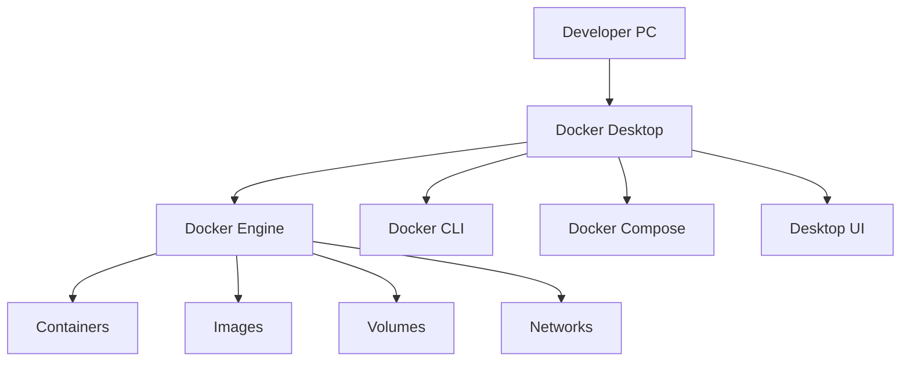
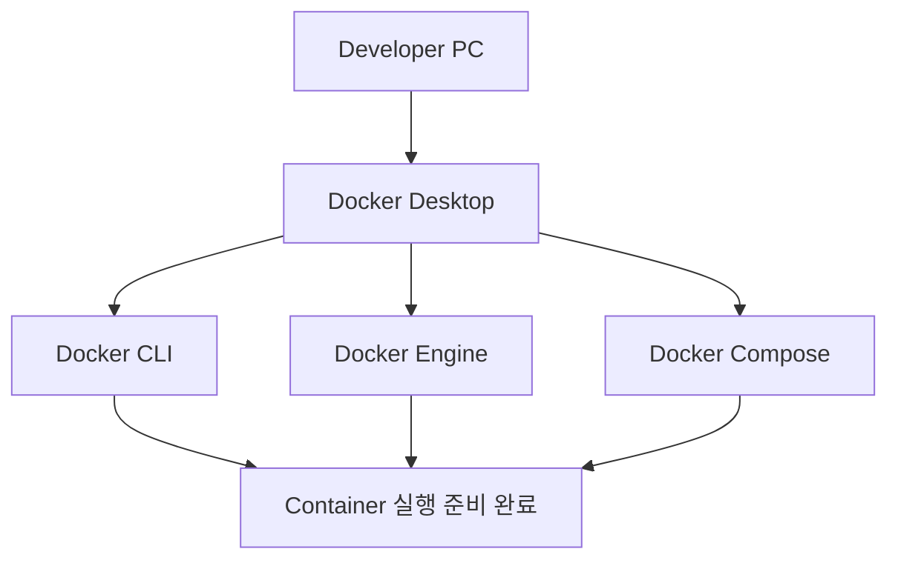

# Docker Desktop 설치 및 기본 환경 구성 가이드

## 1. 문서 목적

본 문서는 MicroServer 프로젝트의 로컬 개발 인프라를 Container 기반으로 실행하기 위해
Windows 및 macOS 개발 PC에 **Docker Desktop**을 설치하고,
Docker Engine / Docker CLI / Docker Compose를 사용할 수 있는 기본 환경을 구성하는 방법을 설명한다.

본 문서는 특정 Database나 Application Container를 실행하는 문서가 아니다.

현재 단계에서는 다음 내용만 구성한다.

- Docker / Container 역할 이해
- Windows Docker Desktop 설치
- Windows WSL 2 기반 실행환경 확인
- macOS Docker Desktop 설치
- Apple Silicon / Intel Mac 구분
- Docker Desktop 사용 정책 및 라이선스 확인
- Docker Engine / Docker CLI 확인
- Docker Compose 확인
- Docker Desktop Resource와 Disk 사용 이해
- 기본 Container 실행 테스트
- Docker Desktop 기본 문제 해결

Oracle Database Free Image Pull과 실제 Database Container 구성은 다음 문서에서 진행한다.

```text
Docker Desktop 설치 및 기본 환경 구성
        ↓
Oracle Database Free 로컬 개발환경 구성
        ↓
Apple Silicon 환경은 필요 시 ARM64 지원 검증
```

---

## 2. 개발환경 구성에서 Docker Desktop의 위치

MicroServer 개발환경은 다음 순서로 준비한다.


현재 문서는 다음 단계에 해당한다.

```text
Git / GitHub
    ↓
Eclipse Temurin JDK
    ↓
Apache Maven
    ↓
VS Code
    ↓
[ Docker Desktop ]              ← 현재
    ↓
Oracle Database Free
```

Docker Desktop을 먼저 독립적으로 준비하면
이후 Oracle뿐 아니라 Redis, Kafka, 기타 개발용 Container를 추가할 때 동일 환경을 재사용할 수 있다.

---

## 3. Docker Desktop의 역할

Docker Desktop은 Windows와 macOS에서 Container 개발환경을 쉽게 사용할 수 있도록
Docker 관련 도구를 하나의 Desktop Application으로 제공한다.

개념적으로 다음과 같이 이해할 수 있다.



주요 구성:

| 구성 | 역할 |
|---|---|
| Docker Engine | Image를 이용하여 Container 실행 |
| Docker CLI | `docker` 명령 제공 |
| Docker Compose | 여러 Container 구성을 YAML로 관리 |
| Docker Desktop UI | Container / Image / Volume 상태 확인 |
| Docker VM / Backend | Windows/macOS에서 Linux Container 실행 기반 제공 |

MicroServer에서는 **Linux Container 기반 개발환경**을 기준으로 한다.

---

## 4. Container를 사용하는 이유

개발 PC에 Oracle Database 같은 Server Software를 직접 설치하면
OS별 설치 과정, 버전, 설정 파일, Service 상태가 개발자마다 달라질 수 있다.

Container 기반으로 구성하면 다음과 같은 장점이 있다.

```text
동일 Image
    ↓
동일한 Server Software 구성
    ↓
개발자별 독립 실행
    ↓
삭제 / 재생성 용이
    ↓
로컬 개발환경 재현성 향상
```

특히 Database나 Middleware처럼 설치와 초기화 과정이 복잡한 제품을
개발 PC에서 격리하여 운영할 때 유용하다.

---

# Windows 환경

## 5. Windows 사전 확인

Windows에서 Docker Desktop을 사용할 때는 일반적으로 WSL 2 기반 Backend를 사용한다.

PowerShell에서 Windows Subsystem for Linux 상태를 확인한다.

```powershell
wsl --status
```

설치된 Distribution 확인:

```powershell
wsl --list --verbose
```

예:

```text
NAME      STATE      VERSION
Ubuntu    Stopped    2
```

Docker Desktop 설치 과정에서 WSL 2 활성화가 필요하면
Docker Desktop Installer 또는 Windows가 안내하는 절차를 따른다.

!!! note "WSL 2"
    Docker Desktop의 Windows 환경에서는 WSL 2 기반 Engine을 사용할 수 있다.
    MicroServer는 Oracle Linux Container를 실행하므로 Windows Container Mode가 아니라
    Linux Container 기반 환경을 사용한다.

---

## 6. Windows Docker Desktop 다운로드

Docker 공식 사이트에서 **Docker Desktop for Windows**를 다운로드한다.

설치 시점의 최신 지원 Windows Version과 Hardware Requirement는
Docker 공식 문서를 기준으로 확인한다.

회사 개발 PC에서 설치 권한이 제한되어 있다면
사내 Software 배포 정책 또는 관리자 권한 정책을 먼저 확인한다.

---

## 7. Windows Docker Desktop 설치

다운로드한 Installer를 실행한다.

일반적인 개발환경에서는 WSL 2 Backend를 사용한다.

설치 완료 후 Windows Start Menu에서 다음 Application을 실행한다.

```text
Docker Desktop
```

처음 실행하면 Docker Desktop 초기 설정과 약관 화면이 나타날 수 있다.

Docker Engine이 완전히 시작될 때까지 기다린다.

---

## 8. Windows WSL 2 Engine 확인

Docker Desktop:

```text
Settings
→ General
```

WSL 2 기반 Engine을 사용하는 환경이라면
관련 설정이 활성화되어 있는지 확인한다.

필요한 경우:

```text
Settings
→ Resources
→ WSL Integration
```

에서 사용할 WSL Distribution과의 통합 상태를 확인할 수 있다.

MicroServer에서 단순히 Windows PowerShell을 이용해 Docker CLI를 사용할 경우
특정 Linux Distribution 내부 개발이 반드시 필요한 것은 아니다.

---

## 9. Windows Docker CLI 확인

새 PowerShell을 실행한다.

```powershell
docker --version
```

정상 예:

```text
Docker version ...
```

Docker Client만 설치된 것이 아니라 Engine과도 연결되는지 확인한다.

```powershell
docker info
```

`docker info`에서 Client와 Server 정보를 정상적으로 확인할 수 있어야 한다.

---

# macOS 환경

## 10. Mac CPU Architecture 확인

Terminal:

```bash
uname -m
```

Apple Silicon:

```text
arm64
```

Intel Mac:

```text
x86_64
```

Docker Desktop은 Mac Architecture에 맞는 설치 Package를 사용한다.

---

## 11. macOS Docker Desktop 다운로드

Docker 공식 사이트에서 Mac용 Docker Desktop을 다운로드한다.

Apple Silicon Mac:

```text
Docker Desktop for Mac - Apple silicon
```

Intel Mac:

```text
Docker Desktop for Mac - Intel
```

Apple Silicon에서 Intel용 Docker Desktop을 일부러 선택하지 않는다.

---

## 12. macOS Docker Desktop 설치

다운로드한 `Docker.dmg`를 연다.

Docker Application을 다음 위치로 이동한다.

```text
/Applications/Docker.app
```

Applications에서 Docker Desktop을 실행한다.

macOS가 보안 또는 권한 관련 확인을 요청하면
Docker Desktop 공식 설치 절차에 따라 진행한다.

---

## 13. macOS Docker CLI 확인

새 Terminal을 실행한다.

```bash
docker --version
```

Docker Engine 연결 확인:

```bash
docker info
```

정상적으로 Server 정보까지 조회되는지 확인한다.

Apple Silicon에서 Oracle Database Free를 사용할 경우
추가 Architecture 검증은 별도의 다음 문서에서 수행한다.

```text
Apple Silicon Oracle Docker 지원 및 검증 가이드
```

---

## 14. Docker Desktop 라이선스 및 회사 사용 정책

Docker Desktop은 사용 목적과 조직 규모에 따라 Subscription 조건이 달라질 수 있다.

Docker 공식 문서에서는 대규모 기업에서의 상업적 Docker Desktop 사용에
유료 Subscription이 필요할 수 있음을 안내한다.

따라서 회사 개발 PC에서 사용하는 경우 다음을 확인한다.

- 회사의 Docker Desktop 사용 정책
- 조직의 Docker Subscription 보유 여부
- 보안 Software와의 충돌 여부
- 개발 PC Virtualization 정책
- 관리자 권한 정책

!!! warning
    Docker Desktop의 사용 조건과 Oracle Database Free의 사용 조건은 서로 다른 제품 정책이다.
    각각 별도로 확인한다.

---

## 15. Docker Compose 확인

Docker Desktop에는 Docker Compose를 함께 사용할 수 있는 구성이 제공된다.

확인:

```bash
docker compose version
```

정상 예:

```text
Docker Compose version ...
```

현재 표준 명령은 다음 형식이다.

```bash
docker compose
```

Legacy Standalone Compose에서 사용하던:

```bash
docker-compose
```

형식은 기존 환경 호환 목적이 아니라면 새 가이드의 기본 명령으로 사용하지 않는다.

현재 단계에서는 Compose 기능 존재 여부만 확인한다.

실제 `compose.yml` 또는 `docker-compose.local.yml`은
프로젝트가 생성된 이후 프로젝트 로컬 인프라 구성 단계에서 작성한다.

---

## 16. Docker Desktop 기본 상태 확인

다음 명령을 순서대로 실행한다.

```bash
docker --version
docker info
docker compose version
```

확인 항목:

```text
Docker CLI      → 실행 가능
Docker Engine   → Server 연결 가능
Docker Compose  → 실행 가능
```

세 항목이 모두 정상이어야 이후 Oracle Container 구성을 진행한다.

---

## 17. 기본 Container 실행 테스트

Docker Engine 자체가 정상 동작하는지 간단히 확인하려면
Docker의 기본 Test Container를 사용할 수 있다.

```bash
docker run --rm hello-world
```

이 명령은 다음 과정을 확인한다.

```text
Docker CLI
   ↓
Docker Engine
   ↓
Image Pull
   ↓
Container 생성
   ↓
Container 실행
   ↓
종료 후 --rm으로 삭제
```

정상 메시지가 출력되면 Docker의 기본 실행경로가 동작하는 것이다.

현재 Test는 Docker 자체 확인 목적이며 Oracle과는 무관하다.

---

## 18. Image / Container / Volume의 차이

Docker를 처음 사용할 때 다음 세 개념을 혼동하기 쉽다.


### Image

Server Software와 실행환경의 Template이다.

예:

```text
Oracle Database Free Image
```

### Container

Image를 기반으로 실제 실행되는 Instance이다.

예:

```text
microserver-oracle
```

### Volume

Container Life Cycle과 분리하여 Data를 보관한다.

예:

```text
microserver-oracle-data
```

특히 Database Container에서는 Volume이 중요하다.

```text
Container 삭제
    ≠
Database Data 삭제

Volume까지 삭제
    =
Database Data 삭제 가능
```

Oracle 문서에서 이 차이를 다시 실제 명령과 함께 설명한다.

---

## 19. Docker Desktop Resource 이해

Oracle Database는 일반적인 경량 Web Container보다
Memory와 Disk를 더 많이 사용한다.

다음 항목을 확인한다.

- Host 전체 Memory
- Docker Desktop 사용 가능 Resource
- Docker Image 저장 공간
- Named Volume 저장 공간
- SSD 여유 공간
- 동시에 실행하는 Container 수

현재 단계에서는 임의의 Memory Limit 값을 프로젝트 표준으로 강제하지 않는다.

개발 PC 사양과 동시에 실행하는 개발 도구에 따라 Resource 요구량이 달라질 수 있기 때문이다.

---

## 20. Docker Disk 사용 확인

Docker가 사용하는 Disk 현황을 확인할 수 있다.

```bash
docker system df
```

Image:

```bash
docker image ls
```

Volume:

```bash
docker volume ls
```

Container:

```bash
docker ps -a
```

Oracle Image와 Database Volume을 사용하기 시작하면 Disk 사용량이 증가하므로
정기적으로 확인할 수 있다.

---

## 21. Docker Desktop UI

Docker Desktop UI에서도 주요 상태를 확인할 수 있다.

대표 영역:

```text
Containers
Images
Volumes
Builds
Settings
```

CLI를 기본 기준으로 사용하되
Container Logs나 Resource 상태를 빠르게 확인할 때 Desktop UI를 함께 사용할 수 있다.

---

## 22. 현재 단계에서 하지 않는 작업

현재는 Docker 실행환경 자체만 준비한다.

다음 작업은 아직 하지 않는다.

```text
Oracle Database Image Pull
Oracle Container 생성
Oracle Volume 생성
FREEPDB1 접속
Spring Boot 프로젝트 생성
Docker Compose 프로젝트 파일 작성
application-local.yml 작성
```

Oracle 관련 실제 구성은 다음 문서에서 진행한다.

---

## 23. 자주 발생하는 문제

### 23.1 `docker` 명령을 찾을 수 없음

```bash
docker --version
```

명령을 찾지 못한다면:

- Docker Desktop 설치 여부 확인
- Docker Desktop 설치 후 Terminal 재실행
- Windows / macOS 설치가 정상 완료되었는지 확인

---

### 23.2 `docker info`에서 Server 연결 실패

대표적으로 Docker Desktop이 실행되지 않았거나
Docker Engine이 아직 시작되지 않은 경우 발생한다.

Docker Desktop을 실행하고 Engine 상태를 확인한다.

다시:

```bash
docker info
```

---

### 23.3 Windows에서 WSL 관련 오류

PowerShell:

```powershell
wsl --status
```

```powershell
wsl --list --verbose
```

WSL 2가 정상 활성화되어 있는지 확인한다.

Docker Desktop의 WSL Integration 설정도 확인한다.

---

### 23.4 macOS에서 Docker Desktop이 실행되지 않음

다음 항목을 확인한다.

- Mac CPU Architecture와 설치 Package 일치 여부
- macOS 보안 / 권한 Prompt
- Docker Desktop 지원 macOS Version
- Virtualization 관련 환경
- Docker Desktop Logs

---

### 23.5 `docker compose` 명령을 찾을 수 없음

```bash
docker compose version
```

Docker Desktop Version과 설치 상태를 확인한다.

새 환경에서는 Legacy `docker-compose`를 별도로 설치하기보다
Docker Desktop에 포함된 Compose Plugin 사용을 우선한다.

---

### 23.6 Disk 사용량이 계속 증가함

확인:

```bash
docker system df
```

불필요한 Image나 종료된 Container가 있는지 확인한다.

단, Database Volume은 실제 개발 Data를 포함할 수 있으므로
무작정 삭제하지 않는다.

---

## 24. 완료 상태

Docker Desktop 기본 환경 구성이 끝나면 다음 상태가 되어야 한다.



아직 Oracle Container는 만들지 않는다.

---

## 25. 체크리스트

### Windows

- [ ] Docker Desktop for Windows를 설치했다.
- [ ] 필요한 경우 WSL 2가 활성화되어 있다.
- [ ] Linux Container 기반 Docker Desktop 환경을 사용한다.
- [ ] `docker --version`이 정상 실행된다.
- [ ] `docker info`가 정상 실행된다.

### macOS

- [ ] `uname -m`으로 Mac Architecture를 확인했다.
- [ ] Apple Silicon 또는 Intel에 맞는 Docker Desktop을 설치했다.
- [ ] `docker --version`이 정상 실행된다.
- [ ] `docker info`가 정상 실행된다.

### 공통

- [ ] Docker Compose를 사용할 수 있다.
- [ ] `docker run --rm hello-world`가 정상 실행된다.
- [ ] Image / Container / Volume의 차이를 이해했다.
- [ ] 회사 PC라면 Docker Desktop 사용 정책과 Subscription 조건을 확인했다.
- [ ] Oracle Database 구성은 아직 진행하지 않았다.

---

## 26. 다음 단계

Docker Desktop 준비가 완료되면 Oracle Database Free 로컬 개발환경을 구성한다.

```text
Docker Desktop 설치 및 기본 환경 구성       ← 현재 완료
        ↓
Oracle Database Free 로컬 개발환경 구성
        ↓
Spring Boot 프로젝트 생성
```

Apple Silicon Mac에서는 Oracle Image Pull 전후에
별도의 ARM64 지원 및 Architecture 검증 가이드를 참고할 수 있다.

---

## 27. 공식 참고 자료

- Docker Desktop  
  <https://docs.docker.com/desktop/>

- Docker Desktop for Windows  
  <https://docs.docker.com/desktop/setup/install/windows-install/>

- Docker Desktop WSL 2 Backend  
  <https://docs.docker.com/desktop/features/wsl/>

- Docker Desktop for Mac  
  <https://docs.docker.com/desktop/setup/install/mac-install/>

- Docker Compose Installation  
  <https://docs.docker.com/compose/install/>
