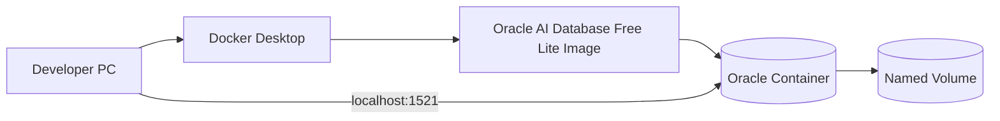
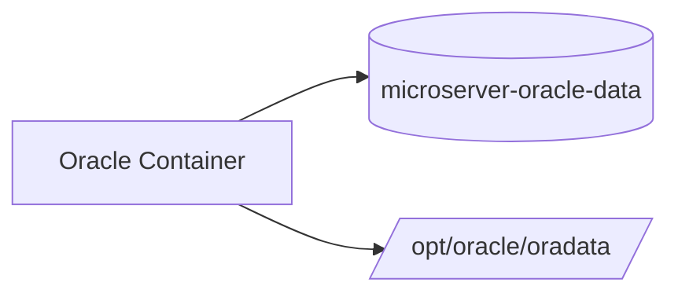
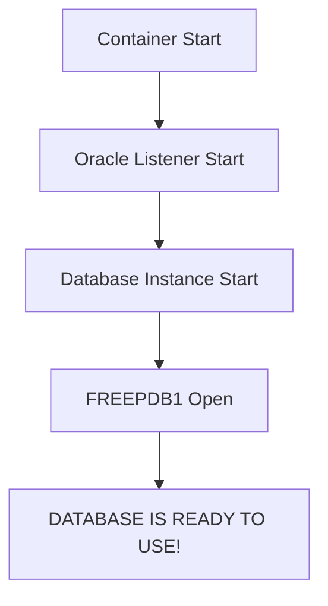
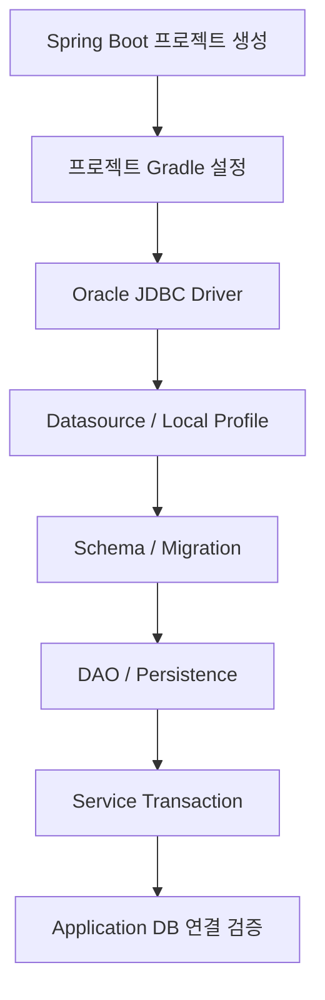
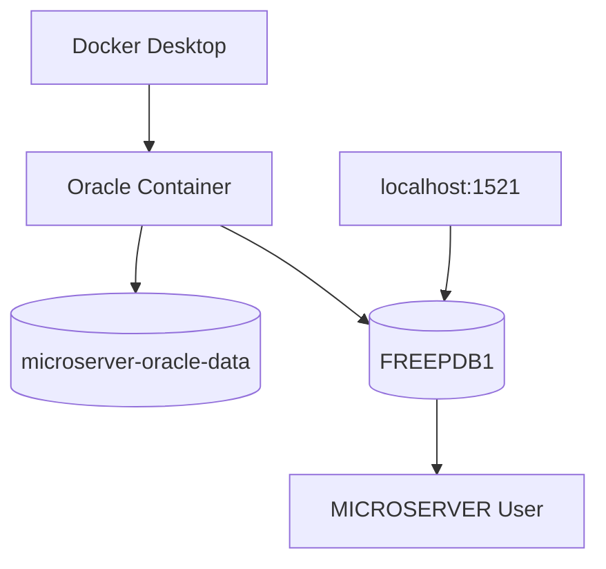

# Oracle Database Free 로컬 개발환경 구성 가이드

## 1. 문서 목적

본 문서는 MicroServer 프로젝트에서 데이터 영속성 계층을 개발하기 전에
Docker Desktop 위에 **Oracle AI Database Free 기반 로컬 Database 환경**을 구성하는 방법을 설명한다.

이 문서는 **Docker Desktop 설치 자체를 설명하는 문서가 아니다.**
Windows 또는 macOS에서 Docker Desktop 설치와 기본 검증을 먼저 완료한 뒤 진행한다.

현재 단계에서는 다음 내용까지 구성한다.

- Oracle 공식 Container Image 선정
- Oracle AI Database Free Lite Image Pull
- Image Tag 운영 원칙 이해
- Oracle SYSTEM Password 준비
- Named Volume 생성
- Windows / macOS Oracle Container 실행
- Database Ready 상태 확인
- `FREEPDB1` 접속 확인
- 프로젝트 로컬 사용자 `MICROSERVER` 생성
- Host Port 확인
- Container Stop / Start / 삭제
- Database Data 초기화
- Oracle Container 기본 문제 해결

다음 내용은 Spring Boot 프로젝트 생성 이후 별도 가이드에서 진행한다.

- Oracle JDBC Driver
- `build.gradle`
- Datasource
- `application-local.yml`
- Docker Compose 프로젝트 파일
- `.env`
- Schema / Seed SQL
- Flyway / Liquibase
- DAO / Persistence
- Service Transaction
- 실제 Application DB 연결 Test

---

## 2. 사전 준비

Oracle Container를 구성하기 전에 **사용 중인 운영체제에 맞는 Docker Desktop 가이드**를 먼저 완료한다.

!!! info "먼저 확인할 Docker Desktop 가이드"
    Docker Desktop의 역할과 공통 개념:

    - [Docker Desktop 개요 및 공통 환경 가이드](docker_desktop_setup.md)

    Windows 개발 PC:

    - [Windows Docker Desktop 설치 가이드](docker_desktop_windows_setup.md)

    macOS 개발 PC:

    - [macOS Docker Desktop 설치 가이드](docker_desktop_macos_setup.md)

    Docker Desktop 설치가 완료된 뒤 본 문서로 돌아와 Oracle Database 환경을 구성한다.

### 2.1 Docker 기본 상태 확인

새 Terminal 또는 PowerShell을 열고 다음 명령을 확인한다.

```bash
docker --version
docker version
docker info
docker compose version
```

정상 상태에서는 최소한 다음 조건을 만족해야 한다.

```text
Docker CLI          → 실행 가능
Docker Engine       → Server 연결 가능
Docker Compose      → Version 확인 가능
```

특히 `docker version`에서는 **Client와 Server가 모두 조회**되어야 한다.

```text
Client:
  ...

Server:
  ...
```

!!! warning "Docker Engine 연결 오류가 있으면 여기서 중단"
    `docker version` 또는 `docker info`에서 Docker Engine에 연결되지 않는다면
    Oracle Image Pull이나 Container 생성을 진행하지 않는다.

    운영체제별 Docker Desktop 설치 가이드의 문제 해결 절을 먼저 확인한다.

    - [Windows Docker Desktop 설치 가이드](docker_desktop_windows_setup.md)
    - [macOS Docker Desktop 설치 가이드](docker_desktop_macos_setup.md)

---

## 3. 전체 구성 구조



현재 Oracle 로컬 환경의 목표는 다음과 같다.

```text
Host            localhost
Port            1521
Service Name    FREEPDB1
Container       microserver-oracle
Volume          microserver-oracle-data
Schema User     MICROSERVER
```

전체 구성 순서는 다음과 같다.

```text
Docker Desktop 준비
        ↓
Oracle Image Pull
        ↓
Named Volume 생성
        ↓
Oracle Container 생성
        ↓
DATABASE IS READY TO USE! 확인
        ↓
FREEPDB1 접속
        ↓
MICROSERVER User 생성
        ↓
로컬 Oracle 환경 준비 완료
```

---

## 4. Oracle Container Image 선정

MicroServer 로컬 Database는 Oracle이 직접 제공하는
**Oracle Container Registry 공식 Image**를 사용한다.

기본 Image:

```text
container-registry.oracle.com/database/free:latest-lite
```

현재 MicroServer의 로컬 개발 목적은 다음과 같다.

- 일반 SQL
- DDL / DML
- PL/SQL
- Transaction
- JDBC
- DAO / Persistence
- 일반적인 금융 SI CRUD

현재 범위에서는 **Lite Image**를 기본으로 사용한다.

!!! note "Lite Image 사용 기준"
    향후 Oracle의 특수 기능 또는 추가 구성요소가 필요한 요구사항이 생기면
    그 시점에 Full Image, 다른 Tag 또는 별도 Database 환경을 검토한다.

---

## 5. Apple Silicon Mac 사용 시

Apple Silicon Mac에서는 Oracle Container를 생성하기 전에
Host와 Oracle Image의 Architecture를 별도로 확인하는 것을 권장한다.

!!! tip "Apple Silicon 사용자는 먼저 Architecture 검증"
    Apple Silicon Mac 사용자는 다음 문서를 먼저 확인한다.

    **[Apple Silicon Oracle Docker 지원 및 검증 가이드](oracle_docker_apple_silicon_support.md)**

    해당 가이드에서는 다음 내용을 확인한다.

    - Apple Silicon Mac의 `arm64` Architecture 확인
    - Oracle Registry의 ARM64 Image 지원 여부 확인
    - Pull된 Oracle Image의 `linux/arm64` Architecture 확인
    - `--platform linux/amd64` 강제 옵션을 사용하지 않는 이유
    - `DOCKER_DEFAULT_PLATFORM` 설정 확인
    - `DATABASE IS READY TO USE!`까지 실제 Oracle 기동 검증
    - `FREEPDB1` 접속을 통한 최종 동작 확인

Architecture 검증이 끝나면 본 문서의 공통 Oracle 구성 절차를 계속 진행한다.

---

## 6. Oracle Image Pull

Oracle 공식 Container Registry에서 Image를 Pull한다.

```bash
docker pull container-registry.oracle.com/database/free:latest-lite
```

Image 확인:

```bash
docker image ls
```

확인할 Repository:

```text
container-registry.oracle.com/database/free
```

Oracle Container Registry의 정책에 따라
사용 시점에 인증이나 약관 확인이 요구될 수 있다.

---

## 7. `latest-lite` Tag 운영 원칙

현재 개발환경 준비 단계에서는 다음 Tag를 사용한다.

```text
latest-lite
```

`latest-lite`는 고정 Version이 아니라 최신 Lite Image를 가리키므로
시간이 지나면 실제 Image Digest와 Database Release가 달라질 수 있다.

개발환경 탐색 단계:

```text
latest-lite
→ 편리하게 최신 지원 Image 확인
```

프로젝트 본격화 이후:

```text
Version / Digest 확인
→ 팀 표준 Image 고정 검토
```

재현 가능한 개발환경이 중요해지는 시점에는 Image 정보를 기록하는 것이 좋다.

### 7.1 Windows PowerShell

PowerShell에서는 Bash / zsh의 줄 연결 문자 `\`를 사용하지 않는다.

```powershell
docker image inspect container-registry.oracle.com/database/free:latest-lite
```

Digest 확인:

```powershell
docker image inspect container-registry.oracle.com/database/free:latest-lite --format '{{json .RepoDigests}}'
```

### 7.2 macOS Terminal

```bash
docker image inspect \
  container-registry.oracle.com/database/free:latest-lite
```

Digest 확인:

```bash
docker image inspect \
  container-registry.oracle.com/database/free:latest-lite \
  --format '{{json .RepoDigests}}'
```

!!! tip "Terminal에 맞는 줄바꿈 문법 사용"
    Windows PowerShell의 여러 줄 명령은 Backtick(`)을 사용하고,
    macOS Bash / zsh는 Backslash(`\`)를 사용한다.

---

## 8. Oracle Password 사용

Oracle Container 초기 생성 시
SYS / SYSTEM 계정에 사용할 Password를 `ORACLE_PWD` 환경변수로 전달한다.

실제 Password를 문서나 Source Repository에 작성하지 않는다.

### 8.1 Windows: 앞 단계에서 설정한 값 사용

Windows에서는 VS Code 설치 단계에서 다음 구조를 준비하는 것을 기준으로 한다.

```text
C:\local-microserver\env
├─ start-vscode.cmd
├─ local-env.example.cmd
└─ local-env.cmd
       ↓
       ORACLE_PWD 설정
```

`start-vscode.cmd`가 `local-env.cmd`를 호출한 뒤 VS Code를 실행하면
VS Code 내부 PowerShell이 `ORACLE_PWD`를 상속받는다.

따라서 본 Oracle 가이드에서는 매번 Password를 직접 입력하기보다
**앞 단계에서 설정된 `ORACLE_PWD`를 불러와 사용하는 것**을 기준으로 한다.

!!! info "관련 가이드"
    `start-vscode.cmd`와 `local-env.cmd` 구성은
    **[VS Code 설치 가이드](../vscode/vscode_install.md)**를 참고한다.

설정 여부 확인:

```powershell
if ($env:ORACLE_PWD) {
    "ORACLE_PWD is set"
} else {
    "ORACLE_PWD is not set"
}
```

정상:

```text
ORACLE_PWD is set
```

!!! warning "Password 값을 직접 출력하지 않음"
    `$env:ORACLE_PWD`를 그대로 실행하면 실제 Password가 화면에 표시될 수 있다.

설정되지 않았다면:

```text
local-env.cmd 존재 확인
        ↓
ORACLE_PWD 설정 확인
        ↓
Portable VS Code 완전 종료
        ↓
start-vscode.cmd로 다시 실행
        ↓
Integrated PowerShell에서 재확인
```

!!! note "`local-env.cmd`는 `.gitignore` 대상이 아님"
    `C:\local-microserver\env\local-env.cmd`는
    `workspace\microserver` Git Repository 밖에 있다.

    따라서 프로젝트 `.gitignore`로 제외할 필요가 없다.

    다만 `C:\local-microserver` 전체를 ZIP으로 배포할 때는
    실제 Secret 파일인 `local-env.cmd`를 Package에서 제외한다.

### 8.2 macOS Terminal

현재 Windows의 `start-vscode.cmd`와 동일한 macOS Local Secret Script는
본 단계에서 별도 표준화하지 않는다.

```bash
export ORACLE_PWD='<strong-local-password>'
```

설정 여부:

```bash
if [ -n "$ORACLE_PWD" ]; then
  echo "ORACLE_PWD is set"
else
  echo "ORACLE_PWD is not set"
fi
```

!!! danger "Secret 관리 원칙"
    - 실제 Password를 Markdown 문서에 기록하지 않는다.
    - Production Credential을 Local Database에 재사용하지 않는다.
    - Repository 내부 `.env`는 해당 Repository의 `.gitignore`로 제외한다.
    - Repository 밖 `local-env.cmd`는 개발환경 배포 Package에서 제외한다.

---

## 9. Named Volume 생성

Database Data를 Container Life Cycle과 분리하기 위해
Named Volume을 생성한다.

```bash
docker volume create microserver-oracle-data
```

확인:

```bash
docker volume ls
```

Volume 이름:

```text
microserver-oracle-data
```

Oracle Database Data Mount Path:

```text
/opt/oracle/oradata
```



!!! info "Image / Container / Volume 개념"
    Image / Container / Volume의 일반적인 차이는
    이전 Docker Desktop 공통 가이드에서 설명한다.

    **[Docker Desktop 개요 및 공통 환경 가이드](docker_desktop_setup.md)**

    본 문서에서는 특히 **Oracle Database Data를 Named Volume에 영속화**한다는 점에 집중한다.

---

## 10. Oracle Container 생성

운영체제에 따라 명령 줄 표현 방식만 다르며
생성되는 Container의 구성은 동일하다.

공통 설정:

```text
Container Name : microserver-oracle
Host Port      : 1521
Container Port : 1521
Volume         : microserver-oracle-data
Data Path      : /opt/oracle/oradata
Image          : container-registry.oracle.com/database/free:latest-lite
```

### 10.1 Windows PowerShell

```powershell
docker run -d `
  --name microserver-oracle `
  -p 1521:1521 `
  -e ORACLE_PWD=$env:ORACLE_PWD `
  -v microserver-oracle-data:/opt/oracle/oradata `
  container-registry.oracle.com/database/free:latest-lite
```

한 줄 실행:

```powershell
docker run -d --name microserver-oracle -p 1521:1521 -e ORACLE_PWD=$env:ORACLE_PWD -v microserver-oracle-data:/opt/oracle/oradata container-registry.oracle.com/database/free:latest-lite
```

!!! tip "PowerShell 여러 줄 명령"
    PowerShell에서 여러 줄 명령을 작성할 때 사용하는 Backtick(`) 뒤에는
    불필요한 공백을 넣지 않는다.

### 10.2 macOS Terminal

```bash
docker run -d \
  --name microserver-oracle \
  -p 1521:1521 \
  -e ORACLE_PWD="$ORACLE_PWD" \
  -v microserver-oracle-data:/opt/oracle/oradata \
  container-registry.oracle.com/database/free:latest-lite
```

Apple Silicon에서는 기본 구성에서 다음 옵션을 추가하지 않는다.

```text
--platform linux/amd64
```

Architecture 관련 내용은
[Apple Silicon Oracle Docker 지원 및 검증 가이드](oracle_docker_apple_silicon_support.md)를 따른다.

### 10.3 주요 옵션

| 옵션 | 의미 |
|---|---|
| `-d` | Background 실행 |
| `--name microserver-oracle` | Container 이름 지정 |
| `-p 1521:1521` | Host 1521과 Oracle Listener 1521 연결 |
| `-e ORACLE_PWD=...` | 초기 Database Password 전달 |
| `-v ...:/opt/oracle/oradata` | Database Data 영속화 |

---

## 11. Container 생성 상태 확인

실행 중 Container:

```bash
docker ps
```

전체 Container:

```bash
docker ps -a
```

확인할 이름:

```text
microserver-oracle
```

Container가 바로 종료되었다면 다음 단계로 넘어가지 않고 로그를 확인한다.

```bash
docker logs microserver-oracle
```

---

## 12. Database 초기화 및 Ready 상태 확인

Oracle Database는 Container Process가 시작되었다고
즉시 접속 가능한 상태가 되는 것은 아니다.

로그를 Follow한다.

```bash
docker logs -f microserver-oracle
```

Oracle Database가 준비되면 다음 메시지를 확인한다.

```text
DATABASE IS READY TO USE!
```

로그 Follow 종료:

```text
Ctrl + C
```

정상 흐름:



!!! important "Container Running과 Database Ready는 다름"
    `docker ps`에서 Container가 `Up` 상태여도
    Database 초기화가 끝나지 않았을 수 있다.

    다음 단계의 SQL 접속은 반드시 `DATABASE IS READY TO USE!` 확인 후 진행한다.

---

## 13. 기본 접속 정보

```text
Host         : localhost
Port         : 1521
Service Name : FREEPDB1
Admin User   : SYSTEM
Password     : ORACLE_PWD로 지정한 값
```

Oracle AI Database Free에서 사용할 PDB Service:

```text
FREEPDB1
```

향후 Spring Boot Datasource에서도 이 Service Name을 사용한다.

현재는 Datasource 파일을 생성하지 않는다.

---

## 14. SQL*Plus로 `FREEPDB1` 접속

Oracle Container 내부의 SQL*Plus를 이용해 Database 접속을 확인한다.

### 14.1 Windows PowerShell

```powershell
docker exec -it microserver-oracle sqlplus "system/$($env:ORACLE_PWD)@FREEPDB1"
```

### 14.2 macOS Terminal

```bash
docker exec -it microserver-oracle \
  sqlplus system/"$ORACLE_PWD"@FREEPDB1
```

정상 접속:

```text
SQL>
```

접속되지 않는다면 다음을 먼저 확인한다.

```text
1. microserver-oracle Container가 Running 상태인가?
2. DATABASE IS READY TO USE! 메시지를 확인했는가?
3. Service Name이 FREEPDB1인가?
4. ORACLE_PWD 값이 Container 최초 생성 시 사용한 Password와 같은가?
```

---

## 15. 현재 PDB 확인

SQL*Plus에서 현재 접속한 Container를 확인한다.

```sql
SELECT sys_context('USERENV', 'CON_NAME') AS container_name
FROM dual;
```

정상 결과:

```text
FREEPDB1
```

이 확인은 프로젝트 Local User를 잘못된 `CDB$ROOT`에 생성하는 실수를 방지하는 데 중요하다.

---

## 16. 프로젝트 로컬 사용자 구성

Application이 SYSTEM 계정으로 Table을 생성하고 SQL을 실행하는 방식은 사용하지 않는다.

운영 원칙:

```text
SYSTEM
→ Database 관리 및 Local Schema 준비

MICROSERVER
→ 향후 Application 개발용 Schema
```

현재 단계에서는 로컬 개발 DB에 사용할 별도 Schema User를 준비한다.

### 16.1 `FREEPDB1` 재확인

사용자 생성 전 반드시 현재 PDB를 확인한다.

```sql
SELECT sys_context('USERENV', 'CON_NAME')
FROM dual;
```

결과:

```text
FREEPDB1
```

### 16.2 `MICROSERVER` 사용자 생성

```sql
CREATE USER MICROSERVER
IDENTIFIED BY "<local-password>";
```

### 16.3 기본 개발 권한 부여

```sql
GRANT CREATE SESSION TO MICROSERVER;
GRANT CREATE TABLE TO MICROSERVER;
GRANT CREATE SEQUENCE TO MICROSERVER;
GRANT CREATE VIEW TO MICROSERVER;
GRANT CREATE PROCEDURE TO MICROSERVER;
```

개발용 `USERS` Tablespace 사용 기준:

```sql
ALTER USER MICROSERVER
QUOTA UNLIMITED ON USERS;
```

!!! warning "로컬 환경에서도 DBA Role을 습관적으로 부여하지 않음"
    로컬 학습 / 개발 환경이라는 이유로
    Application Schema User에 `DBA` Role을 부여하지 않는다.

### 16.4 사용자 확인

SYSTEM Session:

```sql
SELECT username,
       account_status,
       default_tablespace,
       temporary_tablespace
FROM dba_users
WHERE username = 'MICROSERVER';
```

권한 확인:

```sql
SELECT privilege
FROM dba_sys_privs
WHERE grantee = 'MICROSERVER'
ORDER BY privilege;
```

현재 단계에서는 업무 Table이나 Sequence를 만들지 않는다.

### 16.5 SYSTEM Session 종료

```sql
exit
```

`docker exec ... sqlplus` 방식으로 실행했다면
SQL*Plus 종료 후 Host Terminal로 돌아온다.

---

## 17. Host Port 확인

SQL 접속과 별도로 Host에서 Oracle Listener Port가 열려 있는지 확인할 수 있다.

### 17.1 Windows

```powershell
Test-NetConnection localhost -Port 1521
```

정상 예:

```text
TcpTestSucceeded : True
```

### 17.2 macOS

```bash
nc -vz localhost 1521
```

!!! note "Port Open만으로 Database Ready를 판단하지 않음"
    다음 세 가지를 함께 확인한다.

    ```text
    docker ps
    DATABASE IS READY TO USE!
    FREEPDB1 SQL 접속
    ```

---

## 18. Container 운영과 Database Data

Image / Container / Volume의 일반적인 개념은
[Docker Desktop 개요 및 공통 환경 가이드](docker_desktop_setup.md)에서 설명한다.

여기서는 Oracle Database 운영에 필요한 명령만 정리한다.

### 18.1 Container 중지

```bash
docker stop microserver-oracle
```

### 18.2 Container 다시 시작

```bash
docker start microserver-oracle
```

로그:

```bash
docker logs -f microserver-oracle
```

Named Volume을 유지하므로 Stop / Start에서 Database Data는 유지된다.

### 18.3 Container만 삭제

```bash
docker rm -f microserver-oracle
```

Volume 확인:

```bash
docker volume ls
```

다음 Volume이 남아 있다면 Database Data는 별도 보관된다.

```text
microserver-oracle-data
```

### 18.4 Database 완전 초기화

!!! danger "Database Data 전체 삭제"
    아래 절차는 현재 로컬 Oracle Database Data를 삭제한다.

Container 제거:

```bash
docker rm -f microserver-oracle
```

Volume 제거:

```bash
docker volume rm microserver-oracle-data
```

다시 새 환경을 만들려면:

```bash
docker volume create microserver-oracle-data
```

이후 Oracle Container를 다시 생성한다.

핵심:

```text
Container 삭제
    ≠
Database Data 삭제

Named Volume 삭제
    =
Database Data 삭제
```

---

## 19. Password 변경과 기존 Volume

다음 상황을 주의한다.

```text
기존 Database Volume 존재
        +
새 ORACLE_PWD 값
        ↓
기존 DB Password가 자동으로 새 값으로 변경되는 것은 아님
```

`ORACLE_PWD`는 Container의 초기 Database 구성과 관련된 값이다.

기존 Data Volume을 재사용하면서 환경변수만 변경한 경우
실제 Database Password와 현재 Shell 변수 값이 달라질 수 있다.

따라서 Password 문제가 발생하면 먼저 다음을 구분한다.

```text
기존 Database Data를 유지할 것인가?
또는
Named Volume까지 삭제하고 새 Database로 초기화할 것인가?
```

---

## 20. 현재 단계에서 만들지 않는 항목

### 20.1 Docker Compose 프로젝트 파일

Docker Compose 기능 자체는 앞 단계의 Docker Desktop 가이드에서 확인했다.

- [Docker Desktop 개요 및 공통 환경 가이드](docker_desktop_setup.md)
- [Windows Docker Desktop 설치 가이드](docker_desktop_windows_setup.md)
- [macOS Docker Desktop 설치 가이드](docker_desktop_macos_setup.md)

현재는 Spring Boot Project가 아직 없으므로 다음 파일은 만들지 않는다.

```text
compose.yml
docker-compose.local.yml
.env
```

프로젝트 Directory와 Local Infrastructure 운영 위치를 결정한 후
프로젝트 생성 이후 별도 가이드에서 작성한다.

### 20.2 Database Object

현재 Oracle 환경 준비의 완료 기준은 다음까지이다.

```text
Oracle Container
FREEPDB1
MICROSERVER User
```

다음 Database Object는 이후 Database / Persistence 구현 단계에서 생성한다.

```text
Table
Sequence
Index
View
Procedure
Seed Data
Migration History
```

환경 확인을 위해 임의의 `TB_SAMPLE`을 지금 만들지 않는다.

---

## 21. 프로젝트 생성 이후 Oracle 연계 흐름



이후 단계에서 다룰 내용:

```text
ojdbc
build.gradle
application-local.yml
DB_USERNAME / DB_PASSWORD
Docker Compose
.env
Schema SQL
Flyway / Liquibase
DAO
Transaction
```

---

## 22. 자주 발생하는 문제

Docker Desktop 자체의 설치 / WSL 2 / Engine 문제는
운영체제별 Docker Desktop 가이드에서 먼저 확인한다.

- [Windows Docker Desktop 설치 가이드](docker_desktop_windows_setup.md)
- [macOS Docker Desktop 설치 가이드](docker_desktop_macos_setup.md)

본 절에서는 **Oracle Container를 구성한 이후 발생하는 문제**에 집중한다.

### 22.1 Oracle Container가 생성되지 않음

```bash
docker ps -a
```

Image 확인:

```bash
docker image ls
```

Oracle Image가 존재하는지 확인한다.

```text
container-registry.oracle.com/database/free
```

Docker Engine 자체가 정상인지 확인해야 하는 경우:

```bash
docker info
```

Engine 오류라면 Oracle 문제로 보지 말고 앞 단계의 Docker Desktop 가이드를 확인한다.

### 22.2 Container가 바로 종료됨

```bash
docker logs microserver-oracle
```

확인 항목:

- Host Memory
- Disk 여유 공간
- Oracle Image 상태
- Password 설정
- Named Volume 상태
- 1521 Port 충돌

### 22.3 1521 Port 충돌

Windows:

```powershell
netstat -ano | findstr :1521
```

macOS:

```bash
lsof -i :1521
```

필요하면 Host Port만 변경할 수 있다.

예:

```bash
-p 1522:1521
```

구조:

```text
localhost:1522
        ↓
Container:1521
```

Host Port를 변경하면 향후 JDBC URL도 동일한 Host Port를 사용해야 한다.

### 22.4 `ORA-12514`

다음을 확인한다.

```text
Service Name : FREEPDB1
```

그리고 Database가 Ready인지 확인한다.

```bash
docker logs -f microserver-oracle
```

### 22.5 사용자 생성 시 Common User 오류

현재 Session이 `CDB$ROOT`일 가능성이 있다.

확인:

```sql
SELECT sys_context('USERENV', 'CON_NAME')
FROM dual;
```

프로젝트 Local User는 다음 PDB에 연결한 상태에서 생성한다.

```text
FREEPDB1
```

### 22.6 SYSTEM Password가 맞지 않음

기존 Named Volume과 새 `ORACLE_PWD`의 관계를 확인한다.

기존 DB를 유지할 것인지 완전히 초기화할 것인지 먼저 결정한다.

---

## 23. Docker Desktop UI에서 Oracle 확인

Docker Desktop UI에서도 Oracle Container 상태를 확인할 수 있다.

```text
Docker Desktop
→ Containers
→ microserver-oracle
```

확인할 수 있는 내용:

- Running / Stopped 상태
- Logs
- Port Mapping
- Container 상세정보
- Resource 사용 상태

!!! tip "Docker Desktop UI는 보조 확인 도구"
    Docker Desktop UI의 일반적인 사용 방법은
    [Docker Desktop 개요 및 공통 환경 가이드](docker_desktop_setup.md)를 참고한다.

    본 문서에서는 CLI 명령을 기본 기준으로 하고 UI는 Oracle Container 상태 확인에 보조적으로 사용한다.

---

## 24. 보안 주의사항

Git에 포함하지 않는다.

```text
SYSTEM Password
MICROSERVER Password
Production DB URL
Production DB User
Production DB Password
```

Windows에서는 `C:\local-microserver\env\local-env.cmd`에 Local Secret을 분리하고 `start-vscode.cmd`로 실행한 VS Code가 값을 상속받는 방식을 사용한다.

`local-env.cmd`는 프로젝트 Git Repository 밖에 있으므로 프로젝트 `.gitignore` 대상이 아니다. 대신 개발환경 ZIP / 배포 Package에서 제외한다.

Production Credential을 로컬 개발 DB에 재사용하지 않는다.

향후 Spring Boot Repository 내부에 `.env` 같은 Secret 파일을 만들면 그때는 해당 Repository의 `.gitignore` 정책을 적용한다.

---

## 25. 완료 상태



완료 기준:

```text
Oracle Image       → Pull 완료
Container          → 실행 가능
Named Volume       → 구성 완료
Database           → READY
FREEPDB1            → 접속 가능
MICROSERVER User   → 생성 / 확인
```

Spring Boot는 아직 생성 전이다.

---

## 26. 최종 검증

### 26.1 Container

```bash
docker ps
```

### 26.2 Log

```bash
docker logs microserver-oracle
```

다음 메시지를 확인한다.

```text
DATABASE IS READY TO USE!
```

### 26.3 Port

```text
localhost:1521
```

Windows:

```powershell
Test-NetConnection localhost -Port 1521
```

macOS:

```bash
nc -vz localhost 1521
```

### 26.4 Service

```text
FREEPDB1
```

### 26.5 현재 PDB

```sql
SELECT sys_context('USERENV', 'CON_NAME')
FROM dual;
```

결과:

```text
FREEPDB1
```

### 26.6 최종 확인 흐름

```text
Docker Engine 정상
        ↓
Oracle Container Running
        ↓
DATABASE IS READY TO USE!
        ↓
localhost:1521 접근 가능
        ↓
FREEPDB1 SQL 접속 가능
        ↓
MICROSERVER User 확인
        ↓
Oracle 로컬 개발환경 준비 완료
```

---

## 27. 체크리스트

### 27.1 Docker 사전 환경

- [ ] Docker Desktop 개요 및 공통 환경 가이드를 확인했다.
- [ ] 사용 중인 OS의 Docker Desktop 설치 가이드를 완료했다.
- [ ] `docker version`에서 Client / Server가 모두 정상 조회된다.
- [ ] `docker info`가 정상 실행된다.
- [ ] Windows에서는 `start-vscode.cmd`로 실행한 VS Code에서 `ORACLE_PWD` 설정 여부를 확인했다.

### 27.2 Image / Container

- [ ] Oracle 공식 Container Registry Image를 사용한다.
- [ ] `latest-lite` Image를 Pull했다.
- [ ] Named Volume `microserver-oracle-data`를 생성했다.
- [ ] `microserver-oracle` Container를 생성했다.
- [ ] 1521 Port Mapping을 확인했다.

### 27.3 Database

- [ ] `DATABASE IS READY TO USE!`를 확인했다.
- [ ] `FREEPDB1`에 접속할 수 있다.
- [ ] 현재 `CON_NAME`이 `FREEPDB1`이다.
- [ ] `MICROSERVER` Local User를 준비했다.
- [ ] Application에서 SYSTEM을 사용하지 않는 원칙을 적용한다.

### 27.4 단계 확인

- [ ] 아직 Spring Boot 프로젝트를 생성하지 않았다.
- [ ] 아직 `build.gradle`에 Oracle Driver를 추가하지 않았다.
- [ ] 아직 Datasource를 설정하지 않았다.
- [ ] 아직 Compose 프로젝트 파일을 만들지 않았다.
- [ ] 아직 업무 Schema Object를 생성하지 않았다.

---

## 28. 다음 단계

Oracle Database Free 로컬 환경이 준비되면 Spring Boot 프로젝트 생성으로 진행한다.

```text
Docker Desktop
        ↓
Oracle Database Free              ← 현재 완료
        ↓
Spring Boot 프로젝트 생성
        ↓
프로젝트 JDK / Gradle / VS Code 설정
        ↓
Oracle JDBC / Datasource
        ↓
Persistence / Transaction
```

Apple Silicon에서 Oracle Image Architecture를 별도로 검증하려면
다음 보조 문서를 참고한다.

**[Apple Silicon Oracle Docker 지원 및 검증 가이드](oracle_docker_apple_silicon_support.md)**

---

## 29. 공식 참고 자료

!!! tip "Oracle 공식 문서"
    - [Oracle AI Database - Run Oracle AI Database Locally](https://docs.oracle.com/en/database/oracle/agent-memory/26.6/guide/run-locally.html)
    - [Oracle AI Database Free - Get Started](https://www.oracle.com/database/free/get-started/)
    - [Connecting to Oracle AI Database Free](https://docs.oracle.com/en/database/oracle/oracle-database/26/xeinl/connecting-oracle-database-free.html)
    - [Oracle Container Registry](https://container-registry.oracle.com/)

    Oracle Image Tag, Registry 정책, 제품 명칭 및 지원 범위는 변경될 수 있으므로
    실제 환경을 구성할 때는 Oracle 공식 문서를 기준으로 확인한다.
