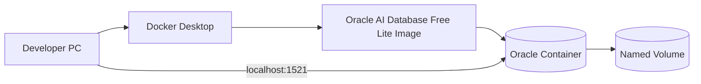
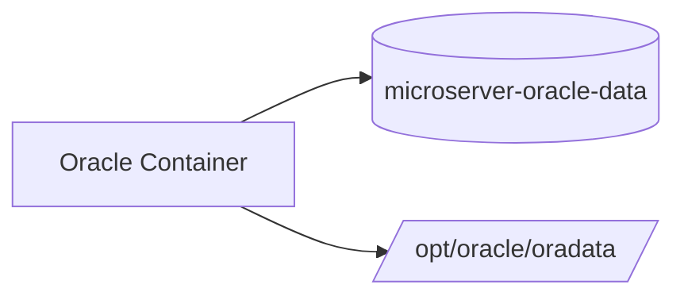
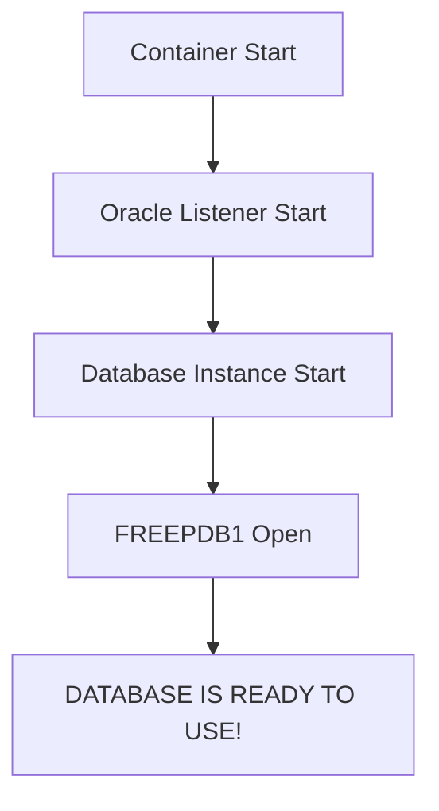
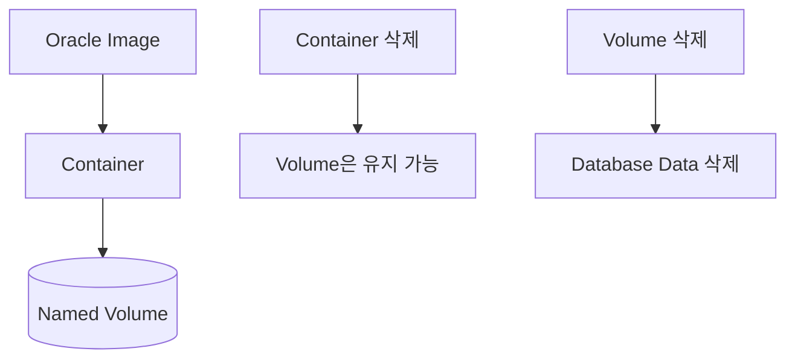
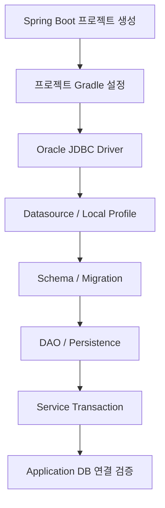
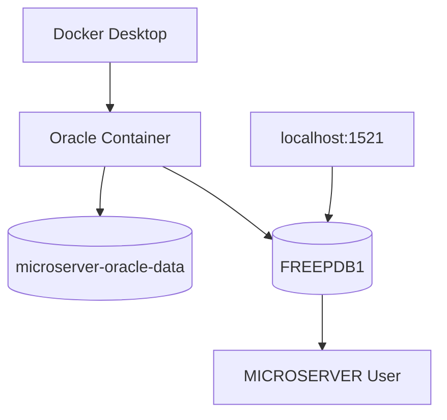

# Oracle Database Free 로컬 개발환경 구성 가이드

## 1. 문서 목적

본 문서는 MicroServer 프로젝트에서 데이터 영속성 계층을 개발하기 전에
Docker Desktop 위에 **Oracle AI Database Free 기반 로컬 Database 환경**을 구성하는 방법을 설명한다.

사전 단계에서 Docker Desktop이 정상적으로 준비되어 있어야 한다.

현재 단계에서는 Application과 Database를 연결하지 않는다.

따라서 다음 내용까지만 진행한다.

- Oracle 공식 Container Image 선정
- Oracle AI Database Free Lite Image Pull
- Image Tag 운영 원칙 이해
- Oracle SYSTEM Password 준비
- Named Volume 생성
- Windows / macOS Oracle Container 실행
- Database Ready 상태 확인
- `FREEPDB1` 접속 확인
- 프로젝트 로컬 사용자 생성
- Host Port 확인
- Container Stop / Start / 삭제
- Database Data 초기화
- Oracle Container 기본 문제 해결

다음 내용은 Spring Boot 프로젝트 생성 이후 별도 가이드에서 진행한다.

- Oracle JDBC Driver
- `build.gradle`
- Datasource
- `application-local.yml`
- Docker Compose 프로젝트 파일
- `.env`
- Schema / Seed SQL
- Flyway / Liquibase
- DAO / Persistence
- Service Transaction
- 실제 Application DB 연결 Test

---

## 2. 사전 준비

다음 명령이 정상이어야 한다.

```bash
docker --version
docker info
docker compose version
```

Docker Engine에 정상 연결되지 않는 상태에서는 Oracle Image Pull과 Container 실행을 진행하지 않는다.

Docker 자체 설치 방법은 다음 문서를 참고한다.

```text
Docker Desktop 설치 및 기본 환경 구성 가이드
```

---

## 3. 전체 구성 구조



현재 Oracle 환경의 목표:

```text
Host            localhost
Port            1521
Service Name    FREEPDB1
Container       microserver-oracle
Volume          microserver-oracle-data
```

---

## 4. Oracle Container Image 선정

MicroServer 로컬 Database는 Oracle이 직접 제공하는
**Oracle Container Registry 공식 Image**를 사용한다.

기본 Image:

```text
container-registry.oracle.com/database/free:latest-lite
```

Oracle 공식 로컬 실행 문서에서도 Oracle AI Database Free Lite를
Docker 또는 Podman으로 실행하는 예제에 이 Image를 사용한다.

현재 MicroServer의 로컬 개발 목적은 다음과 같다.

- 일반 SQL
- DDL / DML
- PL/SQL
- Transaction
- JDBC
- DAO / Persistence
- 일반적인 금융 SI CRUD

현재 범위에서는 Lite Image를 기본으로 사용한다.

!!! note "Lite Image"
    향후 Oracle의 특수 기능 또는 추가 구성요소가 필요한 요구사항이 생기면
    그 시점에 Full / 다른 Tag 또는 별도 Database 환경을 검토한다.

---

## 5. Apple Silicon Mac 사용 시

!!! tip "Apple Silicon Mac 사용자"

    Apple Silicon Mac에서는 Oracle Database Free의 ARM64 지원 여부와
    실제로 **ARM64 Native Image가 선택되었는지 확인하는 것을 권장한다.**

    과거 Apple Silicon 초기 환경에서는 Oracle Database Container Image의
    Architecture 문제로 Image를 내려받더라도 Database가 정상적으로 실행되지 않는 사례가 있었다.

    현재 Oracle AI Database Free는 ARM64 Platform을 공식 지원하므로,
    Oracle Container를 구성하기 전에 다음 가이드를 참고하여
    Host와 Oracle Image의 Architecture를 확인한다.

    **→ [Apple Silicon Oracle Docker 지원 및 검증 가이드](oracle_docker_apple_silicon_support.md)**

    해당 가이드에서는 다음 내용을 확인한다.

    - Apple Silicon Mac의 `arm64` Architecture 확인
    - Oracle Registry의 ARM64 Image 지원 여부 확인
    - Pull된 Oracle Image의 `linux/arm64` Architecture 확인
    - `--platform linux/amd64` 강제 옵션을 사용하지 않는 이유
    - `DOCKER_DEFAULT_PLATFORM` 설정 확인
    - `DATABASE IS READY TO USE!`까지 실제 Oracle 기동 검증
    - `FREEPDB1` 접속을 통한 최종 동작 확인

위 검증이 완료되면 본 문서의 공통 Oracle Database Free 구성 절차를 계속 진행한다.

본 문서에서는 Windows와 macOS에서 공통으로 적용할 수 있는
Oracle Database Free의 Image Pull, Volume, Container 실행,
`FREEPDB1` 및 프로젝트 사용자 구성 절차에 집중한다.

---

## 6. Oracle Image Pull

Oracle 공식 Container Registry에서 Image를 Pull한다.

```bash
docker pull container-registry.oracle.com/database/free:latest-lite
```

Image 확인:

```bash
docker image ls
```

확인 Repository:

```text
container-registry.oracle.com/database/free
```

Oracle Container Registry의 정책에 따라
사용 시점에 인증이나 약관 확인이 요구될 수 있다.

---

## 7. `latest-lite` Tag 운영 원칙

현재 개발환경 준비 단계에서는:

```text
latest-lite
```

를 사용한다.

이 Tag는 고정 Version이 아니라 최신 Lite Image를 가리키므로
시간이 지나면 실제 Image Digest와 Database Release가 달라질 수 있다.

개발환경 탐색 단계:

```text
latest-lite
→ 편리하게 최신 지원 Image 확인
```

프로젝트 본격화 이후:

```text
Version / Digest 확인
→ 팀 표준 Image 고정 검토
```

재현 가능한 개발환경이 중요해지는 시점에는
다음 정보를 기록하는 것이 좋다.

```bash
docker image inspect \
  container-registry.oracle.com/database/free:latest-lite
```

Digest 확인 예:

```bash
docker image inspect \
  container-registry.oracle.com/database/free:latest-lite \
  --format '{{json .RepoDigests}}'
```

---

## 8. Oracle Password 준비

Oracle Container 초기 생성 시
SYS / SYSTEM 계정에 사용할 Password를 환경변수로 전달한다.

실제 Password를 문서나 Git Repository에 작성하지 않는다.

### Windows PowerShell

```powershell
$env:ORACLE_PWD='<strong-local-password>'
```

### macOS

```bash
export ORACLE_PWD='<strong-local-password>'
```

현재 Terminal Session에서만 사용한다.

---

## 9. Named Volume 생성

Database Data를 Container Life Cycle과 분리하기 위해
Named Volume을 생성한다.

```bash
docker volume create microserver-oracle-data
```

확인:

```bash
docker volume ls
```

Volume:

```text
microserver-oracle-data
```

Oracle Database Data Mount Path:

```text
/opt/oracle/oradata
```

구조:



---

## 10. macOS / Linux Terminal에서 Container 실행

```bash
docker run -d \
  --name microserver-oracle \
  -p 1521:1521 \
  -e ORACLE_PWD="$ORACLE_PWD" \
  -v microserver-oracle-data:/opt/oracle/oradata \
  container-registry.oracle.com/database/free:latest-lite
```

주요 옵션:

| 옵션 | 의미 |
|---|---|
| `-d` | Background 실행 |
| `--name` | Container 이름 |
| `-p 1521:1521` | Host와 Oracle Listener Port 연결 |
| `-e ORACLE_PWD=...` | 초기 Database Password 전달 |
| `-v ...:/opt/oracle/oradata` | Database Data 영속화 |

Apple Silicon에서는 기본 구성에서 다음을 추가하지 않는다.

```text
--platform linux/amd64
```

Architecture 관련 내용은 별도 Apple Silicon 가이드를 따른다.

---

## 11. Windows PowerShell에서 Container 실행

```powershell
docker run -d `
  --name microserver-oracle `
  -p 1521:1521 `
  -e ORACLE_PWD=$env:ORACLE_PWD `
  -v microserver-oracle-data:/opt/oracle/oradata `
  container-registry.oracle.com/database/free:latest-lite
```

한 줄 실행:

```powershell
docker run -d --name microserver-oracle -p 1521:1521 -e ORACLE_PWD=$env:ORACLE_PWD -v microserver-oracle-data:/opt/oracle/oradata container-registry.oracle.com/database/free:latest-lite
```

PowerShell의 여러 줄 명령에서는 Backtick(`) 뒤에 불필요한 공백이 들어가지 않도록 주의한다.

---

## 12. Container 생성 상태 확인

실행 중 Container:

```bash
docker ps
```

전체 Container:

```bash
docker ps -a
```

확인 이름:

```text
microserver-oracle
```

Container가 바로 종료되었다면 다음 단계로 넘어가지 않고 로그를 확인한다.

```bash
docker logs microserver-oracle
```

---

## 13. Database 초기화 로그 확인

Oracle Database는 Container Process가 올라왔다고 즉시 접속 가능한 것이 아니다.

로그:

```bash
docker logs -f microserver-oracle
```

Oracle Database가 준비되면 다음 메시지를 확인한다.

```text
DATABASE IS READY TO USE!
```

로그 Follow 종료:

```text
Ctrl + C
```

정상 흐름:



---

## 14. 기본 접속 정보

```text
Host         : localhost
Port         : 1521
Service Name : FREEPDB1
Admin User   : SYSTEM
Password     : ORACLE_PWD로 지정한 값
```

Oracle AI Database Free에서 기본 생성되는 첫 PDB Service는:

```text
FREEPDB1
```

이다.

향후 Spring Boot Datasource에서도 이 Service Name을 사용한다.

현재는 Datasource 파일을 생성하지 않는다.

---

## 15. SQL*Plus로 FREEPDB1 접속

Oracle Container 내부의 SQL*Plus를 이용해 Database 접속을 확인한다.

### macOS

```bash
docker exec -it microserver-oracle \
  sqlplus system/"$ORACLE_PWD"@FREEPDB1
```

### Windows PowerShell

```powershell
docker exec -it microserver-oracle sqlplus "system/$($env:ORACLE_PWD)@FREEPDB1"
```

정상 접속:

```text
SQL>
```

---

## 16. 현재 PDB 확인

SQL*Plus:

```sql
SELECT sys_context('USERENV', 'CON_NAME') AS container_name
FROM dual;
```

정상 결과:

```text
FREEPDB1
```

이 확인은 프로젝트 Local User를 잘못된 CDB Root에 생성하는 실수를 방지하는 데 중요하다.

---

## 17. 프로젝트 로컬 사용자 운영 원칙

Application이 SYSTEM 계정으로 Table을 생성하고 SQL을 실행하는 방식은 사용하지 않는다.

구조:

```text
SYSTEM
→ Database 관리 및 Local Schema 준비

MICROSERVER
→ 향후 Application 개발용 Schema
```

현재 단계에서는 로컬 개발 DB에 사용할 별도 Schema User를 준비한다.

---

## 18. MICROSERVER 사용자 생성

반드시 `FREEPDB1`에 접속한 상태인지 먼저 확인한다.

```sql
SELECT sys_context('USERENV', 'CON_NAME')
FROM dual;
```

결과:

```text
FREEPDB1
```

사용자 생성:

```sql
CREATE USER MICROSERVER
IDENTIFIED BY "<local-password>";
```

기본 개발 권한:

```sql
GRANT CREATE SESSION TO MICROSERVER;
GRANT CREATE TABLE TO MICROSERVER;
GRANT CREATE SEQUENCE TO MICROSERVER;
GRANT CREATE VIEW TO MICROSERVER;
GRANT CREATE PROCEDURE TO MICROSERVER;
```

개발용 `USERS` Tablespace 사용 기준:

```sql
ALTER USER MICROSERVER
QUOTA UNLIMITED ON USERS;
```

!!! warning
    로컬 학습 / 개발 환경이라는 이유로 `DBA` Role을 습관적으로 부여하지 않는다.

---

## 19. MICROSERVER 사용자 확인

SYSTEM Session:

```sql
SELECT username,
       account_status,
       default_tablespace,
       temporary_tablespace
FROM dba_users
WHERE username = 'MICROSERVER';
```

권한 확인:

```sql
SELECT privilege
FROM dba_sys_privs
WHERE grantee = 'MICROSERVER'
ORDER BY privilege;
```

현재 단계에서는 업무 Table이나 Sequence를 만들지 않는다.

---

## 20. SYSTEM Session 종료

```sql
exit
```

Container Shell 자체에 들어간 것이 아니라
`docker exec ... sqlplus` 방식으로 실행했다면 SQL*Plus 종료 후 Host Terminal로 돌아온다.

---

## 21. Host Port 확인

### Windows

```powershell
Test-NetConnection localhost -Port 1521
```

정상 항목 예:

```text
TcpTestSucceeded : True
```

### macOS

```bash
nc -vz localhost 1521
```

Port Open만으로 Database Ready를 완전히 판단하지 않는다.

다음 세 가지를 함께 본다.

```text
docker ps
DATABASE IS READY TO USE!
FREEPDB1 SQL 접속
```

---

## 22. Container Stop / Start

중지:

```bash
docker stop microserver-oracle
```

다시 시작:

```bash
docker start microserver-oracle
```

로그:

```bash
docker logs -f microserver-oracle
```

Named Volume을 유지하므로 Stop / Start에서 Database Data는 유지된다.

---

## 23. Container와 Volume의 관계

Database 운영에서 가장 중요한 차이 중 하나이다.



즉:

```text
Container 삭제
    ≠
Database Data 삭제

Named Volume 삭제
    =
Database Data 삭제
```

---

## 24. Container만 삭제

```bash
docker rm -f microserver-oracle
```

Volume 확인:

```bash
docker volume ls
```

다음 Volume이 남아 있다면 Data는 별도 보관된다.

```text
microserver-oracle-data
```

---

## 25. Database 완전 초기화

!!! danger "Database Data 전체 삭제"
    아래 명령은 현재 로컬 Oracle Data를 삭제한다.

Container 제거:

```bash
docker rm -f microserver-oracle
```

Volume 제거:

```bash
docker volume rm microserver-oracle-data
```

다시 새 환경을 만들려면:

```bash
docker volume create microserver-oracle-data
```

이후 Container를 다시 생성한다.

---

## 26. Password 변경과 기존 Volume

다음 상황을 주의한다.

```text
기존 Database Volume 존재
        +
새 ORACLE_PWD 값
        ↓
기존 DB Password가 자동으로 새 값으로 변경되는 것은 아님
```

`ORACLE_PWD`는 Container의 초기 Database 구성과 관련된 값이다.

기존 Data Volume을 재사용하면서 환경변수만 변경한 경우
실제 Database Password와 현재 Shell 변수 값이 달라질 수 있다.

---

## 27. Docker Compose는 현재 만들지 않는다

Docker Desktop에서는:

```bash
docker compose version
```

으로 Compose 기능을 확인할 수 있다.

하지만 현재는 Spring Boot Project가 아직 없다.

따라서 다음 파일은 생성하지 않는다.

```text
compose.yml
docker-compose.local.yml
.env
```

프로젝트 Directory와 Local Infrastructure 운영 위치를 결정한 후
프로젝트 생성 이후 별도 가이드에서 작성한다.

---

## 28. 현재 만들지 않는 Database Object

현재 Oracle 환경 준비의 완료 기준은:

```text
Oracle Container
FREEPDB1
MICROSERVER User
```

까지이다.

다음은 이후 Database / Persistence 구현 단계에서 진행한다.

```text
Table
Sequence
Index
View
Procedure
Seed Data
Migration History
```

환경 확인을 위해 임의의 `TB_SAMPLE`을 지금 만들지 않는다.

실제 Project Schema와 Migration 정책이 만들어진 이후 SQL을 관리한다.

---

## 29. 프로젝트 생성 이후 Oracle 연계 흐름



이후 문서에서 다룰 내용:

```text
ojdbc
build.gradle
application-local.yml
DB_USERNAME / DB_PASSWORD
Docker Compose
.env
Schema SQL
Flyway / Liquibase
DAO
Transaction
```

---

## 30. 자주 발생하는 문제

### 30.1 Container가 생성되지 않음

```bash
docker ps -a
```

Image 확인:

```bash
docker image ls
```

Docker Engine:

```bash
docker info
```

---

### 30.2 Container가 바로 종료됨

```bash
docker logs microserver-oracle
```

확인 항목:

- Host Memory
- Disk 여유 공간
- Image 상태
- Password
- Volume 상태
- Port 충돌

---

### 30.3 1521 Port 충돌

Windows:

```powershell
netstat -ano | findstr :1521
```

macOS:

```bash
lsof -i :1521
```

필요하면 Host Port만 변경할 수 있다.

예:

```bash
-p 1522:1521
```

구조:

```text
localhost:1522
        ↓
Container:1521
```

향후 JDBC URL도 Host Port 1522를 사용해야 한다.

---

### 30.4 `ORA-12514`

다음을 확인한다.

```text
Service Name : FREEPDB1
```

그리고 Database가 Ready인지 확인한다.

```bash
docker logs -f microserver-oracle
```

---

### 30.5 사용자 생성 시 Common User 오류

현재 Session이 `CDB$ROOT`일 가능성이 있다.

확인:

```sql
SELECT sys_context('USERENV', 'CON_NAME')
FROM dual;
```

프로젝트 Local User는:

```text
FREEPDB1
```

에 연결한 상태에서 생성한다.

---

### 30.6 SYSTEM Password가 맞지 않음

기존 Named Volume과 새 `ORACLE_PWD`의 관계를 확인한다.

기존 DB를 유지할 것인지 완전히 초기화할 것인지 먼저 결정한다.

---

## 31. Docker Desktop UI에서 확인

```text
Docker Desktop
→ Containers
→ microserver-oracle
```

확인할 수 있는 내용:

- Running / Stopped 상태
- Logs
- Port Mapping
- Container 상세정보
- Resource 사용 상태

CLI 명령을 기본 기준으로 하고 UI는 보조 확인 도구로 사용한다.

---

## 32. 보안 주의사항

Git에 포함하지 않는다.

```text
SYSTEM Password
MICROSERVER Password
Production DB URL
Production DB User
Production DB Password
```

현재 Password는 Terminal Session Environment Variable 또는 수동 SQL 입력을 이용한다.

Production Credential을 로컬 개발 DB에 재사용하지 않는다.

---

## 33. 완료 상태



완료 기준:

```text
Oracle Image       → Pull 완료
Container          → 실행 가능
Named Volume       → 구성 완료
Database           → READY
FREEPDB1            → 접속 가능
MICROSERVER User   → 생성 / 확인
```

Spring Boot는 아직 생성 전이다.

---

## 34. 최종 검증

Container:

```bash
docker ps
```

Log:

```bash
docker logs microserver-oracle
```

Ready:

```text
DATABASE IS READY TO USE!
```

Port:

```text
localhost:1521
```

Service:

```text
FREEPDB1
```

SQL:

```sql
SELECT sys_context('USERENV', 'CON_NAME')
FROM dual;
```

결과:

```text
FREEPDB1
```

---

## 35. 체크리스트

### Image / Container

- [ ] Oracle 공식 Container Registry Image를 사용한다.
- [ ] `latest-lite` Image를 Pull했다.
- [ ] Named Volume을 생성했다.
- [ ] `microserver-oracle` Container를 생성했다.
- [ ] 1521 Port Mapping을 확인했다.

### Database

- [ ] `DATABASE IS READY TO USE!`를 확인했다.
- [ ] `FREEPDB1`에 접속할 수 있다.
- [ ] 현재 `CON_NAME`이 `FREEPDB1`이다.
- [ ] `MICROSERVER` Local User를 준비했다.
- [ ] Application에서 SYSTEM을 사용하지 않는 원칙을 적용한다.

### 단계 확인

- [ ] 아직 Spring Boot 프로젝트를 생성하지 않았다.
- [ ] 아직 `build.gradle`에 Oracle Driver를 추가하지 않았다.
- [ ] 아직 Datasource를 설정하지 않았다.
- [ ] 아직 Compose 프로젝트 파일을 만들지 않았다.
- [ ] 아직 업무 Schema Object를 생성하지 않았다.

---

## 36. 다음 단계

Oracle Database Free 로컬 환경이 준비되면 Spring Boot 프로젝트 생성으로 진행한다.

```text
Docker Desktop
        ↓
Oracle Database Free              ← 현재 완료
        ↓
Spring Boot 프로젝트 생성
        ↓
프로젝트 JDK / Gradle / VS Code 설정
        ↓
Oracle JDBC / Datasource
        ↓
Persistence / Transaction
```

Apple Silicon에서 Oracle Image Architecture를 별도로 검증하려면
다음 보조 문서를 참고한다.

```text
Apple Silicon Oracle Docker 지원 및 검증 가이드
```

---

## 37. 공식 참고 자료

- Oracle AI Database - Run Oracle AI Database Locally  
  <https://docs.oracle.com/en/database/oracle/agent-memory/26.6/guide/run-locally.html>

- Oracle AI Database Free - Get Started  
  <https://www.oracle.com/database/free/get-started/>

- Connecting to Oracle AI Database Free  
  <https://docs.oracle.com/en/database/oracle/oracle-database/26/xeinl/connecting-oracle-database-free.html>

- Oracle Container Registry  
  <https://container-registry.oracle.com/>
