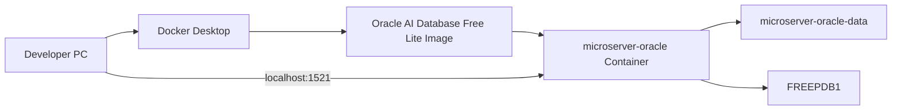
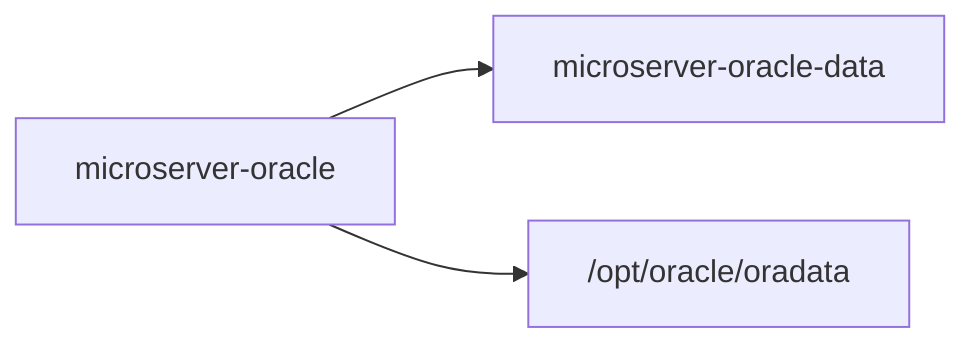
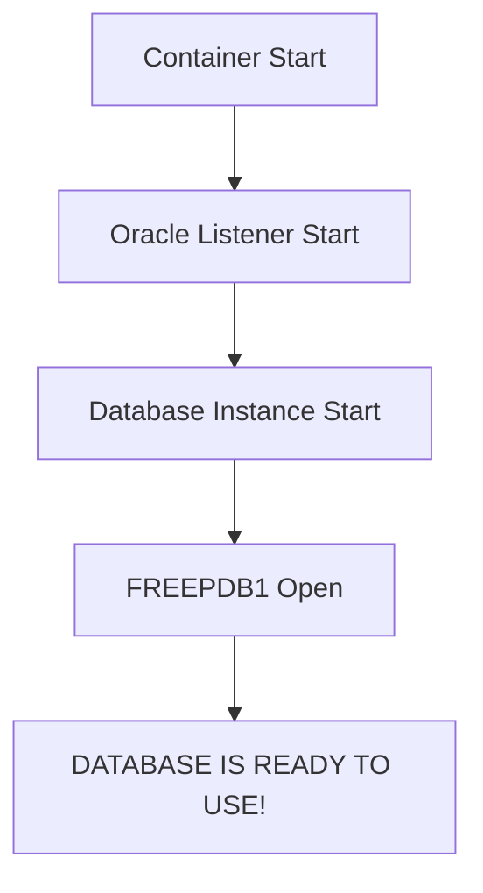
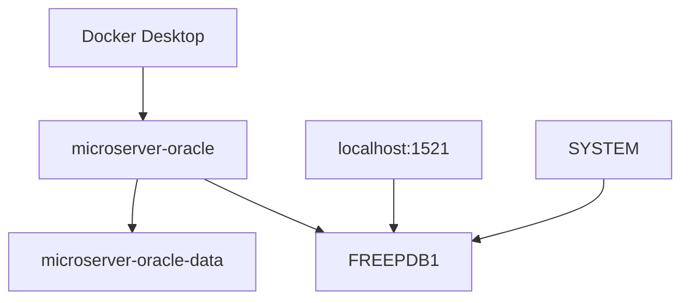

# Oracle Database Free 설치 및 접속 가이드

## 1. 문서 목적

본 문서는 MicroServer 프로젝트의 로컬 Database 환경으로 사용할 **Oracle AI Database Free**를
Docker Desktop 위에 구성하고, Oracle 관리자 계정인 `SYSTEM`으로 `FREEPDB1`에 정상 접속되는 상태까지 검증하는 절차를 설명한다.

현재 문서는 다음 범위를 담당한다.

- Docker Desktop 사전 상태 확인
- Oracle 공식 Container Image 선정 및 Pull
- Oracle SYSTEM Password 준비
- Named Volume 생성
- Oracle Container 생성
- Database Ready 상태 확인
- Host Port 확인
- `SYSTEM` 계정으로 `FREEPDB1` 접속
- 현재 PDB 확인
- Container Stop / Start / 삭제 및 Data 보존 원칙
- Oracle Container 구성 단계의 기본 문제 해결

다음 내용은 별도 문서에서 진행한다.

- 프로젝트 전용 Tablespace 생성
- `MICROSERVER` User / Schema 생성
- Tablespace Quota 설정
- Application용 System Privilege 부여
- `MICROSERVER` 계정 접속 검증

→ [Oracle Tablespace 및 프로젝트 사용자 구성](oracle_database_schema_setup.md)

!!! info "Docker Desktop 설치는 선행 단계"
    본 문서는 Docker Desktop 자체의 설치 가이드가 아니다.

    먼저 다음 문서를 완료한다.

    - [Docker Desktop 개요 및 공통 환경](docker_desktop_setup.md)
    - [Windows Docker Desktop 설치](docker_desktop_windows_setup.md)
    - [macOS Docker Desktop 설치](docker_desktop_macos_setup.md)

---

## 2. 전체 구성 구조

MicroServer 로컬 Oracle 환경의 기본 구조는 다음과 같다.



현재 기본 구성값:

| 항목 | 값 |
|---|---|
| Host | `localhost` |
| Host Port | `1521` |
| Container Port | `1521` |
| Service Name | `FREEPDB1` |
| Admin User | `SYSTEM` |
| Container Name | `microserver-oracle` |
| Volume Name | `microserver-oracle-data` |
| Oracle Data Path | `/opt/oracle/oradata` |
| Image | `container-registry.oracle.com/database/free:latest-lite` |

전체 진행 흐름:

```text
Docker Desktop 정상 확인
        ↓
Oracle Image Pull
        ↓
ORACLE_PWD 준비
        ↓
Named Volume 생성
        ↓
Oracle Container 생성
        ↓
DATABASE IS READY TO USE! 확인
        ↓
localhost:1521 확인
        ↓
SYSTEM → FREEPDB1 접속
        ↓
현재 PDB가 FREEPDB1인지 확인
        ↓
Oracle 기본 설치 / 접속 검증 완료
```

---

## 3. Docker 사전 상태 확인

새 Terminal 또는 PowerShell에서 다음 명령을 확인한다.

```powershell
docker --version
docker version
docker info
docker compose version
```

정상 상태에서는 최소한 다음 조건을 만족해야 한다.

```text
Docker CLI      → 실행 가능
Docker Engine   → Server 연결 가능
Docker Compose  → Version 확인 가능
```

특히 `docker version`에서는 **Client와 Server가 모두 조회**되어야 한다.

!!! warning "Docker Engine 연결 오류가 있으면 Oracle 구성을 진행하지 않음"
    `docker version` 또는 `docker info`에서 Docker Engine에 연결되지 않는다면
    Oracle Image Pull이나 Container 생성을 먼저 진행하지 않는다.

    운영체제별 Docker Desktop 가이드에서 Engine 상태를 먼저 확인한다.

---

## 4. Oracle Container Image 선정

MicroServer 로컬 Database는 Oracle이 직접 제공하는 Oracle Container Registry Image를 사용한다.

기본 Image:

```text
container-registry.oracle.com/database/free:latest-lite
```

현재 로컬 개발환경에서는 다음과 같은 일반적인 개발 작업을 목표로 한다.

- DDL / DML
- Transaction
- PL/SQL
- JDBC
- DAO / Persistence
- 일반적인 CRUD
- Spring Boot 연계

따라서 현재 단계에서는 **Lite Image**를 기본으로 사용한다.

!!! note "`latest-lite`는 고정 Version이 아님"
    `latest-lite`는 시간이 지나면 실제 Image Digest와 Database Release가 달라질 수 있다.

    개발환경 탐색 단계에서는 편리하지만,
    프로젝트 표준 환경을 확정할 때는 실제 검증한 Version / Digest를 기록하는 것을 권장한다.

---

## 5. Apple Silicon Mac 사용 시

Apple Silicon Mac에서는 Oracle Container 생성 전에 Architecture 지원 여부를 별도 확인한다.

→ [Apple Silicon Oracle Docker 지원 및 검증](oracle_docker_apple_silicon_support.md)

해당 문서에서 다음을 확인한다.

- Mac Host Architecture
- Oracle Image Architecture
- ARM64 지원 여부
- `--platform linux/amd64` 강제 사용 여부
- `DOCKER_DEFAULT_PLATFORM`
- Oracle Database Ready 상태
- `FREEPDB1` 실제 접속

Architecture 검증이 끝나면 본 문서의 공통 절차를 계속 진행한다.

---

## 6. Oracle Image Pull

Oracle 공식 Container Registry에서 Image를 Pull한다.

```powershell
docker pull container-registry.oracle.com/database/free:latest-lite
```

Image 확인:

```powershell
docker image ls
```

확인할 Repository:

```text
container-registry.oracle.com/database/free
```

Image 상세 확인:

### 6.1 Windows PowerShell

```powershell
docker image inspect container-registry.oracle.com/database/free:latest-lite
```

Digest 확인:

```powershell
docker image inspect container-registry.oracle.com/database/free:latest-lite --format '{{json .RepoDigests}}'
```

### 6.2 macOS Terminal

```bash
docker image inspect \
  container-registry.oracle.com/database/free:latest-lite
```

Digest 확인:

```bash
docker image inspect \
  container-registry.oracle.com/database/free:latest-lite \
  --format '{{json .RepoDigests}}'
```

!!! tip "Shell별 줄바꿈 문법"
    Windows PowerShell은 여러 줄 명령에 Backtick(`)을 사용하고,
    macOS Bash / zsh는 Backslash(`\`)를 사용한다.

---

## 7. Oracle SYSTEM Password 준비

Oracle Container를 최초 생성할 때 `SYS` / `SYSTEM` 계정에 사용할 Password를
`ORACLE_PWD` 환경변수로 전달한다.

실제 Password를 Markdown 문서나 Git Repository에 직접 기록하지 않는다.

### 7.1 Windows PowerShell

MicroServer Windows 환경은 PowerShell 기반 Local 환경 Script를 사용한다.

```text
C:\local-microserver\env
├─ setup.ps1
├─ start-vscode.ps1
├─ local-env.example.ps1
└─ local-env.ps1
```

개발자별 Secret은 다음 파일에 둔다.

```text
C:\local-microserver\env\local-env.ps1
```

예:

```powershell
$env:ORACLE_PWD = '<개발자-개인-로컬-비밀번호>'
```

`MicroServer VS Code.lnk` 또는 `start-vscode.ps1`을 통해 VS Code를 실행하면
`local-env.ps1`의 값을 포함한 Process 환경이 VS Code와 Integrated Terminal에 전달된다.

설정 여부만 확인:

```powershell
if ($env:ORACLE_PWD) { "ORACLE_PWD is set" } else { "ORACLE_PWD is not set" }
```

정상:

```text
ORACLE_PWD is set
```

!!! danger "Password 값을 직접 출력하지 않음"
    `$env:ORACLE_PWD` 값을 그대로 화면에 출력하지 않는다.

!!! note "`local-env.ps1`은 개발환경 Package에서 제외"
    `local-env.ps1`은 프로젝트 Git Repository 밖에 있으므로 프로젝트 `.gitignore` 대상은 아니다.

    대신 실제 Secret이 들어간 `local-env.ps1`은
    `C:\local-microserver` 개발환경 ZIP / 배포 Package에서 제외한다.

### 7.2 macOS Terminal

현재 macOS에서는 Windows와 동일한 Local Secret Script 구조를 별도 표준화하지 않는다.

필요한 Terminal Session에서:

```bash
export ORACLE_PWD='<strong-local-password>'
```

설정 여부:

```bash
if [ -n "$ORACLE_PWD" ]; then echo "ORACLE_PWD is set"; else echo "ORACLE_PWD is not set"; fi
```

---

## 8. Named Volume 생성

Database Data를 Container Life Cycle과 분리하기 위해 Named Volume을 생성한다.

```powershell
docker volume create microserver-oracle-data
```

확인:

```powershell
docker volume ls
```

Volume:

```text
microserver-oracle-data
```

Oracle Data Mount Path:

```text
/opt/oracle/oradata
```

구조:



핵심은 다음과 같다.

```text
Container
→ Oracle 실행 Process

Named Volume
→ Oracle Database 실제 Data 보관
```

---

## 9. Oracle Container 생성

공통 설정:

```text
Container Name : microserver-oracle
Host Port      : 1521
Container Port : 1521
Volume         : microserver-oracle-data
Data Path      : /opt/oracle/oradata
Image          : container-registry.oracle.com/database/free:latest-lite
```

### 9.1 Windows PowerShell

여러 줄:

```powershell
docker run -d `
  --name microserver-oracle `
  -p 1521:1521 `
  -e ORACLE_PWD=$env:ORACLE_PWD `
  -v microserver-oracle-data:/opt/oracle/oradata `
  container-registry.oracle.com/database/free:latest-lite
```

한 줄:

```powershell
docker run -d --name microserver-oracle -p 1521:1521 -e ORACLE_PWD=$env:ORACLE_PWD -v microserver-oracle-data:/opt/oracle/oradata container-registry.oracle.com/database/free:latest-lite
```

### 9.2 macOS Terminal

```bash
docker run -d \
  --name microserver-oracle \
  -p 1521:1521 \
  -e ORACLE_PWD="$ORACLE_PWD" \
  -v microserver-oracle-data:/opt/oracle/oradata \
  container-registry.oracle.com/database/free:latest-lite
```

### 9.3 주요 옵션

| 옵션 | 의미 |
|---|---|
| `-d` | Background 실행 |
| `--name microserver-oracle` | Container 이름 |
| `-p 1521:1521` | Host와 Oracle Listener Port 연결 |
| `-e ORACLE_PWD=...` | 초기 Database Password 전달 |
| `-v ...:/opt/oracle/oradata` | Database Data 영속화 |

---

## 10. Container 생성 상태 확인

실행 중 Container:

```powershell
docker ps
```

전체 Container:

```powershell
docker ps -a
```

확인할 이름:

```text
microserver-oracle
```

Container가 바로 종료되었다면 로그를 확인한다.

```powershell
docker logs microserver-oracle
```

---

## 11. Database Ready 상태 확인

Oracle Database는 Container가 `Up` 상태라고 해서 즉시 접속 가능한 것은 아니다.

로그 Follow:

```powershell
docker logs -f microserver-oracle
```

Database 준비가 완료되면 다음 메시지를 확인한다.

```text
DATABASE IS READY TO USE!
```

로그 Follow 종료:

```text
Ctrl + C
```



!!! important "Container Running과 Database Ready는 다름"
    `docker ps`에서 Container가 `Up`이어도 Oracle 초기화가 끝나지 않았을 수 있다.

    SQL 접속은 `DATABASE IS READY TO USE!` 확인 후 진행한다.

---

## 12. 기본 접속 정보

```text
Host         : localhost
Port         : 1521
Service Name : FREEPDB1
Admin User   : SYSTEM
Password     : ORACLE_PWD로 지정한 값
```

향후 Spring Boot Datasource에서도 기본적으로 `FREEPDB1` Service를 사용한다.

현재 단계에서는 아직 Spring Boot Datasource를 구성하지 않는다.

---

## 13. Host Port 확인

### 13.1 Windows

```powershell
Test-NetConnection localhost -Port 1521
```

정상:

```text
TcpTestSucceeded : True
```

### 13.2 macOS

```bash
nc -vz localhost 1521
```

!!! note "Port가 열렸다는 것만으로 Database Ready를 판단하지 않음"
    다음 세 가지를 함께 확인한다.

    ```text
    docker ps
    DATABASE IS READY TO USE!
    FREEPDB1 SQL 접속
    ```

---

## 14. SQL*Plus로 SYSTEM 접속

Oracle Container 내부의 SQL*Plus를 이용해 `SYSTEM` 계정으로 `FREEPDB1` 접속을 확인한다.

### 14.1 Windows PowerShell

```powershell
docker exec -it microserver-oracle sqlplus "system/$($env:ORACLE_PWD)@FREEPDB1"
```

### 14.2 macOS Terminal

```bash
docker exec -it microserver-oracle sqlplus system/"$ORACLE_PWD"@FREEPDB1
```

정상 접속:

```text
SQL>
```

접속되지 않는다면 다음을 확인한다.

```text
1. microserver-oracle Container가 Running 상태인가?
2. DATABASE IS READY TO USE! 메시지를 확인했는가?
3. Service Name이 FREEPDB1인가?
4. ORACLE_PWD가 Container 최초 생성 시 사용한 Password와 같은가?
```

---

## 15. 현재 PDB 확인

`SYSTEM`으로 접속한 SQL*Plus에서 현재 PDB를 확인한다.

SQL*Plus 복사/붙여넣기 편의를 위해 본 문서의 실행 SQL은 가능한 한 **한 줄 SQL**로 제공한다.

```sql
SELECT sys_context('USERENV','CON_NAME') AS container_name FROM dual;
```

정상 결과:

```text
FREEPDB1
```

이 확인은 이후 프로젝트 User를 잘못된 `CDB$ROOT`에 만드는 실수를 방지하는 데 중요하다.

현재 Session이 `FREEPDB1`이면 Oracle 설치와 기본 관리자 접속 검증은 완료된 것이다.

```text
SYSTEM
   ↓
FREEPDB1 접속 성공
   ↓
Oracle Database Free 기본 구성 완료
```

다음 단계:

→ [Oracle Tablespace 및 프로젝트 사용자 구성](oracle_database_schema_setup.md)

---

## 16. Container 운영과 Database Data

### 16.1 Container 중지

```powershell
docker stop microserver-oracle
```

### 16.2 Container 다시 시작

```powershell
docker start microserver-oracle
```

로그:

```powershell
docker logs -f microserver-oracle
```

Named Volume을 유지하므로 Stop / Start에서는 Database Data가 유지된다.

### 16.3 Container만 삭제

```powershell
docker rm -f microserver-oracle
```

Volume 확인:

```powershell
docker volume ls
```

다음 Volume이 남아 있다면 Database Data는 별도로 보관된다.

```text
microserver-oracle-data
```

### 16.4 Database 완전 초기화

!!! danger "Database Data 전체 삭제"
    다음 절차는 현재 로컬 Oracle Database Data 전체를 삭제한다.

Container 제거:

```powershell
docker rm -f microserver-oracle
```

Volume 제거:

```powershell
docker volume rm microserver-oracle-data
```

새 Volume:

```powershell
docker volume create microserver-oracle-data
```

핵심:

```text
Container 삭제
≠
Database Data 삭제

Named Volume 삭제
=
Database Data 삭제
```

---

## 17. Password 변경과 기존 Volume

다음 상황을 주의한다.

```text
기존 Database Volume 존재
        +
새 ORACLE_PWD 값
        ↓
기존 DB Password가 자동 변경되는 것은 아님
```

`ORACLE_PWD`는 Container 최초 Database 구성과 관련된 값이다.

기존 Volume을 재사용하면서 Shell의 `ORACLE_PWD`만 변경하면
실제 Database Password와 현재 환경변수 값이 달라질 수 있다.

Password 문제가 발생하면 먼저 다음을 결정한다.

```text
기존 Database Data를 유지할 것인가?
또는
Named Volume까지 삭제하고 새 Database로 초기화할 것인가?
```

---

## 18. 자주 발생하는 문제

### 18.1 Oracle Container가 생성되지 않음

```powershell
docker ps -a
docker image ls
docker info
```

Docker Engine 자체가 정상인지 먼저 확인한다.

### 18.2 Container가 바로 종료됨

```powershell
docker logs microserver-oracle
```

확인 항목:

- Host Memory
- Disk 여유 공간
- Oracle Image 상태
- Password 설정
- Named Volume 상태
- 1521 Port 충돌

### 18.3 1521 Port 충돌

Windows:

```powershell
netstat -ano | findstr :1521
```

macOS:

```bash
lsof -i :1521
```

필요하면 Host Port를 변경할 수 있다.

```text
-p 1522:1521
```

이 경우 향후 JDBC URL도 `1522`를 사용해야 한다.

### 18.4 `ORA-12514`

Service Name을 확인한다.

```text
FREEPDB1
```

그리고 Database Ready 상태를 다시 확인한다.

```powershell
docker logs -f microserver-oracle
```

### 18.5 SYSTEM Password가 맞지 않음

기존 Named Volume과 새 `ORACLE_PWD`의 관계를 확인한다.

환경변수만 바꾸었다고 기존 Database의 Password가 자동 변경되지는 않는다.

---

## 19. Docker Desktop UI에서 확인

Docker Desktop UI에서도 Oracle Container 상태를 확인할 수 있다.

```text
Docker Desktop
→ Containers
→ microserver-oracle
```

확인 항목:

- Running / Stopped
- Logs
- Port Mapping
- Container 상세정보
- Resource 사용 상태

CLI를 기본 기준으로 하고 Docker Desktop UI는 보조 확인 수단으로 사용한다.

---

## 20. 보안 주의사항

다음 정보는 Git Repository와 공유용 개발환경 Package에 포함하지 않는다.

```text
SYSTEM Password
MICROSERVER Password
Production DB URL
Production DB User
Production DB Password
API Key / Token
```

Windows에서는 개발자별 Local Secret을 다음 파일에 분리한다.

```text
C:\local-microserver\env\local-env.ps1
```

실제 `local-env.ps1`은 개발환경 배포 Package에서 제외한다.

Production Credential을 Local Database에 재사용하지 않는다.

---

## 21. 완료 기준



완료 기준:

- [ ] Docker Engine이 정상이다.
- [ ] Oracle 공식 Image를 Pull했다.
- [ ] Named Volume `microserver-oracle-data`를 생성했다.
- [ ] `microserver-oracle` Container가 실행 중이다.
- [ ] `DATABASE IS READY TO USE!`를 확인했다.
- [ ] `localhost:1521` 접근이 가능하다.
- [ ] `SYSTEM`으로 `FREEPDB1`에 접속할 수 있다.
- [ ] 현재 `CON_NAME`이 `FREEPDB1`이다.
- [ ] 아직 프로젝트 Tablespace / User는 별도 문서에서 구성한다.
- [ ] 아직 Spring Boot Datasource는 구성하지 않았다.

---

## 22. 다음 단계

Oracle 기본 설치 및 SYSTEM 접속 검증이 완료되면
프로젝트 Application Schema를 준비한다.

```text
Oracle Database Free 설치
        ↓
SYSTEM → FREEPDB1 접속 검증          ← 현재 완료
        ↓
프로젝트 Tablespace 생성
        ↓
MICROSERVER User 생성
        ↓
권한 / Quota 설정
        ↓
MICROSERVER 접속 검증
```

다음 문서:

**[Oracle Tablespace 및 프로젝트 사용자 구성](oracle_database_schema_setup.md)**

---

## 23. 공식 참고 자료

- [Oracle AI Database Free - Get Started](https://www.oracle.com/database/free/get-started/)
- [Oracle Container Registry](https://container-registry.oracle.com/)
- [Docker Desktop 개요 및 공통 환경](docker_desktop_setup.md)
- [Apple Silicon Oracle Docker 지원 및 검증](oracle_docker_apple_silicon_support.md)
