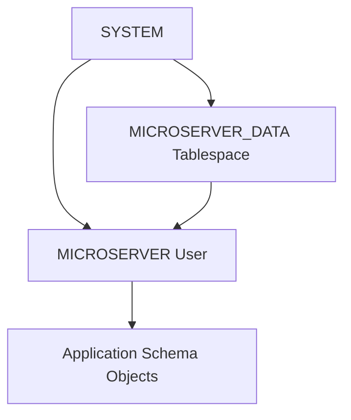

# Oracle Tablespace 및 프로젝트 사용자 구성 가이드

## 1. 문서 목적

본 문서는 Docker 기반 Oracle AI Database Free의 기본 설치와 `SYSTEM` 계정 접속이 완료된 이후,
MicroServer Application에서 사용할 **전용 Tablespace와 프로젝트 Schema User**를 구성하는 절차를 설명한다.

선행 문서:

→ [Oracle Database Free 설치 및 접속](oracle_database_free_setup.md)

현재 문서에서는 다음을 구성한다.

- 현재 PDB가 `FREEPDB1`인지 재확인
- 현재 Tablespace 구성 확인
- Default Permanent Tablespace 확인
- Oracle Datafile 경로 확인
- `MICROSERVER_DATA` Tablespace 생성
- `MICROSERVER` User 생성
- Default / Temporary Tablespace 지정
- Tablespace Quota 설정
- Application 개발에 필요한 기본 System Privilege 부여
- 사용자 상태와 권한 확인
- `MICROSERVER` 계정 실제 접속 검증
- 기존에 User를 먼저 생성한 경우의 보정 절차
- `ORA-00959: tablespace 'USERS' does not exist` 대응

!!! tip "SQL*Plus 실행 SQL은 한 줄 기준"
    SQL*Plus에서 여러 줄 복사/붙여넣기가 불편할 수 있으므로
    실제 실행하는 SQL은 가능한 한 **한 줄 형태**로 제공한다.

---

## 2. SYSTEM과 Application User 역할 분리

Application이 `SYSTEM` 계정으로 업무 Table을 생성하거나 SQL을 실행하는 방식은 사용하지 않는다.

역할:

```text
SYSTEM
→ Database 관리
→ Tablespace 생성
→ 프로젝트 User / Schema 준비

MICROSERVER
→ Application 개발용 Schema
→ Table / Sequence / View / Procedure 등 업무 Object 소유
```



!!! warning "Application User에 DBA Role을 습관적으로 부여하지 않음"
    Local 개발환경이라는 이유만으로 `MICROSERVER` User에 `DBA` Role을 부여하지 않는다.

    필요한 권한만 명시적으로 부여한다.

---

## 3. SYSTEM으로 `FREEPDB1` 접속

Windows PowerShell:

```powershell
docker exec -it microserver-oracle sqlplus "system/$($env:ORACLE_PWD)@FREEPDB1"
```

정상:

```text
SQL>
```

현재 PDB 확인:

```sql
SELECT sys_context('USERENV','CON_NAME') AS container_name FROM dual;
```

정상:

```text
FREEPDB1
```

!!! important "반드시 FREEPDB1에서 작업"
    프로젝트 Local User와 Tablespace 구성은 `FREEPDB1`에 접속한 상태에서 진행한다.

    `CDB$ROOT`에 잘못 생성하지 않도록 먼저 `CON_NAME`을 확인한다.

---

## 4. 현재 Tablespace 구성 확인

먼저 현재 `FREEPDB1`에 어떤 Tablespace가 존재하는지 확인한다.

```sql
SELECT tablespace_name,contents,status FROM dba_tablespaces ORDER BY tablespace_name;
```

현재 MicroServer 검증 환경에서는 다음과 같은 기본 구성이 확인되었다.

```text
SYSAUX     PERMANENT   ONLINE
SYSTEM     PERMANENT   ONLINE
TEMP       TEMPORARY   ONLINE
UNDOTBS1   UNDO        ONLINE
```

즉 현재 검증한 Oracle Free 환경에는 일반적인 Application용 `USERS` Tablespace가 존재하지 않았다.

!!! note "Oracle 환경마다 기본 Tablespace 구성은 다를 수 있음"
    다른 Oracle Version, Image 또는 기존 Database에서는 `USERS` Tablespace가 존재할 수도 있다.

    따라서 `USERS`가 당연히 존재한다고 가정하지 말고 실제 환경을 조회한 뒤 구성한다.

---

## 5. Default Permanent Tablespace 확인

현재 PDB의 Default Permanent Tablespace를 확인한다.

```sql
SELECT property_name,property_value FROM database_properties WHERE property_name='DEFAULT_PERMANENT_TABLESPACE';
```

현재 검증 환경의 결과:

```text
DEFAULT_PERMANENT_TABLESPACE
SYSTEM
```

이 상태에서 다음과 같이 Tablespace를 지정하지 않고 User를 만들면:

```sql
CREATE USER MICROSERVER IDENTIFIED BY "<local-password>";
```

해당 User의 Default Tablespace가 `SYSTEM`으로 지정될 수 있다.

이는 Application Schema 운영 구조로 적절하지 않다.

```text
SYSTEM
→ Oracle System 관리 영역

MICROSERVER_DATA
→ MicroServer Application Data 영역
```

따라서 프로젝트용 Tablespace를 별도로 생성한다.

---

## 6. Oracle Managed Files 설정 확인

Oracle이 Datafile 경로를 자동으로 관리하는지 확인한다.

```sql
SHOW PARAMETER db_create_file_dest;
```

현재 검증 환경에서는 `VALUE`가 비어 있었다.

```text
db_create_file_dest    string
```

즉 현재 환경은 `CREATE TABLESPACE` 시 Datafile 위치를 자동으로 결정하도록
`db_create_file_dest`가 설정되어 있지 않다.

따라서 기존 Datafile의 실제 Directory를 확인하고
동일한 PDB Data Directory 아래에 프로젝트 Datafile을 명시적으로 생성한다.

---

## 7. 기존 Datafile 경로 확인

다음 SQL로 실제 Datafile 경로를 확인한다.

```sql
SELECT tablespace_name,file_name FROM dba_data_files ORDER BY tablespace_name;
```

현재 MicroServer 검증 환경에서는 다음 경로가 확인되었다.

```text
SYSAUX
/opt/oracle/oradata/FREE/FREEPDB1/sysaux01.dbf

SYSTEM
/opt/oracle/oradata/FREE/FREEPDB1/system01.dbf

UNDOTBS1
/opt/oracle/oradata/FREE/FREEPDB1/undotbs01.dbf
```

따라서 PDB Datafile Directory는 다음과 같다.

```text
/opt/oracle/oradata/FREE/FREEPDB1/
```

!!! important "Datafile 경로는 실제 조회 결과를 기준으로 사용"
    다른 Image나 Version에서는 경로가 다를 수 있다.

    가이드의 경로를 무조건 복사하지 말고 먼저 `dba_data_files` 결과를 확인한다.

---

## 8. 프로젝트 Tablespace 생성

MicroServer Application용 Tablespace 이름은 다음을 사용한다.

```text
MICROSERVER_DATA
```

Datafile:

```text
/opt/oracle/oradata/FREE/FREEPDB1/microserver_data01.dbf
```

생성 SQL:

```sql
CREATE TABLESPACE MICROSERVER_DATA DATAFILE '/opt/oracle/oradata/FREE/FREEPDB1/microserver_data01.dbf' SIZE 100M AUTOEXTEND ON NEXT 100M MAXSIZE UNLIMITED;
```

정상:

```text
Tablespace created.
```

### 8.1 설정 의미

| 설정 | 의미 |
|---|---|
| `MICROSERVER_DATA` | 프로젝트 전용 Tablespace |
| `SIZE 100M` | 최초 Datafile 크기 |
| `AUTOEXTEND ON` | 공간 부족 시 자동 확장 |
| `NEXT 100M` | 한 번 확장할 때 증가 단위 |
| `MAXSIZE UNLIMITED` | Oracle이 허용하는 범위에서 자동 확장 |

!!! note "Local 개발환경 기준"
    현재 크기 정책은 Local 개발 편의를 위한 기본값이다.

    운영 DB의 Tablespace Size, Autoextend, Maxsize 정책은
    실제 운영 Database 관리 기준에 따라 별도로 설계한다.

### 8.2 생성 확인

```sql
SELECT tablespace_name,contents,status FROM dba_tablespaces WHERE tablespace_name='MICROSERVER_DATA';
```

정상 예:

```text
MICROSERVER_DATA   PERMANENT   ONLINE
```

Datafile 확인:

```sql
SELECT tablespace_name,file_name,bytes/1024/1024 AS size_mb,autoextensible FROM dba_data_files WHERE tablespace_name='MICROSERVER_DATA';
```

---

## 9. 새 `MICROSERVER` User 생성

새 환경에서는 **Tablespace를 먼저 생성한 뒤 User를 생성**한다.

권장 생성 SQL:

```sql
CREATE USER MICROSERVER IDENTIFIED BY "<local-password>" DEFAULT TABLESPACE MICROSERVER_DATA TEMPORARY TABLESPACE TEMP QUOTA UNLIMITED ON MICROSERVER_DATA;
```

이 SQL은 다음을 한 번에 지정한다.

```text
User                  MICROSERVER
Default Tablespace    MICROSERVER_DATA
Temporary Tablespace  TEMP
Quota                  UNLIMITED on MICROSERVER_DATA
```

!!! danger "실제 Password를 문서나 Git에 기록하지 않음"
    `<local-password>`는 실제 개발자 Local Password로 대체한다.

    Production Credential을 Local DB에 재사용하지 않는다.

---

## 10. 기본 개발 권한 부여

Application 개발에 필요한 기본 System Privilege를 명시적으로 부여한다.

```sql
GRANT CREATE SESSION TO MICROSERVER;
```

```sql
GRANT CREATE TABLE TO MICROSERVER;
```

```sql
GRANT CREATE SEQUENCE TO MICROSERVER;
```

```sql
GRANT CREATE VIEW TO MICROSERVER;
```

```sql
GRANT CREATE PROCEDURE TO MICROSERVER;
```

현재 단계에서는 다음과 같은 광범위 권한을 기본으로 부여하지 않는다.

```text
DBA
RESOURCE
UNLIMITED TABLESPACE
```

`MICROSERVER_DATA`에 대해서만 필요한 Quota를 부여하는 구조를 사용한다.

---

## 11. 기존에 `MICROSERVER` User를 먼저 만든 경우

이미 다음과 같이 User를 생성했다면:

```sql
CREATE USER MICROSERVER IDENTIFIED BY "<local-password>";
```

현재 검증 환경에서는 Default Permanent Tablespace가 `SYSTEM`이므로
`MICROSERVER`의 Default Tablespace도 `SYSTEM`으로 지정되었을 수 있다.

먼저 확인:

```sql
SELECT username,account_status,default_tablespace,temporary_tablespace FROM dba_users WHERE username='MICROSERVER';
```

예:

```text
MICROSERVER   OPEN   SYSTEM   TEMP
```

이 경우 User를 삭제하고 다시 만들 필요는 없다.

`MICROSERVER_DATA` Tablespace를 생성한 뒤 다음과 같이 변경한다.

```sql
ALTER USER MICROSERVER DEFAULT TABLESPACE MICROSERVER_DATA TEMPORARY TABLESPACE TEMP;
```

Quota 설정:

```sql
ALTER USER MICROSERVER QUOTA UNLIMITED ON MICROSERVER_DATA;
```

권한이 아직 없다면 기본 개발 권한을 부여한다.

---

## 12. `ORA-00959: tablespace 'USERS' does not exist`

다음 SQL 실행 시:

```sql
ALTER USER MICROSERVER QUOTA UNLIMITED ON USERS;
```

다음 오류가 발생할 수 있다.

```text
ORA-00959: tablespace 'USERS' does not exist
```

의미:

```text
현재 접속한 PDB에 USERS Tablespace가 존재하지 않음
```

확인:

```sql
SELECT tablespace_name,contents,status FROM dba_tablespaces ORDER BY tablespace_name;
```

현재 MicroServer 검증 환경에서는 `USERS`가 존재하지 않았고,
Default Permanent Tablespace가 `SYSTEM`이었다.

따라서 본 프로젝트에서는 `USERS`를 새로 전제로 사용하지 않고
명시적인 프로젝트 전용 Tablespace를 구성한다.

```text
USERS
→ 사용하지 않음

MICROSERVER_DATA
→ MicroServer Application 전용
```

해결:

```sql
CREATE TABLESPACE MICROSERVER_DATA DATAFILE '/opt/oracle/oradata/FREE/FREEPDB1/microserver_data01.dbf' SIZE 100M AUTOEXTEND ON NEXT 100M MAXSIZE UNLIMITED;
```

기존 User 변경:

```sql
ALTER USER MICROSERVER DEFAULT TABLESPACE MICROSERVER_DATA TEMPORARY TABLESPACE TEMP;
```

Quota:

```sql
ALTER USER MICROSERVER QUOTA UNLIMITED ON MICROSERVER_DATA;
```

---

## 13. User 상태 확인

```sql
SELECT username,account_status,default_tablespace,temporary_tablespace FROM dba_users WHERE username='MICROSERVER';
```

정상 기준:

```text
USERNAME              MICROSERVER
ACCOUNT_STATUS         OPEN
DEFAULT_TABLESPACE     MICROSERVER_DATA
TEMPORARY_TABLESPACE   TEMP
```

---

## 14. System Privilege 확인

```sql
SELECT privilege FROM dba_sys_privs WHERE grantee='MICROSERVER' ORDER BY privilege;
```

예상 권한:

```text
CREATE PROCEDURE
CREATE SEQUENCE
CREATE SESSION
CREATE TABLE
CREATE VIEW
```

---

## 15. Tablespace Quota 확인

Quota를 확인한다.

```sql
SELECT tablespace_name,username,bytes,max_bytes FROM dba_ts_quotas WHERE username='MICROSERVER';
```

`MAX_BYTES = -1` 등으로 표시되면 Unlimited Quota로 관리되는 환경일 수 있다.

핵심 확인 대상:

```text
USERNAME         MICROSERVER
TABLESPACE_NAME  MICROSERVER_DATA
```

---

## 16. MICROSERVER 계정 접속 검증

SYSTEM Session을 종료한다.

```sql
exit
```

Windows PowerShell에서 `MICROSERVER` 계정으로 접속한다.

Password를 직접 Command History에 남기는 방식은 피하는 것이 좋지만,
로컬 환경에서 단순 접속 검증을 수행할 경우 SQL*Plus Prompt 방식으로 접속할 수 있다.

```powershell
docker exec -it microserver-oracle sqlplus MICROSERVER@FREEPDB1
```

SQL*Plus가 Password를 요청하면 개발자 Local Password를 입력한다.

정상:

```text
SQL>
```

현재 User 확인:

```sql
SELECT USER FROM dual;
```

정상:

```text
MICROSERVER
```

현재 PDB 확인:

```sql
SELECT sys_context('USERENV','CON_NAME') AS container_name FROM dual;
```

정상:

```text
FREEPDB1
```

!!! tip "Password를 Command Line에 직접 넣지 않는 이유"
    Command Line에 Password를 직접 작성하면 Terminal History나 Process 정보에 노출될 수 있다.

    가능하면 SQL*Plus Password Prompt를 이용한다.

---

## 17. 현재 단계에서 업무 Object는 만들지 않음

현재 단계의 완료 기준은 다음까지이다.

```text
FREEPDB1
    ↓
MICROSERVER_DATA
    ↓
MICROSERVER
```

다음 Object는 Spring Boot 프로젝트와 Database Schema 설계 이후 생성한다.

```text
Table
Sequence
Index
View
Procedure
Seed Data
Migration History
```

환경 확인을 위해 임의의 업무 Table을 미리 만들지 않는다.

---

## 18. Tablespace와 User 관계 이해

Oracle에서 **User 자체가 Tablespace 안에 저장되는 것은 아니다.**

`CREATE USER`는 Database Dictionary에 사용자 / Schema 정보를 등록한다.

실제 저장공간을 사용하는 것은 이후 User가 생성하는 Segment이다.

```text
MICROSERVER User / Schema
        ↓
CREATE TABLE ...
CREATE INDEX ...
        ↓
Segment 생성
        ↓
MICROSERVER_DATA Tablespace
        ↓
microserver_data01.dbf
```

Default Tablespace는 Object 생성 시 별도 Tablespace를 지정하지 않았을 때
기본적으로 사용할 저장공간을 결정한다.

Temporary Tablespace `TEMP`는 Sort, Join 등 임시 작업에 사용된다.

---

## 19. Docker Named Volume과 Datafile 관계

Oracle Container는 다음 Named Volume을 사용한다.

```text
microserver-oracle-data
```

Mount:

```text
microserver-oracle-data
        ↓
/opt/oracle/oradata
        ↓
FREE
└─ FREEPDB1
   ├─ system01.dbf
   ├─ sysaux01.dbf
   ├─ undotbs01.dbf
   └─ microserver_data01.dbf
```

따라서 `MICROSERVER_DATA`의 Datafile 역시 Named Volume 안에 저장된다.

```text
Container 삭제
→ Volume 유지
→ Datafile 유지 가능

Volume 삭제
→ Oracle Database Data 전체 삭제
```

---

## 20. 사용자 재구성 시 주의사항

### 20.1 User만 삭제

향후 User를 재구성해야 하는 경우 `DROP USER`는 신중하게 사용한다.

```sql
DROP USER MICROSERVER CASCADE;
```

`CASCADE`는 해당 User가 소유한 Schema Object를 함께 삭제한다.

현재 실제 업무 Object가 존재한다면 Data 손실이 발생할 수 있다.

### 20.2 Tablespace 삭제

Tablespace 삭제는 더욱 주의한다.

현재 문서에서는 일반 개발 절차로 `DROP TABLESPACE`를 수행하지 않는다.

Database를 완전히 초기화하려는 목적이라면
개별 Object를 수동으로 정리하기보다 Local Oracle Named Volume 전체 초기화 여부를 먼저 검토한다.

---

## 21. 보안 및 운영 원칙

- `SYSTEM` 계정은 Application에서 사용하지 않는다.
- Application은 `MICROSERVER` 계정을 사용한다.
- 실제 Password를 Markdown / Git에 기록하지 않는다.
- Production DB 계정과 Password를 Local Database에 재사용하지 않는다.
- Local 환경이라고 `DBA` Role을 무조건 부여하지 않는다.
- Tablespace와 Quota를 명시적으로 지정한다.
- 운영환경의 Tablespace Size 정책은 DBA / 운영 기준을 따른다.

---

## 22. 최종 검증

SYSTEM으로 확인:

```sql
SELECT tablespace_name,contents,status FROM dba_tablespaces WHERE tablespace_name='MICROSERVER_DATA';
```

```sql
SELECT username,account_status,default_tablespace,temporary_tablespace FROM dba_users WHERE username='MICROSERVER';
```

```sql
SELECT privilege FROM dba_sys_privs WHERE grantee='MICROSERVER' ORDER BY privilege;
```

MICROSERVER로 확인:

```sql
SELECT USER FROM dual;
```

```sql
SELECT sys_context('USERENV','CON_NAME') AS container_name FROM dual;
```

최종 목표:

```text
FREEPDB1
│
├─ SYSTEM / SYSAUX / UNDO / TEMP
│
└─ MICROSERVER_DATA
      ↓
   MICROSERVER
      ↓
Application Schema Objects
```

---

## 23. 체크리스트

### 23.1 PDB / Tablespace

- [ ] `SYSTEM`으로 `FREEPDB1`에 접속했다.
- [ ] `CON_NAME`이 `FREEPDB1`인지 확인했다.
- [ ] `dba_tablespaces`로 실제 Tablespace 목록을 확인했다.
- [ ] Default Permanent Tablespace를 확인했다.
- [ ] `db_create_file_dest` 설정 여부를 확인했다.
- [ ] `dba_data_files`에서 실제 Datafile Directory를 확인했다.
- [ ] `MICROSERVER_DATA` Tablespace를 생성했다.

### 23.2 User

- [ ] `MICROSERVER` User를 생성했다.
- [ ] Default Tablespace가 `MICROSERVER_DATA`이다.
- [ ] Temporary Tablespace가 `TEMP`이다.
- [ ] `MICROSERVER_DATA` Quota가 설정되어 있다.
- [ ] 필요한 System Privilege만 부여했다.
- [ ] `DBA` Role을 부여하지 않았다.

### 23.3 접속 검증

- [ ] `MICROSERVER@FREEPDB1`으로 접속할 수 있다.
- [ ] `SELECT USER FROM dual;` 결과가 `MICROSERVER`이다.
- [ ] 현재 `CON_NAME`이 `FREEPDB1`이다.
- [ ] 아직 실제 업무 Table / Sequence는 생성하지 않았다.

---

## 24. 다음 단계

Oracle 프로젝트 Schema 준비가 완료되면
Spring Boot 프로젝트의 Database 연계 단계에서 다음 내용을 진행한다.

```text
MICROSERVER_DATA / MICROSERVER 완료
        ↓
Oracle JDBC Driver
        ↓
Spring Boot Datasource
        ↓
Local Profile / Secret 연계
        ↓
Schema / Migration
        ↓
DAO / Persistence
        ↓
Service Transaction
        ↓
Application DB 연결 검증
```

현재 단계에서는 아직 Spring Boot Database Object를 만들지 않는다.

---

## 25. 관련 문서

- [Oracle Database Free 설치 및 접속](oracle_database_free_setup.md)
- [Docker Desktop 개요 및 공통 환경](docker_desktop_setup.md)
- [Windows Docker Desktop 설치](docker_desktop_windows_setup.md)
- [macOS Docker Desktop 설치](docker_desktop_macos_setup.md)
- [Apple Silicon Oracle Docker 지원 및 검증](oracle_docker_apple_silicon_support.md)
