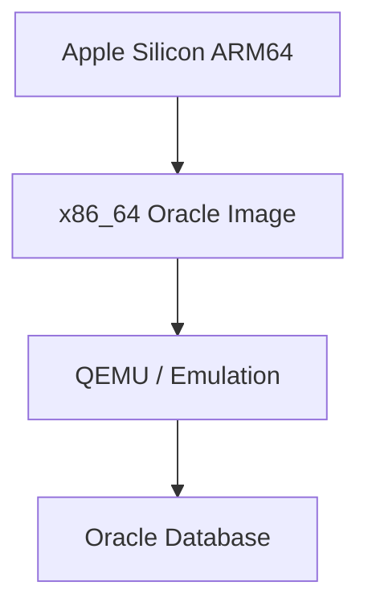
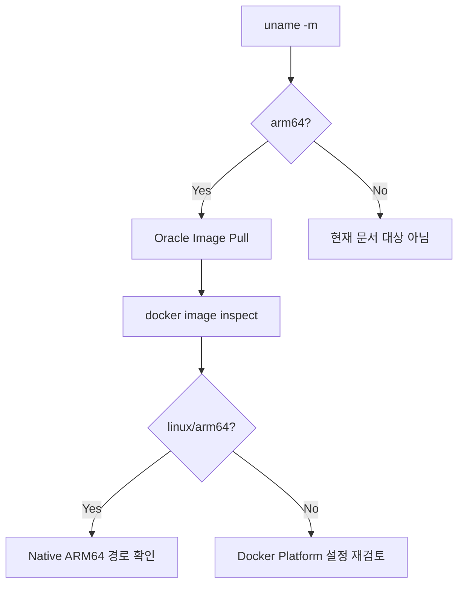
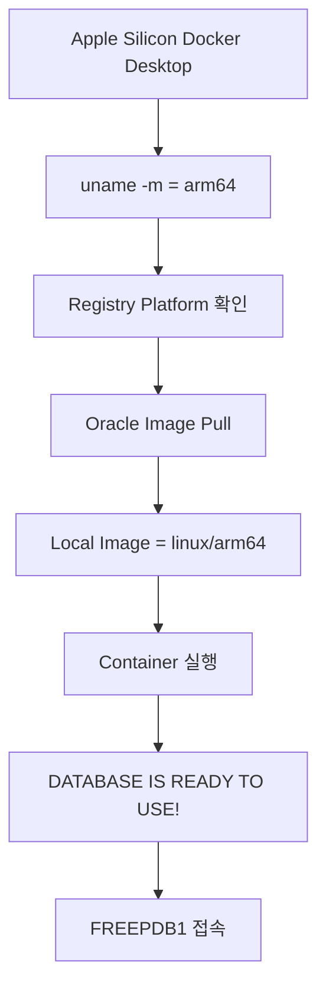

# Apple Silicon Oracle Docker 지원 및 검증 가이드

## 1. 문서 목적

본 문서는 Apple Silicon 기반 Mac에서 Oracle Database Container를 사용할 때
과거에 존재했던 x86_64 / ARM64 Architecture 호환성 문제를 이해하고,
현재 Oracle AI Database Free Image가 **Native ARM64 환경으로 실행되는지 검증하는 방법**을 설명한다.

이 문서는 Oracle Database 설치 절차 전체를 반복하지 않는다.

Oracle Image Pull, Named Volume, Container 실행, `FREEPDB1`, 프로젝트 사용자 생성 등
일반적인 Oracle 구성은 다음 문서를 기준으로 한다.

```text
Oracle Database Free 로컬 개발환경 구성 가이드
```

본 문서는 Apple Silicon 특화 내용만 다룬다.

- 과거 Apple Silicon Oracle Container 이슈
- Oracle의 ARM 기반 Mac 공식 지원 변화
- 현재 ARM64 지원 범위
- Mac Host Architecture 확인
- Registry Image Platform 확인
- Local Image Architecture 확인
- `--platform linux/amd64`를 사용하지 않는 이유
- `DOCKER_DEFAULT_PLATFORM` 점검
- ARM64 관련 오류 및 문제 해결
- Apple Silicon 정상 동작 판정 기준

---

## 2. 왜 이 문서가 필요한가

Apple Silicon Mac 초기에는 Oracle Database Container Image가
주로 x86_64 환경을 기준으로 제공되었다.

그 결과 다음과 같은 구조적 문제가 있었다.



즉 Host와 Image Architecture가 달랐다.

이 시기에는 다음과 같은 우회 방법이 사용되기도 했다.

```text
--platform linux/amd64
QEMU Emulation
Rosetta 기반 실행
x86_64 VM
Colima 기반 우회
```

Image Pull 자체가 성공해도 Database Process 기동 과정에서 문제가 발생할 수 있었다.

따라서 과거 경험이 있는 개발자라면
현재 Image도 실제 ARM64 Native Image인지 확인하는 것이 중요하다.

---

## 3. Oracle의 ARM 기반 Apple Mac 공식 지원 변화

Oracle은 **2024년 11월 12일**
Oracle Database 23ai Free Container Image의 Arm 기반 Apple Mac 지원을 공식 발표했다.

Oracle은 개발자가 Emulation Software에 의존하지 않도록
Oracle Database 23ai Free를 ARM Architecture로 Porting하고
M-series Mac에서 Native로 실행 가능한 Container Image를 제공한다고 설명했다.

Oracle 공식 발표의 실행 예에서도 다음 Image를 사용했다.

```text
container-registry.oracle.com/database/free:latest-lite
```

현재 Oracle Database Container Image 공식 자료에서는
**Oracle AI Database 26ai Free Edition의 ARM64 Platform 지원**을 명시한다.

따라서 MicroServer에서 사용하는 현재 Free 계열은
과거 x86_64-only Oracle Image 상황과 동일하게 취급하면 안 된다.

---

## 4. 현재 MicroServer 기준

Apple Silicon 개발환경 기준:

```text
Host                  Apple Silicon Mac
Host Architecture     arm64
Docker                 Docker Desktop for Apple silicon
Oracle Image           container-registry.oracle.com/database/free:latest-lite
Expected Platform      linux/arm64
AMD64 강제 옵션         사용하지 않음
```

구조:


---

## 5. 지원 범위를 과거 Oracle Version과 혼동하지 않는다

ARM64 지원이 있다고 해서
모든 과거 Oracle Database Version / Edition의 모든 Container Image가
Apple Silicon에서 Native로 동작한다는 뜻은 아니다.

Oracle 공식 Container Image 자료에서는 현재 ARM64 지원 대상에
Oracle AI Database 26ai Free Edition이 포함되어 있음을 안내한다.

따라서 MicroServer의 판단 기준은:

```text
현재 사용하는 Oracle AI Database Free
```

이다.

과거 Oracle 12c / 18c / 21c 등에서 경험한 Container 호환성 문제를
현재 Free ARM64 Image에 그대로 적용해서 판단하지 않는다.

---

## 6. Mac Host Architecture 확인

Terminal:

```bash
uname -m
```

Apple Silicon 정상 결과:

```text
arm64
```

Intel Mac:

```text
x86_64
```

현재 문서는 다음 Host를 대상으로 한다.

```text
arm64
```

---

## 7. Docker Desktop Architecture 확인

Apple Silicon Mac에서는
Apple Silicon용 Docker Desktop을 설치하는 것을 기본으로 한다.

Docker 정보:

```bash
docker info
```

Architecture 관련 내용을 찾고 싶다면:

```bash
docker info | grep -i architecture
```

출력은 Docker Desktop Version에 따라 다를 수 있다.

중요한 기준은 최종적으로 Oracle Local Image가:

```text
linux/arm64
```

인지 확인하는 것이다.

---

## 8. Oracle Registry Platform 정보 확인

Image를 Pull하기 전 또는 별도 검증할 때
Registry에 등록된 Platform Manifest를 확인할 수 있다.

```bash
docker buildx imagetools inspect \
  container-registry.oracle.com/database/free:latest-lite
```

Manifest 정보에서 ARM64 Platform을 확인한다.

확인 대상:

```text
linux/arm64
```

Registry 상태와 Tag 구성은 시점에 따라 변경될 수 있으므로
문서에 특정 Digest를 고정해서 기록하지 않는다.

실제 개발환경 구성 시점에 직접 확인한다.

---

## 9. Oracle Image Pull

일반 Oracle 가이드와 동일하게 Pull한다.

```bash
docker pull container-registry.oracle.com/database/free:latest-lite
```

이 단계에서 별도의 Apple Silicon 전용 Repository 이름을 사용하지 않는다.

Oracle의 공식 ARM 기반 Mac 발표에서도 같은 `latest-lite` Repository / Tag를 사용했다.

---

## 10. Local Image Architecture 확인

Pull된 Image가 실제로 어떤 Architecture인지 확인한다.

```bash
docker image inspect \
  container-registry.oracle.com/database/free:latest-lite \
  --format '{{.Os}}/{{.Architecture}}'
```

Apple Silicon Native Image의 기대값:

```text
linux/arm64
```

이 결과는 매우 중요하다.

```text
Host
arm64

Image
linux/arm64
```

가 함께 확인되어야 한다.

---

## 11. Host / Image Architecture 검증



정상:

```text
Host  : arm64
Image : linux/arm64
```

주의:

```text
Host  : arm64
Image : linux/amd64
```

---

## 12. `--platform linux/amd64`를 사용하지 않는다

과거 Apple Silicon Oracle 관련 검색 결과에는 다음 옵션이 자주 보일 수 있다.

```bash
--platform linux/amd64
```

이 옵션은 x86_64 Platform을 강제로 선택하는 것이다.

현재 Oracle AI Database Free의 ARM64 지원을 사용하는 MicroServer 표준 환경에서는
기본 실행 옵션으로 사용하지 않는다.

잘못된 기본 예:

```bash
docker run --platform linux/amd64 ...
```

현재 기준:

```bash
docker run ...
```

Docker가 Apple Silicon Host에 맞는 ARM64 Variant를 선택하도록 한다.

---

## 13. Rosetta / QEMU를 기본 전제로 하지 않는다

현재 기본 구성에서는 다음을 Oracle 실행 필수 조건으로 두지 않는다.

```text
Rosetta for x86_64 Oracle
QEMU Emulation
x86_64 Docker VM
AMD64 강제 Platform
```

물론 다른 Legacy Software를 위해 Docker Desktop의 x86_64 Emulation 기능을 사용할 수는 있다.

하지만 MicroServer Oracle AI Database Free 환경에서는
Native ARM64 실행을 우선한다.

---

## 14. `DOCKER_DEFAULT_PLATFORM` 확인

과거 다른 프로젝트에서 AMD64 Image를 실행하기 위해
환경변수를 설정해 둔 경우가 있다.

확인:

```bash
echo $DOCKER_DEFAULT_PLATFORM
```

다음 값이 강제로 지정되어 있다면 주의한다.

```text
linux/amd64
```

현재 Shell에서 임시 해제:

```bash
unset DOCKER_DEFAULT_PLATFORM
```

Shell 설정파일에 영구 등록되어 있다면
왜 설정했는지 확인한 뒤 프로젝트별 영향도를 고려해 제거한다.

---

## 15. 기존 AMD64 Local Image 확인

Local Image Architecture 확인:

```bash
docker image inspect \
  container-registry.oracle.com/database/free:latest-lite \
  --format '{{.Os}}/{{.Architecture}}'
```

만약:

```text
linux/amd64
```

라면 다음을 확인한다.

- 예전에 받은 Image인지
- `--platform linux/amd64`로 Pull했는지
- `DOCKER_DEFAULT_PLATFORM`이 설정되어 있는지
- Docker Desktop이 Apple Silicon용인지

---

## 16. 기존 Image 다시 Pull

필요한 경우 Oracle Container를 먼저 확인한다.

```bash
docker ps -a
```

Image 제거:

```bash
docker image rm \
  container-registry.oracle.com/database/free:latest-lite
```

다시 Pull:

```bash
docker pull \
  container-registry.oracle.com/database/free:latest-lite
```

Architecture 다시 확인:

```bash
docker image inspect \
  container-registry.oracle.com/database/free:latest-lite \
  --format '{{.Os}}/{{.Architecture}}'
```

!!! warning
    Image 삭제와 Named Volume 삭제는 다른 작업이다.
    기존 Oracle Database Data가 필요하다면 Volume은 삭제하지 않는다.

---

## 17. Oracle Container 실행

실제 Password / Volume / Port 설정은
`Oracle Database Free 로컬 개발환경 구성 가이드`를 따른다.

Apple Silicon에서 중요한 것은 실행 명령에:

```text
--platform linux/amd64
```

를 추가하지 않는 것이다.

일반적인 실행 형태:

```bash
docker run -d \
  --name microserver-oracle \
  -p 1521:1521 \
  -e ORACLE_PWD="$ORACLE_PWD" \
  -v microserver-oracle-data:/opt/oracle/oradata \
  container-registry.oracle.com/database/free:latest-lite
```

---

## 18. Database Ready 검증

Architecture가 맞는 것만으로 Oracle Database 정상 동작이 완전히 검증되는 것은 아니다.

Container:

```bash
docker ps
```

로그:

```bash
docker logs -f microserver-oracle
```

최종 확인:

```text
DATABASE IS READY TO USE!
```

Oracle의 ARM Mac 공식 발표에서도
M-series Mac에서 동일 Image를 실행하여 `FREEPDB1`이 열리고
이 Ready 메시지가 출력되는 예를 제시했다.

---

## 19. FREEPDB1 확인

일반 Oracle 가이드에 따라 SQL*Plus로 `FREEPDB1` 접속을 확인한다.

접속 후:

```sql
SELECT sys_context('USERENV', 'CON_NAME')
FROM dual;
```

정상:

```text
FREEPDB1
```

Apple Silicon 정상 검증은 단순 Architecture 확인에서 끝나지 않고
실제 Oracle PDB 접속까지 확인하는 것이 좋다.

---

## 20. Apple Silicon 정상 판정 기준

다음 네 항목을 모두 확인한다.

### Host

```bash
uname -m
```

```text
arm64
```

### Local Image

```bash
docker image inspect \
  container-registry.oracle.com/database/free:latest-lite \
  --format '{{.Os}}/{{.Architecture}}'
```

```text
linux/arm64
```

### Database

```text
DATABASE IS READY TO USE!
```

### PDB

```text
FREEPDB1
```

전체:

```text
Mac CPU             → arm64
Oracle Image        → linux/arm64
Oracle Database     → READY
Oracle PDB          → FREEPDB1
```

---

## 21. `exec format error`

다음 오류가 발생할 경우:

```text
exec format error
```

가장 먼저 Architecture를 확인한다.

```bash
uname -m
```

```bash
docker image inspect \
  container-registry.oracle.com/database/free:latest-lite \
  --format '{{.Os}}/{{.Architecture}}'
```

불일치 예:

```text
Host  : arm64
Image : linux/amd64
```

현재 Free Image는 ARM64 지원이 있으므로
바로 Emulation 옵션을 추가하기보다
Docker Platform 설정이 잘못된 원인을 먼저 찾는다.

---

## 22. Platform Warning

예:

```text
requested image's platform ...
does not match the detected host platform ...
```

확인 순서:

```text
uname -m
        ↓
DOCKER_DEFAULT_PLATFORM
        ↓
Local Image Architecture
        ↓
docker run의 --platform 옵션
        ↓
Docker Desktop Package
```

---

## 23. Container는 Up인데 Database가 Ready가 아님

이 문제는 Architecture 외 원인일 수도 있다.

확인:

```bash
docker ps -a
docker logs microserver-oracle
```

점검:

- Host Memory 부족
- Docker Desktop Resource
- Disk 여유 공간
- Volume 상태
- Password
- Port 충돌
- 기존 Database Data와 현재 Image 상태

Architecture가 `linux/arm64`라는 이유만으로 모든 기동 문제를 ARM 이슈로 판단하지 않는다.

---

## 24. 과거 Oracle Image와 현재 Image의 차이

과거:

```text
Apple Silicon
   ↓
x86_64 Oracle Image
   ↓
Emulation 필요
```

현재 MicroServer Free 환경:

```text
Apple Silicon
   ↓
ARM64 Docker 환경
   ↓
Oracle AI Database Free ARM64
   ↓
Native 실행
```

이 변화 때문에 과거의 “Mac M1/M2에서는 Oracle Docker가 안 된다”는 경험이나 글을
현재 Free Image에 그대로 적용하면 잘못된 판단이 될 수 있다.

---

## 25. Apple Silicon 전용 Docker 설정을 과하게 추가하지 않는다

Oracle이 Native ARM64를 지원하는 환경에서는
다음과 같은 복잡한 우회 설정을 기본 가이드에 추가하지 않는다.

```text
Colima x86_64 VM
QEMU 세부 설정
Rosetta 강제
별도 AMD64 Docker Context
```

정상 ARM64 경로가 먼저이다.

예외적으로 Legacy Oracle Version을 사용해야 하는 별도 프로젝트에서는
그 프로젝트의 요구사항으로 다시 검토한다.

---

## 26. Version / Tag 검증

`latest-lite`는 가변 Tag이다.

따라서 팀 표준화 시점에는 실제 Image 정보를 확인한다.

```bash
docker image inspect \
  container-registry.oracle.com/database/free:latest-lite
```

Repo Digest:

```bash
docker image inspect \
  container-registry.oracle.com/database/free:latest-lite \
  --format '{{json .RepoDigests}}'
```

Apple Silicon 지원 여부뿐 아니라
팀 재현성 측면에서도 Version / Digest 기록은 의미가 있다.

---

## 27. 권장 검증 순서



이 흐름을 사용하면
“Image는 받았는데 실제 Oracle은 실행되지 않는다”는 과거 문제까지 포함하여 검증할 수 있다.

---

## 28. 체크리스트

### Host

- [ ] Apple Silicon Mac이다.
- [ ] `uname -m` 결과가 `arm64`이다.
- [ ] Apple Silicon용 Docker Desktop을 사용한다.

### Image

- [ ] Oracle 공식 `latest-lite` Image를 사용한다.
- [ ] Registry Platform 정보를 확인할 수 있다.
- [ ] Local Image가 `linux/arm64`이다.

### Platform

- [ ] `--platform linux/amd64`를 사용하지 않는다.
- [ ] `DOCKER_DEFAULT_PLATFORM=linux/amd64`가 강제되지 않았다.
- [ ] QEMU / Rosetta를 Oracle 실행의 기본 전제로 하지 않는다.

### Runtime

- [ ] Oracle Container가 실행된다.
- [ ] `DATABASE IS READY TO USE!`가 확인된다.
- [ ] `FREEPDB1`에 접속할 수 있다.

---

## 29. 결론

Apple Silicon 초기에는 Oracle Database Container가 x86_64 중심이어서
Image Pull 이후에도 Native 실행이 되지 않거나 Emulation이 필요할 수 있었다.

하지만 Oracle은 2024년 11월 Oracle Database 23ai Free의
Arm 기반 Apple Mac용 Container Image를 공식 발표했고,
현재 Oracle AI Database 26ai Free Edition도 ARM64 지원 대상이다.

따라서 MicroServer에서는 Apple Silicon Mac에서:

```text
container-registry.oracle.com/database/free:latest-lite
```

를 사용하되 다음을 직접 검증한다.

```text
Host   → arm64
Image  → linux/arm64
DB     → DATABASE IS READY TO USE!
PDB    → FREEPDB1
```

이 네 조건이 확인되면
과거 x86_64 Emulation 방식이 아닌 Native ARM64 Oracle 로컬 개발환경이 정상 구성된 것으로 판단한다.

---

## 30. 공식 참고 자료

- Oracle Database Blog - Oracle Database 23ai Free Container Images for Arm-based Apple Mac  
  <https://blogs.oracle.com/database/announcing-oracle-database-23ai-free-container-images-for-armbased-apple-macbook-computers>

- Oracle Database Container Images  
  <https://github.com/oracle/docker-images/tree/main/OracleDatabase/SingleInstance>

- Oracle Database Container FAQ  
  <https://github.com/oracle/docker-images/blob/main/OracleDatabase/SingleInstance/FAQ.md>

- Oracle AI Database Free - Get Started  
  <https://www.oracle.com/database/free/get-started/>

- Docker Buildx Imagetools Inspect  
  <https://docs.docker.com/reference/cli/docker/buildx/imagetools/inspect/>

- Docker Image Inspect  
  <https://docs.docker.com/reference/cli/docker/image/inspect/>
