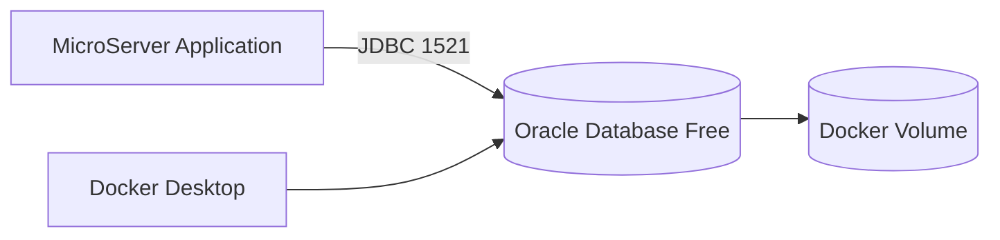
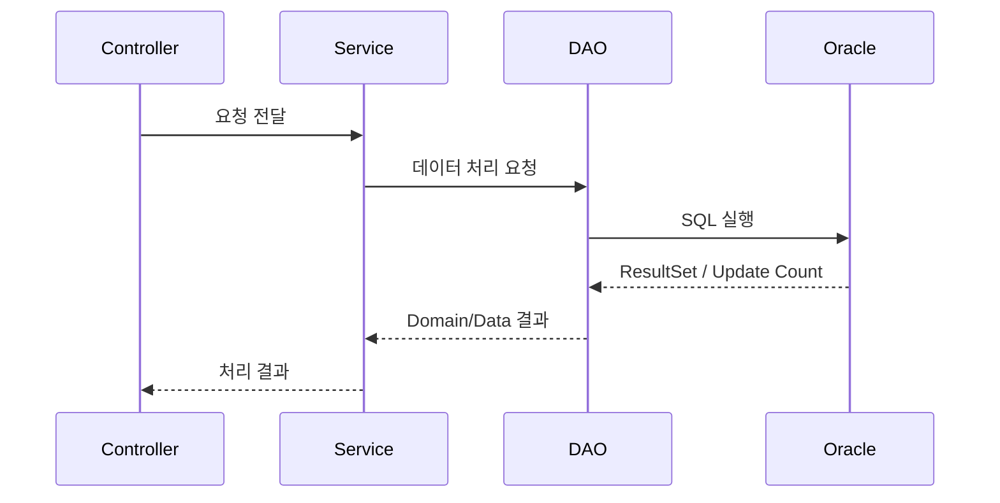

# Oracle / Docker 로컬 개발환경 구성 가이드

## 1. 문서 목적

본 문서는 MicroServer 프로젝트에서 데이터 영속성 계층과 DAO 기능을 개발하기 위해 로컬 PC에 **Docker 기반 Oracle Database 개발환경**을 구성한다.

운영 Oracle DB에 직접 연결하지 않고 개발자 PC에서 독립적인 Database를 실행함으로써 다음 장점을 얻을 수 있다.

- 개발자별 독립 DB 제공
- 데이터 초기화와 재생성이 쉬움
- 운영 DB 접속 의존 제거
- DAO / Transaction 기능 개발 가능
- 테스트 데이터 자유롭게 구성 가능
- 동일한 DB 실행 방식 공유

---

## 2. 로컬 DB 구성 구조



애플리케이션은 Host의 `localhost:1521`을 통해 Docker 내부 Oracle Listener에 연결한다.

---

## 3. 사전 준비

다음 환경이 준비되어 있어야 한다.

```bash
docker --version
```

Docker Desktop을 실행한 뒤:

```bash
docker info
```

Docker Engine에 정상 연결되는지 확인한다.

---

## 4. Docker Desktop 리소스

Oracle Database는 일반적인 경량 컨테이너보다 상대적으로 많은 메모리와 디스크를 사용한다.

개발 PC 전체 메모리가 16GB라면 Oracle 외 다른 컨테이너를 동시에 많이 실행하지 않는다.

권장 개발환경에서는 Docker Desktop에 충분한 메모리를 할당하고 SSD 여유공간을 확보한다.

---

## 5. Oracle Database Free 이미지

Oracle Container Registry의 Database Free 이미지를 사용한다.

본 가이드에서는 개발용으로 상대적으로 가벼운 `latest-lite` 예시를 사용한다.

```bash
docker pull container-registry.oracle.com/database/free:latest-lite
```

환경 또는 Oracle Container Registry 정책에 따라 Registry 로그인이나 약관 확인이 요구될 수 있다.

---

## 6. 데이터 영속 Volume 생성

컨테이너를 삭제하더라도 DB 데이터를 유지하려면 Named Volume을 사용한다.

```bash
docker volume create microserver-oracle-data
```

확인:

```bash
docker volume ls
```

---

## 7. Oracle 컨테이너 실행

### macOS / Linux Terminal

먼저 비밀번호를 환경변수로 지정한다.

```bash
export ORACLE_PWD='<strong-local-password>'
```

컨테이너 실행:

```bash
docker run -d \
  --name microserver-oracle \
  -p 1521:1521 \
  -e ORACLE_PWD="$ORACLE_PWD" \
  -v microserver-oracle-data:/opt/oracle/oradata \
  container-registry.oracle.com/database/free:latest-lite
```

### Windows PowerShell

```powershell
$env:ORACLE_PWD='<strong-local-password>'
```

```powershell
docker run -d `
  --name microserver-oracle `
  -p 1521:1521 `
  -e ORACLE_PWD=$env:ORACLE_PWD `
  -v microserver-oracle-data:/opt/oracle/oradata `
  container-registry.oracle.com/database/free:latest-lite
```

> 실제 비밀번호를 Markdown 문서, Git 저장소, shell history 공유본에 저장하지 않는다.

---

## 8. 컨테이너 상태 확인

```bash
docker ps
```

전체 컨테이너:

```bash
docker ps -a
```

Oracle 로그:

```bash
docker logs -f microserver-oracle
```

DB 초기 기동에는 시간이 필요할 수 있으므로 로그에서 Database가 정상 Open 상태가 되었는지 확인한 뒤 접속한다.

로그 확인 종료:

```text
Ctrl + C
```

---

## 9. 기본 접속 정보

Oracle Database Free 계열의 PDB 서비스 예시는 다음과 같이 사용한다.

```text
Host        : localhost
Port        : 1521
Service Name: FREEPDB1
User        : SYSTEM 또는 프로젝트 전용 계정
Password    : 컨테이너 생성 시 설정한 비밀번호
```

애플리케이션은 SYSTEM 계정을 직접 사용하지 않고 별도의 개발 계정을 생성하여 사용하는 것을 권장한다.

---

## 10. Container 내부 SQL*Plus 접속

Oracle 컨테이너 내부에서 접속을 확인할 수 있다.

```bash
docker exec -it microserver-oracle bash
```

컨테이너 내부에서 SQL*Plus를 사용해 접속한다.

환경 이미지에 포함된 도구와 경로에 따라 실행 명령이 다를 수 있으므로 컨테이너 제공 명령을 확인한다.

작업 후:

```bash
exit
```

---

## 11. 프로젝트 전용 사용자 생성

개발자가 SYSTEM 계정으로 테이블을 생성하지 않도록 프로젝트 전용 Schema를 만든다.

먼저 **`FREEPDB1` PDB 서비스에 SYSTEM 계정으로 접속한 상태**에서 사용자 생성 SQL을 실행한다. CDB Root에서 일반 사용자명을 생성하면 Oracle의 Common User 규칙 때문에 실패할 수 있다.

예시 SQL:

```sql
CREATE USER MICROSERVER IDENTIFIED BY "<local-password>";

GRANT CREATE SESSION TO MICROSERVER;
GRANT CREATE TABLE TO MICROSERVER;
GRANT CREATE SEQUENCE TO MICROSERVER;
GRANT CREATE VIEW TO MICROSERVER;
GRANT CREATE PROCEDURE TO MICROSERVER;

ALTER USER MICROSERVER QUOTA UNLIMITED ON USERS;
```

`USERS` Tablespace를 사용하는 개발환경 기준 예시이며, 프로젝트에서 별도 Tablespace를 만들 경우 해당 Tablespace에 필요한 Quota만 부여한다.

학습 프로젝트라도 `DBA` 권한을 습관적으로 부여하지 않는다.

---

## 12. 테스트 테이블 생성

프로젝트 계정으로 접속 후 예시 테이블을 생성한다.

```sql
CREATE TABLE TB_SAMPLE (
    SAMPLE_ID      NUMBER          NOT NULL,
    SAMPLE_NAME    VARCHAR2(100)   NOT NULL,
    CREATED_AT     TIMESTAMP       DEFAULT SYSTIMESTAMP NOT NULL,
    CONSTRAINT PK_TB_SAMPLE PRIMARY KEY (SAMPLE_ID)
);
```

Sequence:

```sql
CREATE SEQUENCE SQ_SAMPLE
START WITH 1
INCREMENT BY 1
NOCACHE;
```

테스트 데이터:

```sql
INSERT INTO TB_SAMPLE (SAMPLE_ID, SAMPLE_NAME)
VALUES (SQ_SAMPLE.NEXTVAL, 'MicroServer');

COMMIT;
```

확인:

```sql
SELECT * FROM TB_SAMPLE;
```

---

## 13. Spring 애플리케이션 접속 설정 예시

`application-local.yml` 예:

```yaml
spring:
  datasource:
    url: jdbc:oracle:thin:@//localhost:1521/FREEPDB1
    username: ${DB_USERNAME:MICROSERVER}
    password: ${DB_PASSWORD}
    driver-class-name: oracle.jdbc.OracleDriver
```

실제 비밀번호는 소스에 작성하지 않고 환경변수로 전달한다.

### Windows PowerShell

```powershell
$env:DB_USERNAME='MICROSERVER'
$env:DB_PASSWORD='<local-password>'
```

### macOS

```bash
export DB_USERNAME='MICROSERVER'
export DB_PASSWORD='<local-password>'
```

---

## 14. Maven Oracle JDBC Driver

Spring Boot 또는 프로젝트 Dependency Management 정책에 맞춰 Oracle JDBC Driver를 추가한다.

예시:

```xml
<dependency>
    <groupId>com.oracle.database.jdbc</groupId>
    <artifactId>ojdbc11</artifactId>
</dependency>
```

실제 버전은 프로젝트 Parent POM 또는 BOM에서 통합 관리하는 것을 권장한다.

---

## 15. Database Connection Test

애플리케이션 실행 전 네트워크 포트를 확인할 수 있다.

### Windows

```powershell
Test-NetConnection localhost -Port 1521
```

### macOS

```bash
nc -vz localhost 1521
```

포트가 열려 있어도 DB 서비스 초기화가 완료되지 않았다면 JDBC 연결은 실패할 수 있다.

따라서 `docker logs`도 함께 확인한다.

---

## 16. 컨테이너 중지 / 시작

사용하지 않을 때:

```bash
docker stop microserver-oracle
```

다시 시작:

```bash
docker start microserver-oracle
```

Named Volume을 사용하므로 컨테이너를 Stop/Start 해도 데이터는 유지된다.

---

## 17. 컨테이너 삭제

```bash
docker stop microserver-oracle
docker rm microserver-oracle
```

Named Volume을 삭제하지 않았다면 DB 데이터 볼륨은 별도로 남는다.

Volume 확인:

```bash
docker volume ls
```

---

## 18. DB 데이터를 완전히 초기화

> 아래 작업은 로컬 Oracle 데이터를 모두 삭제한다.

컨테이너 삭제:

```bash
docker rm -f microserver-oracle
```

Volume 삭제:

```bash
docker volume rm microserver-oracle-data
```

다시 Volume 생성 후 컨테이너를 실행하면 새로운 DB 환경으로 초기화할 수 있다.

---

## 19. Docker Compose 사용 예시

로컬 인프라 구성이 늘어날 것을 고려하면 Docker Compose 파일로 관리하는 것이 편리하다.

예: `docker-compose.local.yml`

```yaml
services:
  oracle:
    image: container-registry.oracle.com/database/free:latest-lite
    container_name: microserver-oracle
    ports:
      - "1521:1521"
    environment:
      ORACLE_PWD: ${ORACLE_PWD}
    volumes:
      - microserver-oracle-data:/opt/oracle/oradata

volumes:
  microserver-oracle-data:
```

`.env` 예:

```text
ORACLE_PWD=<strong-local-password>
```

`.env`는 Git에 Commit하지 않는다.

```gitignore
.env
```

실행:

```bash
docker compose -f docker-compose.local.yml up -d
```

로그:

```bash
docker compose -f docker-compose.local.yml logs -f oracle
```

종료:

```bash
docker compose -f docker-compose.local.yml down
```

Named Volume은 `down`만으로 기본 삭제되지 않는다.

---

## 20. 초기 Schema Script 운영 방식

프로젝트가 발전하면 SQL을 문서에서 수동 복사하기보다 다음처럼 관리한다.

```text
database/
 ├─ 01_schema.sql
 ├─ 02_sequence.sql
 ├─ 03_seed_data.sql
 └─ README.md
```

향후 Flyway 또는 Liquibase를 도입하면 애플리케이션과 DB Schema Version을 함께 관리할 수 있다.

초기 단계에서는 SQL Script를 명확히 나누어 관리하고 이후 Migration Tool로 확장한다.

---

## 21. DAO 개발 연결 흐름



Transaction의 기본 단위는 Service 계층에서 관리하고 DAO는 데이터 접근 역할에 집중하도록 구성한다.

---

## 22. 자주 발생하는 문제

### 1521 포트 충돌

확인:

```bash
docker ps
```

Windows:

```powershell
netstat -ano | findstr :1521
```

macOS:

```bash
lsof -i :1521
```

필요하면 Host Port를 변경할 수 있다.

```text
Host 1522 → Container 1521
```

Docker 옵션:

```bash
-p 1522:1521
```

JDBC URL도 `1522`로 변경한다.

### Container가 즉시 종료됨

```bash
docker ps -a
docker logs microserver-oracle
```

메모리 부족, 이미지 초기화 오류, 볼륨 권한 등을 확인한다.

### `ORA-12514`

Listener는 떠 있지만 요청한 Service가 아직 등록되지 않았거나 PDB가 준비되지 않았을 때 발생할 수 있다.

```bash
docker logs -f microserver-oracle
```

DB가 완전히 기동되었는지와 접속 Service Name `FREEPDB1`을 확인한다.

### 비밀번호 오류

컨테이너를 재시작한다고 최초 설정한 DB 비밀번호가 새 환경변수 값으로 자동 변경되는 것은 아니다.

기존 Volume을 유지한 채 `ORACLE_PWD`만 변경하면 실제 DB 비밀번호와 불일치할 수 있다.

---

## 23. 보안 주의사항

로컬 개발 DB라도 다음 값은 소스에 포함하지 않는다.

```text
SYSTEM Password
Project DB Password
Production DB URL
Production DB Account
```

Git Commit 전:

```bash
git status
git diff
```

`.env`, 개인 설정파일이 포함되지 않았는지 확인한다.

---

## 24. 최종 검증

Docker:

```bash
docker ps
```

로그:

```bash
docker logs microserver-oracle
```

포트:

```text
localhost:1521
```

DB:

```text
Service Name: FREEPDB1
```

Application:

```text
JDBC URL → localhost:1521/FREEPDB1
Project Account → MICROSERVER
```

---

## 25. 체크리스트

- [ ] Docker Desktop이 설치되어 있다.
- [ ] `docker info`가 정상 실행된다.
- [ ] Oracle Database Free 이미지를 Pull했다.
- [ ] Named Volume을 생성했다.
- [ ] `microserver-oracle` 컨테이너가 실행된다.
- [ ] Oracle Database가 정상 Open 상태이다.
- [ ] `localhost:1521` 연결이 가능하다.
- [ ] `FREEPDB1` 서비스로 접속할 수 있다.
- [ ] 프로젝트 전용 Schema를 생성했다.
- [ ] Spring Datasource 설정에서 비밀번호를 환경변수로 분리했다.
- [ ] `.env`와 민감정보가 Git에서 제외되어 있다.

---

## 26. 참고

Oracle 공식 Docker 이미지 저장소 및 Oracle Database Container 문서를 기준으로 로컬 개발환경을 구성한다. 이미지 태그와 세부 지원 정책은 Oracle 배포 상태에 따라 변경될 수 있으므로 실제 프로젝트 착수 시 사용하는 태그를 고정하는 것이 좋다.
