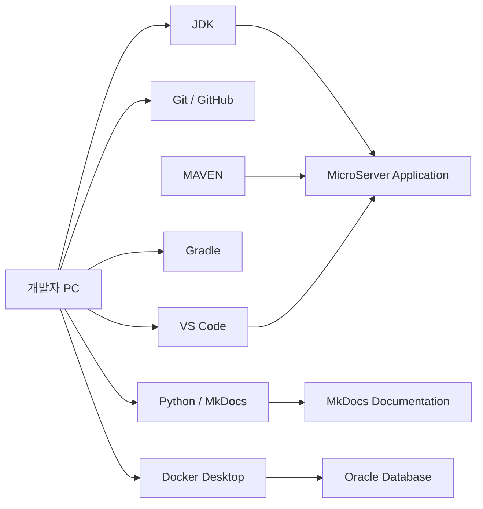
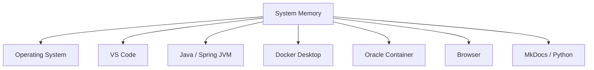
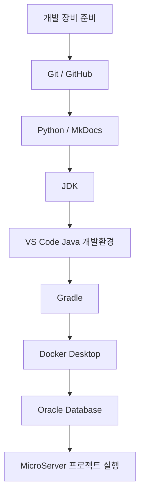

# 개발 장비 구성 가이드

## 1. 문서 목적

본 문서는 MicroServer 프로젝트를 개발하기 위해 필요한 **개발 장비, 운영체제, 필수 소프트웨어, 네트워크 및 로컬 실행 환경의 기준**을 정의한다.

MicroServer 프로젝트는 단순한 예제 프로젝트가 아니라 다음 환경을 로컬에서 단계적으로 구성하는 것을 전제로 한다.

- Java / Spring 기반 애플리케이션 개발
- Gradle Multi-Project 빌드
- Oracle Database 로컬 실행
- Docker 기반 개발 인프라 실행
- MkDocs 기반 기술문서 작성 및 로컬 미리보기
- Git / GitHub 기반 소스 및 문서 형상관리
- VS Code 기반 통합 개발환경 구성

따라서 CPU, 메모리, 저장장치뿐 아니라 **Docker를 동시에 실행할 수 있는 여유 자원**을 고려하여 개발 장비를 구성하는 것이 좋다.

---

## 2. 개발 환경 구성 원칙

MicroServer 프로젝트의 표준 개발 환경은 다음과 같이 정의한다.



개발 장비는 크게 다음 세 역할을 동시에 수행한다.

1. **애플리케이션 개발 장비**
   - Java 소스 편집
   - 테스트 실행
   - Gradle 빌드
   - Spring Boot 애플리케이션 실행

2. **로컬 개발 서버**
   - Oracle Database 컨테이너 실행
   - 향후 Redis, Kafka 등 추가 인프라 실행 가능

3. **문서 작성 장비**
   - Markdown 작성
   - MkDocs 로컬 서버 실행
   - GitHub Pages 배포

---

## 3. 권장 개발 장비 사양

### 3.1 최소 사양

학습 및 소규모 기능 개발이 가능한 최소 기준이다.

| 항목 | 권장 기준 |
|---|---|
| CPU | Intel Core i5 / AMD Ryzen 5 / Apple Silicon M1 이상 |
| 메모리 | 16GB |
| 저장장치 | SSD 512GB 이상 |
| 네트워크 | 유선 또는 안정적인 Wi-Fi |
| 운영체제 | Windows 11 또는 최신 macOS 계열 |
| 디스플레이 | Full HD 이상 |

16GB 메모리에서도 개발은 가능하지만, 다음 프로그램을 동시에 실행하면 메모리 부족이 발생할 수 있다.

- VS Code
- Docker Desktop
- Oracle Database 컨테이너
- 브라우저 여러 탭
- MkDocs 서버
- Java 애플리케이션

따라서 실제 프로젝트 개발 장비는 가능하면 32GB 이상을 권장한다.

### 3.2 권장 사양

| 항목 | 권장 기준 |
|---|---|
| CPU | Intel Core i7 / AMD Ryzen 7 / Apple Silicon Pro 계열 이상 |
| 메모리 | 32GB |
| 저장장치 | SSD 1TB 이상 |
| 디스플레이 | QHD 이상 또는 듀얼 모니터 |
| 네트워크 | 기가비트 유선 또는 Wi-Fi 6 이상 |

32GB 메모리 환경이면 Java 개발, Oracle 컨테이너, 문서 서버를 동시에 구동하면서도 비교적 여유 있게 사용할 수 있다.

### 3.3 확장 개발 환경

향후 다음과 같은 구성까지 로컬에서 실행할 경우 32GB~64GB 환경을 고려한다.

- Oracle Database
- Redis
- Kafka
- Elasticsearch / OpenSearch
- 다수의 Spring Boot 서비스
- 테스트용 API Gateway
- 로컬 Kubernetes

---

## 4. 운영체제 기준

프로젝트는 Windows와 macOS 모두에서 개발할 수 있도록 구성한다.

### 4.1 Windows

권장 환경:

- Windows 11 64bit
- PowerShell
- Git for Windows
- Docker Desktop
- Visual Studio Code

Windows에서는 다음 항목에 특히 주의한다.

- PowerShell 실행 정책
- PATH 환경변수
- `JAVA_HOME`
- Git 줄바꿈 설정
- Docker Desktop의 WSL2 기반 실행 환경

### 4.2 macOS

권장 환경:

- Apple Silicon 기반 Mac 권장
- Terminal 또는 iTerm 계열 터미널
- Homebrew 선택 사용
- Docker Desktop
- Visual Studio Code

macOS에서는 기본 설치된 시스템 Python에 의존하지 않고 **프로젝트용 Python 가상환경을 별도로 생성**한다.

---

## 5. 필수 소프트웨어 구성

MicroServer 개발 장비에는 다음 소프트웨어를 설치한다.

| 분류 | 프로그램 | 용도 |
|---|---|---|
| IDE | Visual Studio Code | 표준 개발 IDE |
| SCM | Git | 소스 형상관리 |
| Remote SCM | GitHub | 원격 저장소 / 협업 |
| Java | JDK | Java 컴파일 및 실행 |
| Build | Gradle | 빌드 및 의존성 관리 |
| Container | Docker Desktop | 로컬 인프라 실행 |
| Database | Oracle Database Free | 로컬 개발 DB |
| Python | Python | MkDocs 실행 환경 |
| Docs | MkDocs / Material | 기술문서 사이트 구축 |
| Browser | Chrome / Edge / Safari | 애플리케이션 및 문서 확인 |

---

## 6. 개발 디렉터리 구성 권장안

개발 소스와 도구를 무분별하게 섞지 않고 일정한 위치에서 관리하는 것을 권장한다.

### Windows 예시

```text
C:\workspace\
 ├─ microserver\
 ├─ microserver-docs\
 └─ temp\
```

### macOS 예시

```text
~/workspace/
 ├─ microserver/
 ├─ microserver-docs/
 └─ temp/
```

Git 저장소는 가능하면 OneDrive, iCloud Drive 등 실시간 동기화 폴더 내부에 두지 않는다.

파일 동기화 프로그램과 Git이 동시에 파일을 변경하면 다음 문제가 발생할 수 있다.

- `.git` 파일 잠금
- 빌드 산출물 중복 동기화
- 파일명 대소문자 충돌
- 불필요한 네트워크 사용량 증가

---

## 7. 디스크 공간 운영 기준

Java 소스 자체는 크지 않지만 Docker 이미지와 Gradle 캐시가 지속적으로 증가할 수 있다.

주요 공간 사용 위치는 다음과 같다.

```text
프로젝트 소스
Gradle Cache
Docker Image / Volume
VS Code Extension
Python Virtual Environment
MkDocs Build 결과
```

### Gradle 캐시

기본 위치:

```text
Windows: C:\Users\<사용자>\.gradle\caches
macOS:   ~/.gradle/caches
```

### Python 가상환경

프로젝트별로 `.venv`를 생성하면 프로젝트마다 패키지가 별도로 저장된다.

### Docker

Oracle 이미지와 데이터 볼륨은 일반 애플리케이션보다 상대적으로 많은 저장공간을 사용할 수 있으므로 SSD 여유공간을 충분히 확보한다.

---

## 8. 메모리 운영 권장안

개발 시 예상되는 메모리 사용 영역은 다음과 같다.



16GB 환경에서는 Docker 컨테이너를 사용하지 않을 때 중지하는 습관을 권장한다.

```bash
docker stop microserver-oracle
```

다시 사용할 때:

```bash
docker start microserver-oracle
```

---

## 9. 개발 장비 기본 확인 명령

환경 구성이 끝난 후 터미널에서 다음 명령이 모두 정상 실행되는지 확인한다.

```bash
git --version
java -version
gradle --version
python --version
# macOS에서는 python3 --version 사용 가능
docker --version
code --version
```

프로젝트별 Python 가상환경을 활성화한 뒤 다음도 확인한다.

```bash
mkdocs --version
```

---

## 10. 개발 장비 구성 순서

처음부터 모든 프로그램을 한 번에 설치하기보다 다음 순서로 구성한다.



권장 순서는 다음과 같다.

1. Git 설치 및 GitHub 연결
2. 프로젝트 저장소 Clone
3. Python 설치
4. Python 가상환경 생성
5. MkDocs 실행 환경 구성
6. JDK 설치
7. VS Code Java 확장 구성
8. Gradle 설치 및 Wrapper 이해
9. Docker Desktop 설치
10. Oracle Database 컨테이너 실행
11. 프로젝트 빌드 및 테스트

---

## 11. 개발 장비 보안 기본 수칙

개발 PC라 하더라도 다음 정보는 Git 저장소에 직접 저장하지 않는다.

- DB 계정 비밀번호
- GitHub Personal Access Token
- API Key
- 인증서 Private Key
- 운영계 접속정보
- 사내 Nexus / Artifactory 인증정보

민감 정보는 다음 방식 중 하나로 관리한다.

- 환경변수
- 로컬 전용 설정 파일
- `.env`
- Gradle `gradle.properties`
- 운영환경 Secret 관리 시스템

그리고 해당 파일은 `.gitignore`에 등록한다.

예:

```gitignore
.env
*.local
.vscode/settings.local.json
```

---

## 12. 개발 장비 점검 체크리스트

- [ ] Windows 또는 macOS 개발 환경이 준비되어 있다.
- [ ] SSD 여유공간이 충분하다.
- [ ] 메모리 16GB 이상을 확보했다.
- [ ] VS Code가 설치되어 있다.
- [ ] Git 명령이 실행된다.
- [ ] GitHub 저장소에 접근할 수 있다.
- [ ] JDK가 설치되어 있다.
- [ ] Gradle을 실행할 수 있고 프로젝트 생성 이후 Gradle Wrapper를 사용할 준비가 되어 있다.
- [ ] Python 가상환경을 생성할 수 있다.
- [ ] MkDocs 로컬 서버를 실행할 수 있다.
- [ ] Docker Desktop이 정상 실행된다.
- [ ] Oracle 컨테이너를 실행할 준비가 되어 있다.

---

## 13. 다음 문서

개발 장비 준비가 완료되면 다음 순서로 환경을 구성한다.

1. **Git / GitHub 환경 구성**
2. **Python / MkDocs 환경 구성**
3. **JDK 설치 및 설정**
4. **VS Code 개발환경 구성**
5. **Gradle 설치 및 설정**
6. **Oracle / Docker 로컬 환경 구성**
