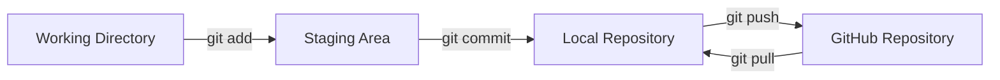
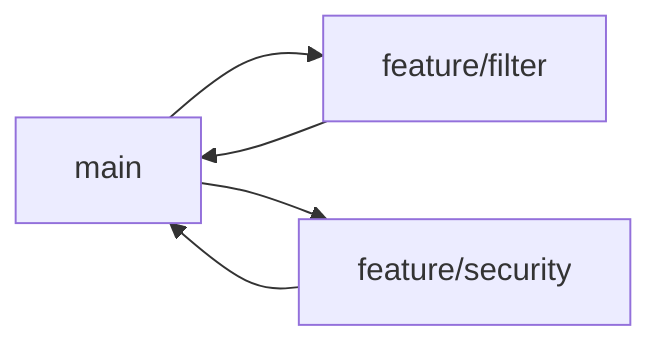

# Git / GitHub 환경 구성 가이드

## 1. 문서 목적

본 문서는 MicroServer 프로젝트의 소스코드와 기술문서를 Git으로 관리하고 GitHub 원격 저장소와 연동하기 위한 기본 개발환경을 구성한다.

프로젝트에서는 Git을 단순 백업 도구가 아니라 다음 목적의 **표준 형상관리 도구**로 사용한다.

- 소스코드 변경 이력 관리
- 기능 단위 Commit
- 원격 저장소 Push / Pull
- 브랜치 기반 병렬 개발
- 문서 변경 이력 관리
- GitHub 기반 협업 및 리뷰

---

## 2. Git 기반 개발 흐름



기본 작업 흐름은 다음과 같다.

```bash
git status
git add .
git commit -m "docs: add environment setup guide"
git push
```

---

## 3. Git 설치

### 3.1 Windows

Git for Windows를 설치한다.

설치 완료 후 PowerShell을 새로 열고 확인한다.

```powershell
git --version
```

정상 예시:

```text
git version 2.x.x.windows.x
```

### 3.2 macOS

터미널에서 먼저 확인한다.

```bash
git --version
```

Git이 설치되어 있지 않으면 macOS가 Command Line Tools 설치를 안내할 수 있다.

Homebrew를 사용하는 경우 다음 방식도 사용할 수 있다.

```bash
brew install git
```

설치 후:

```bash
git --version
```

---

## 4. Git 사용자 정보 설정

Commit에는 작성자 정보가 기록되므로 최초 1회 사용자 정보를 설정한다.

```bash
git config --global user.name "Your Name"
git config --global user.email "your-email@example.com"
```

확인:

```bash
git config --global --list
```

특정 프로젝트만 다른 계정을 사용할 경우 저장소 디렉터리에서 `--global`을 제외하고 설정한다.

```bash
git config user.name "Project User"
git config user.email "project@example.com"
```

---

## 5. 기본 브랜치 설정

새 Git 저장소 생성 시 기본 브랜치를 `main`으로 사용하도록 설정할 수 있다.

```bash
git config --global init.defaultBranch main
```

---

## 6. 줄바꿈 정책

Windows는 CRLF, Linux/macOS는 LF를 주로 사용하기 때문에 팀 개발에서는 줄바꿈 정책을 명확히 하는 것이 중요하다.

프로젝트에서는 가능하면 `.gitattributes`를 저장소에 두어 저장소 기준을 통일한다.

예:

```gitattributes
* text=auto

*.java text eol=lf
*.xml text eol=lf
*.yml text eol=lf
*.yaml text eol=lf
*.md text eol=lf
*.sh text eol=lf
*.bat text eol=crlf
*.cmd text eol=crlf
```

개별 PC의 기본 설정은 다음과 같이 사용할 수 있다.

### Windows

```powershell
git config --global core.autocrlf true
```

### macOS

```bash
git config --global core.autocrlf input
```

프로젝트에 `.gitattributes`가 있다면 저장소 정책을 우선한다.

---

## 7. GitHub 인증 방식

GitHub 원격 저장소 연결은 크게 HTTPS와 SSH 방식이 있다.

| 방식 | 특징 |
|---|---|
| HTTPS | 설정이 단순하고 Credential Manager와 함께 사용 가능 |
| SSH | 키 기반 인증으로 개발환경에서 편리하게 사용 가능 |

프로젝트 개발환경에서는 SSH 방식을 권장한다.

---

## 8. SSH Key 생성

### 8.1 기존 키 확인

```bash
ls ~/.ssh
```

Windows PowerShell에서도 사용자 홈의 `.ssh` 디렉터리를 확인할 수 있다.

```powershell
Get-ChildItem $HOME\.ssh
```

### 8.2 SSH Key 생성

```bash
ssh-keygen -t ed25519 -C "your-email@example.com"
```

기본 저장 위치를 사용할 경우 Enter를 입력한다.

```text
~/.ssh/id_ed25519
~/.ssh/id_ed25519.pub
```

공개키 확인:

#### Windows

```powershell
Get-Content $HOME\.ssh\id_ed25519.pub
```

#### macOS

```bash
cat ~/.ssh/id_ed25519.pub
```

출력된 공개키를 GitHub 계정의 SSH Key에 등록한다.

> 개인키인 `id_ed25519` 파일은 외부에 공유하거나 Git 저장소에 Commit하면 안 된다.

---

## 9. GitHub SSH 연결 확인

```bash
ssh -T git@github.com
```

최초 연결에서는 GitHub 서버 fingerprint 확인 메시지가 나타날 수 있다.

정상적으로 인증되면 GitHub 계정이 확인되었다는 메시지가 출력된다.

---

## 10. 프로젝트 Clone

프로젝트 저장소의 SSH URL을 사용한다.

예:

```bash
cd ~/workspace
git clone git@github.com:Team-Microserver/<repository>.git
```

Windows 예:

```powershell
cd C:\workspace
git clone git@github.com:Team-Microserver/<repository>.git
```

Clone 후:

```bash
cd <repository>
git status
```

---

## 11. 기존 로컬 프로젝트를 GitHub와 연결

이미 로컬에 소스가 있는 경우:

```bash
git init
git add .
git commit -m "chore: initialize project"
git branch -M main
git remote add origin git@github.com:Team-Microserver/<repository>.git
git push -u origin main
```

원격 저장소 확인:

```bash
git remote -v
```

---

## 12. 기본 개발 작업 흐름

기능 작업 전 항상 현재 상태를 확인한다.

```bash
git status
git pull
```

작업 후 변경 파일 확인:

```bash
git status
git diff
```

Staging:

```bash
git add .
```

Commit:

```bash
git commit -m "feat: add request pre-processing filter"
```

Push:

```bash
git push
```

---

## 13. Commit 메시지 권장 규칙

프로젝트 변경 이력을 읽기 쉽게 하기 위해 다음 Prefix를 권장한다.

| Prefix | 용도 |
|---|---|
| `feat` | 기능 추가 |
| `fix` | 오류 수정 |
| `docs` | 문서 변경 |
| `refactor` | 리팩터링 |
| `test` | 테스트 추가/수정 |
| `build` | Gradle/Maven, Dependency 등 빌드 변경 |
| `chore` | 기타 설정 및 유지보수 |

예:

```text
feat: add common response wrapper
fix: handle authentication exception
docs: add Oracle Docker setup guide
build: configure Gradle multi-project build
```

Commit은 가능한 한 **하나의 의미 있는 변경 단위**로 나눈다.

---

## 14. 브랜치 운영 기본안

초기 학습/구축 단계에서는 지나치게 복잡한 Git Flow보다 단순한 브랜치 모델을 사용한다.



예:

```bash
git switch -c feature/common-filter
```

작업 완료 후:

```bash
git add .
git commit -m "feat: add common request filter"
git push -u origin feature/common-filter
```

---

## 15. `.gitignore` 기본 구성

Java, VS Code, Python, MkDocs, 운영체제 파일이 섞이지 않도록 기본 제외 규칙을 둔다.

```gitignore
# Java / Gradle
build/
.gradle/
*.class
*.jar
!gradle/wrapper/gradle-wrapper.jar
*.war

# IDE
.vscode/
.idea/
*.iml

# Python
.venv/
__pycache__/
*.pyc

# MkDocs
site/

# OS
.DS_Store
Thumbs.db

# Logs
*.log
logs/

# Secrets
.env
*.local
```

> VS Code의 팀 공용 설정을 저장소에 관리할 계획이라면 `.vscode/` 전체를 제외하지 말고 필요한 파일만 선택적으로 관리한다.

---

## 16. 실수로 잘못 Commit한 파일 제거

파일을 로컬에는 유지하고 Git 추적에서만 제거하려면:

```bash
git rm --cached <file>
```

디렉터리:

```bash
git rm -r --cached <directory>
```

그 후 `.gitignore`에 추가하고 Commit한다.

---

## 17. 자주 사용하는 Git 명령

```bash
# 상태 확인
git status

# 변경 내용 확인
git diff

# 최근 Commit 확인
git log --oneline --graph --decorate -20

# 원격 저장소 확인
git remote -v

# 원격 변경 가져오기
git fetch

# 현재 브랜치 확인
git branch

# 브랜치 생성 및 이동
git switch -c feature/example

# main 이동
git switch main

# 최신 변경 반영
git pull
```

---

## 18. 프로젝트 작업 시작 전 체크

```bash
git status
git branch --show-current
git pull
```

작업 종료 전 체크:

```bash
git status
git diff
git add .
git commit -m "<type>: <message>"
git push
```

---

## 19. 문제 해결

### `Permission denied (publickey)`

확인:

```bash
ssh -T git@github.com
```

추가 확인:

```bash
ssh-add -l
```

필요한 경우 SSH Agent에 키를 등록한다.

```bash
ssh-add ~/.ssh/id_ed25519
```

### `fatal: not a git repository`

현재 위치 확인:

```bash
pwd
```

Windows:

```powershell
Get-Location
```

프로젝트 루트로 이동한 후 다시 실행한다.

### Push 전에 원격 변경이 존재하는 경우

```bash
git pull --rebase
```

충돌이 발생하면 충돌 파일을 수정한 후 계속 진행한다.

---

## 20. 확인 체크리스트

- [ ] Git이 설치되어 있다.
- [ ] `git --version`이 정상 실행된다.
- [ ] 사용자 이름과 이메일을 설정했다.
- [ ] GitHub SSH Key를 등록했다.
- [ ] `ssh -T git@github.com` 연결이 성공한다.
- [ ] MicroServer 저장소를 Clone했다.
- [ ] `.gitignore` 정책을 확인했다.
- [ ] Commit 메시지 규칙을 이해했다.
- [ ] Push / Pull이 정상 동작한다.
