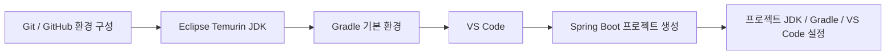
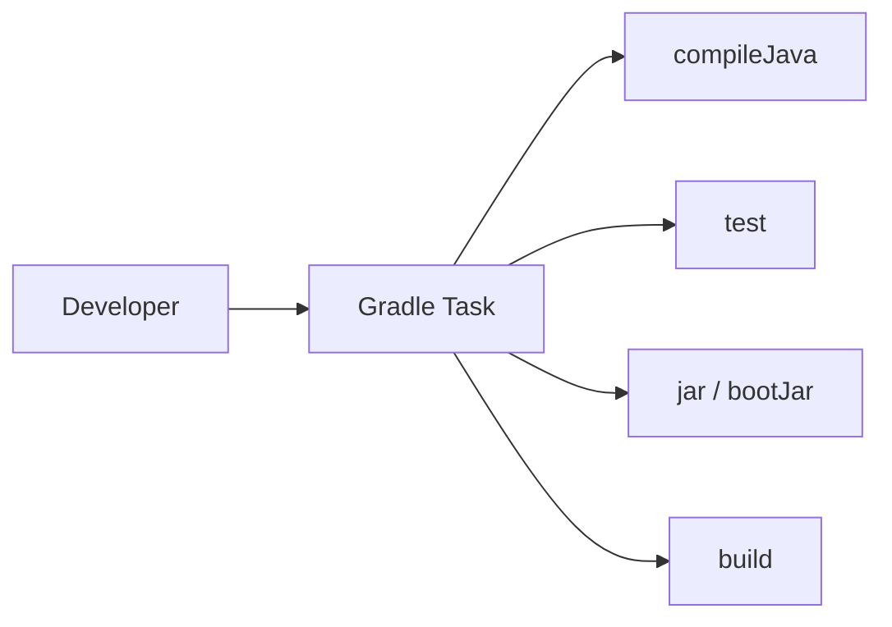
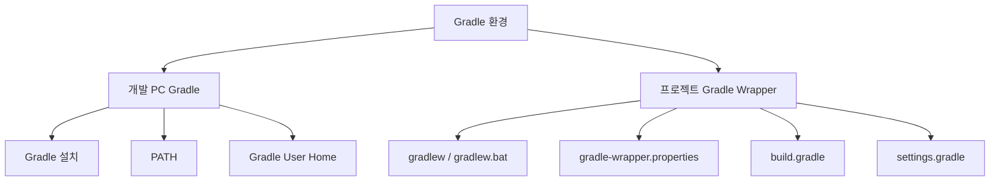

# Gradle 설치 및 기본 환경 구성 가이드

## 1. 문서 목적

본 문서는 MicroServer 프로젝트의 **주 Build Tool인 Gradle**을 이해하고,
Windows 및 macOS 개발 PC에서 Gradle을 사용할 수 있는 기본 환경을 준비하는 방법을 설명한다.

MicroServer는 이번 프로젝트부터 **Gradle + Groovy DSL**을 기본 Build 방식으로 사용한다.

다만 기존 금융 SI 및 Java 프로젝트에서 Maven을 많이 사용하므로,
Gradle을 설명할 때 주요 설정과 명령에 대응하는 **Maven 방식도 함께 비교**한다.

현재 단계에서는 아직 Spring Boot 프로젝트를 생성하지 않는다.

따라서 본 문서에서는 다음 내용을 다룬다.

- Gradle의 역할과 기본 개념
- Gradle과 Maven의 구조 차이
- Gradle Groovy DSL 선택 이유
- Gradle 9.7.1 / Java 26 기준
- Windows / macOS Gradle 설치
- `GRADLE_HOME` / PATH 구성
- Gradle User Home과 Cache 이해
- Gradle Wrapper의 역할과 적용 시점
- Maven 명령 및 설정과의 대응 관계
- Gradle 설치 관련 기본 문제 해결

다음과 같은 프로젝트 종속 설정은 아직 진행하지 않는다.

- `build.gradle` 작성 및 수정
- `settings.gradle` 작성 및 수정
- Spring Boot Gradle Plugin 구성
- Gradle Wrapper 버전 고정
- Gradle Multi-Project 구성
- Subproject 간 의존성 구성
- 공통 Module JAR 구성
- Dependency / Plugin 정책 구성
- 실제 프로젝트 Build
- 특정 Module Build
- Dependency 분석

위 내용은 Spring Boot 프로젝트 생성 이후
**프로젝트 Gradle / Build 환경 설정 단계**에서 순차적으로 진행한다.

---

## 2. MicroServer Build Tool 기준

MicroServer의 기본 Build Tool은 다음과 같이 정의한다.

```text
Build Tool : Gradle
DSL        : Groovy
Gradle     : 9.7.1
Java       : 26
Spring Boot: 4.1.0
```

Spring Boot 4.1.0은 공식적으로 다음 Gradle 버전을 지원한다.

```text
Gradle 8.x : 8.14 이상
Gradle 9.x : 지원
```

Gradle 9.7.1은 Java 26에서 Gradle 자체를 실행할 수 있는 버전이다.

따라서 다음 조합을 프로젝트 기준으로 사용한다.

```text
Java 26
   +
Gradle 9.7.1
   +
Spring Boot 4.1.0
```

!!! info "버전 기준"
    본 문서 작성 기준일은 2026-08-24이다.

    Gradle은 프로젝트 생성 이후 Wrapper로 버전을 고정한다.
    개발 PC에 설치한 Gradle보다 **프로젝트의 `gradlew`가 최종 Build 기준**이다.

---

## 3. 개발환경 구성에서 Gradle의 위치

MicroServer 프로젝트의 개발도구 환경은 다음 순서로 구성한다.



현재 문서는 다음 단계에 해당한다.

```text
Git / GitHub 환경 구성
        ↓
Eclipse Temurin JDK 준비
        ↓
[ Gradle 기본 환경 구성 ]      ← 현재
        ↓
VS Code 개발환경 구성
        ↓
Spring Boot 프로젝트 생성
        ↓
프로젝트별 JDK / Gradle / VS Code 설정
```

JDK가 Java 실행환경을 제공한다면 Gradle은 Java 프로젝트의
**Build, Test, Dependency 관리, Task 실행 및 Multi-Project Build**를 담당한다.

---

## 4. Gradle과 Maven을 같이 이해하는 방법

Maven 경험이 있다면 Gradle을 다음 대응 관계로 이해하면 빠르다.

| Maven | Gradle | 의미 |
|---|---|---|
| `pom.xml` | `build.gradle` | Build / Dependency 설정 |
| Parent POM / `<modules>` | `settings.gradle` + Root `build.gradle` | 전체 프로젝트 및 Subproject 구성 |
| `<dependency>` | `dependencies {}` | Dependency 선언 |
| `<plugin>` | `plugins {}` | Build Plugin 적용 |
| `mvnw` / `mvnw.cmd` | `gradlew` / `gradlew.bat` | 프로젝트 고정 Build Tool 실행 |
| Maven Lifecycle | Gradle Task | Build 실행 단위 |
| `target/` | `build/` | Build 결과 Directory |
| `~/.m2/repository` | `~/.gradle/caches` | Dependency / Build Cache |
| `mvn package` | `./gradlew build` | Build / Test / Packaging |
| `mvn test` | `./gradlew test` | Test 실행 |
| `mvn spring-boot:run` | `./gradlew bootRun` | Spring Boot 실행 |
| `mvn dependency:tree` | `./gradlew dependencies` | Dependency 구조 확인 |

Gradle은 Maven의 Lifecycle 중심 방식과 달리 **Task Graph**를 중심으로 동작한다.



---

## 5. Gradle Groovy DSL을 사용하는 이유

Gradle Build Script는 다음 두 DSL을 지원한다.

```text
Groovy DSL : build.gradle
Kotlin DSL : build.gradle.kts
```

MicroServer에서는 첫 Gradle 프로젝트이므로 **Groovy DSL**을 사용한다.

이유:

- Gradle 자체의 개념 학습에 집중할 수 있다.
- Spring / Java 예제가 많이 축적되어 있다.
- 문법이 상대적으로 간결하다.
- 기존 Maven 설정과 대응 관계를 보기 쉽다.

향후 Gradle 구조를 충분히 이해한 뒤 필요하면 Kotlin DSL로 전환할 수 있다.

!!! note "프로젝트 표준"
    본 프로젝트의 Build Script 예시는 특별한 언급이 없으면 `build.gradle` 기준으로 작성한다.

---

## 6. Gradle 실행 구조와 설치 원칙

Gradle도 Maven과 마찬가지로 **개발 PC 설치본**과 **프로젝트 Wrapper**를 구분해야 한다.



### 6.1 개발 PC Gradle

```text
gradle
```

용도:

- Gradle 자체 학습
- Wrapper가 없는 프로젝트의 초기 Wrapper 생성
- Gradle 명령 구조 확인

### 6.2 프로젝트 Gradle Wrapper

Windows:

```text
gradlew.bat
```

macOS / Linux:

```text
./gradlew
```

용도:

- 프로젝트 Gradle 버전 고정
- 개발자별 Gradle 버전 차이 방지
- CI/CD와 로컬 Build 기준 통일
- 필요한 Gradle Distribution 자동 다운로드

!!! important "실제 프로젝트 Build 원칙"
    Spring Boot 프로젝트가 생성된 이후에는 가능한 한 `gradle` 명령보다
    **Gradle Wrapper인 `gradlew` / `gradlew.bat`를 사용한다.**

---

### 6.3 Gradle 설치는 필수인가

Gradle 공식 권장 방식은 프로젝트에 포함된 Wrapper를 사용하는 것이다.

따라서 Spring Initializr가 생성한 프로젝트를 사용하는 일반 개발자는
개발 PC에 Gradle을 반드시 전역 설치할 필요는 없다.

MicroServer에서는 다음 기준으로 운영한다.

```text
프로젝트 Build
→ Gradle Wrapper 사용      [필수]

개발 PC Gradle 설치
→ Gradle 학습 / Wrapper 복구 / 관리 목적     [권장]
```

이번 프로젝트는 Gradle을 직접 학습하는 목적도 있으므로
개발 PC Gradle 설치 과정까지 가이드에 포함한다.

---

### 6.4 사전 준비

Gradle은 JVM에서 실행되므로 JDK가 필요하다.

앞 단계에서 다음 환경이 준비되어 있어야 한다.

- Eclipse Temurin JDK 26 준비
- JDK Home 경로 확인
- `java` / `javac` 실행 확인

예:

#### Windows

```text
C:\dev\jdks\temurin-26
```

#### macOS

```text
~/dev/jdks/temurin-26.jdk/Contents/Home
```

MicroServer에서는 OS 전체 `JAVA_HOME`을 하나의 버전으로 영구 고정하기보다
프로젝트와 Terminal Session에서 필요한 JDK를 명시적으로 선택하는 방식을 사용한다.

---

## 7. Windows 환경 구성

### 7.1 Gradle 다운로드

Gradle 공식 Releases 페이지에서 Binary Distribution을 다운로드한다.

예:

```text
gradle-9.7.1-bin.zip
```

Gradle Distribution에는 일반적으로 다음 선택지가 있다.

```text
-bin.zip   → 실행에 필요한 Binary 중심
-all.zip   → Binary + Source + Documentation
```

일반 개발환경에서는 `-bin.zip`을 사용하면 충분하다.

---

### 7.2 Gradle 압축 해제

예:

```text
C:\dev\tools\gradle\gradle-9.7.1
```

구조 예:

```text
C:\dev\tools\gradle\gradle-9.7.1\
├─ bin\
├─ init.d\
├─ lib\
├─ LICENSE
└─ NOTICE
```

`bin` Directory 안에 다음 실행 파일이 존재하는지 확인한다.

```text
gradle.bat
```

---

### 7.3 현재 Session에서 Gradle 실행

PowerShell에서 현재 Session에 JDK와 Gradle을 연결한다.

```powershell
$env:JAVA_HOME="C:\dev\jdks\temurin-26"
$env:GRADLE_HOME="C:\dev\tools\gradle\gradle-9.7.1"
$env:Path="$env:JAVA_HOME\bin;$env:GRADLE_HOME\bin;$env:Path"
```

확인:

```powershell
java -version
gradle --version
```

예상 확인 항목:

```text
Gradle 9.7.1
JVM: 26
OS: Windows
```

---

### 7.4 PATH 영구 등록 여부

Gradle을 개발 PC에서 자주 직접 사용할 경우 `GRADLE_HOME/bin`을 PATH에 등록할 수 있다.

하지만 실제 프로젝트 Build는 Wrapper를 사용하므로
Gradle 전역 PATH에 지나치게 의존하지 않는다.

권장 우선순위:

```text
1. 프로젝트 gradlew.bat
2. 필요한 경우 개발 PC gradle.bat
```

---

## 8. macOS 환경 구성

### 8.1 Gradle 설치 Directory

Binary ZIP을 직접 다운로드하여 다음과 같이 관리할 수 있다.

```text
~/dev/tools/gradle/gradle-9.7.1
```

또는 Homebrew를 사용하는 개발자는 다음 방식도 사용할 수 있다.

```bash
brew install gradle
```

!!! note
    프로젝트 Build 버전은 Homebrew로 설치된 Gradle 버전이 아니라
    프로젝트 `gradlew`에 의해 결정된다.

---

### 8.2 현재 Session에서 Gradle 실행

Binary를 직접 설치한 경우:

```bash
export JAVA_HOME="$HOME/dev/jdks/temurin-26.jdk/Contents/Home"
export GRADLE_HOME="$HOME/dev/tools/gradle/gradle-9.7.1"
export PATH="$JAVA_HOME/bin:$GRADLE_HOME/bin:$PATH"
```

확인:

```bash
java -version
gradle --version
```

Homebrew 설치라면 일반적으로 다음만 확인하면 된다.

```bash
gradle --version
```

---

## 9. Gradle User Home과 Cache

Gradle은 사용자별 Cache 및 설정을 기본적으로 다음 위치에 저장한다.

#### Windows

```text
C:\Users\<사용자>\.gradle
```

#### macOS / Linux

```text
~/.gradle
```

주요 구조 예:

```text
.gradle/
├─ caches/
├─ daemon/
├─ wrapper/
└─ gradle.properties
```

역할:

| Directory / File | 역할 |
|---|---|
| `caches/` | Dependency 및 Build 관련 Cache |
| `daemon/` | Gradle Daemon 관련 데이터 |
| `wrapper/` | Wrapper가 다운로드한 Gradle Distribution |
| `gradle.properties` | 사용자별 Gradle Property |

---

### 9.1 Maven `.m2`와 비교

Maven에서는 일반적으로 다음 위치를 사용한다.

```text
~/.m2/repository
~/.m2/settings.xml
```

Gradle에서는 개념적으로 다음과 대응한다.

```text
~/.gradle/caches
~/.gradle/gradle.properties
```

단, Maven `settings.xml`과 Gradle `gradle.properties`는 완전히 동일한 기능은 아니다.

Repository 인증, Proxy, 사내 Repository 등은 Gradle에서
`repositories {}` 설정, `gradle.properties`, 환경변수 또는 Init Script를 조합하여 구성할 수 있다.

민감한 Credential은 Project Repository에 Commit하지 않는다.

---

## 10. Gradle 기본 명령과 Maven 대응

현재는 프로젝트가 없으므로 실제 Build를 수행하지 않는다.

Gradle 자체 확인에 사용할 수 있는 명령:

```bash
gradle --version
gradle --help
```

프로젝트 생성 이후 자주 사용하는 명령은 다음과 같다.

```bash
./gradlew tasks
./gradlew projects
./gradlew clean
./gradlew test
./gradlew build
./gradlew bootRun
./gradlew dependencies
```

Windows PowerShell:

```powershell
.\gradlew.bat tasks
.\gradlew.bat projects
.\gradlew.bat clean
.\gradlew.bat test
.\gradlew.bat build
.\gradlew.bat bootRun
.\gradlew.bat dependencies
```

---

### 10.1 Maven 명령 대응표

| 목적 | Gradle | Maven |
|---|---|---|
| 버전 확인 | `./gradlew --version` | `./mvnw -version` |
| Task / Goal 확인 | `./gradlew tasks` | `./mvnw help:describe ...` |
| Clean | `./gradlew clean` | `./mvnw clean` |
| Test | `./gradlew test` | `./mvnw test` |
| Build | `./gradlew build` | `./mvnw package` 또는 `verify` |
| Spring Boot 실행 | `./gradlew bootRun` | `./mvnw spring-boot:run` |
| Dependency Tree | `./gradlew dependencies` | `./mvnw dependency:tree` |
| 특정 Dependency 분석 | `./gradlew dependencyInsight` | `./mvnw dependency:tree -Dincludes=...` |
| Multi Project 목록 | `./gradlew projects` | Parent POM `<modules>` 확인 |

Gradle은 `build`가 Test와 Packaging 관련 Task에 의존하도록 구성되어 있으므로
Maven의 Lifecycle과 1:1로 완전히 동일하지 않다.

---

## 11. Gradle Wrapper 적용 시점

현재는 아직 프로젝트가 없으므로 Wrapper를 프로젝트에 생성하지 않는다.

Spring Initializr로 Gradle 프로젝트를 만들면 일반적으로 다음 파일이 생성된다.

```text
gradle/
└─ wrapper/
   ├─ gradle-wrapper.jar
   └─ gradle-wrapper.properties

gradlew
gradlew.bat
```

프로젝트가 생성된 이후 다음을 확인한다.

```bash
./gradlew --version
```

필요하다면 Wrapper Version을 프로젝트 표준인 9.7.1로 갱신한다.

```bash
./gradlew :wrapper --gradle-version 9.7.1
```

Windows:

```powershell
.\gradlew.bat :wrapper --gradle-version 9.7.1
```

Wrapper 상세 설정은 프로젝트 생성 이후 별도 가이드에서 진행한다.

---

## 12. `build.gradle`과 Maven `pom.xml` 비교 예고

프로젝트 생성 이후 다음과 같은 대응 구조를 사용한다.

### 12.1 Gradle

```groovy
plugins {
    id 'java'
    id 'org.springframework.boot' version '4.1.0'
    id 'io.spring.dependency-management' version '1.1.7'
}

group = 'io.github.teammicroserver'
version = '0.0.1-SNAPSHOT'

java {
    toolchain {
        languageVersion = JavaLanguageVersion.of(26)
    }
}

repositories {
    mavenCentral()
}

dependencies {
    implementation 'org.springframework.boot:spring-boot-starter-webmvc'
    testImplementation 'org.springframework.boot:spring-boot-starter-webmvc-test'
}
```

### 12.2 Maven 대응

```xml
<parent>
    <groupId>org.springframework.boot</groupId>
    <artifactId>spring-boot-starter-parent</artifactId>
    <version>4.1.0</version>
</parent>

<groupId>io.github.teammicroserver</groupId>
<artifactId>microserver</artifactId>
<version>0.0.1-SNAPSHOT</version>

<properties>
    <java.version>26</java.version>
</properties>

<dependencies>
    <dependency>
        <groupId>org.springframework.boot</groupId>
        <artifactId>spring-boot-starter-webmvc</artifactId>
    </dependency>
</dependencies>
```

이 비교 방식은 이후 Gradle 관련 문서에서도 계속 사용한다.

---

## 13. Gradle 학습 순서

이번 프로젝트에서는 다음 순서로 Gradle을 학습한다.

```text
Gradle Project
   ↓
settings.gradle
   ↓
build.gradle
   ↓
Plugin
   ↓
Repository
   ↓
Dependency Configuration
   ↓
Task
   ↓
Wrapper
   ↓
Multi-Project Build
```

초기 단계에서는 다음 고급 기능을 바로 도입하지 않는다.

```text
Version Catalog
Convention Plugin
buildSrc
Composite Build
Custom Plugin
Isolated Projects
복잡한 Custom Task
```

기본 구조를 이해한 뒤 프로젝트가 커질 때 검토한다.

---

## 14. 기본 문제 해결

### `gradle` 명령을 찾을 수 없는 경우

Windows:

```powershell
Get-Command gradle
```

macOS:

```bash
which gradle
```

PATH를 확인한다.

### 잘못된 Java를 사용하는 경우

```bash
gradle --version
```

출력의 JVM Version을 확인한다.

현재 Terminal Session에서 JDK 26을 연결한 뒤 다시 실행한다.

### 프로젝트에서는 `gradle`이 되고 `gradlew`가 안 되는 경우

Wrapper File과 실행 권한을 확인한다.

macOS / Linux:

```bash
ls -l gradlew
chmod +x gradlew
```

### Dependency Cache 문제

문제 분석을 위해 Cache 위치를 확인한다.

```text
~/.gradle/caches
```

Cache 전체 삭제를 먼저 시도하기보다 실제 오류 원인을 확인한 뒤 필요한 범위만 정리한다.

---

## 15. 체크리스트

- [ ] Gradle이 Java 프로젝트의 Build Tool임을 이해했다.
- [ ] MicroServer의 기본 Build Tool이 Gradle임을 확인했다.
- [ ] Groovy DSL을 사용하는 이유를 이해했다.
- [ ] Gradle 9.7.1과 Java 26의 관계를 확인했다.
- [ ] 개발 PC에서 `gradle --version`을 확인할 수 있다.
- [ ] `~/.gradle`의 역할을 이해했다.
- [ ] Gradle Wrapper가 실제 프로젝트 Build 기준임을 이해했다.
- [ ] `build.gradle`과 Maven `pom.xml`의 역할 차이를 이해했다.
- [ ] Gradle Task와 Maven Lifecycle의 개념 차이를 이해했다.
- [ ] 아직 실제 MicroServer 프로젝트의 `build.gradle`을 수정하지 않았다.

---

## 16. 다음 단계

Gradle 기본 환경 구성이 끝나면 VS Code 개발환경을 구성한다.

```text
JDK 설치 및 설정
        ↓
Gradle 설치 및 기본 환경 구성       ← 현재 완료
        ↓
VS Code 개발환경 구성
        ↓
Spring Boot 프로젝트 생성
        ↓
프로젝트 JDK / Gradle / VS Code 설정
```

VS Code 단계에서는 **Gradle for Java**를 포함한 Java / Spring Boot Extension을 준비한다.

프로젝트 생성 이후에는 다음 파일을 실제로 다룬다.

```text
build.gradle
settings.gradle
gradlew
gradlew.bat
gradle/wrapper/gradle-wrapper.properties
```

---

## 17. 공식 참고 자료

- Gradle Releases  
  <https://gradle.org/releases/>

- Gradle Wrapper  
  <https://docs.gradle.org/current/userguide/gradle_wrapper.html>

- Gradle Compatibility Matrix  
  <https://docs.gradle.org/current/userguide/compatibility.html>

- Gradle Multi-Project Builds  
  <https://docs.gradle.org/current/userguide/multi_project_builds.html>

- Spring Boot Gradle Plugin  
  <https://docs.spring.io/spring-boot/gradle-plugin/>

- Spring Boot System Requirements  
  <https://docs.spring.io/spring-boot/system-requirements.html>
