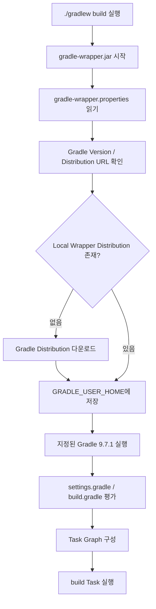
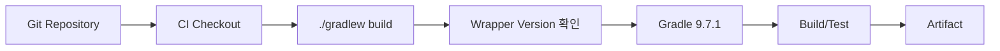

# Gradle Wrapper 및 프로젝트 운영 원칙

## 1. 문서 목적

Gradle을 처음 사용할 때 가장 중요하면서도 혼동하기 쉬운 개념이 **Gradle Wrapper**이다.

단순히 다음 명령만 외우면 Wrapper의 목적을 제대로 이해하기 어렵다.

```bash
./gradlew build
```

본 문서는 다음 질문에 답하는 것을 목표로 한다.

- Gradle을 설치했는데 왜 다시 `gradlew`를 사용하는가?
- `gradle`과 `gradlew`는 무엇이 다른가?
- Wrapper가 Gradle을 자동으로 다운로드한다는 것은 무슨 의미인가?
- `gradle-wrapper.properties`는 왜 필요한가?
- Wrapper 파일을 Git에 Commit해야 하는가?
- 프로젝트 구성원은 어떤 명령을 사용해야 하는가?
- CI/CD에서는 어떤 Gradle을 사용하는가?
- Gradle Version을 Upgrade할 때 무엇을 변경해야 하는가?

---

## 2. Wrapper를 한 문장으로 이해하기

Gradle Wrapper는 다음과 같이 이해하면 된다.

> **프로젝트가 사용할 Gradle Version을 프로젝트 자체가 지정하고, 모든 개발자와 CI/CD가 그 Version으로 Build하도록 만드는 실행 장치**

즉, Wrapper의 핵심은 단순한 실행 Script가 아니라 **Build Tool Version을 프로젝트의 일부로 관리하는 것**이다.

---

## 3. 왜 Wrapper가 필요한가

개발자 세 명이 같은 프로젝트를 개발한다고 가정한다.

### Wrapper가 없는 경우

```text
개발자 A PC
Gradle 9.7.1

개발자 B PC
Gradle 9.6.0

개발자 C PC
Gradle 8.14

CI Server
Gradle 9.5.0
```

모두 다음 명령을 사용한다.

```bash
gradle build
```

그러면 같은 Source를 Build하더라도 사용하는 Gradle Version이 서로 다르다.

Build Tool Version 차이는 다음 문제를 만들 수 있다.

- Plugin 동작 차이
- Deprecated 기능 처리 차이
- Build Script 문법 지원 차이
- Java Version 호환성 차이
- CI에서는 실패하지만 개발 PC에서는 성공하는 문제
- 개발자마다 Build 결과가 달라지는 문제

### Wrapper를 사용하는 경우

프로젝트에서 Gradle 9.7.1을 지정한다.

```text
개발자 A ─┐
개발자 B ─┼─→ gradlew ─→ Gradle 9.7.1
개발자 C ─┤
CI Server ─┘
```

각 PC에 설치된 Gradle Version이 달라도 프로젝트 Build는 같은 Gradle Version을 사용한다.

이것이 Wrapper를 사용하는 가장 중요한 이유이다.

---

## 4. `gradle`과 `gradlew`의 차이

### 개발 PC 설치 Gradle

```bash
gradle build
```

의미:

```text
현재 OS PATH에서 gradle 실행파일 검색
        ↓
PC에 설치된 Gradle 실행
        ↓
현재 PC Gradle Version으로 Build
```

### Gradle Wrapper

macOS / Linux:

```bash
./gradlew build
```

Windows:

```powershell
.\gradlew.bat build
```

의미:

```text
프로젝트 gradlew 실행
        ↓
gradle-wrapper.properties 확인
        ↓
프로젝트가 지정한 Gradle Version 확인
        ↓
해당 Version이 Local에 있는지 확인
        ↓
없으면 다운로드
        ↓
지정된 Gradle Version으로 Build
```

즉, `gradlew`의 `w`는 Wrapper를 의미한다.

```text
gradle
→ 개발 PC Gradle

gradlew
→ Gradle Wrapper
```

---

## 5. Wrapper 동작 흐름

프로젝트에 다음 설정이 있다고 가정한다.

```properties
distributionUrl=https\://services.gradle.org/distributions/gradle-9.7.1-bin.zip
```

개발자가 처음 다음 명령을 실행한다.

```bash
./gradlew build
```

Wrapper는 개념적으로 다음 순서로 동작한다.



두 번째 Build부터는 이미 다운로드한 Gradle Distribution을 재사용한다.

따라서 Wrapper를 사용한다고 해서 매번 인터넷에서 Gradle을 다시 다운로드하는 것은 아니다.

---

## 6. Wrapper 파일 구조

일반적인 Gradle 프로젝트에는 다음 파일이 포함된다.

```text
microserver/
├─ gradlew
├─ gradlew.bat
└─ gradle/
   └─ wrapper/
      ├─ gradle-wrapper.jar
      └─ gradle-wrapper.properties
```

각 파일의 역할을 정확히 구분해보자.

---

## 7. `gradlew`

```text
gradlew
```

macOS / Linux에서 사용하는 Shell Script이다.

예:

```bash
./gradlew build
```

이 Script 자체가 Gradle 전체 프로그램인 것은 아니다.

Wrapper JAR를 시작하고 프로젝트에 지정된 Gradle을 사용할 수 있도록 연결하는 **시작 Script**이다.

macOS/Linux에서는 실행 권한이 필요하다.

```bash
chmod +x gradlew
```

---

## 8. `gradlew.bat`

```text
gradlew.bat
```

Windows에서 사용하는 Batch Script이다.

PowerShell:

```powershell
.\gradlew.bat build
```

Command Prompt에서는 다음처럼 실행할 수도 있다.

```cmd
gradlew.bat build
```

역할은 macOS/Linux의 `gradlew`와 같다.

---

## 9. `gradle-wrapper.jar`

```text
gradle/wrapper/gradle-wrapper.jar
```

Wrapper의 실행 Code가 들어 있는 작은 JAR 파일이다.

주요 역할:

- Wrapper 설정 읽기
- Gradle Distribution 위치 확인
- 필요한 Gradle 다운로드
- 다운로드한 Gradle 실행

!!! important "Git 관리"
    Gradle 공식 문서는 `gradle-wrapper.jar`를 포함한 Wrapper 파일을 Version Control에 Commit하는 것을 전제로 한다.

따라서 `.jar` 파일이라고 해서 `.gitignore`로 제외하면 안 된다.

---

## 10. `gradle-wrapper.properties`

```text
gradle/wrapper/gradle-wrapper.properties
```

프로젝트가 사용할 Gradle Distribution을 정의한다.

대표적인 예:

```properties
distributionBase=GRADLE_USER_HOME
distributionPath=wrapper/dists
distributionUrl=https\://services.gradle.org/distributions/gradle-9.7.1-bin.zip
networkTimeout=10000
validateDistributionUrl=true
zipStoreBase=GRADLE_USER_HOME
zipStorePath=wrapper/dists
```

가장 중요한 항목:

```properties
distributionUrl=https\://services.gradle.org/distributions/gradle-9.7.1-bin.zip
```

여기에서 사실상 프로젝트 Gradle Version이 결정된다.

```text
gradle-9.7.1-bin.zip
       ↑
프로젝트 Gradle Version
```

---

## 11. Wrapper와 `GRADLE_USER_HOME`

Wrapper가 다운로드한 Gradle Distribution은 일반적으로 사용자 Gradle Home 아래에 저장된다.

Windows 기본 위치:

```text
C:\Users\<사용자>\.gradle
```

macOS / Linux:

```text
~/.gradle
```

그 아래 Wrapper Distribution이 저장된다.

```text
~/.gradle/
└─ wrapper/
   └─ dists/
      └─ gradle-9.7.1-bin/
         └─ ...
```

따라서 프로젝트 Directory 안에 Gradle 9.7.1 전체 Binary가 복사되는 것이 아니다.

```text
Git Project
├─ gradlew
├─ gradlew.bat
└─ gradle/wrapper/...
        │
        │ "9.7.1을 사용하라"
        ↓
사용자 ~/.gradle/wrapper/dists/
└─ 실제 Gradle Distribution
```

이 구조 때문에 Wrapper 관련 파일은 작게 유지하면서도 모든 개발자가 같은 Gradle Version을 사용할 수 있다.

---

## 12. Wrapper가 있으면 Gradle 설치가 필요 없는 이유

기존 Gradle 프로젝트에 다음 파일이 이미 있다면:

```text
gradlew
gradlew.bat
gradle/wrapper/gradle-wrapper.jar
gradle/wrapper/gradle-wrapper.properties
```

일반 개발자는 시스템 Gradle을 직접 실행할 필요가 없다.

macOS:

```bash
./gradlew build
```

Windows:

```powershell
.\gradlew.bat build
```

Wrapper가 필요한 Gradle Version을 준비하기 때문이다.

그래서 공식 Gradle 가이드도 기존 프로젝트 Build에는 Wrapper 사용을 권장한다.

---

## 13. 그렇다면 왜 개발 PC에 Gradle을 설치했는가

Wrapper 자체를 **처음 생성해야 하는 상황**에서는 실행 가능한 Gradle이 필요할 수 있다.

예:

```bash
gradle :wrapper --gradle-version 9.7.1
```

즉, 역할을 다음처럼 구분한다.

```text
개발 PC Gradle
→ Wrapper가 없는 초기 상황에서 Wrapper를 생성할 수 있음
→ Gradle 학습 및 관리 도구

Gradle Wrapper
→ 실제 프로젝트 Build의 표준 실행 도구
```

Spring Initializr로 Gradle 프로젝트를 생성하면 Wrapper 파일이 함께 생성되는 경우가 일반적이므로 프로젝트 구성원이 직접 Wrapper를 처음 만드는 상황은 많지 않다.

---

## 14. MicroServer 프로젝트 구성 원칙

MicroServer에서는 Wrapper를 단순한 편의 Script가 아니라 **Build 환경 표준화 구성요소**로 취급한다.

### 14.1 프로젝트 Build 명령

macOS / Linux:

```bash
./gradlew build
```

Windows:

```powershell
.\gradlew.bat build
```

### 14.2 사용하지 않는 방식

프로젝트 Build 문서에서 특별한 이유가 없다면 다음 명령을 기준으로 작성하지 않는다.

```bash
gradle build
```

이 명령은 시스템 설치 Gradle에 의존하기 때문이다.

---

## 15. Git에 Commit해야 하는 Wrapper 파일

다음 파일은 모두 Git으로 관리한다.

```text
gradlew
gradlew.bat
gradle/wrapper/gradle-wrapper.jar
gradle/wrapper/gradle-wrapper.properties
```

예:

```text
microserver/
├─ gradlew                                      [Commit]
├─ gradlew.bat                                  [Commit]
└─ gradle/
   └─ wrapper/
      ├─ gradle-wrapper.jar                     [Commit]
      └─ gradle-wrapper.properties              [Commit]
```

반면 다음 Directory는 일반적으로 Commit하지 않는다.

```text
.gradle/
build/
```

`.gradle/`은 프로젝트 Build 과정에서 생성되는 Local Gradle 상태/Cache 성격의 Directory이다.

`build/`는 Build 결과물이다.

---

## 16. Wrapper 파일을 임의로 수정하지 않는 이유

Wrapper Script와 JAR는 Gradle이 생성하는 파일이다.

따라서 Version 변경이 필요하다고 해서 다음 파일을 텍스트 편집기로 직접 수정하는 방식은 권장하지 않는다.

```text
gradlew
gradlew.bat
gradle-wrapper.jar
```

Wrapper Version 변경은 Gradle의 `wrapper` Task를 사용한다.

---

## 17. Gradle Version 확인

현재 프로젝트 Wrapper Version을 확인한다.

macOS / Linux:

```bash
./gradlew --version
```

Windows:

```powershell
.\gradlew.bat --version
```

확인할 주요 항목:

```text
Gradle 9.7.1
JVM 26
```

---

## 18. Wrapper Version Upgrade

Gradle 공식 문서에서는 Wrapper Task를 이용한 Upgrade를 권장한다.

macOS / Linux:

```bash
./gradlew :wrapper --gradle-version 9.7.1
```

Windows:

```powershell
.\gradlew.bat :wrapper --gradle-version 9.7.1
```

Gradle 9.7.1 Release Note에서는 Wrapper 파일 자체까지 최신화하기 위해 Wrapper Task를 다시 실행하는 방식도 안내한다.

예:

```bash
./gradlew :wrapper --gradle-version 9.7.1
./gradlew :wrapper
```

Upgrade 후에는 다음을 확인한다.

```bash
./gradlew --version
```

그리고 변경된 Wrapper 파일을 Git에 Commit한다.

---

## 19. `bin` Distribution을 기본으로 사용하는 이유

Wrapper 설정에서도 일반적으로 다음 Distribution을 사용한다.

```text
gradle-9.7.1-bin.zip
```

예:

```properties
distributionUrl=https\://services.gradle.org/distributions/gradle-9.7.1-bin.zip
```

`bin` Distribution은 Build 실행에 필요한 Runtime을 포함한다.

`all` Distribution은 Source와 Documentation도 포함하므로 용량이 더 크다.

일반 개발 및 CI Build에는 `bin`으로 충분하다.

---

## 20. 사내망 / 폐쇄망에서는 어떻게 되는가

금융 SI 프로젝트에서는 인터넷 접근이 제한된 개발망을 사용할 수 있다.

Wrapper의 기본 Distribution URL이 외부 Gradle Server라면:

```properties
distributionUrl=https\://services.gradle.org/distributions/gradle-9.7.1-bin.zip
```

인터넷이 차단된 환경에서는 최초 다운로드가 실패할 수 있다.

이 경우 프로젝트 정책에 따라 다음 방식을 검토할 수 있다.

```text
사내 Artifact Repository
사내 HTTP Repository
사내 파일 배포 서버
사전 다운로드한 Gradle Distribution
```

예를 들어 사내 Repository에서 Gradle Distribution을 제공한다면 Wrapper의 Distribution URL을 사내 주소로 운영할 수 있다.

```properties
distributionUrl=https\://repository.company.local/gradle/gradle-9.7.1-bin.zip
```

!!! warning "Credential"
    Repository 인증정보를 `gradle-wrapper.properties`에 평문으로 Commit하는 방식은 피한다.

실제 사내 Repository / Proxy / 인증 정책은 프로젝트 보안 기준에 맞춰 별도 구성한다.

---

## 21. Wrapper와 CI/CD

CI Server에 Gradle 9.7.1을 따로 설치해 두는 구조보다 Source Repository의 Wrapper를 실행하는 구조가 Build 재현성 측면에서 명확하다.



이렇게 하면 Local과 CI가 같은 실행 기준을 사용한다.

```text
개발자 Local
./gradlew build

CI
./gradlew build

→ 동일 Wrapper Version
```

---

## 22. 자주 하는 오해

### 오해 1. Gradle 9.7.1을 설치했으니 프로젝트도 자동으로 9.7.1이다

아니다.

프로젝트 Wrapper Version은 다음 파일이 기준이다.

```text
gradle/wrapper/gradle-wrapper.properties
```

---

### 오해 2. `gradlew`는 Gradle 실행파일 자체이다

정확히는 Wrapper 실행 Script이다.

Wrapper가 프로젝트에서 사용할 Gradle Distribution을 찾아 실행한다.

---

### 오해 3. Wrapper를 사용하면 매번 Gradle을 다운로드한다

아니다.

한 번 다운로드한 Distribution은 일반적으로 `GRADLE_USER_HOME`의 Wrapper Cache에서 재사용한다.

---

### 오해 4. `gradle-wrapper.jar`는 Binary라 Git에 넣으면 안 된다

Wrapper JAR는 Gradle 공식 구조상 Version Control에 포함하는 파일이다.

---

### 오해 5. 개발자마다 Gradle을 같은 Directory에 설치해야 한다

Wrapper를 사용하면 개발 PC의 Gradle 설치 위치는 프로젝트 Build 기준이 아니다.

중요한 것은 프로젝트의 Wrapper 설정이다.

---

## 23. MicroServer Wrapper 체크리스트

Spring Boot 프로젝트 생성 이후 다음을 확인한다.

- [ ] `gradlew`가 존재한다.
- [ ] `gradlew.bat`가 존재한다.
- [ ] `gradle/wrapper/gradle-wrapper.jar`가 존재한다.
- [ ] `gradle/wrapper/gradle-wrapper.properties`가 존재한다.
- [ ] Wrapper Version이 프로젝트 표준 Version과 일치한다.
- [ ] `./gradlew --version` 또는 `.\gradlew.bat --version`이 정상 동작한다.
- [ ] Wrapper 파일 전체가 Git 관리 대상이다.
- [ ] `.gradle/`과 `build/`는 Git에서 제외한다.
- [ ] 프로젝트 Build 문서는 `gradle`보다 `gradlew` 기준으로 작성한다.
- [ ] CI/CD도 프로젝트 Wrapper를 실행하도록 구성한다.

---

## 24. 다음 문서

Wrapper를 이해했다면 Gradle의 실제 실행 명령, Cache 구조 및 문제 해결 방법을 확인한다.

→ [Gradle 명령어·Cache·문제 해결](gradle_usage.md)

---

## 25. 공식 참고 자료

- [Gradle Wrapper](https://docs.gradle.org/current/userguide/gradle_wrapper.html)
- [Gradle Wrapper Basics](https://docs.gradle.org/current/userguide/gradle_wrapper_basics.html)
- [Gradle Installing Guide](https://docs.gradle.org/current/userguide/installation.html)
- [Gradle 9.7.1 Release Notes](https://docs.gradle.org/9.7.1/release-notes.html)
