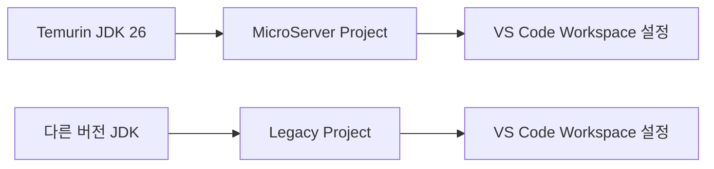
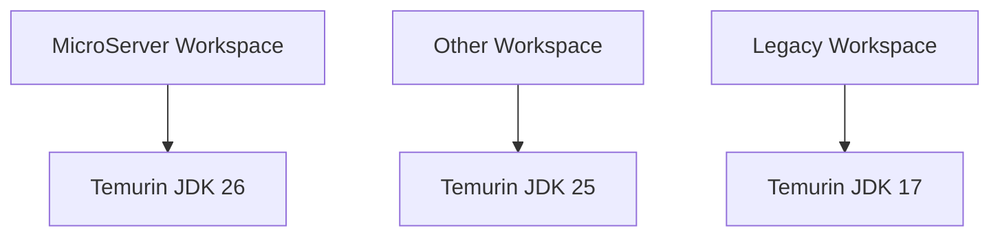
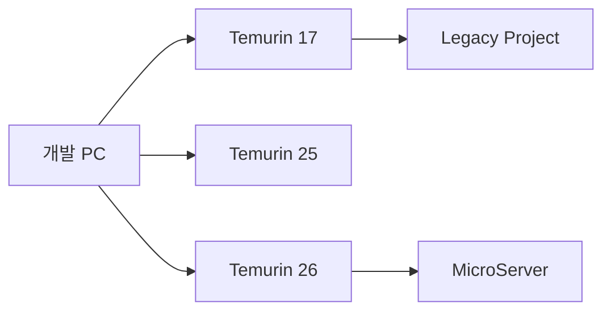

# JDK 설치 및 설정 가이드

## 1. 문서 목적

본 문서는 MicroServer 프로젝트의 Java 개발을 시작하기 위한 **JDK(Java Development Kit) 준비 및 프로젝트별 JDK 연결 방법**을 설명한다.

이 단계에서는 아직 Spring Boot 프로젝트나 Maven 빌드 환경을 구성하지 않는다.
따라서 본 문서의 범위는 다음과 같다.

- Eclipse Temurin JDK 다운로드
- Windows / macOS에서 JDK 압축 해제 및 보관
- JDK 자체 정상 동작 확인
- VS Code에서 프로젝트별로 사용할 JDK 지정

다음 내용은 본 문서에서 다루지 않는다.

- Spring Boot 프로젝트 생성
- Maven 설치 및 설정
- `pom.xml` 설정
- Spring Boot Java 버전 설정
- 애플리케이션 실행 및 빌드

위 항목은 이후 단계의 가이드 문서에서 별도로 구성한다.

---

## 2. 프로젝트 JDK 운영 원칙

MicroServer 프로젝트는 JDK를 운영체제 전체에 공통으로 적용하는 방식보다 **프로젝트별로 명시적으로 JDK를 선택하는 방식**을 사용한다.

즉, 다음과 같은 전역 설정을 기본 운영 방식으로 사용하지 않는다.

```text
JAVA_HOME
PATH에 JDK/bin 등록
운영체제 기본 Java 변경
```

대신 JDK를 개발 장비의 지정된 디렉터리에 보관하고, VS Code Workspace 설정에서 해당 프로젝트가 사용할 JDK를 직접 지정한다.



이 방식의 장점은 다음과 같다.

- 프로젝트마다 서로 다른 JDK 버전을 사용할 수 있다.
- 다른 Java 프로젝트의 JDK 설정에 영향을 주지 않는다.
- `JAVA_HOME` 변경으로 인해 기존 프로젝트가 영향을 받는 문제를 줄일 수 있다.
- 개발자가 여러 Java 버전을 동시에 보유하기 쉽다.
- 프로젝트별 JDK 버전을 명확하게 관리할 수 있다.

!!! note "STS와 유사한 프로젝트별 JDK 운영"
    STS/Eclipse에서 프로젝트별 Installed JRE 또는 Execution Environment를 지정하는 것과 유사하게, VS Code에서도 Java Runtime 설정을 이용하여 프로젝트별 JDK를 선택할 수 있다.

---

## 3. 프로젝트 표준 JDK

MicroServer 프로젝트의 JDK 배포판은 **Eclipse Temurin**을 사용한다.

2026년 8월 기준 Eclipse Adoptium의 최신 일반 Java 릴리스는 다음과 같다.

```text
Eclipse Temurin JDK 26
현재 릴리스: 26.0.2+10
```

따라서 본 프로젝트에서는 **Temurin JDK 26**을 기준으로 개발환경을 구성한다.

!!! info "LTS 버전 참고"
    Java 26은 현재 최신 일반 릴리스이며 LTS 버전은 아니다.
    현재 최신 LTS는 Java 25이다.
    본 프로젝트에서는 최신 버전을 적용한다는 기준에 따라 Java 26을 사용한다.

JDK는 Oracle JDK, Amazon Corretto, Microsoft Build of OpenJDK 등 여러 배포판이 존재하지만 프로젝트 내 개발환경의 일관성을 위해 **Eclipse Temurin으로 통일**한다.

---

## 4. JDK와 JRE의 차이

Java 개발환경에서는 JRE가 아니라 반드시 JDK가 필요하다.

```text
JDK
 ├─ Java Runtime
 ├─ javac Compiler
 ├─ Debug / Diagnostic Tools
 ├─ javadoc
 └─ 기타 Java 개발 도구
```

Temurin 다운로드 시 다음 항목을 확인한다.

```text
Version      : 26
Package Type : JDK
JVM          : HotSpot
Architecture : 개발 장비에 맞게 선택
```

JRE만 다운로드하지 않도록 주의한다.

---

## 5. JDK 설치 방식

본 프로젝트에서는 JDK를 운영체제용 Installer로 설치한 후 `JAVA_HOME`을 등록하는 방식보다 **압축 배포본을 다운로드하여 개발 도구 디렉터리에 직접 보관하는 방식**을 권장한다.

예를 들어 다음과 같이 여러 버전의 JDK를 함께 보관할 수 있다.

### Windows

```text
C:\dev\jdks
 ├─ temurin-26
 ├─ temurin-25
 └─ temurin-17
```

### macOS

```text
~/dev/jdks
 ├─ temurin-26.jdk
 ├─ temurin-25.jdk
 └─ temurin-17.jdk
```

각 프로젝트는 필요한 JDK 디렉터리를 VS Code에서 별도로 지정한다.

!!! warning "JDK를 프로젝트 Git 저장소에 포함하지 않는다"
    JDK 자체는 용량이 크고 운영체제 및 CPU Architecture에 따라 파일이 달라진다.
    따라서 JDK 바이너리를 Git Repository에 포함하지 않는다.

---

# Windows 환경

## 6. Windows Temurin JDK 준비

### 6.1 개발 장비 Architecture 확인

일반적인 Windows 개발 장비는 x64 환경을 사용한다.

PowerShell에서 확인할 수 있다.

```powershell
$env:PROCESSOR_ARCHITECTURE
```

일반적인 출력:

```text
AMD64
```

이 경우 Temurin 다운로드 시 **Windows / x64 / JDK**를 선택한다.

ARM 기반 Windows 장비라면 해당 Architecture에 맞는 패키지를 선택한다.

---

### 6.2 Temurin JDK 다운로드

Eclipse Adoptium 공식 사이트에서 Temurin JDK를 다운로드한다.

- Eclipse Adoptium: <https://adoptium.net/>
- Temurin Releases: <https://adoptium.net/temurin/releases/>

다운로드 기준:

```text
Version      : 26
Operating OS : Windows
Architecture : x64
Package Type : JDK
Archive      : ZIP
```

본 프로젝트에서는 시스템 Installer보다 **ZIP 압축 배포본 사용을 권장**한다.

---

### 6.3 JDK 압축 해제

예를 들어 다음 디렉터리를 생성한다.

```text
C:\dev\jdks
```

다운로드한 Temurin JDK ZIP 파일의 압축을 해제한 후 관리하기 쉬운 이름으로 정리한다.

예:

```text
C:\dev\jdks\temurin-26
```

JDK 내부 구조는 대략 다음과 같다.

```text
C:\dev\jdks\temurin-26
 ├─ bin
 │   ├─ java.exe
 │   ├─ javac.exe
 │   └─ ...
 ├─ conf
 ├─ include
 ├─ jmods
 ├─ legal
 ├─ lib
 └─ release
```

VS Code에서 지정해야 하는 경로는 `bin`이 아니라 **JDK Home 디렉터리 자체**이다.

```text
O  C:\dev\jdks\temurin-26
X  C:\dev\jdks\temurin-26\bin
X  C:\dev\jdks\temurin-26\bin\java.exe
```

---

### 6.4 Windows JDK 정상 동작 확인

본 프로젝트에서는 시스템 PATH에 Java를 등록하지 않으므로 다음 명령이 반드시 동작할 필요는 없다.

```powershell
java -version
```

대신 JDK의 실행파일을 직접 지정하여 확인한다.

```powershell
& "C:\dev\jdks\temurin-26\bin\java.exe" -version
```

Compiler 확인:

```powershell
& "C:\dev\jdks\temurin-26\bin\javac.exe" -version
```

정상적으로 설치되었다면 다음과 같이 Java 26 버전이 확인된다.

```text
openjdk version "26..."
OpenJDK Runtime Environment Temurin-26...
OpenJDK 64-Bit Server VM Temurin-26...
```

`javac` 역시 26 버전이 출력되는지 확인한다.

---

# macOS 환경

## 7. macOS Temurin JDK 준비

### 7.1 Mac Architecture 확인

Terminal에서 다음 명령을 실행한다.

```bash
uname -m
```

Apple Silicon Mac:

```text
arm64
```

Intel Mac:

```text
x86_64
```

Apple Silicon 환경에서는 Temurin의 **macOS / AArch64** 패키지를 사용한다.

---

### 7.2 Temurin JDK 다운로드

Eclipse Adoptium 공식 사이트에서 다운로드한다.

- Eclipse Adoptium: <https://adoptium.net/>
- Temurin Releases: <https://adoptium.net/temurin/releases/>

Apple Silicon 기준:

```text
Version      : 26
Operating OS : macOS
Architecture : AArch64
Package Type : JDK
Archive      : TAR.GZ
```

Intel Mac은 Architecture를 x64로 선택한다.

본 프로젝트에서는 macOS Installer인 `.pkg`보다 **압축 배포본(TAR.GZ)** 사용을 권장한다.

---

### 7.3 JDK 압축 해제

JDK 관리 디렉터리를 생성한다.

```bash
mkdir -p ~/dev/jdks
```

다운로드한 TAR.GZ 파일의 압축을 해제한다.

예:

```bash
tar -xzf OpenJDK26U-jdk_*.tar.gz -C ~/dev/jdks
```

압축 해제된 디렉터리는 필요하면 다음과 같이 관리하기 쉬운 이름으로 변경한다.

```text
~/dev/jdks/temurin-26.jdk
```

macOS JDK의 실제 Java Home은 일반적으로 다음 위치이다.

```text
~/dev/jdks/temurin-26.jdk/Contents/Home
```

구조 예:

```text
temurin-26.jdk
 └─ Contents
     └─ Home
         ├─ bin
         ├─ conf
         ├─ include
         ├─ jmods
         ├─ legal
         └─ lib
```

VS Code에서 지정할 JDK 경로는 다음과 같다.

```text
~/dev/jdks/temurin-26.jdk/Contents/Home
```

---

### 7.4 macOS JDK 정상 동작 확인

전역 `JAVA_HOME`을 설정하지 않고 JDK 실행파일을 직접 호출한다.

```bash
~/dev/jdks/temurin-26.jdk/Contents/Home/bin/java -version
```

Compiler 확인:

```bash
~/dev/jdks/temurin-26.jdk/Contents/Home/bin/javac -version
```

정상적으로 Java 26이 출력되는지 확인한다.

!!! note
    본 프로젝트에서는 `~/.zshrc`에 `JAVA_HOME` 또는 JDK `bin` 경로를 등록하는 것을 기본 설정으로 사용하지 않는다.

---

# VS Code 프로젝트별 JDK 설정

## 8. 프로젝트별 JDK를 사용하는 이유

개발 장비에는 여러 프로젝트가 존재할 수 있다.

예:

```text
Project A → JDK 26
Project B → JDK 25
Legacy    → JDK 17
```

OS 환경변수의 `JAVA_HOME`을 바꾸는 방식은 현재 작업 중인 프로젝트뿐 아니라 다른 터미널이나 개발 도구에도 영향을 줄 수 있다.

MicroServer 프로젝트에서는 이를 피하기 위해 **VS Code Workspace가 사용할 JDK를 프로젝트 단위로 지정**한다.



---

## 9. VS Code Java Runtime 설정 개념

VS Code의 Java 확장에서는 여러 JDK를 등록하고 프로젝트에서 사용할 Java Runtime을 지정할 수 있다.

주요 설정은 다음과 같다.

```text
java.configuration.runtimes
```

이 설정은 Java Execution Environment와 로컬 JDK 경로를 연결한다.

예:

```json
{
    "java.configuration.runtimes": [
        {
            "name": "JavaSE-26",
            "path": "JDK_HOME_PATH",
            "default": true
        }
    ]
}
```

`path`에는 반드시 JDK의 Home 디렉터리를 지정한다.

```text
O  JDK Home
X  JDK Home/bin
X  java 실행파일
```

현재 VS Code Java 확장은 `JavaSE-26` Runtime을 지원한다.

---

## 10. Workspace 단위 설정

VS Code에는 크게 다음 두 종류의 설정이 있다.

```text
User Settings
    └─ 모든 프로젝트에 공통 적용

Workspace Settings
    └─ 현재 프로젝트에만 적용
```

MicroServer 프로젝트에서는 Java Runtime을 **Workspace Settings에 설정하는 방식**을 사용한다.

프로젝트 디렉터리를 VS Code에서 열면 Workspace 설정은 일반적으로 다음 파일에 저장된다.

```text
<project-root>/.vscode/settings.json
```

예:

```text
microserver
 ├─ .vscode
 │   └─ settings.json
 ├─ docs
 └─ ...
```

이 설정을 사용하면 다른 VS Code 프로젝트의 JDK 설정과 분리할 수 있다.

!!! note "Workspace Trust"
    `java.configuration.runtimes`는 개발 장비의 로컬 JDK 경로를 참조하는 설정이다.
    신뢰되지 않은 Workspace에서는 보안 정책에 따라 제한될 수 있으므로, 본인이 생성하거나 검증한 프로젝트라면 VS Code의 Workspace Trust 상태도 함께 확인한다.

---

## 11. Windows 프로젝트별 JDK 설정

예를 들어 Windows에서 Temurin JDK를 다음 위치에 준비했다고 가정한다.

```text
C:\dev\jdks\temurin-26
```

MicroServer 프로젝트의 `.vscode/settings.json`에 다음과 같이 설정한다.

```json
{
    "java.configuration.runtimes": [
        {
            "name": "JavaSE-26",
            "path": "C:\\dev\\jdks\\temurin-26",
            "default": true
        }
    ]
}
```

Windows JSON에서는 `\` 문자를 다음과 같이 두 번 작성해야 한다.

```text
C:\\dev\\jdks\\temurin-26
```

또는 `/` 형태로 작성할 수도 있다.

```json
{
    "java.configuration.runtimes": [
        {
            "name": "JavaSE-26",
            "path": "C:/dev/jdks/temurin-26",
            "default": true
        }
    ]
}
```

---

## 12. macOS 프로젝트별 JDK 설정

macOS에서 JDK가 다음 위치에 있다고 가정한다.

```text
/Users/<사용자계정>/dev/jdks/temurin-26.jdk/Contents/Home
```

`.vscode/settings.json`:

```json
{
    "java.configuration.runtimes": [
        {
            "name": "JavaSE-26",
            "path": "/Users/<사용자계정>/dev/jdks/temurin-26.jdk/Contents/Home",
            "default": true
        }
    ]
}
```

`~` 대신 실제 절대 경로를 지정하는 것을 권장한다.

현재 VS Code Java Runtime 경로 설정에서는 **JDK Home 절대 경로를 사용하는 것이 가장 명확하다.**

---

## 13. `java.jdt.ls.java.home`과의 차이

VS Code Java 설정에는 다음 속성도 존재한다.

```text
java.jdt.ls.java.home
```

하지만 이 설정과 프로젝트 Runtime은 역할이 다르다.

### `java.jdt.ls.java.home`

Java Language Server 자체를 실행하기 위한 JDK를 지정한다.

```text
VS Code
  └─ Java Language Server 실행용 JDK
```

최근 VS Code Java Extension은 Windows x64, macOS x64/AArch64 등 주요 플랫폼에서 Java Language Server 실행용 Runtime을 자체 포함할 수 있다.

따라서 MicroServer 프로젝트에서는 특별한 이유가 없는 한 이 값을 별도로 지정하지 않는다.

### `java.configuration.runtimes`

프로젝트가 사용할 Java Runtime을 지정한다.

```text
MicroServer Project
  └─ Temurin JDK 26
```

따라서 본 프로젝트에서 중요하게 관리할 설정은 다음이다.

```text
java.configuration.runtimes
```

!!! warning
    `java.jdt.ls.java.home`을 프로젝트 JDK 설정과 동일한 개념으로 사용하지 않는다.
    Language Server 실행 JDK와 프로젝트 컴파일용 JDK는 목적이 다르다.

---

## 14. VS Code 화면에서 JDK 확인

Java 관련 VS Code 확장 설치가 완료된 이후 Command Palette에서 다음 명령을 사용할 수 있다.

Windows:

```text
Ctrl + Shift + P
```

macOS:

```text
Command + Shift + P
```

검색:

```text
Java: Configure Java Runtime
```

이 화면에서는 현재 VS Code가 인식한 JDK와 프로젝트 Runtime을 확인할 수 있다.

확인해야 할 항목:

```text
Project Runtime
    JavaSE-26

JDK Path
    Windows : C:\dev\jdks\temurin-26
    macOS   : .../temurin-26.jdk/Contents/Home
```

!!! note
    Java Extension 설치 및 VS Code의 세부 Java 개발환경 구성은 다음 단계인 **VS Code 개발환경 구성 가이드**에서 설명한다.
    본 문서에서는 JDK와 프로젝트 Runtime의 연결 개념까지만 다룬다.

---

## 15. 프로젝트별 설정 시 주의사항

### 15.1 `JAVA_HOME`을 추가하지 않는다

본 프로젝트에서는 기본적으로 다음 설정을 하지 않는다.

Windows:

```text
JAVA_HOME=C:\...\jdk
Path=%JAVA_HOME%\bin
```

macOS:

```bash
export JAVA_HOME=...
export PATH="$JAVA_HOME/bin:$PATH"
```

프로젝트 JDK는 VS Code Workspace에서 지정한다.

---

### 15.2 JDK 경로는 개발 장비별로 다를 수 있다

Workspace의 JDK 경로는 개발자 로컬 장비의 실제 파일 경로를 사용한다.

예:

```text
개발자 A
C:\dev\jdks\temurin-26

개발자 B
D:\development\jdks\temurin-26
```

따라서 팀에서 `.vscode/settings.json`을 Git으로 공유하려면 JDK 경로 정책을 별도로 정해야 한다.

가장 단순한 방법은 개발 장비별 표준 JDK 보관 경로를 정하는 것이다.

예:

```text
Windows : C:\dev\jdks\temurin-26
macOS   : ~/dev/jdks/temurin-26.jdk/Contents/Home
```

Windows와 macOS가 동시에 존재하는 프로젝트에서는 JDK 경로가 서로 다르므로 **JDK 경로가 포함된 Workspace 설정을 무조건 공통 커밋하지 않는 것**이 안전하다.

필요한 경우 팀 표준 경로 또는 개발자별 로컬 설정 운영 정책을 별도로 정한다.

---

### 15.3 JDK 경로는 절대 경로로 명확하게 지정한다

프로젝트 Runtime 설정의 `path`에는 개발 장비에 존재하는 **JDK Home 절대 경로**를 지정하는 것을 권장한다.

Windows 예:

```text
C:/dev/jdks/temurin-26
```

macOS 예:

```text
/Users/<사용자계정>/dev/jdks/temurin-26.jdk/Contents/Home
```

JDK 자체는 Git 프로젝트와 분리된 개발 도구 영역에 보관하고, VS Code Workspace가 해당 경로를 바라보도록 구성한다.

---

## 16. 여러 프로젝트에서 서로 다른 JDK 사용 예

한 개발 장비에 다음 JDK가 있다고 가정한다.

```text
C:\dev\jdks
 ├─ temurin-17
 ├─ temurin-25
 └─ temurin-26
```

MicroServer:

```json
{
    "java.configuration.runtimes": [
        {
            "name": "JavaSE-26",
            "path": "C:/dev/jdks/temurin-26",
            "default": true
        }
    ]
}
```

Legacy Project:

```json
{
    "java.configuration.runtimes": [
        {
            "name": "JavaSE-17",
            "path": "C:/dev/jdks/temurin-17",
            "default": true
        }
    ]
}
```

이 경우 OS의 기본 Java 환경을 변경하지 않고 프로젝트를 전환할 수 있다.



---

## 17. 최종 확인

JDK 준비가 끝나면 다음 사항을 확인한다.

### Windows

```powershell
& "C:\dev\jdks\temurin-26\bin\java.exe" -version
& "C:\dev\jdks\temurin-26\bin\javac.exe" -version
```

### macOS

```bash
~/dev/jdks/temurin-26.jdk/Contents/Home/bin/java -version
~/dev/jdks/temurin-26.jdk/Contents/Home/bin/javac -version
```

VS Code Java 개발환경 구성이 완료된 이후에는 다음 명령으로 프로젝트 Runtime을 확인한다.

```text
Java: Configure Java Runtime
```

MicroServer 프로젝트가 다음 Runtime을 바라보고 있는지 확인한다.

```text
JavaSE-26
```

---

## 18. 체크리스트

- [ ] Eclipse Temurin JDK를 사용한다.
- [ ] 프로젝트 기준 JDK가 Java 26으로 준비되어 있다.
- [ ] JRE가 아닌 JDK Package를 다운로드했다.
- [ ] Windows에서는 ZIP 배포본을 사용했다.
- [ ] macOS에서는 TAR.GZ 배포본을 사용했다.
- [ ] JDK를 프로젝트 Git Repository 외부에 보관했다.
- [ ] JDK의 `java` 실행파일이 정상 동작한다.
- [ ] JDK의 `javac` 실행파일이 정상 동작한다.
- [ ] 전역 `JAVA_HOME` 설정을 프로젝트 기본 구성으로 사용하지 않는다.
- [ ] JDK `bin` 디렉터리를 전역 PATH에 추가하지 않았다.
- [ ] VS Code Workspace에서 `java.configuration.runtimes`로 프로젝트 JDK를 지정할 준비가 되어 있다.
- [ ] VS Code가 JDK Home 디렉터리를 바라보도록 설정한다.
- [ ] Spring Boot / Maven / `pom.xml` 관련 설정은 이후 가이드에서 진행한다.

---

## 19. 다음 단계

JDK 준비가 완료되면 다음 가이드를 진행한다.

```text
JDK 설치 및 설정
        ↓
VS Code 개발환경 구성
        ↓
Maven 설치 및 설정
        ↓
Spring Boot 프로젝트 구성
```

다음 단계에서는 VS Code의 Java 개발 확장 기능과 프로젝트 개발환경을 구성한다.

---

## 20. 공식 참고 자료

- Eclipse Adoptium: <https://adoptium.net/>
- Eclipse Temurin Release Roadmap: <https://adoptium.net/support/>
- VS Code Java - Managing Java Projects: <https://code.visualstudio.com/docs/java/java-project>
- Language Support for Java by Red Hat: <https://github.com/redhat-developer/vscode-java>
- VS Code Settings Scope: <https://code.visualstudio.com/api/references/contribution-points>
