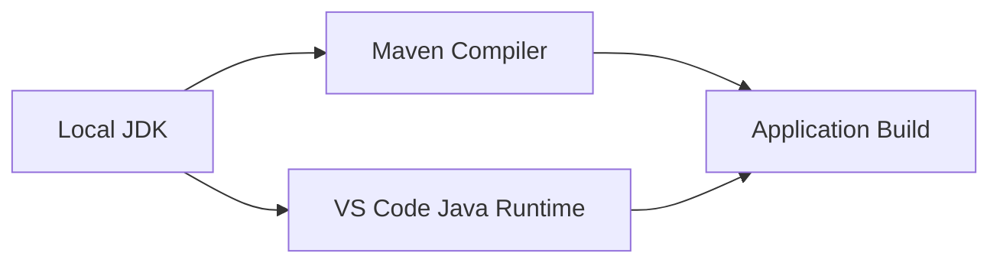

# JDK 설치 및 설정 가이드

## 1. 문서 목적

본 문서는 MicroServer 프로젝트의 Java 소스 컴파일, 테스트, Maven 빌드 및 Spring 애플리케이션 실행에 필요한 **JDK(Java Development Kit)** 환경을 Windows와 macOS에 구성한다.

프로젝트에서는 개발자별 Java 버전 차이로 인한 빌드 오류를 방지하기 위해 동일한 LTS 계열 JDK 사용을 권장한다.

본 가이드의 프로젝트 기준 예시는 **JDK 25 LTS**로 작성한다.

---

## 2. JDK와 JRE의 차이

```text
JDK
 ├─ Java Compiler (javac)
 ├─ Java Runtime
 ├─ Debug / Diagnostic Tools
 └─ 개발 도구
```

개발 환경에서는 단순 실행 환경인 JRE만 설치하지 않고 반드시 JDK를 설치한다.

확인해야 할 대표 명령:

```bash
java -version
javac -version
```

---

## 3. 프로젝트 Java 버전 운영 원칙

MicroServer 프로젝트에서는 Java 버전을 다음 세 위치에서 일치시킨다.



확인 대상:

1. OS `JAVA_HOME`
2. VS Code Java Runtime
3. Maven `pom.xml`의 Java 버전

예:

```xml
<properties>
    <java.version>25</java.version>
</properties>
```

또는 Maven Compiler Plugin에서 release 기준을 지정할 수 있다.

---

## 4. JDK 배포판 선택

Java는 여러 OpenJDK 배포판이 존재한다.

개발팀에서는 특정 개발자만 별도 배포판을 사용하기보다 하나의 배포판과 버전을 정해 공통 사용하도록 한다.

예:

- Eclipse Temurin
- Oracle JDK
- Microsoft Build of OpenJDK
- Amazon Corretto

본 가이드는 특정 Vendor 기능에 의존하지 않고 **OpenJDK 25 호환 JDK**를 기준으로 설명한다.

---

# Windows 설정

## 5. Windows JDK 설치

### 5.1 기존 Java 확인

PowerShell:

```powershell
java -version
javac -version
```

설치된 Java 실행파일 위치 확인:

```powershell
where.exe java
where.exe javac
```

여러 Java가 설치된 PC에서는 PATH에 어떤 Java가 먼저 등록되어 있는지 반드시 확인한다.

### 5.2 JDK 설치

JDK 25 x64 설치 패키지를 내려받아 설치한다.

예시 설치 위치:

```text
C:\Program Files\Java\jdk-25
```

또는 사용하는 JDK 배포판의 설치 디렉터리를 사용한다.

---

## 6. Windows `JAVA_HOME` 설정

Windows 검색에서 **시스템 환경 변수 편집**을 실행한다.

환경 변수에서 사용자 또는 시스템 변수에 다음 값을 추가한다.

```text
변수 이름: JAVA_HOME
변수 값:   C:\Program Files\Java\jdk-25
```

`Path`에는 다음 항목을 추가한다.

```text
%JAVA_HOME%\bin
```

기존에 오래된 Java 경로가 Path에 있다면 우선순위를 확인한다.

새 PowerShell을 실행하고 확인한다.

```powershell
echo $env:JAVA_HOME
java -version
javac -version
```

---

## 7. Windows에서 현재 Java 경로 확인

```powershell
where.exe java
```

Java 설정 상세 확인:

```powershell
java -XshowSettings:properties -version 2>&1 | Select-String "java.home"
```

`JAVA_HOME`과 실제 `java`가 서로 다른 JDK를 바라보고 있지 않은지 확인한다.

---

# macOS 설정

## 8. macOS JDK 설치 확인

```bash
java -version
javac -version
```

설치된 JDK 목록:

```bash
/usr/libexec/java_home -V
```

---

## 9. macOS JDK 설치

JDK 25 macOS 설치 패키지를 사용하거나 Homebrew를 사용할 수 있다.

설치 완료 후:

```bash
/usr/libexec/java_home -V
```

JDK 25 경로 확인:

```bash
/usr/libexec/java_home -v 25
```

---

## 10. macOS `JAVA_HOME` 설정

현재 터미널에서 임시 설정:

```bash
export JAVA_HOME=$(/usr/libexec/java_home -v 25)
export PATH="$JAVA_HOME/bin:$PATH"
```

확인:

```bash
echo $JAVA_HOME
java -version
javac -version
```

지속적으로 사용하려면 zsh 설정에 추가한다.

```bash
nano ~/.zshrc
```

추가:

```bash
export JAVA_HOME=$(/usr/libexec/java_home -v 25)
export PATH="$JAVA_HOME/bin:$PATH"
```

적용:

```bash
source ~/.zshrc
```

---

## 11. Apple Silicon 확인

```bash
uname -m
```

Apple Silicon:

```text
arm64
```

가능하면 JDK도 ARM64용 네이티브 배포판을 설치한다.

---

## 12. Maven에서 JDK 확인

Maven이 설치된 후 반드시 다음 명령으로 Maven이 사용하는 Java를 확인한다.

```bash
mvn -version
```

출력에서 다음 정보를 확인한다.

```text
Java version: 21...
Java home: ...
```

Maven의 Java 버전이 `java -version` 결과와 다르다면 `JAVA_HOME` 또는 실행 Terminal 환경을 확인한다.

---

## 13. 프로젝트 `pom.xml` Java 버전 확인

Spring Boot 기반 프로젝트 예:

```xml
<properties>
    <java.version>25</java.version>
</properties>
```

일반 Maven 프로젝트에서는 다음과 같이 설정할 수도 있다.

```xml
<properties>
    <maven.compiler.release>25</maven.compiler.release>
</properties>
```

부모 POM에서 Java 버전을 관리하는 멀티모듈 프로젝트라면 하위 모듈에서 반복 선언하지 않는다.

```text
microserver-parent
 ├─ pom.xml   ← Java 버전 공통 관리
 ├─ common
 ├─ core
 └─ application
```

---

## 14. Java 버전 불일치 문제

### `Unsupported class file major version`

컴파일한 Java 버전과 실행 Java 버전이 맞지 않을 때 발생할 수 있다.

확인:

```bash
java -version
javac -version
mvn -version
```

### `invalid target release`

Maven Compiler가 요청한 Java 버전을 현재 JDK가 지원하지 않을 때 발생할 수 있다.

예를 들어 프로젝트는 Java 25인데 개발 PC가 JDK 17을 사용하는 경우를 확인한다.

### VS Code만 다른 Java를 사용하는 경우

터미널에서는 정상인데 VS Code Java Language Server가 다른 JDK를 사용할 수 있다.

이 경우 VS Code의 다음 명령을 확인한다.

```text
Java: Configure Java Runtime
```

VS Code 개발환경 문서에서 상세 설정한다.

---

## 15. 여러 JDK를 사용하는 경우

여러 프로젝트 때문에 JDK 17과 JDK 25을 동시에 설치할 수 있다.

macOS에서는:

```bash
/usr/libexec/java_home -V
```

현재 세션을 JDK 17로 변경:

```bash
export JAVA_HOME=$(/usr/libexec/java_home -v 17)
```

JDK 25:

```bash
export JAVA_HOME=$(/usr/libexec/java_home -v 25)
```

Windows에서는 환경변수와 PATH를 변경하거나 JDK Version Manager를 별도로 사용할 수 있다.

프로젝트에서는 특정 Version Manager 사용을 강제하기보다 `pom.xml`, CI 환경, 문서에서 공식 Java 기준 버전을 명확히 관리한다.

---

## 16. 최종 검증

### Windows

```powershell
echo $env:JAVA_HOME
where.exe java
java -version
javac -version
```

### macOS

```bash
echo $JAVA_HOME
which java
java -version
javac -version
/usr/libexec/java_home -V
```

Maven 설치 후 공통 확인:

```bash
mvn -version
```

---

## 17. 체크리스트

- [ ] JDK 25 계열이 설치되어 있다.
- [ ] `java -version`이 정상 실행된다.
- [ ] `javac -version`이 정상 실행된다.
- [ ] `JAVA_HOME`이 설정되어 있다.
- [ ] PATH가 올바른 JDK의 `bin`을 가리킨다.
- [ ] Maven이 동일한 Java 버전을 사용한다.
- [ ] 프로젝트 `pom.xml` Java 버전과 로컬 JDK 버전이 일치한다.
- [ ] VS Code Java Runtime도 동일 버전으로 구성할 준비가 되어 있다.
