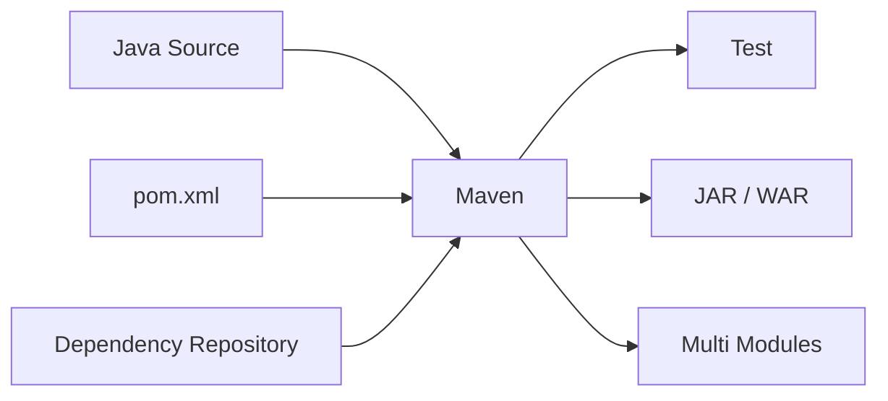
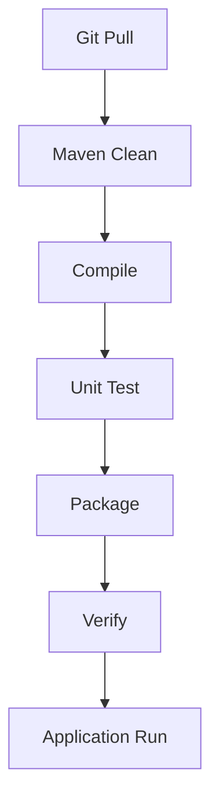

# Maven 설치 및 설정 가이드

## 1. 문서 목적

본 문서는 MicroServer 프로젝트의 **Maven 빌드환경**을 구성하고 멀티모듈 프로젝트에서 공통적으로 사용할 빌드 방법을 정리한다.

MicroServer 프로젝트에서는 공통영역을 독립 모듈로 구성하여 JAR로 빌드하고 다른 애플리케이션 모듈에서 의존하도록 구성할 수 있으므로 Maven의 부모 POM, 모듈, 의존성, 플러그인 관리가 중요하다.

---

## 2. Maven 역할



Maven은 다음 역할을 담당한다.

- Java Compile
- Unit Test
- Dependency 관리
- 멀티모듈 빌드
- JAR / WAR Packaging
- Plugin 실행
- Build Profile 관리

---

## 3. 사전 조건

JDK가 먼저 설치되어 있어야 한다.

```bash
java -version
javac -version
```

프로젝트 기준 Java 버전과 일치하는지 확인한다.

---

## 4. Maven 설치 확인

```bash
mvn -version
```

출력에서 다음 항목을 확인한다.

```text
Apache Maven ...
Java version: 21...
Java home: ...
```

Maven이 설치되어 있지 않은 경우 Apache Maven Binary Distribution을 설치하고 `bin` 디렉터리를 PATH에 추가한다.

---

# Windows

## 5. Windows Maven 설치

Maven Binary ZIP을 내려받아 압축 해제한다.

예:

```text
C:\tools\apache-maven\
```

환경변수 예:

```text
MAVEN_HOME=C:\tools\apache-maven
```

PATH:

```text
%MAVEN_HOME%\bin
```

새 PowerShell에서 확인:

```powershell
echo $env:MAVEN_HOME
mvn -version
```

---

# macOS

## 6. macOS Maven 설치

Homebrew를 사용하는 경우:

```bash
brew install maven
```

확인:

```bash
mvn -version
```

직접 Binary Distribution을 설치하는 경우 Maven `bin` 디렉터리를 PATH에 등록한다.

---

## 7. Maven Wrapper 권장

개발자 PC마다 Maven 버전 차이가 발생하는 것을 줄이기 위해 프로젝트에는 **Maven Wrapper**를 포함하는 것을 권장한다.

Wrapper 구성 파일 예:

```text
microserver/
 ├─ .mvn/
 │   └─ wrapper/
 │       └─ maven-wrapper.properties
 ├─ mvnw
 ├─ mvnw.cmd
 └─ pom.xml
```

Wrapper 생성:

```bash
mvn wrapper:wrapper
```

Wrapper 사용:

### Windows

```powershell
.\mvnw.cmd clean verify
```

### macOS / Linux

```bash
./mvnw clean verify
```

프로젝트에 Wrapper가 존재하면 일상적인 빌드는 가능하면 Wrapper 기준으로 실행한다.

---

## 8. Maven 기본 디렉터리 구조

```text
module/
 ├─ pom.xml
 └─ src/
     ├─ main/
     │   ├─ java/
     │   └─ resources/
     └─ test/
         ├─ java/
         └─ resources/
```

---

## 9. 멀티모듈 프로젝트 구조

MicroServer 프로젝트에서는 기능을 모듈별로 분리하고 공통영역을 JAR로 제공하는 구조를 사용할 수 있다.

예:

```text
microserver/
 ├─ pom.xml
 ├─ microserver-common/
 │   └─ pom.xml
 ├─ microserver-core/
 │   └─ pom.xml
 ├─ microserver-persistence/
 │   └─ pom.xml
 └─ microserver-application/
     └─ pom.xml
```

부모 POM:

```xml
<packaging>pom</packaging>

<modules>
    <module>microserver-common</module>
    <module>microserver-core</module>
    <module>microserver-persistence</module>
    <module>microserver-application</module>
</modules>
```

---

## 10. 공통 모듈 JAR 구성

공통 모듈은 다음과 같이 JAR Packaging을 사용한다.

```xml
<packaging>jar</packaging>
```

Application 모듈에서 의존:

```xml
<dependency>
    <groupId>com.example.microserver</groupId>
    <artifactId>microserver-common</artifactId>
    <version>${project.version}</version>
</dependency>
```

전체 Reactor Build에서는 Maven이 모듈 의존 순서를 분석하여 필요한 모듈을 먼저 빌드한다.

---

## 11. 기본 Maven Lifecycle

주요 Lifecycle Phase:

```text
validate
  ↓
compile
  ↓
test
  ↓
package
  ↓
verify
  ↓
install
  ↓
deploy
```

자주 사용하는 명령:

```bash
mvn clean
mvn test
mvn package
mvn clean package
mvn clean verify
mvn clean install
```

---

## 12. 프로젝트 권장 빌드 명령

로컬 개발 중 빠른 검증:

```bash
./mvnw test
```

전체 빌드 검증:

```bash
./mvnw clean verify
```

Windows:

```powershell
.\mvnw.cmd clean verify
```

`verify`는 단순 package보다 검증 단계까지 포함하도록 플러그인을 연결하기에 적합하다.

---

## 13. 특정 모듈만 빌드

```bash
mvn -pl microserver-common clean package
```

해당 모듈이 의존하는 다른 Reactor 모듈도 함께 빌드:

```bash
mvn -pl microserver-application -am clean package
```

옵션 의미:

```text
-pl : project list
-am : also make required projects
```

Application 모듈 개발 시 매우 자주 사용하는 방식이다.

---

## 14. 테스트 생략

테스트 코드를 컴파일하지만 실행만 생략:

```bash
mvn clean package -DskipTests
```

테스트 관련 컴파일까지 생략하는 옵션은 일반 개발 과정에서 남용하지 않는다.

배포용 빌드는 가능한 한 테스트를 포함한다.

---

## 15. Local Repository

Maven은 외부 Dependency를 로컬 저장소에 Cache한다.

### Windows

```text
C:\Users\<USER>\.m2\repository
```

### macOS

```text
~/.m2/repository
```

Dependency 다운로드 문제가 반복될 경우 특정 Artifact 디렉터리를 삭제하고 다시 받을 수 있다.

전체 `.m2/repository`를 무조건 삭제하는 것은 다운로드 비용이 크므로 마지막 수단으로 사용한다.

---

## 16. `settings.xml`

Maven 사용자별 설정 파일:

### Windows

```text
C:\Users\<USER>\.m2\settings.xml
```

### macOS

```text
~/.m2/settings.xml
```

사내 Nexus / Artifactory 또는 Proxy를 사용하는 경우 이 파일에 설정할 수 있다.

예시 구조:

```xml
<settings xmlns="http://maven.apache.org/SETTINGS/1.0.0">
    <mirrors>
        <!-- 회사 저장소 사용 시 설정 -->
    </mirrors>

    <servers>
        <!-- 인증이 필요한 저장소 계정 -->
    </servers>

    <proxies>
        <!-- 회사 Proxy 사용 시 설정 -->
    </proxies>
</settings>
```

비밀번호가 포함된 개인 `settings.xml`은 프로젝트 Git 저장소에 Commit하지 않는다.

---

## 17. Dependency Management

멀티모듈에서는 공통 Dependency 버전을 부모 POM에서 관리한다.

```xml
<dependencyManagement>
    <dependencies>
        <dependency>
            <groupId>com.fasterxml.jackson.core</groupId>
            <artifactId>jackson-databind</artifactId>
            <version>...</version>
        </dependency>
    </dependencies>
</dependencyManagement>
```

하위 모듈에서는 버전을 반복하지 않는다.

```xml
<dependency>
    <groupId>com.fasterxml.jackson.core</groupId>
    <artifactId>jackson-databind</artifactId>
</dependency>
```

Spring Boot Parent 또는 BOM을 사용할 경우 해당 Dependency Management 정책을 우선 활용한다.

---

## 18. Plugin Management

플러그인 버전과 공통 설정은 부모 POM의 `pluginManagement`에서 관리할 수 있다.

```xml
<build>
    <pluginManagement>
        <plugins>
            <!-- common plugin configuration -->
        </plugins>
    </pluginManagement>
</build>
```

멀티모듈에서 모듈별 Plugin 버전이 달라지는 문제를 줄일 수 있다.

---

## 19. Effective POM 확인

부모 상속과 BOM 적용 이후 실제 Maven이 사용하는 POM을 확인한다.

```bash
mvn help:effective-pom
```

파일로 저장:

```bash
mvn help:effective-pom -Doutput=effective-pom.xml
```

문제 분석 후 생성 파일은 필요 없다면 삭제한다.

---

## 20. Effective Settings 확인

```bash
mvn help:effective-settings
```

사내 Repository / Proxy / Mirror 문제를 분석할 때 유용하다.

---

## 21. Dependency Tree 확인

```bash
mvn dependency:tree
```

특정 라이브러리 버전 충돌이 의심될 때:

```bash
mvn dependency:tree -Dincludes=<groupId>:<artifactId>
```

Spring 관련 라이브러리의 버전을 임의 Override하기 전에 Dependency Tree를 먼저 확인한다.

---

## 22. Maven 실행 Java 확인

```bash
mvn -version
```

중요 확인 항목:

```text
Java version
Java home
OS name
```

JDK 설정이 바뀌었는데 Maven은 이전 JDK를 사용한다면 Terminal을 새로 열고 `JAVA_HOME`을 확인한다.

---

## 23. 자주 발생하는 문제

### `mvn: command not found`

Maven PATH 설정을 확인한다.

프로젝트에 Wrapper가 있다면:

```bash
./mvnw -version
```

Windows:

```powershell
.\mvnw.cmd -version
```

### Dependency 다운로드 실패

다음 항목을 확인한다.

- 인터넷 연결
- 회사 Proxy
- Nexus / Artifactory 상태
- `settings.xml`
- Repository 인증정보

### Java 버전 오류

```bash
java -version
mvn -version
```

두 명령의 Java 버전을 비교한다.

### 하위 모듈 Dependency를 찾지 못함

루트에서 전체 빌드를 실행한다.

```bash
mvn clean install
```

또는:

```bash
mvn -pl microserver-application -am clean package
```

---

## 24. 프로젝트 빌드 표준 흐름



개발자는 Commit 전 최소 다음 명령의 성공 여부를 확인하는 것을 권장한다.

```bash
./mvnw clean verify
```

Windows:

```powershell
.\mvnw.cmd clean verify
```

---

## 25. 최종 체크리스트

- [ ] JDK가 정상 설치되어 있다.
- [ ] `mvn -version` 또는 Maven Wrapper가 정상 실행된다.
- [ ] Maven이 프로젝트 기준 JDK를 사용한다.
- [ ] 부모 POM과 하위 모듈이 정상 인식된다.
- [ ] 공통 모듈이 JAR로 빌드된다.
- [ ] `clean verify`가 성공한다.
- [ ] `.m2/settings.xml`의 민감정보가 Git에 포함되지 않는다.
- [ ] 가능하면 Maven Wrapper를 프로젝트에 포함한다.
