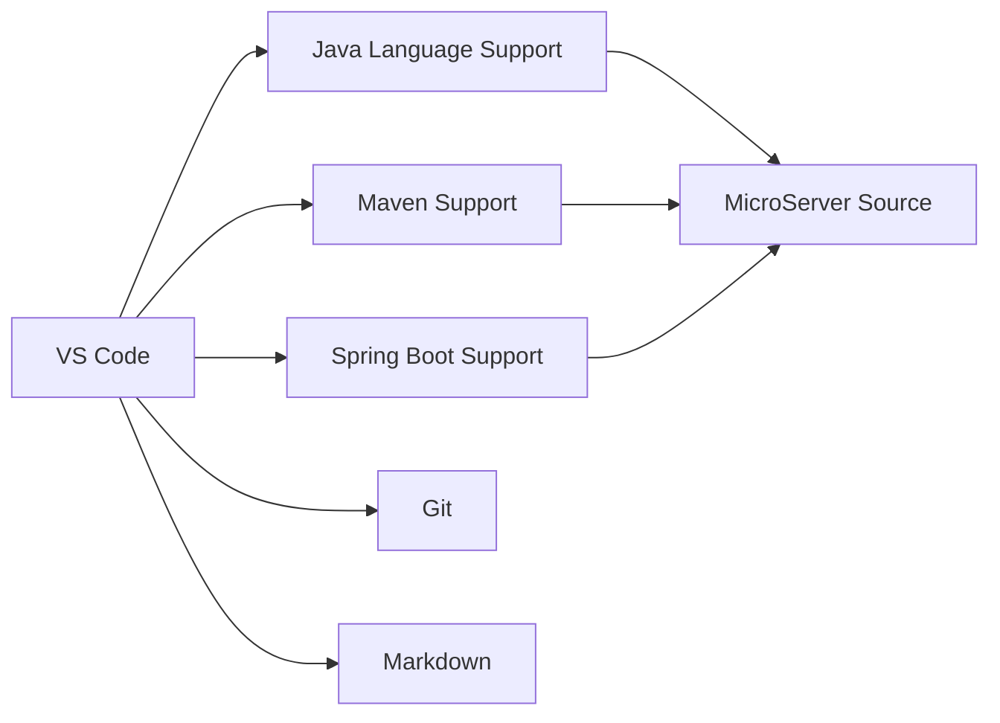
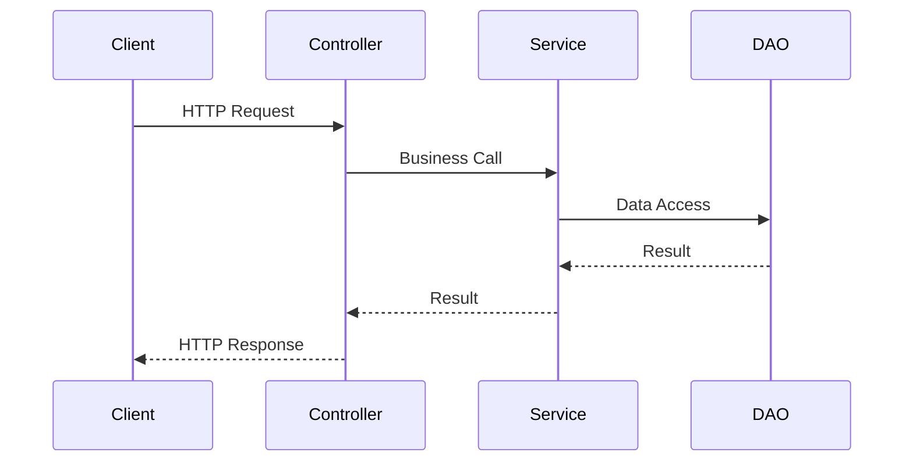

# VS Code Java 개발환경 구성 가이드

## 1. 문서 목적

본 문서는 MicroServer 프로젝트의 표준 IDE인 **Visual Studio Code(VS Code)** 에 Java, Maven, Spring 기반 개발환경을 구성한다.

프로젝트는 특정 중량급 IDE에 의존하지 않고 VS Code를 기준으로 다음 기능을 사용할 수 있도록 설정한다.

- Java 코드 자동완성
- Import 관리
- Refactoring
- Maven 프로젝트 인식
- JUnit 테스트 실행
- Debugging
- Spring Boot 애플리케이션 실행
- Git 연동
- Markdown 문서 작성

---

## 2. VS Code 개발 구조



---

## 3. 사전 준비

VS Code Java 개발환경을 구성하기 전에 다음 항목이 준비되어 있어야 한다.

```bash
java -version
javac -version
git --version
```

Maven을 이미 설치했다면:

```bash
mvn -version
```

프로젝트가 Maven Wrapper를 제공한다면 글로벌 Maven 설치 전에도 Wrapper를 사용할 수 있다.

---

## 4. VS Code 설치 확인

Terminal 또는 PowerShell:

```bash
code --version
```

`code` 명령을 사용할 수 없더라도 VS Code 애플리케이션 자체는 정상 설치되어 있을 수 있다.

VS Code를 실행한 뒤 프로젝트 폴더를 직접 열어도 된다.

---

## 5. 프로젝트 열기

### Windows

```powershell
code C:\workspace\microserver
```

### macOS

```bash
code ~/workspace/microserver
```

가능하면 개별 모듈이 아니라 **멀티모듈 Maven 프로젝트의 루트 디렉터리**를 연다.

```text
microserver/
 ├─ pom.xml
 ├─ microserver-common/
 ├─ microserver-core/
 ├─ microserver-application/
 └─ ...
```

---

## 6. 필수 Java 확장 설치

VS Code Extensions 화면에서 다음 확장을 설치한다.

### 필수

- **Extension Pack for Java**
- **Spring Boot Extension Pack**

Extension Pack for Java에는 Java Language Support, Debugger, Test Runner, Maven 관련 확장이 함께 포함될 수 있어 Java 개발환경을 한 번에 구성하기 좋다.

Spring Boot 프로젝트를 개발할 경우 Spring Boot Extension Pack을 추가한다.

---

## 7. 선택 확장

프로젝트 운영에 따라 다음 확장을 선택적으로 사용할 수 있다.

| 확장 유형 | 용도 |
|---|---|
| Git 보조 도구 | Commit History, Blame 등 확인 |
| YAML | `application.yml`, `mkdocs.yml` 편집 |
| Markdown | Markdown 작성 편의성 |
| Docker | Container / Image 확인 |
| XML | Maven `pom.xml` 편집 |

확장은 너무 많이 설치하기보다 프로젝트에 필요한 확장만 사용한다.

---

## 8. JDK Runtime 설정 확인

Command Palette를 연다.

```text
Windows / Linux: Ctrl + Shift + P
macOS: Command + Shift + P
```

다음 명령을 실행한다.

```text
Java: Configure Java Runtime
```

설치된 JDK 25이 Project JDK 또는 Default JDK로 인식되는지 확인한다.

터미널에서도 확인한다.

```bash
java -version
```

VS Code와 Terminal의 JDK가 서로 다르면 빌드 결과가 달라질 수 있다.

---

## 9. 프로젝트 Import

루트 `pom.xml`이 있는 디렉터리를 열면 Java 및 Maven 확장이 프로젝트를 분석한다.

처음 열 때 다음 과정이 발생할 수 있다.

```text
Maven Project Scan
→ Dependency Resolution
→ Java Project Import
→ Workspace Indexing
```

프로젝트 규모에 따라 초기 인덱싱 동안 Java 자동완성이 늦게 활성화될 수 있다.

---

## 10. Maven 프로젝트 확인

VS Code Explorer 또는 Maven View에서 부모 프로젝트와 하위 모듈이 정상적으로 인식되는지 확인한다.

예:

```text
microserver-parent
 ├─ microserver-common
 ├─ microserver-core
 ├─ microserver-persistence
 └─ microserver-application
```

Terminal에서도 검증한다.

```bash
mvn clean test
```

Maven Wrapper 사용 시:

### Windows

```powershell
.\mvnw.cmd clean test
```

### macOS

```bash
./mvnw clean test
```

---

## 11. VS Code 공용 설정 예시

프로젝트에 `.vscode/settings.json`을 둘 수 있다.

예:

```json
{
  "editor.formatOnSave": true,
  "files.trimTrailingWhitespace": true,
  "files.insertFinalNewline": true,
  "java.configuration.updateBuildConfiguration": "interactive",
  "java.compile.nullAnalysis.mode": "automatic"
}
```

팀 전체에 적용할 설정만 저장소에 Commit한다.

개인 PC 경로, 개인 토큰, 로컬 비밀번호는 `.vscode/settings.json`에 Commit하지 않는다.

---

## 12. 추천 VS Code Workspace 구조

```text
microserver/
 ├─ .vscode/
 │   ├─ settings.json
 │   └─ extensions.json
 ├─ pom.xml
 ├─ microserver-common/
 ├─ microserver-core/
 └─ microserver-application/
```

권장 확장 목록을 `.vscode/extensions.json`으로 공유할 수 있다.

예:

```json
{
  "recommendations": [
    "vscjava.vscode-java-pack",
    "vmware.vscode-boot-dev-pack"
  ]
}
```

확장 ID는 사용하는 배포 상태에 따라 VS Code Marketplace에서 확인한다.

---

## 13. Spring Boot 애플리케이션 실행

`main` 메서드가 있는 Application Class를 연다.

예:

```java
@SpringBootApplication
public class MicroserverApplication {

    public static void main(String[] args) {
        SpringApplication.run(MicroserverApplication.class, args);
    }
}
```

Java 확장이 정상 동작하면 소스 상단 또는 `main` 메서드 주변에 Run / Debug 명령이 표시된다.

또는 Terminal에서 실행한다.

```bash
mvn spring-boot:run
```

멀티모듈인 경우 실제 실행 모듈에서 명령을 수행하거나 `-pl` 옵션을 사용한다.

```bash
mvn -pl microserver-application -am spring-boot:run
```

---

## 14. Debug 실행

VS Code의 **Run and Debug** 메뉴에서 Java 애플리케이션을 실행한다.

Breakpoint를 설정한 뒤 Debug를 시작하면 다음 흐름으로 확인할 수 있다.



Controller, Service, DAO 계층에 각각 Breakpoint를 두면 요청 흐름을 단계별로 확인하기 좋다.

---

## 15. JUnit 테스트 실행

테스트 클래스 예:

```java
class SampleServiceTest {

    @Test
    void sampleTest() {
        // test
    }
}
```

VS Code Java Test Runner가 정상 설치되면 테스트 메서드 또는 클래스 단위로 Run / Debug가 가능하다.

Terminal 기준 전체 테스트:

```bash
mvn test
```

특정 모듈:

```bash
mvn -pl microserver-core test
```

---

## 16. 코드 작성 시 권장 설정

다음 기본 품질 항목을 적용한다.

- 저장 시 공백 정리
- 파일 마지막 줄 개행
- 프로젝트 공통 문자셋 UTF-8
- 코드 포맷터 팀 규칙 통일
- Import 자동 정리

문자셋은 VS Code 오른쪽 하단에서 확인할 수 있다.

```text
UTF-8
```

---

## 17. Git 사용

VS Code Source Control 화면에서도 Git을 사용할 수 있지만 중요한 작업은 Git 명령으로 상태를 확인하는 습관을 권장한다.

```bash
git status
git diff
git log --oneline -10
```

특히 Commit 전에 변경 파일을 직접 확인한다.

---

## 18. Java Language Server 문제 해결

코드 오류가 없는데 Java 프로젝트 인식이 이상한 경우 Command Palette에서 다음 작업을 사용할 수 있다.

```text
Java: Clean Java Language Server Workspace
```

그 후 VS Code가 Java Project를 다시 Import하도록 한다.

추가 확인:

```bash
java -version
mvn -version
```

---

## 19. Maven 의존성 변경 후 반영

`pom.xml` 변경 후 자동 반영이 되지 않으면 Maven Project Refresh 또는 Java Build Configuration Update를 수행한다.

터미널에서 먼저 정상 빌드되는지 확인하는 것도 중요하다.

```bash
mvn clean test
```

IDE 오류와 실제 Maven 빌드 오류를 구분해야 한다.

---

## 20. VS Code가 다른 JDK를 사용하는 문제

다음 세 값을 비교한다.

```bash
java -version
mvn -version
```

VS Code:

```text
Java: Configure Java Runtime
```

세 환경이 동일한 JDK 25을 사용하도록 맞춘다.

---

## 21. 프로젝트 루트를 잘못 연 경우

하위 모듈만 열면 부모 POM의 dependencyManagement나 pluginManagement를 정상적으로 인식하지 못하는 것처럼 보일 수 있다.

잘못된 예:

```text
VS Code Root
└─ microserver-common/
```

권장:

```text
VS Code Root
└─ microserver/
   ├─ pom.xml
   ├─ microserver-common/
   └─ microserver-application/
```

---

## 22. 최종 확인 체크리스트

- [ ] VS Code가 설치되어 있다.
- [ ] 프로젝트 루트 디렉터리를 열었다.
- [ ] Extension Pack for Java를 설치했다.
- [ ] Spring Boot Extension Pack을 설치했다.
- [ ] VS Code가 JDK 25을 인식한다.
- [ ] Maven 프로젝트가 정상 Import된다.
- [ ] Java 자동완성이 동작한다.
- [ ] JUnit 테스트를 실행할 수 있다.
- [ ] Spring Boot 애플리케이션을 Run / Debug 할 수 있다.
- [ ] Git 변경 파일을 VS Code에서 확인할 수 있다.
