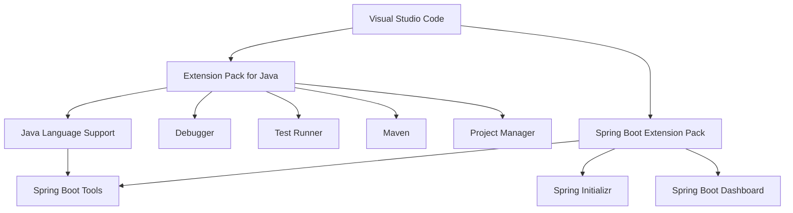
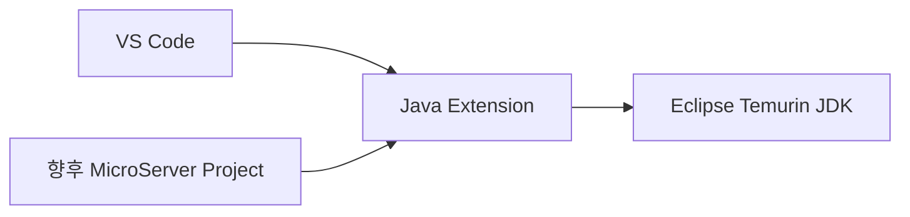
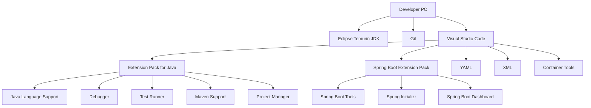

# VS Code Java / Spring Boot 개발환경 구성 가이드

## 1. 문서 목적

본 문서는 MicroServer 프로젝트에서 사용할 표준 개발 도구인 **Visual Studio Code(VS Code)** 를
Java 및 Spring Boot 개발에 적합한 형태로 구성하는 방법을 설명한다.

이 단계에서는 아직 MicroServer 애플리케이션 프로젝트를 생성하지 않는다.

따라서 본 문서는 다음 작업에 집중한다.

- VS Code 설치 및 기본 동작 확인
- Java 개발에 필요한 필수 확장 구성
- Spring Boot 개발에 필요한 필수 확장 구성
- 각 확장의 역할과 사용 목적 이해
- YAML, XML, Container 관련 보조 확장 구성
- VS Code가 JDK를 사용할 수 있는 상태인지 확인
- MicroServer 개발용 VS Code 환경을 준비
- 이후 프로젝트 생성 단계에서 적용할 설정 범위 구분

> **중요**
>
> 이 문서에서는 Spring Boot 프로젝트 생성, `pom.xml` 설정, Maven 빌드,
> 애플리케이션 실행, 디버깅, 테스트 코드 작성 등을 진행하지 않는다.
>
> 해당 내용은 이후 프로젝트 생성 및 Spring Boot 개발환경 구성 단계에서 다룬다.

---

## 2. 전체 환경 구성 순서

MicroServer 프로젝트의 개발환경은 다음 순서로 구성한다.


현재 문서는 다음 영역에 해당한다.

```text
JDK 준비
   ↓
[ VS Code 개발환경 구성 ]   ← 현재 단계
   ↓
프로젝트 생성
   ↓
Maven / Spring Boot 프로젝트 구성
   ↓
애플리케이션 개발
```

---

## 3. 사전 준비

본 가이드를 진행하기 전에 다음 항목이 준비되어 있어야 한다.

### 필수

- Git / GitHub 환경 구성 완료
- Eclipse Temurin JDK 준비 완료
- 사용할 JDK 디렉터리 위치 확인

JDK는 이전 **JDK 설치 및 설정 가이드**의 기준을 따른다.

MicroServer 프로젝트에서는 운영체제 전체에 하나의 `JAVA_HOME`을 고정하여 사용하는 방식보다,
필요한 JDK를 로컬에 준비하고 **VS Code Workspace에서 프로젝트별 JDK를 선택하는 방식**을 기본으로 한다.

따라서 현재 단계에서 시스템 전역 `JAVA_HOME` 설정은 필수 조건이 아니다.

---

# 4. VS Code 설치

## 4.1 Windows

Visual Studio Code 공식 사이트에서 Windows용 VS Code를 다운로드한다.

일반 개발 PC에서는 다음 설치 형태를 사용할 수 있다.

```text
Windows x64 User Installer
```

설치 과정에서 다음 옵션을 활성화하는 것을 권장한다.

- PATH에 VS Code 추가
- 파일을 Code로 열기 메뉴 등록
- 디렉터리를 Code로 열기 메뉴 등록
- 지원되는 파일 형식의 편집기로 Code 등록

설치가 완료되면 VS Code를 실행한다.

Terminal에서 `code` 명령 사용이 가능한 경우 다음과 같이 확인할 수 있다.

```powershell
code --version
```

정상 예:

```text
1.xx.x
...
```

> `code --version` 명령이 실행되지 않더라도 VS Code 자체가 정상 설치되어 있을 수 있다.
> 이 경우 VS Code 설치 옵션의 PATH 등록 여부를 확인한다.

---

## 4.2 macOS

Visual Studio Code macOS 버전을 다운로드한 뒤 애플리케이션을 다음 위치에 배치한다.

```text
/Applications/Visual Studio Code.app
```

VS Code를 실행한 후 Command Palette를 연다.

```text
Command + Shift + P
```

다음 명령을 검색하여 실행한다.

```text
Shell Command: Install 'code' command in PATH
```

새 Terminal을 실행한 후 확인한다.

```bash
code --version
```

---

# 5. VS Code 화면 기본 구성

VS Code를 처음 사용하는 경우 주요 화면의 역할을 먼저 이해한다.

| 영역 | 역할 |
|---|---|
| Explorer | 폴더 및 파일 탐색 |
| Search | 전체 파일 검색 |
| Source Control | Git 변경사항 확인 |
| Run and Debug | 실행 및 디버깅 관리 |
| Extensions | 확장 프로그램 설치 및 관리 |
| Terminal | VS Code 내부 Terminal |
| Problems | 오류 및 경고 확인 |
| Output | 각 확장 프로그램의 로그 확인 |
| Command Palette | VS Code 및 확장 기능 명령 실행 |

Command Palette 단축키:

### Windows

```text
Ctrl + Shift + P
```

### macOS

```text
Command + Shift + P
```

Java 및 Spring 관련 설정 대부분은 Command Palette를 통해 접근할 수 있으므로
이 단축키는 익숙해지는 것이 좋다.

---

# 6. Extension 구성 원칙

MicroServer 프로젝트에서는 개발자별 Extension 구성이 지나치게 달라지지 않도록
다음 기준으로 VS Code 확장을 구성한다.

```text
필수
 ├─ Extension Pack for Java
 └─ Spring Boot Extension Pack

권장
 ├─ YAML
 ├─ XML
 └─ Container Tools

선택
 ├─ Git 보조 Extension
 ├─ Markdown 보조 Extension
 └─ 기타 개인 생산성 Extension
```

핵심 원칙은 다음과 같다.

1. Java 기본 개발 기능은 **Extension Pack for Java**를 기준으로 통일한다.
2. Spring Boot 개발 기능은 **Spring Boot Extension Pack**을 기준으로 통일한다.
3. Pack에 포함된 Extension을 개발자가 임의로 일부만 제거하지 않는다.
4. YAML / XML / Container 관련 기능은 프로젝트 특성에 맞게 추가한다.
5. 개인 편의 Extension은 프로젝트 필수 Extension과 구분한다.
6. 유사 기능을 제공하는 Extension을 중복 설치하지 않는다.

---

# 7. Java 필수 Extension 설치

## 7.1 Extension Pack for Java

VS Code 왼쪽 메뉴에서 **Extensions**를 선택한다.

단축키:

### Windows

```text
Ctrl + Shift + X
```

### macOS

```text
Command + Shift + X
```

검색창에 다음을 입력한다.

```text
Extension Pack for Java
```

Publisher가 Microsoft인지 확인한 후 설치한다.

Extension ID:

```text
vscjava.vscode-java-pack
```

CLI로 설치하는 경우:

```bash
code --install-extension vscjava.vscode-java-pack
```

---

## 7.2 Extension Pack을 사용하는 이유

Java 개발에 필요한 Extension을 각각 따로 설치할 수도 있지만,
MicroServer 프로젝트에서는 개발자별 설치 누락을 방지하기 위해
**Extension Pack for Java를 통째로 설치하는 방식**을 권장한다.

Extension Pack for Java에는 Java 개발에 필요한 주요 Extension이 함께 포함된다.

```text
Extension Pack for Java
 │
 ├─ Language Support for Java by Red Hat
 ├─ Debugger for Java
 ├─ Test Runner for Java
 ├─ Maven for Java
 ├─ Project Manager for Java
 └─ Visual Studio IntelliCode
```

현재 단계에서는 아직 프로젝트를 만들지 않기 때문에
각 Extension이 제공하는 기능을 이해하고 정상 설치 여부까지만 확인한다.

---

# 8. Java Extension별 역할

## 8.1 Language Support for Java by Red Hat

Extension ID:

```text
redhat.java
```

Java 개발환경에서 가장 핵심적인 Extension이다.

VS Code 자체는 Java 전용 IDE가 아니기 때문에,
이 Extension이 Java Language Server를 제공하여 Java 코드를 이해하도록 만든다.

주요 역할:

- Java 문법 분석
- 코드 자동완성
- IntelliSense
- 오류 및 경고 표시
- Import 관리
- 클래스 / 메서드 탐색
- 코드 이동
- Rename 등 Refactoring
- Java 코드 Format
- Javadoc 정보 표시
- Java 프로젝트 구조 인식

즉, VS Code를 **Java IDE처럼 동작하게 만드는 핵심 기반 Extension**이라고 이해하면 된다.

```text
VS Code
   ↓
Language Support for Java
   ↓
Java Language Server
   ↓
Java Source / JDK / Project Structure 분석
```

MicroServer 프로젝트에서는 **필수 Extension**이다.

---

## 8.2 Debugger for Java

Extension ID:

```text
vscjava.vscode-java-debug
```

Java 애플리케이션의 Debug 기능을 제공한다.

주요 역할:

- Breakpoint 설정
- Step Into
- Step Over
- Step Out
- 변수 값 확인
- Call Stack 확인
- Expression 평가
- Java Process Debug 연결

현재 단계에서는 실제 애플리케이션을 실행하거나 Debug하지 않는다.

이 Extension은 이후 Spring Boot 프로젝트가 생성된 뒤
Controller, Service, Repository 등의 실행 흐름을 분석할 때 사용한다.

MicroServer 프로젝트에서는 **필수 Extension**이다.

---

## 8.3 Test Runner for Java

Extension ID:

```text
vscjava.vscode-java-test
```

Java 테스트 실행을 지원한다.

주요 역할:

- JUnit 테스트 탐색
- Test Explorer 제공
- 테스트 단위 실행
- 테스트 Debug
- 테스트 성공 / 실패 결과 표시

이 Extension은 이후 단위 테스트 및 통합 테스트 환경을 구성할 때 사용한다.

현재 단계에서는 테스트 클래스나 테스트 코드를 작성하지 않는다.

MicroServer 프로젝트에서는 **필수 Extension**이다.

---

## 8.4 Maven for Java

Extension ID:

```text
vscjava.vscode-maven
```

VS Code에서 Maven 프로젝트를 인식하고 관리하기 위한 Extension이다.

주요 역할:

- Maven 프로젝트 탐색
- Maven Goal 확인
- Maven Lifecycle 확인
- Dependency 확인
- Maven 명령 실행 지원
- Maven 프로젝트 관리

MicroServer는 Maven 기반으로 프로젝트를 구성할 예정이므로 필수 Extension이다.

다만 현재는 아직 Maven 프로젝트를 생성하기 전이므로
`pom.xml` 설정이나 Maven Build는 진행하지 않는다.

Maven 자체의 설치 및 설정은 별도의 **Maven 설치 및 설정 가이드**에서 다룬다.

---

## 8.5 Project Manager for Java

Extension ID:

```text
vscjava.vscode-java-dependency
```

Java 프로젝트와 프로젝트 Dependency를 VS Code에서 관리할 수 있도록 지원한다.

주요 역할:

- Java Projects View 제공
- 프로젝트 구조 탐색
- Java Package 관리
- 프로젝트 Dependency 확인
- Java 프로젝트 생성 및 관리 기능 제공

향후 MicroServer 프로젝트를 VS Code에서 열면
Explorer 영역에서 Java Project 구조를 확인할 수 있게 된다.

현재는 아직 프로젝트가 없으므로 설치까지만 진행한다.

---

## 8.6 Visual Studio IntelliCode

Extension ID:

```text
VisualStudioExptTeam.vscodeintellicode
```

코드 작성 시 IntelliSense 기능을 보조하여
개발자가 자주 사용할 가능성이 높은 API나 코드 후보를 제시한다.

주요 역할:

- IntelliSense 추천 기능 보강
- 코드 작성 생산성 향상
- Java 개발 시 자동완성 경험 개선

Java Language Support가 Java 코드 분석의 기반이라면,
IntelliCode는 해당 자동완성 경험을 보조하는 역할이라고 이해하면 된다.

---

# 9. Spring Boot 필수 Extension 설치

Java Extension Pack 설치가 완료되면 Spring Boot 개발용 Extension을 추가한다.

Extensions 검색창에서 다음을 검색한다.

```text
Spring Boot Extension Pack
```

Publisher가 VMware인지 확인한 후 설치한다.

Extension ID:

```text
vmware.vscode-boot-dev-pack
```

CLI:

```bash
code --install-extension vmware.vscode-boot-dev-pack
```

VS Code 공식 Java 문서에서도 Spring Boot 개발 시
**Extension Pack for Java + Spring Boot Extension Pack** 구성을 권장한다.

---

# 10. Spring Boot Extension Pack 구성

Spring Boot Extension Pack에는 다음 주요 Extension이 포함된다.

```text
Spring Boot Extension Pack
 │
 ├─ Spring Boot Tools
 ├─ Spring Initializr Java Support
 └─ Spring Boot Dashboard
```

각 Extension의 목적이 서로 다르므로 역할을 구분해 이해하는 것이 중요하다.

---

# 11. Spring Boot Extension별 역할

## 11.1 Spring Boot Tools

Extension ID:

```text
vmware.vscode-spring-boot
```

Spring Boot 개발 시 가장 중요한 Spring 전용 Extension이다.

기본 Java Language Support 위에 Spring Boot 관련 기능을 추가한다.

주요 역할:

- Spring Boot 전용 코드 지원
- Spring 구성 요소 탐색 지원
- Spring 관련 자동완성
- Spring Boot 설정 파일 지원
- `application.properties` 편집 지원
- `application.yml` 편집 지원
- Spring Boot Configuration Property 자동완성
- Spring 관련 오류 및 유효성 확인
- Spring 요소 Navigation 지원

개념적으로 다음 구조로 동작한다.

```text
Language Support for Java
        ↓
Java 기본 언어 기능
        ↓
Spring Boot Tools
        ↓
Spring Boot 전용 개발 기능
```

MicroServer 프로젝트가 Spring Boot 기반이므로 **필수 Extension**이다.

현재 단계에서는 Spring Boot 설정 파일이나 Java Source를 생성하지 않고
Extension 설치까지만 진행한다.

---

## 11.2 Spring Initializr Java Support

Extension ID:

```text
vscjava.vscode-spring-initializr
```

Spring Initializr를 VS Code에서 사용할 수 있도록 지원한다.

주요 역할:

- Spring Boot 프로젝트 생성 Wizard 제공
- Spring Boot 버전 선택
- Java 버전 선택
- Maven / Gradle 선택
- Group / Artifact 정보 입력
- Spring Dependency 선택

Command Palette에서 향후 다음 명령을 사용할 수 있게 된다.

```text
Spring Initializr
```

이 Extension은 **다음 단계의 Spring Boot 프로젝트 생성 가이드**에서 실제로 사용한다.

현재 단계에서는 프로젝트를 생성하지 않는다.

---

## 11.3 Spring Boot Dashboard

Extension ID:

```text
vscjava.vscode-spring-boot-dashboard
```

Workspace 안의 Spring Boot 프로젝트를 한 곳에서 관리할 수 있는 Dashboard를 제공한다.

향후 제공되는 기능:

- Spring Boot 프로젝트 목록 확인
- 실행 상태 확인
- 애플리케이션 시작
- 애플리케이션 중지
- Debug 실행

현재는 아직 Spring Boot 프로젝트가 없기 때문에
Dashboard에 표시되는 애플리케이션이 없는 것이 정상이다.

이 단계에서는 Extension 설치 여부만 확인한다.

---

# 12. Java와 Spring Boot Extension의 관계

Java Extension과 Spring Boot Extension은 서로 대체 관계가 아니다.

Spring Boot는 Java 위에서 동작하므로 먼저 Java 개발환경이 구성되어야 한다.



따라서 MicroServer 개발환경의 기본 구성은 다음과 같다.

```text
VS Code
   +
Extension Pack for Java
   +
Spring Boot Extension Pack
```

---

# 13. 추가 권장 Extension

Java와 Spring Boot Extension 외에도 MicroServer 개발환경에서
사용 가능성이 높은 파일 형식과 Container 환경을 위해 다음 Extension을 권장한다.

---

## 13.1 YAML

Extension:

```text
YAML
```

Publisher:

```text
Red Hat
```

Extension ID:

```text
redhat.vscode-yaml
```

설치:

```bash
code --install-extension redhat.vscode-yaml
```

주요 역할:

- YAML 문법 강조
- YAML 문법 오류 확인
- 자동완성
- Schema 기반 Validation
- YAML 구조 탐색

향후 다음과 같은 파일을 편집할 때 사용한다.

```text
application.yml
docker-compose.yml
mkdocs.yml
GitHub Actions YAML
```

Spring Boot Tools도 Spring Boot의 `application.yml`에 대한 전용 지원을 제공하지만,
YAML Extension은 Spring Boot 외의 일반 YAML 파일까지 폭넓게 지원하므로 함께 설치하는 것을 권장한다.

---

## 13.2 XML

Extension:

```text
XML
```

Publisher:

```text
Red Hat
```

Extension ID:

```text
redhat.vscode-xml
```

설치:

```bash
code --install-extension redhat.vscode-xml
```

주요 역할:

- XML 문법 강조
- XML 자동완성
- XML Validation
- XML Formatting
- XML 구조 탐색
- XSD 기반 지원

향후 Maven 프로젝트가 만들어지면 `pom.xml` 파일 편집에 활용한다.

현재 단계에서는 `pom.xml`을 생성하거나 수정하지 않는다.

---

## 13.3 Container Tools

Extension:

```text
Container Tools
```

Publisher:

```text
Microsoft
```

Extension ID:

```text
ms-azuretools.vscode-containers
```

설치:

```bash
code --install-extension ms-azuretools.vscode-containers
```

주요 역할:

- Docker / Podman Container 확인
- Container Image 확인
- Container 관리
- Container Registry 관련 작업
- Container 기반 개발 작업 지원

MicroServer 프로젝트에서는 이후 Oracle 로컬 개발환경과
각종 Container 기반 개발환경을 사용할 가능성이 있으므로 설치를 권장한다.

> 예전 VS Code의 `Docker` Extension을 기준으로 작성된 문서가 있을 수 있다.
> 현재 Microsoft는 **Container Tools**를 중심으로 Container 개발 기능을 제공하고 있으므로
> 신규 환경에서는 Container Tools를 기준으로 구성한다.

---

# 14. Extension 설치 권장 목록

MicroServer 프로젝트의 VS Code Extension 기준을 정리하면 다음과 같다.

| 구분 | Extension | ID | 설치 기준 | 주요 역할 |
|---|---|---|---|---|
| Java | Extension Pack for Java | `vscjava.vscode-java-pack` | 필수 | Java 개발환경 전체 구성 |
| Spring | Spring Boot Extension Pack | `vmware.vscode-boot-dev-pack` | 필수 | Spring Boot 개발환경 전체 구성 |
| YAML | YAML | `redhat.vscode-yaml` | 권장 | YAML 편집 및 Validation |
| XML | XML | `redhat.vscode-xml` | 권장 | XML / 향후 `pom.xml` 편집 |
| Container | Container Tools | `ms-azuretools.vscode-containers` | 권장 | Docker / Container 관리 |

Pack 내부 Extension은 별도로 다시 설치할 필요가 없다.

---

# 15. CLI를 이용한 일괄 설치

`code` 명령을 사용할 수 있다면 다음 명령으로 기본 Extension을 설치할 수 있다.

```bash
code --install-extension vscjava.vscode-java-pack
code --install-extension vmware.vscode-boot-dev-pack
code --install-extension redhat.vscode-yaml
code --install-extension redhat.vscode-xml
code --install-extension ms-azuretools.vscode-containers
```

설치된 Extension 목록 확인:

```bash
code --list-extensions
```

MicroServer 관련 주요 Extension이 있는지 확인한다.

```text
vscjava.vscode-java-pack
vmware.vscode-boot-dev-pack
redhat.vscode-yaml
redhat.vscode-xml
ms-azuretools.vscode-containers
```

Pack 내부 Extension은 설치 과정에서 함께 설치되므로
`code --list-extensions` 출력에는 Pack과 개별 Extension이 함께 표시될 수 있다.

---

# 16. GUI에서 Extension 설치 상태 확인

VS Code에서 다음 메뉴를 연다.

```text
Extensions
```

검색 조건:

```text
@installed
```

다음 항목이 설치되어 있는지 확인한다.

### Java

```text
Extension Pack for Java
Language Support for Java by Red Hat
Debugger for Java
Test Runner for Java
Maven for Java
Project Manager for Java
Visual Studio IntelliCode
```

### Spring Boot

```text
Spring Boot Extension Pack
Spring Boot Tools
Spring Initializr Java Support
Spring Boot Dashboard
```

### 추가 권장

```text
YAML
XML
Container Tools
```

---

# 17. VS Code Profile 사용 권장

VS Code에는 개발 목적별로 Extension과 Settings를 분리할 수 있는 **Profile** 기능이 있다.

Java / Spring Boot 개발환경을 다른 개발환경과 분리하고 싶다면
MicroServer 전용 Profile을 만들어 사용할 수 있다.

예:

```text
Default
Python
AI Development
MicroServer Java
```

VS Code 메뉴:

```text
File
→ Preferences
→ Profiles
```

또는 Command Palette에서:

```text
Profiles: Create Profile
```

VS Code에는 Java/Spring 개발을 위한 **Java Spring Profile Template**도 제공된다.

이 Profile Template은 Java 개발 Extension과 Spring Boot Extension을 포함하는
Java/Spring 개발용 초기 구성을 빠르게 준비할 때 사용할 수 있다.

다만 MicroServer 프로젝트에서는 Extension 구성을 명확하게 이해하기 위해
본 가이드와 같이 필요한 Extension을 직접 확인하고 설치한 뒤 Profile에 포함시키는 방식을 권장한다.

Profile 사용은 필수가 아니며 팀 개발 표준에 따라 선택할 수 있다.

---

# 18. JDK와 VS Code의 관계

JDK는 VS Code에 포함되어 있는 것이 아니다.

구성 관계는 다음과 같다.



각 구성요소의 역할은 다음과 같다.

| 구성 | 역할 |
|---|---|
| Eclipse Temurin JDK | Java Compiler 및 Runtime 제공 |
| VS Code | 개발 Editor / IDE UI 제공 |
| Java Extension | VS Code와 JDK를 연결하여 Java 개발 기능 제공 |
| Spring Boot Extension | Java 개발환경 위에 Spring Boot 전용 기능 추가 |
| Project Workspace | 향후 프로젝트별 JDK 및 개발 설정 관리 |

---

# 19. VS Code에서 JDK 인식 기능 확인

JDK의 실제 설치 위치와 프로젝트별 JDK 설정 방법은
앞 단계인 **JDK 설치 및 설정 가이드**에서 다룬다.

현재 단계에서는 Java Extension 설치 후 다음 명령이 제공되는지만 확인한다.

Command Palette:

```text
Java: Configure Java Runtime
```

또한 다음 명령도 확인할 수 있다.

```text
Java: Install New JDK
```

MicroServer에서는 `Java: Install New JDK`를 이용해 JDK를 임의 설치하기보다,
앞 단계에서 준비한 **Eclipse Temurin JDK**를 프로젝트 기준 JDK로 사용하는 방식을 따른다.

프로젝트가 생성된 이후에는 Workspace 설정에서
프로젝트별로 사용할 JDK를 명시적으로 연결한다.

```text
PC
 ├─ Temurin JDK A
 ├─ Temurin JDK B
 └─ VS Code
      │
      ├─ Project A → JDK A
      └─ Project B → JDK B
```

이렇게 구성하면 개발 PC에 여러 Java 프로젝트가 존재하더라도
각 프로젝트의 JDK 버전을 독립적으로 운영할 수 있다.

> 현재는 아직 MicroServer 프로젝트가 생성되지 않았으므로
> 실제 Workspace JDK 설정 파일은 이 단계에서 만들지 않는다.

---

# 20. JAVA_HOME에 의존하지 않는 프로젝트 구성

일반적인 Java 설치 문서에서는 다음 방식을 많이 사용한다.

```text
JDK 설치
→ JAVA_HOME 등록
→ PATH 등록
→ 모든 프로젝트가 동일 JDK 사용
```

MicroServer 프로젝트에서는 기본 개발방식을 다음과 같이 가져간다.

```text
Temurin JDK 준비
→ VS Code Java Extension 설치
→ 프로젝트 생성
→ Workspace에서 프로젝트용 JDK 지정
```

따라서 시스템 전체 Java 버전을 하나로 고정하기보다
프로젝트별 개발환경을 독립적으로 관리할 수 있다.

이 방식의 장점:

- 여러 JDK 버전을 동시에 보관 가능
- 프로젝트마다 다른 Java 버전 적용 가능
- 기존 Java 프로젝트에 미치는 영향 최소화
- OS 전역 `JAVA_HOME` 변경 최소화
- 개발환경 재현성 향상
- 프로젝트별 VS Code 설정 관리 가능

---

# 21. VS Code 기본 설정 확인

프로젝트 생성 전에는 Java 프로젝트 전용 Settings를 만들 필요가 없다.

대신 VS Code의 기본 환경만 확인한다.

Settings 열기:

### Windows

```text
Ctrl + ,
```

### macOS

```text
Command + ,
```

다음 항목을 확인한다.

---

## 21.1 파일 인코딩

검색:

```text
Files Encoding
```

권장:

```text
UTF-8
```

소스 코드, YAML, XML, Markdown 등 프로젝트 파일의 문자 인코딩 문제를 방지하기 위한 기본 설정이다.

---

## 21.2 Auto Save

검색:

```text
Files Auto Save
```

Auto Save는 개인 개발 성향에 따라 선택할 수 있다.

프로젝트 표준으로 강제할 필요는 없다.

---

## 21.3 Format On Save

검색:

```text
Editor Format On Save
```

현재 단계에서는 팀 Java Formatter 정책이 정해지기 전이므로
개발자 개인 설정으로 강제하지 않는다.

향후 프로젝트의 Code Style 및 Formatter 정책이 확정되면
Workspace 설정으로 관리하는 것을 권장한다.

---

## 21.4 Trim Trailing Whitespace

검색:

```text
Trim Trailing Whitespace
```

불필요한 줄 끝 공백을 제거할 수 있다.

다만 팀 전체 공통 규칙은 프로젝트가 만들어진 뒤
`.editorconfig` 또는 Workspace 설정에서 통일하는 것을 권장한다.

---

# 22. User Settings와 Workspace Settings 구분

VS Code 설정은 적용 범위가 다르다.

```text
User Settings
    ↓
개발자 PC 전체에 적용

Workspace Settings
    ↓
특정 프로젝트에만 적용
```

MicroServer에서는 다음 원칙을 권장한다.

### User Settings

개발자 개인 취향에 해당하는 설정:

- Theme
- Font Size
- 화면 Layout
- Auto Save
- 개인 단축키

### Workspace Settings

프로젝트 전체에 통일해야 하는 설정:

- 프로젝트 JDK
- Java 관련 프로젝트 설정
- Formatter
- Source Encoding
- Build 관련 IDE 설정
- 프로젝트 권장 Extension

아직 프로젝트가 생성되기 전이므로
현재 문서에서는 Workspace Settings 파일을 생성하지 않는다.

향후 프로젝트를 생성한 뒤 다음 구조를 사용할 수 있다.

```text
microserver/
 └─ .vscode/
     ├─ settings.json
     └─ extensions.json
```

실제 설정 내용은 프로젝트 생성 이후 단계에서 작성한다.

---

# 23. Extension 자동 업데이트

VS Code Extension은 지속적으로 업데이트된다.

Extensions 화면에서 각 Extension의 다음 상태를 확인할 수 있다.

```text
Installed
Enabled
Update
```

기본적으로 최신 Extension을 사용하는 것을 권장하지만,
프로젝트 진행 중 특정 Extension 버전에서 문제가 발생하는 경우
팀에서 버전을 통일할 수 있다.

특히 다음 Extension은 Java 및 Spring 개발환경의 핵심이므로
업데이트 후 문제가 발생하면 우선적으로 확인한다.

```text
Language Support for Java
Debugger for Java
Maven for Java
Spring Boot Tools
Spring Boot Dashboard
```

---

# 24. Extension 문제 확인 방법

Extension 설치 후 기능이 정상적으로 나타나지 않는 경우
먼저 다음 항목을 확인한다.

### 1. Extension이 Enabled 상태인지 확인

```text
Extensions
→ Installed
→ 해당 Extension
→ Enabled
```

### 2. VS Code Reload

Command Palette:

```text
Developer: Reload Window
```

### 3. Extension 로그 확인

```text
View
→ Output
```

Output 목록에서 관련 Extension을 선택한다.

향후 Java 관련 문제 발생 시 다음 로그가 중요하다.

```text
Language Support for Java
Spring Boot Tools
Maven for Java
```

### 4. Java 명령 존재 여부 확인

Command Palette에서 다음을 검색한다.

```text
Java:
```

정상적으로 설치되었다면 여러 Java 관련 Command가 표시된다.

Spring Boot Extension 설치 후에는 다음을 검색할 수 있다.

```text
Spring:
```

또는:

```text
Spring Boot
```

---

# 25. 현재 단계에서 하지 않는 작업

VS Code Extension이 모두 설치되었다고 해서
바로 애플리케이션 개발을 시작하지 않는다.

현재 환경 구성 단계에서는 다음 작업을 하지 않는다.

```text
Spring Boot 프로젝트 생성
pom.xml 작성 / 수정
Maven Dependency 추가
Java Package 생성
Application Class 작성
application.yml 작성
Database 연결
애플리케이션 실행
Debug 실행
JUnit 테스트 작성
```

해당 작업은 이후 가이드에서 순차적으로 진행한다.

이 문서의 목표는 어디까지나 다음 상태를 만드는 것이다.

```text
VS Code 설치 완료
        +
Java 개발 Extension 준비 완료
        +
Spring Boot 개발 Extension 준비 완료
        +
보조 Extension 준비 완료
        +
Temurin JDK를 연결할 수 있는 VS Code 상태
```

---

# 26. 구성 완료 후 예상 환경

환경 구성이 완료되면 개발 PC는 다음과 같은 상태가 된다.



이 상태까지 구성한 뒤 다음 단계에서 MicroServer 프로젝트를 생성한다.

---

# 27. 최종 확인 체크리스트

## VS Code

- [ ] VS Code가 설치되어 있다.
- [ ] VS Code가 정상 실행된다.
- [ ] Command Palette를 사용할 수 있다.
- [ ] Extensions 화면을 사용할 수 있다.
- [ ] Terminal을 사용할 수 있다.

## Java Extension

- [ ] Extension Pack for Java가 설치되어 있다.
- [ ] Language Support for Java by Red Hat이 설치되어 있다.
- [ ] Debugger for Java가 설치되어 있다.
- [ ] Test Runner for Java가 설치되어 있다.
- [ ] Maven for Java가 설치되어 있다.
- [ ] Project Manager for Java가 설치되어 있다.
- [ ] Visual Studio IntelliCode가 설치되어 있다.

## Spring Boot Extension

- [ ] Spring Boot Extension Pack이 설치되어 있다.
- [ ] Spring Boot Tools가 설치되어 있다.
- [ ] Spring Initializr Java Support가 설치되어 있다.
- [ ] Spring Boot Dashboard가 설치되어 있다.

## 추가 권장 Extension

- [ ] YAML Extension이 설치되어 있다.
- [ ] XML Extension이 설치되어 있다.
- [ ] Container Tools가 설치되어 있다.

## JDK 연계 준비

- [ ] Eclipse Temurin JDK가 앞 단계에서 준비되어 있다.
- [ ] `Java: Configure Java Runtime` 명령이 VS Code에서 확인된다.
- [ ] 시스템 전역 `JAVA_HOME`에 의존하지 않는 프로젝트별 JDK 운영 방식을 이해했다.
- [ ] 실제 프로젝트별 JDK 설정은 프로젝트 생성 이후 적용한다는 것을 확인했다.

---

# 28. 다음 단계

VS Code 개발환경 구성이 완료되면 다음 단계로 진행한다.

```text
JDK 설치 및 설정
        ↓
VS Code 개발환경 구성       ← 현재 완료
        ↓
Maven 설치 및 설정
        ↓
Spring Boot 프로젝트 생성
        ↓
프로젝트 기본 구조 구성
        ↓
애플리케이션 개발환경 구성
```

다음 가이드부터 실제 프로젝트와 Build Tool을 구성한다.

---

# 29. 참고

본 가이드의 Extension 구성은 Visual Studio Code 공식 Java 문서와
각 Extension의 Visual Studio Marketplace 정보를 기준으로 작성한다.

- VS Code - Java Extensions  
  <https://code.visualstudio.com/docs/java/extensions>

- VS Code - Spring Boot  
  <https://code.visualstudio.com/docs/java/java-spring-boot>

- VS Code - Managing Java Projects  
  <https://code.visualstudio.com/docs/java/java-project>

- VS Code - Profiles  
  <https://code.visualstudio.com/docs/configure/profiles>

- Spring Boot Extension Pack  
  <https://marketplace.visualstudio.com/items?itemName=vmware.vscode-boot-dev-pack>

- YAML - Red Hat  
  <https://marketplace.visualstudio.com/items?itemName=redhat.vscode-yaml>

- XML - Red Hat  
  <https://marketplace.visualstudio.com/items?itemName=redhat.vscode-xml>

- Container Tools  
  <https://marketplace.visualstudio.com/items?itemName=ms-azuretools.vscode-containers>
