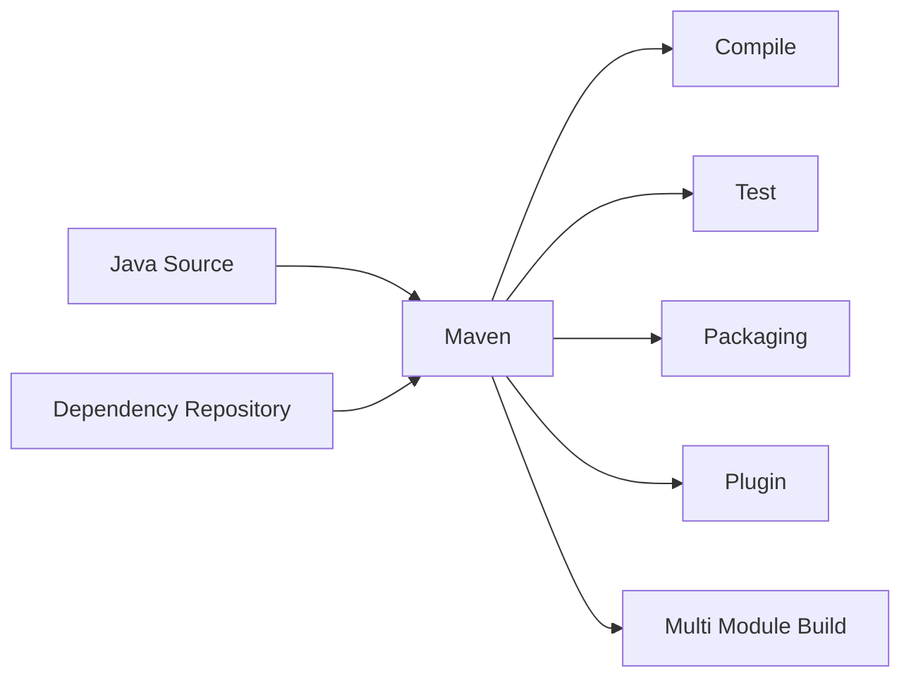
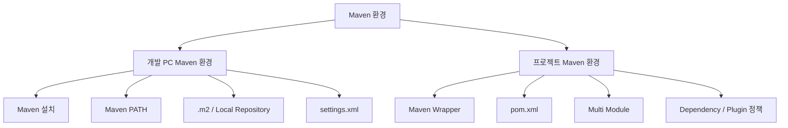
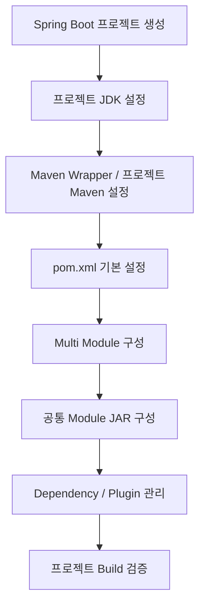

# Maven 설치 및 기본 환경 구성 가이드

## 1. 문서 목적

본 문서는 MicroServer 프로젝트 개발에 사용할 **Apache Maven**을 개발 PC에 준비하고,
Maven 명령을 사용할 수 있는 기본 환경을 구성하는 방법을 설명한다.

현재 단계에서는 아직 Spring Boot 프로젝트를 생성하지 않는다.

따라서 본 문서에서는 **Maven 자체의 설치와 개발 PC 수준의 기본 환경 구성**만 진행한다.

현재 단계에서 다루는 범위는 다음과 같다.

- Apache Maven 역할 이해
- Maven 버전 기준 확인
- Windows / macOS Maven Binary 설치
- Maven 실행 경로 구성
- 앞 단계에서 준비한 Eclipse Temurin JDK를 이용한 Maven 실행 확인
- `.m2` 및 Local Repository 이해
- 사용자별 `settings.xml` 역할 이해
- Maven Wrapper의 목적과 적용 시점 이해
- Maven 설치 관련 기본 문제 해결

다음과 같은 **프로젝트 종속 설정은 아직 진행하지 않는다.**

- `pom.xml` 작성 및 수정
- Spring Boot Parent / BOM 설정
- Maven Wrapper 생성 및 프로젝트 포함
- 프로젝트 Maven 버전 고정
- 멀티모듈 Maven 프로젝트 구성
- 부모 POM 구성
- 공통 모듈 JAR 구성
- Dependency Management
- Plugin Management
- Maven Compiler 설정
- 실제 프로젝트 Build
- 특정 Module Build
- Dependency Tree 분석
- Effective POM 분석

위 내용은 Spring Boot 프로젝트를 생성한 이후
**프로젝트 Maven / Build 환경 설정 단계**에서 순차적으로 구성한다.

---

## 2. 개발환경 구성에서 Maven의 위치

MicroServer 프로젝트의 개발도구 환경은 다음 순서로 구성한다.


현재 문서는 다음 단계에 해당한다.

```text
Git / GitHub 환경 구성
        ↓
Eclipse Temurin JDK 준비
        ↓
[ Apache Maven 설치 ]       ← 현재
        ↓
VS Code 개발환경 구성
        ↓
Spring Boot 프로젝트 생성
        ↓
프로젝트별 JDK / Maven / VS Code 설정
```

JDK가 Java 실행환경을 제공한다면 Maven은 Java 프로젝트의 Build 및 Dependency 관리 도구 역할을 담당한다.

현재는 Maven을 **개발 PC에 사용할 수 있는 상태로 준비**하고,
실제 MicroServer 프로젝트와 Maven을 연결하는 작업은 프로젝트 생성 이후 진행한다.

---

## 3. Maven의 역할

Maven은 Java 프로젝트의 **Build 및 Dependency 관리 도구**이다.

향후 MicroServer 프로젝트가 생성되면 Maven은 다음 역할을 담당한다.



대표적인 역할:

- Java Source Compile
- Unit Test 실행
- Dependency 관리
- JAR / WAR Packaging
- Plugin 실행
- Build Lifecycle 관리
- Multi Module Build
- Repository 연계

현재는 Maven이 관리할 실제 프로젝트가 존재하지 않으므로 위 기능을 실행하지 않는다.

현재 단계의 목표는 다음과 같다.

```text
Apache Maven Binary 준비
        ↓
Maven 실행 경로 구성
        ↓
Temurin JDK로 Maven 실행 확인
        ↓
개발 PC Maven 기본환경 준비 완료
```

---

## 4. 개발 PC Maven 환경과 프로젝트 Maven 환경 구분

Maven 환경은 크게 **개발 PC Maven 환경**과 **프로젝트 Maven 환경**으로 구분한다.



### 현재 단계

현재는 다음 영역만 구성한다.

```text
개발 PC Maven 환경
```

### 프로젝트 생성 이후

Spring Boot 프로젝트를 생성한 이후 다음 영역을 구성한다.

```text
프로젝트 Maven 환경
```

이 두 영역을 분리하면 아직 프로젝트가 존재하지 않는 상태에서
`pom.xml`, Wrapper, Multi Module 설정 등이 먼저 등장하는 문제를 방지할 수 있다.

---

## 5. Maven 버전 기준

MicroServer 프로젝트에서는 Apache Maven의 **현재 안정 버전(Stable Release)** 을 기준으로 설치한다.

본 문서 작성 시점의 Apache Maven 공식 Stable Release는 다음과 같다.

```text
Apache Maven 3.9.16
```

실제 설치 시점에는 Apache Maven 공식 다운로드 페이지에서 최신 Stable Release를 다시 확인한다.

> 프로젝트가 생성된 이후에는 Maven Wrapper를 이용하여
> 해당 프로젝트가 사용할 Maven 버전을 명확하게 고정할 예정이다.
>
> 현재 단계에서는 프로젝트가 존재하지 않으므로 Wrapper를 생성하지 않는다.

---

## 6. 사전 준비

Maven은 Java로 실행되는 도구이므로 JDK가 필요하다.

앞 단계에서 다음 환경이 준비되어 있어야 한다.

- Eclipse Temurin JDK 다운로드 완료
- JDK 압축 해제 완료
- JDK Home 경로 확인
- `java` / `javac` 직접 실행 확인 완료

JDK Home 예:

### Windows

```text
C:\dev\jdks\temurin-26
```

### macOS

```text
~/dev/jdks/temurin-26.jdk/Contents/Home
```

!!! note "macOS JDK Home"
    macOS의 `.jdk` 디렉터리 자체가 아니라 실제 Java Home인
    `Contents/Home`까지 포함한 경로를 사용한다.

MicroServer에서는 시스템 전체에 `JAVA_HOME`을 영구 설정하는 방식을 기본 절차로 사용하지 않는다.

따라서 Maven 설치 검증 시에는 **현재 Terminal Session에서만 Temurin JDK를 임시 연결**한다.

---

# Windows 환경

## 7. Windows Maven 다운로드

Apache Maven 공식 사이트에서 **Binary ZIP Archive**를 다운로드한다.

예:

```text
apache-maven-3.9.16-bin.zip
```

다음 파일과 혼동하지 않는다.

```text
O  Binary ZIP Archive
X  Source Archive
```

Source Archive는 Maven 자체 Source Code이므로 일반 개발환경 설치용으로 사용하지 않는다.

---

## 8. Maven Binary 무결성 확인

Apache Maven 공식 다운로드 페이지에서는 Binary 배포본과 함께
Checksum 및 Signature 검증 정보를 제공한다.

보안 정책이나 개발환경 정책상 다운로드 파일 검증이 필요한 경우
공식 사이트에서 제공하는 **SHA-512 Checksum**을 이용하여 다운로드한 파일이 변조되지 않았는지 확인할 수 있다.

Windows PowerShell 예:

```powershell
Get-FileHash .\apache-maven-3.9.16-bin.zip -Algorithm SHA512
```

출력된 Hash 값을 Apache Maven 공식 다운로드 페이지에서 제공하는 SHA-512 값과 비교한다.

개인 학습환경에서는 선택적으로 수행할 수 있지만,
기업 또는 보안 요구사항이 있는 개발환경에서는 검증을 권장한다.

---

## 9. Windows Maven 압축 해제

다운로드한 ZIP 파일을 개발도구 디렉터리에 압축 해제한다.

권장 예:

```text
C:\dev\tools\apache-maven-3.9.16
```

개발도구 구조 예:

```text
C:\dev\
 ├─ jdks\
 │   └─ temurin-26\
 │
 └─ tools\
     └─ apache-maven-3.9.16\
         ├─ bin\
         ├─ boot\
         ├─ conf\
         └─ lib\
```

JDK와 Maven을 서로 다른 역할의 개발도구로 구분하여 보관한다.

---

## 10. Windows Maven `bin` PATH 등록

Maven 명령을 어느 디렉터리에서나 사용할 수 있도록
Maven의 `bin` 디렉터리를 Windows 사용자 `Path`에 추가한다.

```text
C:\dev\tools\apache-maven-3.9.16\bin
```

Windows:

```text
시스템 환경 변수 편집
→ 환경 변수
→ 사용자 변수
→ Path
```

Maven `bin` 경로를 추가한다.

!!! note
    Maven `bin` 경로를 PATH에 추가하는 것과
    JDK `bin` 경로를 시스템 PATH에 추가하는 것은 서로 다른 설정이다.

본 프로젝트에서는 JDK `bin`을 시스템 PATH에 영구 등록하지 않는다.

---

## 11. Windows Maven 실행파일 확인

환경변수 변경 후 새로운 PowerShell을 실행한다.

Maven 실행파일 위치를 확인한다.

```powershell
where.exe mvn
```

정상 예:

```text
C:\dev\tools\apache-maven-3.9.16\bin\mvn.cmd
```

이 단계에서 Maven 실행파일은 확인되지만,
Java가 시스템 PATH에 없거나 `JAVA_HOME`이 설정되어 있지 않다면
아직 `mvn -version` 실행은 실패할 수 있다.

현재 JDK 운영 방식에서는 정상적인 상태이다.

---

## 12. Windows에서 Temurin JDK를 임시 연결

Maven 실행 검증을 위해 현재 PowerShell Session에서만 Temurin JDK를 연결한다.

```powershell
$env:JAVA_HOME="C:\dev\jdks\temurin-26"
$env:Path="$env:JAVA_HOME\bin;$env:Path"
```

확인:

```powershell
java -version
javac -version
mvn -version
```

Maven 출력에서 다음 항목을 확인한다.

```text
Apache Maven 3.9.16
Java version: ...
Java home: ...
OS name: ...
```

`Java home`이 앞 단계에서 준비한 Eclipse Temurin JDK Home을 가리키는지 확인한다.

PowerShell을 종료하면 이 Session에서 설정한 `JAVA_HOME`과 JDK PATH는 사라진다.

즉, 시스템 전역 `JAVA_HOME`은 변경하지 않는다.

---

## 13. Windows 검증 목적

현재 검증의 목적은 다음 두 가지이다.

```text
1. Maven Binary가 정상 설치되었는가?
2. Maven이 준비된 Temurin JDK에서 정상 실행되는가?
```

현재 단계에서는 다음 환경을 만들지 않는다.

```text
System JAVA_HOME = Temurin JDK
System PATH      = Temurin JDK/bin
```

향후 프로젝트가 생성되면 프로젝트 JDK와 Build 환경을 별도로 구성한다.

---

# macOS 환경

## 14. macOS Maven 설치 방식

MicroServer 프로젝트에서는 Windows와 macOS의 Maven 버전을 가능한 한 동일하게 관리하기 위해
Apache Maven **Binary Distribution을 직접 설치하는 방식**을 기준으로 설명한다.

Homebrew를 이용한 설치도 가능하지만,
설치 시점과 Package Manager 상태에 따라 버전이 달라질 수 있으므로
프로젝트 표준 가이드에서는 Binary Distribution 방식을 우선한다.

---

## 15. macOS Maven 다운로드

Apache Maven 공식 다운로드 페이지에서 Binary TAR.GZ Archive를 다운로드한다.

예:

```text
apache-maven-3.9.16-bin.tar.gz
```

Source Archive가 아닌 Binary Archive를 사용한다.

---

## 16. macOS Maven Binary 무결성 확인

필요한 경우 다운로드한 TAR.GZ 파일의 SHA-512 Hash를 확인한다.

```bash
shasum -a 512 apache-maven-3.9.16-bin.tar.gz
```

출력된 값과 Apache Maven 공식 다운로드 페이지에서 제공하는 SHA-512 값을 비교한다.

---

## 17. macOS Maven 압축 해제

개발도구 디렉터리를 준비한다.

```bash
mkdir -p ~/dev/tools
```

Maven 압축을 해제한다.

```bash
tar -xzf apache-maven-3.9.16-bin.tar.gz -C ~/dev/tools
```

결과 예:

```text
~/dev/
 ├─ jdks/
 │   └─ temurin-26.jdk/
 │
 └─ tools/
     └─ apache-maven-3.9.16/
         ├─ bin/
         ├─ boot/
         ├─ conf/
         └─ lib/
```

---

## 18. macOS Maven PATH 등록

Maven 명령을 어디서나 실행할 수 있도록 Maven `bin` 경로를 PATH에 등록한다.

```bash
nano ~/.zshrc
```

다음 내용을 추가한다.

```bash
export PATH="$HOME/dev/tools/apache-maven-3.9.16/bin:$PATH"
```

적용:

```bash
source ~/.zshrc
```

Maven 실행파일 확인:

```bash
which mvn
```

정상 예:

```text
/Users/<USER>/dev/tools/apache-maven-3.9.16/bin/mvn
```

여기서 등록하는 PATH는 **Maven 실행파일 경로**이다.

JDK Home이나 JDK `bin` 경로를 영구 등록하는 것은 아니다.

---

## 19. macOS에서 Temurin JDK를 임시 연결

현재 Terminal Session에서만 JDK를 연결한다.

```bash
export JAVA_HOME="$HOME/dev/jdks/temurin-26.jdk/Contents/Home"
export PATH="$JAVA_HOME/bin:$PATH"
```

확인:

```bash
java -version
javac -version
mvn -version
```

Maven 출력에서 다음 항목을 확인한다.

```text
Apache Maven 3.9.16
Java version: ...
Java home: ...
OS name: ...
```

`Java home`이 다음 경로를 가리키는지 확인한다.

```text
~/dev/jdks/temurin-26.jdk/Contents/Home
```

Terminal을 종료하면 현재 Session에 설정한 JDK 환경은 사라진다.

따라서 macOS에서도 시스템 전체 Java 버전을 프로젝트 때문에 고정하지 않는다.

---

## 20. Maven과 JDK의 관계

현재 개발환경의 관계는 다음과 같다.


Maven 자체를 실행하기 위해 Java Runtime이 필요하다.

현재 문서에서는 Maven이 **어떤 JDK로 실행되는지 확인하는 것까지만** 진행한다.

역할을 구분하면 다음과 같다.

```text
JDK 설치 가이드
→ Eclipse Temurin JDK 준비

Maven 설치 가이드
→ Apache Maven 준비
→ 준비한 JDK에서 Maven 실행 확인

VS Code 가이드
→ IDE / Java / Spring Boot Extension 준비

프로젝트 생성 이후
→ 실제 프로젝트 JDK / Maven / Build 설정 구성
```

---

## 21. `.m2`와 Local Repository

Maven은 Dependency와 Plugin 등을 Local Repository에 Cache한다.

기본 위치:

### Windows

```text
C:\Users\<USER>\.m2\repository
```

### macOS

```text
~/.m2/repository
```

Maven 사용자 Home 영역은 일반적으로 다음과 같이 구성된다.

```text
.m2/
 ├─ repository/
 └─ settings.xml       ← 필요한 경우 사용
```

역할:

```text
repository/
→ Maven Artifact Local Cache

settings.xml
→ 사용자별 Maven 환경 설정
```

현재는 프로젝트 Build를 수행하지 않으므로 Local Repository에 많은 파일이 없어도 정상이다.

`.m2`는 프로젝트 Source Directory와 별개이며
MicroServer Git Repository에 포함하지 않는다.

---

## 22. `settings.xml`

Maven 사용자별 설정 파일은 다음 위치를 사용한다.

### Windows

```text
C:\Users\<USER>\.m2\settings.xml
```

### macOS

```text
~/.m2/settings.xml
```

향후 다음과 같은 환경에서 사용할 수 있다.

- 사내 Nexus
- Artifactory
- Maven Mirror
- Proxy
- Repository 인증

`settings.xml`에는 개인 계정이나 인증정보가 포함될 수 있으므로
개인 `settings.xml`을 프로젝트 Git Repository에 Commit하지 않는다.

현재 별도 Repository 정책이 확정되지 않았다면
`settings.xml`을 미리 생성할 필요는 없다.

---

## 23. `MAVEN_HOME`은 필수인가

Apache Maven을 실행하기 위해 반드시 `MAVEN_HOME` 환경변수를 정의해야 하는 것은 아니다.

Maven의 `bin` 디렉터리를 PATH에서 찾을 수 있으면 Maven 명령을 실행할 수 있다.

```text
<MAVEN_INSTALL_DIR>/bin
```

따라서 본 가이드에서는 불필요한 환경변수를 늘리지 않고 다음 구성을 기본으로 한다.

```text
Maven 설치 디렉터리
        +
Maven bin PATH
```

특정 운영환경이나 도구가 `MAVEN_HOME`을 요구하는 경우에만 별도로 구성한다.

---

## 24. Maven Wrapper 운영 원칙

Maven Wrapper는 **특정 프로젝트가 사용할 Maven 버전을 프로젝트 차원에서 관리하기 위한 구성**이다.

향후 Spring Boot 프로젝트가 생성되면 다음과 같은 파일이 프로젝트에 존재할 수 있다.

```text
microserver/
 ├─ .mvn/
 ├─ mvnw
 ├─ mvnw.cmd
 └─ pom.xml
```

Wrapper를 사용하면 개발자 PC에 설치된 Maven 버전 차이를 줄이고
프로젝트가 요구하는 Maven 버전을 기준으로 Build할 수 있다.

현재 Maven 설치와 프로젝트 Maven Wrapper의 역할은 다음처럼 구분한다.

```text
개발 PC Maven
→ Maven 도구 자체를 준비
→ 초기 Maven 명령 사용 가능

Maven Wrapper
→ 특정 프로젝트의 Maven 버전 관리
→ 프로젝트 Build 표준
```

현재는 아직 프로젝트가 생성되지 않았으므로 Wrapper를 생성하지 않는다.

따라서 이 단계에서는 다음 명령을 실행하지 않는다.

```text
mvn wrapper:wrapper
```

Wrapper 구성은 Spring Boot 프로젝트 생성 이후
**프로젝트 Maven 설정 단계**에서 진행한다.

---

## 25. 프로젝트 생성 이후 진행할 Maven 설정

현재 문서에서는 아래 작업을 실제로 수행하지 않는다.

```text
pom.xml 작성 / 수정
Spring Boot Parent 설정
Spring Boot BOM 설정
Maven Wrapper 생성
Maven Wrapper 버전 고정
부모 POM 구성
멀티모듈 Maven 구성
공통 Module JAR Packaging
Dependency Management
Plugin Management
Maven Compiler 설정
Project Java Version 설정
clean / test / package / verify
특정 Module Build
dependency:tree
help:effective-pom
```

위 내용은 실제 Spring Boot 프로젝트가 존재하는 시점부터 다음 순서로 진행하는 것을 권장한다.



즉, Maven 관련 내용을 제거하는 것이 아니라
**실제 Maven Project Model이 존재하는 단계로 이동**하는 것이다.

---

## 26. 문제 해결

### 26.1 `mvn` 명령을 찾을 수 없음

#### Windows

```powershell
where.exe mvn
```

Maven `bin`이 Windows PATH에 포함되어 있는지 확인한다.

#### macOS

```bash
which mvn
```

`~/.zshrc`에 Maven `bin` PATH가 포함되어 있는지 확인한다.

---

### 26.2 `JAVA_HOME` 관련 오류

Maven은 Java Runtime이 필요하다.

현재 프로젝트에서는 시스템 `JAVA_HOME`을 영구 설정하지 않으므로
검증 시 현재 Terminal Session에 Temurin JDK를 임시 연결한다.

#### Windows

```powershell
$env:JAVA_HOME="C:\dev\jdks\temurin-26"
$env:Path="$env:JAVA_HOME\bin;$env:Path"

mvn -version
```

#### macOS

```bash
export JAVA_HOME="$HOME/dev/jdks/temurin-26.jdk/Contents/Home"
export PATH="$JAVA_HOME/bin:$PATH"

mvn -version
```

---

### 26.3 Maven이 다른 Java를 사용하는 경우

확인:

```bash
mvn -version
```

다음 항목을 확인한다.

```text
Java version
Java home
```

현재 Session에서 지정한 Eclipse Temurin JDK가 아닌 다른 JDK가 표시된다면
현재 Terminal의 `JAVA_HOME`과 PATH 우선순위를 확인한다.

---

### 26.4 Maven 버전이 예상과 다른 경우

Maven 실행파일 위치를 확인한다.

#### Windows

```powershell
where.exe mvn
```

#### macOS

```bash
which mvn
```

기존 Maven 설치가 PATH 앞쪽에 존재하면 예상과 다른 Maven 버전이 실행될 수 있다.

Maven PATH의 우선순위를 확인한다.

---

## 27. Maven 설치 완료 체크리스트

### JDK 연계

- [ ] Eclipse Temurin JDK가 앞 단계에서 준비되어 있다.
- [ ] Windows JDK Home 경로를 알고 있다.
- [ ] macOS JDK Home이 `.jdk/Contents/Home`까지 포함된 경로임을 확인했다.
- [ ] 검증 시 Temurin JDK를 현재 Terminal Session에만 연결했다.
- [ ] 시스템 전역 `JAVA_HOME`을 프로젝트 때문에 고정하지 않았다.

### Maven

- [ ] Apache Maven Binary Distribution을 다운로드했다.
- [ ] Source Archive가 아닌 Binary Archive를 사용했다.
- [ ] 필요한 경우 SHA-512로 배포본 무결성을 확인했다.
- [ ] Maven을 개발도구 디렉터리에 압축 해제했다.
- [ ] Maven `bin` 디렉터리가 PATH에 등록되어 있다.
- [ ] `mvn` 실행파일 위치를 확인했다.
- [ ] `mvn -version`이 정상적으로 실행된다.
- [ ] Maven이 검증용 Temurin JDK를 사용하고 있음을 확인했다.

### Maven 사용자 환경

- [ ] `.m2`와 Local Repository의 역할을 이해했다.
- [ ] 개인 `settings.xml`을 Git에 Commit하지 않는다는 원칙을 이해했다.
- [ ] `MAVEN_HOME`은 기본 구성에서 필수가 아님을 이해했다.

### 단계 확인

- [ ] Maven Wrapper는 프로젝트 생성 이후 구성한다.
- [ ] 아직 `pom.xml`을 작성하거나 수정하지 않았다.
- [ ] 아직 Maven Build를 수행하지 않았다.
- [ ] 아직 Multi Module을 구성하지 않았다.
- [ ] 아직 Dependency / Plugin 정책을 구성하지 않았다.

---

## 28. 다음 단계

Maven 개발도구 준비가 완료되면 VS Code 개발환경을 구성한다.

```text
Eclipse Temurin JDK
        ↓
Apache Maven                    ← 현재 완료
        ↓
VS Code 개발환경 구성
        ↓
Spring Boot 프로젝트 생성
        ↓
프로젝트 JDK / Maven / VS Code 설정
```

VS Code 환경 구성에서는 Java / Spring Boot Extension을 설치하고,
앞 단계에서 준비한 JDK와 Maven을 이후 프로젝트 개발환경에서 사용할 수 있도록 IDE 환경을 준비한다.

실제 Project Build와 관련된 Maven 설정은 Spring Boot 프로젝트 생성 이후 진행한다.

---

## 29. 공식 참고 자료

- Apache Maven Download  
  <https://maven.apache.org/download.cgi>

- Apache Maven Installation  
  <https://maven.apache.org/install.html>

- Apache Maven Wrapper  
  <https://maven.apache.org/tools/mavenwrapper.html>

- Configuring Apache Maven  
  <https://maven.apache.org/configure.html>
