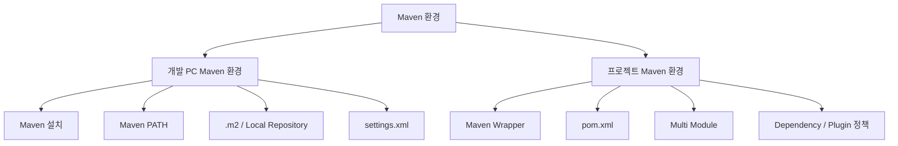

# Maven 설치 및 기본 환경 구성 가이드

## 1. 문서 목적

본 문서는 MicroServer 프로젝트 개발에 사용할 **Apache Maven**을 개발 PC에 준비하고,
Maven 명령을 사용할 수 있는 기본 환경을 구성하는 방법을 설명한다.

현재 단계에서는 아직 Spring Boot 프로젝트를 생성하지 않는다.

따라서 본 문서에서는 Maven 자체의 설치와 개발 PC 수준의 기본 환경만 구성하고,
다음과 같은 **프로젝트 종속 설정은 다루지 않는다.**

- `pom.xml` 작성 및 수정
- Spring Boot Parent / BOM 설정
- Maven Wrapper 생성 및 프로젝트 포함
- 멀티모듈 Maven 프로젝트 구성
- 부모 POM 구성
- 공통 모듈 JAR 구성
- Dependency Management
- Plugin Management
- 실제 프로젝트 Build
- 특정 Module Build
- Dependency Tree 분석
- Effective POM 분석

위 항목은 Spring Boot 프로젝트를 생성한 이후
**프로젝트 Maven / Build 환경 설정 가이드**에서 순차적으로 구성한다.

---

## 2. 개발환경 구성에서 Maven의 위치

MicroServer 프로젝트의 개발도구 환경은 다음 순서로 구성한다.


현재 문서는 다음 단계에 해당한다.

```text
Git / GitHub 환경 구성
        ↓
Eclipse Temurin JDK 준비
        ↓
[ Apache Maven 설치 ]       ← 현재
        ↓
VS Code 개발환경 구성
        ↓
Spring Boot 프로젝트 생성
        ↓
프로젝트별 JDK / Maven / VS Code 설정
```

Maven을 먼저 개발 PC에 준비하고,
이후 VS Code에 Java / Spring Boot / Maven 지원 Extension을 구성한다.

프로젝트 생성 이후에는 개발 PC에 설치된 도구를 실제 MicroServer 프로젝트와 연결한다.

---

## 3. Maven의 역할

Maven은 Java 프로젝트의 **Build 및 Dependency 관리 도구**이다.

향후 MicroServer 프로젝트가 생성되면 Maven은 다음 역할을 담당한다.

```text
Java Source
    ↓
Maven
    ├─ Compile
    ├─ Test
    ├─ Dependency 관리
    ├─ Packaging
    ├─ Plugin 실행
    └─ Multi Module Build
```

다만 현재는 프로젝트가 존재하지 않으므로
Maven의 프로젝트 기능을 실제로 사용하지 않는다.

현재 단계의 목적은 다음과 같다.

```text
Apache Maven Binary 준비
        ↓
Maven 실행 경로 구성
        ↓
Temurin JDK를 이용한 Maven 실행 확인
        ↓
개발 PC의 Maven 기본 환경 준비 완료
```

---

## 4. 프로젝트 Maven 설정과 개발 PC Maven 설정의 구분

Maven 관련 설정은 크게 두 영역으로 구분한다.



### 현재 단계

```text
개발 PC Maven 환경
```

만 구성한다.

### Spring Boot 프로젝트 생성 이후

```text
프로젝트 Maven 환경
```

을 구성한다.

이 두 영역을 분리하면 아직 프로젝트가 존재하지 않는 상태에서
`pom.xml`이나 Module Build 설정이 먼저 등장하는 문제를 방지할 수 있다.

---

## 5. Maven 버전 기준

MicroServer 프로젝트에서는 Apache Maven의 **현재 안정 버전(Stable Release)** 을 기준으로 설치한다.

본 문서 작성 시점의 Apache Maven 공식 Stable Release는 다음과 같다.

```text
Apache Maven 3.9.16
```

Maven 공식 다운로드 페이지에서는 Maven 3.9.16을 최신 Release이자 권장 버전으로 안내하고 있다.

프로젝트를 장기간 운영하는 과정에서 Maven 최신 버전이 변경될 수 있으므로
실제 설치 시에는 Apache Maven 공식 다운로드 페이지의 Stable Release를 다시 확인한다.

> 프로젝트가 생성된 이후에는 Maven Wrapper를 이용하여
> 프로젝트에서 사용할 Maven 버전을 고정할 예정이다.
>
> 현재 단계에서는 아직 프로젝트가 없으므로 Wrapper를 생성하지 않는다.

---

## 6. 사전 준비

Maven 자체가 Java로 실행되기 때문에 JDK가 필요하다.

앞 단계에서 다음 환경이 준비되어 있어야 한다.

- Eclipse Temurin JDK 다운로드 및 압축 해제 완료
- 사용할 Temurin JDK 경로 확인

예:

### Windows

```text
C:\dev\jdks\temurin-26
```

### macOS

```text
~/dev/jdks/temurin-26.jdk
```

MicroServer에서는 프로젝트별 JDK 운영을 기본으로 하므로
시스템 전체에 `JAVA_HOME`을 영구 설정하는 것을 기본 절차로 사용하지 않는다.

따라서 현재 단계에서는 Maven 설치 후 동작을 확인할 때만
현재 Terminal Session에 Temurin JDK를 **임시 연결**하여 검증한다.

---

# 7. Windows Maven 설치

## 7.1 Maven Binary Distribution 다운로드

Apache Maven 공식 사이트에서 Binary ZIP Archive를 다운로드한다.

예:

```text
apache-maven-3.9.16-bin.zip
```

Source Archive가 아니라 **Binary Archive**를 사용한다.

---

## 7.2 Maven 압축 해제

다운로드한 ZIP 파일을 개발도구 디렉터리에 압축 해제한다.

권장 예:

```text
C:\dev\tools\apache-maven-3.9.16
```

구조 예:

```text
C:\dev\
 ├─ jdks\
 │   └─ temurin-26\
 │
 └─ tools\
     └─ apache-maven-3.9.16\
         ├─ bin\
         ├─ boot\
         ├─ conf\
         └─ lib\
```

JDK와 Maven을 서로 다른 역할의 개발도구로 구분하여 보관한다.

---

## 7.3 Maven `bin` PATH 등록

Maven 명령을 어느 디렉터리에서나 사용할 수 있도록 다음 경로를 Windows `Path`에 추가한다.

예:

```text
C:\dev\tools\apache-maven-3.9.16\bin
```

Windows 검색에서 다음 메뉴를 연다.

```text
시스템 환경 변수 편집
→ 환경 변수
→ 사용자 변수
→ Path
```

Maven `bin` 디렉터리를 추가한다.

> Maven 자체를 찾기 위한 PATH 설정이며,
> JDK의 `bin` 디렉터리를 시스템 PATH에 영구 등록하는 것과는 별개의 설정이다.

---

## 7.4 새 PowerShell에서 Maven 명령 확인

환경변수 변경 후 기존 PowerShell이 아닌 **새 PowerShell**을 실행한다.

Maven 실행파일 경로 확인:

```powershell
where.exe mvn
```

예:

```text
C:\dev\tools\apache-maven-3.9.16\bin\mvn.cmd
```

이 단계에서 JDK가 시스템 PATH에 등록되어 있지 않다면
아직 `mvn -version` 실행이 실패할 수 있다.

이는 현재 프로젝트의 JDK 운영 정책에서는 정상적인 상황이다.

---

# 8. Windows에서 Temurin JDK를 임시 연결하여 Maven 확인

Maven은 실행할 Java Runtime이 필요하다.

현재 PowerShell Session에서만 Temurin JDK를 임시로 연결한다.

예:

```powershell
$env:JAVA_HOME="C:\dev\jdks\temurin-26"
$env:Path="$env:JAVA_HOME\bin;$env:Path"
```

확인:

```powershell
java -version
javac -version
mvn -version
```

Maven 정보에서 다음 항목을 확인한다.

```text
Apache Maven 3.9.16
Java version: ...
Java home: ...
```

`Java home`이 앞 단계에서 준비한 Eclipse Temurin JDK를 가리키는지 확인한다.

PowerShell을 종료하면 위에서 설정한 `JAVA_HOME`과 JDK PATH는 사라진다.

즉, **시스템 전역 JAVA_HOME을 변경하지 않는다.**

---

# 9. Windows 임시 환경의 의미

이번 검증의 목적은 다음 두 가지뿐이다.

```text
1. Maven Binary가 정상 설치되었는가?
2. Maven이 준비된 Temurin JDK에서 정상 실행되는가?
```

현재 단계에서는 다음 환경을 만들지 않는다.

```text
System JAVA_HOME = Temurin JDK
System PATH      = Temurin JDK/bin
```

향후 MicroServer 프로젝트를 생성한 뒤
VS Code Workspace와 프로젝트 Build 환경에서 사용할 JDK를 명확하게 연결한다.

---

# 10. macOS Maven 설치

MicroServer 프로젝트에서는 Windows와 macOS의 Maven 버전을 가능한 한 동일하게 관리하기 위해
Apache Maven **Binary Distribution을 직접 사용하는 방식**을 기준으로 설명한다.

Homebrew를 이용한 설치도 가능하지만
설치 시점에 따라 Maven 버전이나 연계 패키지가 달라질 수 있으므로
프로젝트 표준 가이드에서는 Binary Distribution 방식을 우선한다.

---

## 10.1 Maven Binary Distribution 다운로드

macOS에서는 Binary TAR.GZ Archive를 사용할 수 있다.

예:

```text
apache-maven-3.9.16-bin.tar.gz
```

---

## 10.2 압축 해제

예:

```bash
mkdir -p ~/dev/tools
tar -xzf apache-maven-3.9.16-bin.tar.gz -C ~/dev/tools
```

결과:

```text
~/dev/
 ├─ jdks/
 │   └─ temurin-26.jdk/
 │
 └─ tools/
     └─ apache-maven-3.9.16/
```

---

## 10.3 Maven PATH 등록

zsh 환경에서 Maven `bin` 디렉터리를 PATH에 추가한다.

```bash
nano ~/.zshrc
```

다음 내용을 추가한다.

```bash
export PATH="$HOME/dev/tools/apache-maven-3.9.16/bin:$PATH"
```

적용:

```bash
source ~/.zshrc
```

확인:

```bash
which mvn
```

예:

```text
/Users/<USER>/dev/tools/apache-maven-3.9.16/bin/mvn
```

---

# 11. macOS에서 Temurin JDK를 임시 연결하여 Maven 확인

현재 Terminal Session에서만 Temurin JDK를 연결한다.

JDK 디렉터리 구조에 따라 실제 경로는 다를 수 있다.

예:

```bash
export JAVA_HOME="$HOME/dev/jdks/temurin-26.jdk/Contents/Home"
export PATH="$JAVA_HOME/bin:$PATH"
```

확인:

```bash
java -version
javac -version
mvn -version
```

Maven 출력에서 다음 항목을 확인한다.

```text
Apache Maven 3.9.16
Java version: ...
Java home: ...
```

Terminal을 종료하면 현재 Session에 설정한 JDK 환경은 사라진다.

따라서 macOS에서도 시스템 전체의 Java 버전을 프로젝트 때문에 고정하지 않는다.

---

# 12. Maven과 JDK 관계

현재 개발환경의 관계는 다음과 같다.


Maven 실행 자체에는 Java가 필요하지만,
현재 Maven 설치 가이드에서 프로젝트의 Java 버전 정책까지 결정하지는 않는다.

역할을 구분하면 다음과 같다.

```text
JDK 설치 가이드
→ 사용할 Temurin JDK 준비

Maven 설치 가이드
→ Maven Binary 준비 및 JDK에서 실행되는지 확인

VS Code 가이드
→ IDE / Extension 환경 준비

프로젝트 생성 이후
→ 프로젝트가 사용할 JDK / Maven 버전 및 Build 설정 확정
```

---

# 13. Local Repository

Maven은 Dependency와 Plugin 등을 로컬 Repository에 Cache한다.

기본 위치:

### Windows

```text
C:\Users\<USER>\.m2\repository
```

### macOS

```text
~/.m2/repository
```

현재는 프로젝트 Build를 수행하지 않으므로 Repository에 많은 파일이 존재하지 않아도 정상이다.

향후 프로젝트를 생성하고 Dependency를 다운로드하면 Maven이 자동으로 Local Repository를 사용한다.

---

# 14. `.m2` 디렉터리

Maven 사용 시 사용자 Home 아래에 `.m2` 디렉터리가 사용된다.

예:

```text
.m2/
 ├─ repository/
 └─ settings.xml       ← 필요 시 사용
```

주요 역할:

```text
repository/
→ Maven Artifact Local Cache

settings.xml
→ 사용자별 Maven 환경 설정
```

이 디렉터리는 프로젝트 Source Directory와 별개이다.

따라서 `.m2` 전체를 MicroServer Git Repository에 포함하지 않는다.

---

# 15. `settings.xml`

Maven 사용자별 설정 파일은 다음 위치를 사용한다.

### Windows

```text
C:\Users\<USER>\.m2\settings.xml
```

### macOS

```text
~/.m2/settings.xml
```

향후 다음 환경에서 사용할 수 있다.

- 사내 Nexus
- Artifactory
- Maven Mirror
- Proxy
- Repository 인증

개인 비밀번호나 Token 등이 포함될 수 있으므로
사용자 개인 `settings.xml`을 프로젝트 Git Repository에 Commit하지 않는다.

현재 MicroServer 프로젝트에서 별도 Repository 정책이 확정되지 않았다면
`settings.xml`을 억지로 만들 필요는 없다.

---

# 16. `MAVEN_HOME`은 필수인가

Apache Maven을 실행하기 위해 반드시 `MAVEN_HOME`을 정의해야 하는 것은 아니다.

Maven Binary의 다음 디렉터리를 PATH에서 찾을 수 있으면 된다.

```text
<MAVEN_INSTALL_DIR>/bin
```

따라서 본 가이드에서는 불필요한 환경변수를 늘리지 않기 위해
다음 구성을 기본으로 한다.

```text
Maven 설치 디렉터리
        +
Maven bin PATH
```

필요한 경우 운영환경이나 특정 도구 정책에 따라 별도의 Maven Home 변수를 사용할 수 있다.

---

# 17. Maven Wrapper는 언제 구성하는가

Maven Wrapper는 **특정 프로젝트가 사용할 Maven 버전을 프로젝트 안에 명시하기 위한 구성**이다.

대표적으로 프로젝트에는 향후 다음 파일이 존재할 수 있다.

```text
microserver/
 ├─ .mvn/
 ├─ mvnw
 ├─ mvnw.cmd
 └─ pom.xml
```

하지만 현재는 아직 프로젝트가 생성되지 않았다.

따라서 본 단계에서는 다음 명령을 실행하지 않는다.

```text
mvn wrapper:wrapper
```

Wrapper는 Spring Boot 프로젝트가 생성된 이후
프로젝트 Build 표준을 구성하는 단계에서 적용한다.

---

# 18. Maven Wrapper를 이후에 사용하는 이유

개발 PC에 설치한 Maven과 프로젝트에서 사용할 Maven은 역할이 다를 수 있다.

```text
개발 PC Maven
→ Maven 도구 준비 / 초기 프로젝트 작업

Maven Wrapper
→ 특정 프로젝트의 Maven 버전 고정
```

프로젝트 생성 이후에는 가능하면 Wrapper를 기준으로 Build함으로써
개발자별 Maven 버전 차이를 줄인다.

즉, 현재 Maven 설치는 **개발 도구 준비 단계**이며
최종 프로젝트 Build 표준은 Maven Wrapper 구성 단계에서 확정한다.

---

# 19. 현재 단계에서 하지 않는 작업

다음 항목은 모두 프로젝트가 생성된 후 진행한다.

```text
pom.xml 작성 / 수정

Spring Boot Parent 설정

Spring Boot BOM 설정

Maven Wrapper 생성

Maven Wrapper 버전 고정

부모 POM 구성

멀티모듈 Maven 구성

공통 Module JAR Packaging

Dependency Management

Plugin Management

Maven Compiler 설정

Project Java Version 설정

clean / test / package / verify

특정 Module Build

dependency:tree

help:effective-pom
```

이 항목들을 현재 문서에 넣지 않는 이유는
**아직 Maven이 관리할 Project Model 자체가 존재하지 않기 때문**이다.

---

# 20. 프로젝트 생성 이후 이동될 Maven 설정

Spring Boot 프로젝트를 생성한 이후 Maven 관련 가이드는 다음과 같이 구성하는 것을 권장한다.

```text
Spring Boot 프로젝트 생성
        ↓
프로젝트 기본 JDK 설정
        ↓
Maven Wrapper / 프로젝트 Maven 설정
        ↓
pom.xml 기본 설정
        ↓
멀티모듈 Maven 프로젝트 구성
        ↓
공통 모듈 JAR 구성
        ↓
Dependency / Plugin 관리
        ↓
프로젝트 Build 검증
```

기존 Maven 가이드에 포함되어 있던 다음 내용은 이 단계에서 다시 사용한다.

- Maven Wrapper
- Maven 기본 Project 구조
- Maven Lifecycle
- 부모 POM
- Multi Module
- 공통 Module JAR
- Dependency Management
- Plugin Management
- Module Build
- Effective POM
- Dependency Tree
- Build 표준

즉, 내용을 제거하는 것이 아니라 **실제 Project가 존재하는 시점으로 이동**한다.

---

# 21. 문제 해결

## 21.1 `mvn` 명령을 찾을 수 없음

### Windows

```powershell
where.exe mvn
```

Maven `bin`이 Windows PATH에 포함되어 있는지 확인한다.

### macOS

```bash
which mvn
```

`~/.zshrc`에 Maven `bin` PATH가 포함되어 있는지 확인한다.

---

## 21.2 `JAVA_HOME` 관련 오류

Maven은 Java Runtime이 필요하다.

현재 프로젝트에서는 시스템 `JAVA_HOME`을 영구 설정하지 않으므로
검증 시 현재 Terminal Session에 Temurin JDK를 임시 연결한다.

### Windows 예

```powershell
$env:JAVA_HOME="C:\dev\jdks\temurin-26"
$env:Path="$env:JAVA_HOME\bin;$env:Path"

mvn -version
```

### macOS 예

```bash
export JAVA_HOME="$HOME/dev/jdks/temurin-26.jdk/Contents/Home"
export PATH="$JAVA_HOME/bin:$PATH"

mvn -version
```

---

## 21.3 Maven은 실행되지만 다른 Java를 사용하는 경우

확인:

```bash
mvn -version
```

다음 항목을 확인한다.

```text
Java version
Java home
```

현재 Session에서 지정한 Temurin JDK가 아닌 다른 JDK가 표시된다면
현재 Terminal의 `JAVA_HOME`과 PATH 우선순위를 확인한다.

---

# 22. Maven 설치 완료 체크리스트

## 공통

- [ ] Eclipse Temurin JDK가 앞 단계에서 준비되어 있다.
- [ ] Apache Maven Binary Distribution을 준비했다.
- [ ] Maven `bin` 디렉터리가 PATH에 등록되어 있다.
- [ ] `mvn` 실행파일을 찾을 수 있다.
- [ ] Temurin JDK를 현재 Terminal Session에 임시 연결할 수 있다.
- [ ] `mvn -version`이 정상적으로 실행된다.
- [ ] Maven이 검증용 Temurin JDK를 사용하고 있음을 확인했다.

## 운영 원칙

- [ ] 시스템 전역 `JAVA_HOME`을 프로젝트 때문에 고정하지 않았다.
- [ ] `.m2`와 Local Repository의 역할을 이해했다.
- [ ] 개인 `settings.xml`을 Git에 Commit하지 않는다는 원칙을 이해했다.
- [ ] Maven Wrapper는 프로젝트 생성 이후 구성한다는 것을 확인했다.
- [ ] 아직 `pom.xml`을 작성하거나 수정하지 않았다.
- [ ] 아직 Maven Build를 수행하지 않았다.
- [ ] 아직 Multi Module을 구성하지 않았다.

---

# 23. 다음 단계

Maven 개발도구 준비가 완료되면 VS Code 개발환경을 구성한다.

```text
Eclipse Temurin JDK
        ↓
Apache Maven                    ← 현재 완료
        ↓
VS Code 개발환경 구성
        ↓
Spring Boot 프로젝트 생성
        ↓
프로젝트 JDK / Maven / VS Code 설정
```

VS Code 환경 구성에서는 Java / Spring Boot Extension을 설치하고
앞 단계에서 준비한 JDK와 Maven을 향후 프로젝트에서 사용할 수 있는 IDE 환경을 준비한다.

실제 Project Build와 관련된 Maven 설정은 Spring Boot 프로젝트 생성 이후 진행한다.

---

# 24. 참고

- Apache Maven Download  
  <https://maven.apache.org/download.cgi>

- Apache Maven Installation  
  <https://maven.apache.org/install.html>

- Apache Maven Wrapper  
  <https://maven.apache.org/tools/mavenwrapper.html>
