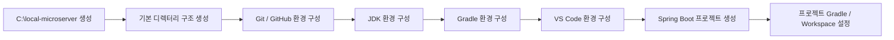

# 프로젝트 로컬 개발환경 구성 가이드

## 1. 개요

MicroServer 프로젝트의 개발환경은 개발자 PC의 전역 설정에 최대한 의존하지 않고, 프로젝트에서 사용하는 개발 도구와 소스코드, 워크스페이스를 **하나의 기준 경로 아래에서 일관되게 관리**하는 것을 목표로 한다.

Windows 개발환경의 기준 루트 경로는 다음과 같이 사용한다.

```text
C:\local-microserver
```

이 경로 아래에 JDK, Gradle 관련 데이터, VS Code Workspace, Git 로컬 저장소 등을 배치하여 프로젝트에 필요한 주요 개발환경을 한곳에서 관리한다.

이 방식의 핵심 목적은 다음과 같다.

- 개발자마다 서로 다른 개발도구 설치 위치를 사용하는 문제를 줄인다.
- Windows 시스템 전역 환경변수에 대한 의존성을 최소화한다.
- 프로젝트 관련 파일과 개발 도구의 관리 위치를 표준화한다.
- 신규 개발자가 동일한 디렉터리 구조로 빠르게 개발환경을 구성할 수 있도록 한다.
- 개발환경 전달 시 경로 차이로 발생하는 설정 오류를 줄인다.
- 필요할 경우 개발환경 폴더를 압축하여 동일한 구조로 전달할 수 있도록 한다.

!!! info "이 문서의 범위"
    이 문서는 JDK, Gradle, VS Code 각각의 상세 설치 방법을 설명하는 문서가 아니다.

    현재 단계에서는 **MicroServer 프로젝트의 로컬 개발환경을 어떤 디렉터리 구조로 관리할 것인지**,  
    그리고 각 개발도구와 Git Repository, Workspace를 **어디에 배치할 것인지에 대한 기준을 정의**한다.

    JDK 설치, Gradle 설치 및 설정, VS Code Extension / Workspace 구성 등 실제 설정 절차는 이후 각 전용 가이드에서 단계별로 진행한다.

!!! tip "권장 방향"
    `C:\local-microserver` 자체를 하나의 Git 저장소로 만드는 것이 아니라,
    프로젝트 소스별 Git 로컬 저장소를 하위 `repos` 디렉터리에 구성하는 방식을 권장한다.

---

## 2. 권장 디렉터리 구조

MicroServer 프로젝트의 Windows 로컬 개발환경은 다음 구조를 기본으로 한다.

```text
C:\local-microserver
│
├─ tools
│  └─ jdk
│      └─ <project-jdk>
│
├─ gradle-home
│
├─ workspace
│  └─ microserver.code-workspace
│
├─ repos
│  ├─ microserver
│  │  ├─ .git
│  │  ├─ gradlew
│  │  ├─ gradlew.bat
│  │  ├─ gradle
│  │  │  └─ wrapper
│  │  ├─ settings.gradle
│  │  ├─ build.gradle
│  │  └─ ...
│  │
│  └─ ...
│
├─ env
│  ├─ setup.cmd
│  └─ setup.ps1
│
└─ README.md
```

각 디렉터리는 다음 역할을 담당한다.

| 경로 | 역할 |
| --- | --- |
| `tools` | 프로젝트에서 사용하는 로컬 개발 도구 보관 |
| `tools\jdk` | 프로젝트 표준 JDK 배치 |
| `gradle-home` | Gradle Wrapper 다운로드 파일 및 Gradle 사용자 캐시 저장 |
| `workspace` | VS Code Workspace 파일 저장 |
| `repos` | Git으로 관리되는 실제 프로젝트 소스 저장 |
| `env` | VS Code 외부 터미널에서 사용할 프로젝트 로컬 환경 초기화 스크립트 저장 |
| `README.md` | 개발환경 기본 사용 방법 및 전달 시 안내사항 작성 |

이 구조의 중요한 점은 **개발도구와 소스코드가 하나의 루트 아래에 있지만 서로 다른 역할의 디렉터리로 명확하게 분리되어 있다는 것**이다.

---

## 3. 하나의 루트 디렉터리로 관리하는 이유

일반적인 Windows 개발환경에서는 개발도구와 소스코드가 다음과 같이 여러 위치에 분산되는 경우가 많다.

```text
C:\Program Files\Java\...
C:\gradle\...
C:\Users\<사용자>\.gradle
C:\Users\<사용자>\source\repos\...
C:\Users\<사용자>\AppData\...
```

이렇게 구성하면 개발자마다 다음과 같은 차이가 발생할 수 있다.

```text
개발자 A
 ├─ JDK 설치 위치 A
 ├─ Gradle 설정 A
 └─ Source Repository 위치 A

개발자 B
 ├─ JDK 설치 위치 B
 ├─ Gradle 설정 B
 └─ Source Repository 위치 B
```

프로젝트 자체에는 문제가 없더라도 개발자 PC마다 경로와 버전이 달라지면서 다음과 같은 문제가 발생할 수 있다.

- `JAVA_HOME` 차이
- Gradle 실행 버전 차이
- VS Code Workspace 절대경로 차이
- 프로젝트 실행 Script 경로 차이
- 신규 개발환경 구성 시 반복적인 수동 설정
- 다른 개발자에게 환경을 전달할 때 재설정 필요

MicroServer 프로젝트에서는 이러한 차이를 줄이기 위해 기준 루트 경로를 다음과 같이 통일한다.

```text
C:\local-microserver
```

즉 개발자의 개인 PC 환경을 기준으로 프로젝트를 맞추는 것이 아니라,

**프로젝트가 요구하는 표준 개발환경 구조를 먼저 정의하고 개발자가 그 구조를 사용하도록 한다.**

---

## 4. JDK 배치 기준

JDK는 다음 위치에서 관리하는 것을 기본 방향으로 한다.

```text
C:\local-microserver\tools\jdk\<project-jdk>
```

예를 들어 프로젝트 표준 JDK가 준비되면 다음과 같은 형태가 된다.

```text
C:\local-microserver
└─ tools
   └─ jdk
      └─ <project-jdk>
```

현재 문서에서는 **JDK를 프로젝트 로컬 개발환경의 어느 위치에서 관리할 것인지**만 정의한다.

실제 JDK 배포판 선택, 다운로드, 설치 또는 압축 해제 방식, 버전 확인, 환경변수 적용 방법 등은 JDK 전용 가이드에서 진행한다.

!!! tip "JDK 상세 설정은 다음 가이드에서 진행"
    JDK 설치 및 실제 개발환경 설정은 다음 문서에서 자세히 설명한다.

    **[JDK 설치 및 설정](java/jdk_setup.md)**

    해당 문서에서는 프로젝트 표준 JDK 준비, 설치 위치, 버전 확인 및 Java 실행환경 구성을 단계별로 진행한다.

### 4.1 시스템 전역 설정 최소화

MicroServer 프로젝트에서는 가능하면 개발자 PC 전체에 영향을 주는 전역 설정을 최소화한다.

예를 들어 시스템 전체 `JAVA_HOME`을 프로젝트마다 변경하면 다른 Java 프로젝트에 영향을 줄 수 있다.

따라서 프로젝트 로컬 JDK를 사용하고, 이후 필요에 따라 다음 방식으로 프로젝트에 연결한다.

- VS Code에서 프로젝트 JDK 지정
- 프로젝트 실행 환경에서 JDK 경로 지정
- 개발환경 초기화 Script에서 세션 단위 환경변수 적용

현재 단계에서는 이러한 구성 방향만 이해하고, 실제 설정은 이후 전용 가이드에서 수행한다.

---

## 5. Gradle 관리 기준

Gradle은 JDK와 동일하게 단순히 특정 폴더에 프로그램을 설치하는 개념보다는 **프로젝트 Build Tool과 Wrapper를 어떻게 일관되게 관리할 것인지**가 중요하다.

MicroServer 프로젝트에서는 다음 두 영역을 구분한다.

```text
개발환경 단계
 └─ Gradle 기본 환경 이해 및 준비

프로젝트 생성 이후
 └─ Gradle Wrapper를 이용한 프로젝트 Gradle 버전 고정
```

현재 로컬 개발환경 구조에서는 Gradle 관련 사용자 데이터를 다음 위치에 모아서 관리할 수 있도록 한다.

```text
C:\local-microserver\gradle-home
```

이 디렉터리는 필요에 따라 Gradle Wrapper 다운로드 파일, 캐시 등 Gradle 사용자 데이터를 프로젝트 루트 하위에서 관리하기 위한 위치로 사용한다.

!!! tip "Gradle 설치 및 기본 환경은 다음 가이드에서 진행"
    Gradle 자체의 설치 방식, 전역 Gradle과 프로젝트 Gradle의 차이,
    Gradle 실행 확인 및 기본 환경 구성은 다음 문서에서 자세히 설명한다.

    **[Gradle 설치 및 기본 환경 구성](gradle/gradle_setup.md)**

    현재 문서에서는 Gradle 관련 데이터를 `C:\local-microserver` 내부에서 관리할 수 있도록
    디렉터리 구조만 정의한다.

### 5.1 Gradle Wrapper는 프로젝트 생성 이후 적용

실제 MicroServer 프로젝트를 생성한 이후에는 Gradle Wrapper를 프로젝트 Repository 내부에 포함한다.

개념적인 구조는 다음과 같다.

```text
repos
└─ microserver
   ├─ gradlew
   ├─ gradlew.bat
   └─ gradle
      └─ wrapper
```

Wrapper를 사용하면 개발자 PC에 설치된 전역 Gradle보다 **프로젝트에서 지정한 Gradle 버전을 기준으로 Build 환경을 통일**할 수 있다.

현재 단계에서는 Wrapper의 역할만 이해하고 실제 생성, 버전 고정, `build.gradle`, `settings.gradle` 구성 등은 프로젝트 생성 이후 별도 가이드에서 수행한다.

!!! tip "프로젝트 Gradle 설정은 프로젝트 생성 이후 진행"
    Spring Boot 프로젝트 생성 이후의 Gradle Wrapper 설정은 다음 문서에서 진행한다.

    **[Gradle Wrapper 및 프로젝트 Gradle 설정](../03_project_creation/project_environment/project_gradle_setup.md)**

    해당 단계에서는 Wrapper 버전 고정, 프로젝트 Gradle 실행, Build 설정 등을 실제 프로젝트를 대상으로 구성한다.

---

## 6. Git 로컬 저장소 구성

### 6.1 루트 디렉터리 전체를 Git 저장소로 만들지 않는다

다음과 같이 `C:\local-microserver` 전체를 하나의 Git Repository로 만드는 방식은 권장하지 않는다.

```text
C:\local-microserver
├─ .git
├─ tools
├─ gradle-home
├─ workspace
└─ repos
```

이렇게 구성하면 JDK, Gradle 캐시, 개발도구 등 Git으로 관리할 필요가 없는 파일까지 하나의 저장소 관리 범위에 포함될 수 있다.

따라서 Git은 실제 소스코드가 있는 Repository 단위로 관리한다.

```text
C:\local-microserver
└─ repos
   └─ microserver
      ├─ .git
      ├─ build.gradle
      ├─ settings.gradle
      ├─ gradlew
      ├─ gradlew.bat
      └─ src
```

즉 다음 경로가 MicroServer 프로젝트의 Git 로컬 저장소가 된다.

```text
C:\local-microserver\repos\microserver
```

### 6.2 여러 Repository를 사용하는 경우

프로젝트가 여러 Git Repository로 분리되는 경우에도 동일한 기준을 사용한다.

```text
C:\local-microserver
└─ repos
   ├─ microserver
   ├─ microserver-common
   ├─ microserver-sample
   └─ microserver-docs
```

각 디렉터리는 독립적인 Git Repository가 된다.

```text
repos
├─ microserver
│  └─ .git
├─ microserver-common
│  └─ .git
└─ microserver-docs
   └─ .git
```

!!! tip "Git / GitHub 상세 구성"
    Git 설치, GitHub Repository 연결, Clone / Commit / Push 등의 실제 형상관리 환경 구성은 다음 가이드에서 진행한다.

    **[Git / GitHub 환경 구성](git_github_setup.md)**

---

## 7. VS Code Workspace 배치 기준

VS Code Workspace는 다음 위치에서 관리하는 것을 권장한다.

```text
C:\local-microserver\workspace\microserver.code-workspace
```

Workspace 파일을 별도 디렉터리에 두면 여러 Git Repository를 하나의 개발 Workspace로 구성할 수 있고, 개발환경 전달 시에도 Workspace 위치를 일정하게 유지할 수 있다.

이 문서에서는 Workspace의 **배치 위치와 상대경로 사용 원칙**까지만 정의한다.

예를 들어 Repository를 Workspace에서 연결할 때 개발자의 사용자 경로를 직접 작성하는 것보다 다음과 같이 상대경로를 사용하는 것이 좋다.

```json
{
  "folders": [
    {
      "path": "../repos/microserver"
    }
  ]
}
```

이렇게 하면 전체 `local-microserver` 디렉터리 구조를 동일하게 유지하는 한 개발자별 사용자 계정 경로 차이에 대한 영향을 줄일 수 있다.

!!! tip "VS Code에서는 프로젝트 환경을 자동 적용"
    MicroServer의 일반 개발환경에서는 VS Code Workspace를 열었을 때
    프로젝트 JDK와 Gradle 관련 설정을 자동으로 사용할 수 있도록 구성하는 것을 목표로 한다.

    따라서 평소 VS Code를 이용한 개발에서는 매번 `setup.ps1` 또는 `setup.cmd`를 먼저 실행하는 방식보다,
    Workspace / Java Runtime / Gradle 실행환경 설정을 통해 자동 적용되도록 구성한다.

    단, VS Code Integrated Terminal의 환경변수와 Java / Gradle Extension이 사용하는 Runtime 설정은
    적용 범위가 다를 수 있으므로 각각 필요한 설정을 명확하게 구성해야 한다.

!!! tip "VS Code 상세 구성은 다음 가이드에서 진행"
    VS Code 설치, Java / Spring Boot Extension, Profile, Workspace 설정 등은 다음 문서에서 단계별로 설명한다.

    **[VS Code 개발환경 구성 개요](vscode/vscode_setup.md)**

    프로젝트 JDK와 VS Code Workspace의 실제 연계 방법은 다음 문서에서 자세히 다룬다.

    **[JDK 연계 및 개발환경 운영](vscode/jdk_workspace_environment_setup.md)**

---

## 8. 환경 초기화 Script 관리

프로젝트의 주요 경로와 환경변수를 개발자 PC의 시스템 전역 설정으로 모두 등록하기보다,
필요한 경우 프로젝트 전용 환경 초기화 Script를 사용할 수 있다.

권장 위치는 다음과 같다.

```text
C:\local-microserver\env
```

예:

```text
env
├─ setup.cmd
└─ setup.ps1
```

환경 초기화 Script는 다음과 같은 값을 **현재 터미널 세션에 적용**하는 용도로 사용할 수 있다.

```text
LOCAL_MICROSERVER
JAVA_HOME
GRADLE_USER_HOME
PATH
```

예를 들어 기본적인 개념은 다음과 같다.

```text
LOCAL_MICROSERVER
        │
        ├─ JAVA_HOME
        │    └─ tools\jdk\...
        │
        └─ GRADLE_USER_HOME
             └─ gradle-home
```

중요한 점은 `setup.cmd`, `setup.ps1`이 Windows 시스템 환경변수를 영구적으로 변경하기 위한 Script가 아니라는 것이다.

기본적으로 해당 Script를 실행한 **현재 Command Prompt 또는 PowerShell 세션에서만 프로젝트 전용 환경을 활성화**하는 용도로 사용한다.

예를 들어 일반 PowerShell에서 직접 Gradle Build를 수행하는 경우에는 다음과 같은 흐름을 사용할 수 있다.

```text
PowerShell 실행
      ↓
setup.ps1 실행
      ↓
현재 PowerShell Session에
JAVA_HOME / GRADLE_USER_HOME 적용
      ↓
gradlew build
또는
gradlew bootRun
```

Command Prompt에서는 동일한 역할을 `setup.cmd`가 담당한다.

!!! tip "setup.cmd / setup.ps1을 매번 실행해야 하는가?"
    **일반 Command Prompt 또는 PowerShell에서 직접 Build / 실행 명령을 수행하는 경우에는**
    해당 터미널에 프로젝트 전용 `JAVA_HOME`, `GRADLE_USER_HOME` 등이 설정되어 있지 않다면
    먼저 `setup.cmd` 또는 `setup.ps1`을 실행해야 한다.

    하지만 MicroServer 프로젝트의 일반적인 개발 방식은 **VS Code Workspace를 기준으로 개발환경을 자동 구성**하는 방향으로 한다.

    따라서 VS Code를 통해 개발하는 경우에는 Workspace와 Java / Gradle 관련 설정을 통해
    프로젝트 JDK와 주요 환경값이 자동으로 적용되도록 구성하여,
    개발자가 매번 `setup.ps1` 또는 `setup.cmd`를 수동으로 실행하지 않도록 한다.

    즉 다음과 같이 역할을 구분한다.

    ```mermaid
    flowchart TD
        A["C:\local-microserver"] --> B["프로젝트 환경 기준"]

        B --> C["VS Code 개발"]
        B --> D["일반 Terminal"]

        C --> E["Workspace / Java / Gradle 설정<br/>자동 환경 적용"]
        D --> F["setup.ps1 / setup.cmd<br/>세션 환경 적용"]

        E --> G["동일한 JDK / Gradle 환경"]
        F --> G

        G --> H["Build / Run"]
    ```

    VS Code에서 Terminal을 새로 생성할 때 적용되는 환경변수와
    Java Extension, Gradle Extension, Run / Debug에서 사용하는 JDK 설정은 적용 범위가 서로 다를 수 있다.

    따라서 실제 Workspace 설정에서는 단순히 Terminal 환경변수만 지정하는 것이 아니라
    **Java Runtime, Gradle 실행 JDK, Run / Debug 환경까지 프로젝트 JDK를 일관되게 사용하도록 구성**한다.

    이 상세 설정은 다음 가이드에서 진행한다.

    **[JDK 연계 및 개발환경 운영](vscode/jdk_workspace_environment_setup.md)**

!!! note "환경 Script의 역할"
    `setup.cmd`, `setup.ps1`은 VS Code 개발환경을 대체하는 것이 아니라
    **VS Code 외부의 일반 터미널에서도 동일한 MicroServer 프로젝트 환경을 사용할 수 있도록 제공하는 보조 진입점**이다.

    예를 들어 다음과 같은 상황에서 사용할 수 있다.

    - Windows PowerShell에서 직접 `gradlew` 명령을 실행하는 경우
    - Command Prompt에서 프로젝트 Build를 수행하는 경우
    - VS Code를 실행하지 않고 간단한 Build / Test를 수행하는 경우
    - 개발환경 문제 발생 시 JDK / Gradle 환경을 독립적으로 검증하는 경우

!!! warning "Script 실행 방식 주의"
    `setup.cmd`는 Command Prompt에서, `setup.ps1`은 PowerShell에서 사용하는 것을 기본으로 한다.

    예를 들어 PowerShell에서 `setup.cmd`를 별도 `cmd.exe` 프로세스로 실행하면
    해당 CMD 프로세스에서 설정된 환경변수가 현재 PowerShell 세션으로 전달되지 않는다.

    또한 Script 파일을 Windows Explorer에서 더블클릭하여 실행하면
    별도의 터미널 프로세스가 실행되었다가 종료되므로 현재 개발 터미널의 환경변수 설정 용도로는 적절하지 않다.

    따라서 다음과 같이 **현재 사용 중인 터미널에서 직접 실행**하는 방식을 사용한다.

    PowerShell:

    ```powershell
    .\env\setup.ps1
    ```

    Command Prompt:

    ```cmd
    env\setup.cmd
    ```

!!! note "환경 Script는 개발도구 설정 이후 확정"
    `setup.cmd`, `setup.ps1`에 들어갈 실제 JDK 경로와 Gradle 관련 환경변수는
    JDK 및 Gradle 개발환경 가이드를 진행한 이후 최종 확정한다.

    현재 문서에서는 Script의 **역할, 저장 위치, 사용 원칙만 정의**한다.

    실제 Script 내용과 VS Code 자동 환경 적용 설정은 이후 관련 가이드에서 단계별로 구성한다.

---

## 9. 개발환경 전달 방식

MicroServer 프로젝트의 로컬 개발환경을 하나의 기준 디렉터리 아래에서 관리하는 가장 큰 이유 중 하나는
신규 개발자에게 동일한 디렉터리 구조를 쉽게 전달하기 위해서다.

기본적인 전달 흐름은 다음과 같다.

```text
개발환경 기준 구조 준비
        ↓
C:\local-microserver 구성
        ↓
필요 파일 및 설정 정리
        ↓
개발환경 패키지 압축
        ↓
신규 개발자에게 전달
        ↓
동일한 기준 경로에 압축 해제
        ↓
개발환경 확인
        ↓
VS Code Workspace 실행
        ↓
프로젝트 Build / 실행
```

### 9.1 기본 전달 대상

개발환경 패키지에는 필요에 따라 다음 항목을 포함할 수 있다.

```text
tools
workspace
env
README.md
```

프로젝트 소스까지 함께 전달하는 경우 다음 디렉터리도 포함할 수 있다.

```text
repos
```

다만 실제 프로젝트에서는 소스코드는 Git Repository에서 Clone하는 방식을 기본으로 하고,
로컬 개발환경 구조와 필요한 개발도구만 별도로 전달하는 방식도 사용할 수 있다.

### 9.2 Gradle 캐시 포함 여부

`gradle-home`은 개발환경 전달 시 선택적으로 포함한다.

Gradle 캐시까지 포함하면 초기 Build에서 일부 다운로드 시간을 줄일 수 있지만 다음과 같은 단점이 있다.

- 압축 파일 크기가 매우 커질 수 있다.
- 오래된 캐시가 함께 전달될 수 있다.
- 불필요한 Build Cache가 포함될 수 있다.
- 개발자별 환경 차이가 캐시에 남을 수 있다.

따라서 일반적인 개발환경 패키지에서는 `gradle-home`을 제외하는 것을 우선 고려한다.

반대로 다음과 같은 환경에서는 포함 여부를 검토할 수 있다.

- 외부 인터넷 연결이 제한된 사내망
- 폐쇄망 개발환경
- Gradle Distribution 또는 Dependency 다운로드가 제한되는 환경

---

## 10. Git 저장소와 개발환경 패키지의 차이

Git Repository와 개발환경 패키지는 목적이 다르다.

### 10.1 Git Repository

Git으로 관리해야 하는 대표적인 항목은 다음과 같다.

```text
소스코드
build.gradle
settings.gradle
gradlew
gradlew.bat
gradle/wrapper
공유가 필요한 VS Code 프로젝트 설정
프로젝트 문서
```

Git으로 관리하지 않는 대표적인 항목은 다음과 같다.

```text
JDK Binary
Gradle Cache
IDE 임시파일
Build 결과물
Log
개발자 개인 설정
```

### 10.2 개발환경 패키지

개발환경 패키지는 **개발환경 표준화와 전달**이 목적이므로 필요에 따라 Git에서 관리하지 않는 항목도 포함할 수 있다.

예:

```text
JDK
환경 초기화 Script
VS Code Workspace
프로젝트 기본 디렉터리 구조
```

필요한 경우 다음 항목도 선택적으로 포함할 수 있다.

```text
프로젝트 Source
Gradle Cache
```

따라서 두 개념은 다음과 같이 구분한다.

| 구분 | 목적 |
| --- | --- |
| Git Repository | 소스코드와 프로젝트 설정의 형상관리 |
| 개발환경 패키지 | 동일한 로컬 개발환경 구조의 구성 및 전달 |

---

## 11. 경로 구성 원칙

### 11.1 개발자 사용자 경로 사용 최소화

설정 파일이나 Script에 다음과 같은 개발자 개인 경로를 직접 작성하지 않는 것을 권장한다.

```text
C:\Users\kim\...
```

대신 다음 기준을 사용한다.

```text
C:\local-microserver
```

또는 환경변수:

```text
%LOCAL_MICROSERVER%
```

VS Code Workspace에서는 가능하면 상대경로를 사용한다.

```text
../repos/microserver
```

이렇게 하면 개발자 계정명이 변경되어도 프로젝트 경로 구조를 유지할 수 있다.

### 11.2 프로젝트 기준 경로와 상대경로

프로젝트 환경을 다른 개발자에게 전달할 수 있도록 만들려면 가능한 한 다음과 같은 관계를 유지하는 것이 중요하다.

```text
local-microserver
├─ workspace
│    └─ ../repos/... 참조
│
├─ repos
│
├─ tools
│
└─ env
```

즉 특정 개발자의 사용자 홈 디렉터리에 의존하기보다
`local-microserver` 내부의 상대적인 디렉터리 관계를 기준으로 환경을 구성한다.

---

## 12. 보안 및 전달 시 주의사항

개발환경 디렉터리를 압축하여 전달하는 경우 개인 계정 또는 보안 정보가 포함되지 않도록 반드시 확인해야 한다.

다음 정보는 개발환경 패키지에 포함하지 않는다.

```text
GitHub Access Token
DB 계정 비밀번호
API Key
인증서 개인키
사내 시스템 계정정보
개인 SSH Private Key
```

이러한 값은 별도의 보안 기준에 따라 관리한다.

또한 Git Repository에서 다음과 같은 Build 및 Cache 디렉터리는 일반적으로 형상관리 대상에서 제외한다.

```gitignore
.gradle/
build/
```

단, Gradle Wrapper에 필요한 파일은 프로젝트 형상관리 대상에 포함한다.

```text
gradlew
gradlew.bat
gradle/wrapper/gradle-wrapper.jar
gradle/wrapper/gradle-wrapper.properties
```

Wrapper 관련 상세 내용은 프로젝트 Gradle 설정 가이드에서 다시 설명한다.

---

## 13. 개발환경 구성 진행 순서

이 문서가 정의하는 디렉터리 구조를 기준으로 실제 개발환경 구성은 다음 순서로 진행한다.



현재 문서는 다음 영역을 담당한다.

```text
[ C:\local-microserver 기본 구조 정의 ]   ← 현재 문서
                ↓
Git / GitHub 환경 구성
                ↓
JDK 설치 및 설정
                ↓
Gradle 설치 및 기본 환경 구성
                ↓
VS Code 개발환경 구성
                ↓
Spring Boot 프로젝트 생성
                ↓
프로젝트 Gradle / Workspace 설정
```

즉 이 문서에서 모든 개발도구를 실제로 설치하는 것이 아니다.

먼저 **개발환경이 들어갈 그릇과 관리 기준을 정의한 후**, 이후 문서에서 각 개발도구를 순서대로 구성한다.

---

## 14. 최종 권장 구조

MicroServer 프로젝트의 Windows 로컬 개발환경은 다음 구성을 기본으로 한다.

```text
C:\local-microserver
│
├─ tools
│  └─ jdk
│      └─ <project-jdk>
│
├─ gradle-home
│
├─ workspace
│  └─ microserver.code-workspace
│
├─ repos
│  └─ microserver
│      ├─ .git
│      ├─ gradlew
│      ├─ gradlew.bat
│      ├─ gradle
│      │  └─ wrapper
│      ├─ settings.gradle
│      ├─ build.gradle
│      └─ src
│
├─ env
│  ├─ setup.cmd
│  └─ setup.ps1
│
└─ README.md
```

개발환경 관리 기준을 정리하면 다음과 같다.

| 구분 | 기본 원칙 |
| --- | --- |
| 개발환경 기준 경로 | `C:\local-microserver` |
| JDK | `tools\jdk` 하위에서 프로젝트 전용으로 관리 |
| Gradle | 전역 설치보다 프로젝트 Gradle / Wrapper 중심으로 관리 |
| Gradle 사용자 데이터 | 필요 시 `gradle-home`으로 통합 |
| Git Repository | `repos` 하위에서 Repository별 관리 |
| VS Code | `workspace` 하위에 Workspace 배치 |
| 환경변수 | 시스템 전역 설정보다 프로젝트 로컬 설정 우선 |
| 환경 Script | `env` 하위에서 관리하며 일반 터미널용 보조 환경 초기화 수단으로 사용 |
| 프로젝트 전달 | 동일한 디렉터리 구조를 기준으로 패키징 가능 |

---

## 15. 관련 가이드

현재 문서 이후에는 다음 순서로 개발환경을 구성한다.

1. **[Git / GitHub 환경 구성](git_github_setup.md)**
2. **[JDK 설치 및 설정](java/jdk_setup.md)**
3. **[Gradle 설치 및 기본 환경 구성](gradle/gradle_setup.md)**
4. **[VS Code 개발환경 구성 개요](vscode/vscode_setup.md)**
5. **[JDK 연계 및 개발환경 운영](vscode/jdk_workspace_environment_setup.md)**
6. **[Gradle Wrapper 및 프로젝트 Gradle 설정](../03_project_creation/project_environment/project_gradle_setup.md)**

각 가이드에서는 현재 문서에서 정의한 `C:\local-microserver` 디렉터리 구조를 기준으로 실제 설치와 설정을 진행한다.

---

## 16. 정리

MicroServer 프로젝트의 로컬 개발환경은 다음과 같은 기준으로 관리한다.

```text
C:\local-microserver
        │
        ├─ 개발 Tool
        ├─ Gradle 사용자 환경
        ├─ VS Code Workspace
        ├─ Git Repository
        └─ 환경 초기화 Script
```

현재 문서의 핵심은 특정 JDK나 Gradle의 설치 방법을 설명하는 것이 아니다.

**프로젝트와 관련된 개발환경을 하나의 기준 경로 아래에서 관리하고,
개발자마다 동일한 디렉터리 구조를 사용할 수 있도록 표준을 정의하는 것**이 목적이다.

JDK, Gradle, VS Code와 같은 개발도구의 실제 설치 및 설정은 이후 각 전용 가이드에서 자세히 진행한다.

또한 개발환경 사용 방식은 다음 원칙으로 구분한다.

```text
VS Code 사용
   └─ Workspace / Java / Gradle 설정을 통해 자동 환경 적용

일반 PowerShell / Command Prompt 사용
   └─ setup.ps1 / setup.cmd로 현재 터미널 세션 환경 초기화
```

따라서 `setup.cmd`, `setup.ps1`을 모든 Build와 애플리케이션 실행 전에 반드시 수행해야 하는 구조로 만들지 않는다.
**일상적인 VS Code 개발은 자동화하고, 환경 Script는 VS Code 외부에서도 동일한 프로젝트 환경을 재현하기 위한 보조 수단으로 사용한다.**

이 구조를 기준으로 개발환경을 구성하면 신규 개발자가 프로젝트에 참여하거나
다른 PC로 개발환경을 이전할 때 경로 차이와 개발자별 설정 차이로 발생하는 문제를 줄일 수 있다.
