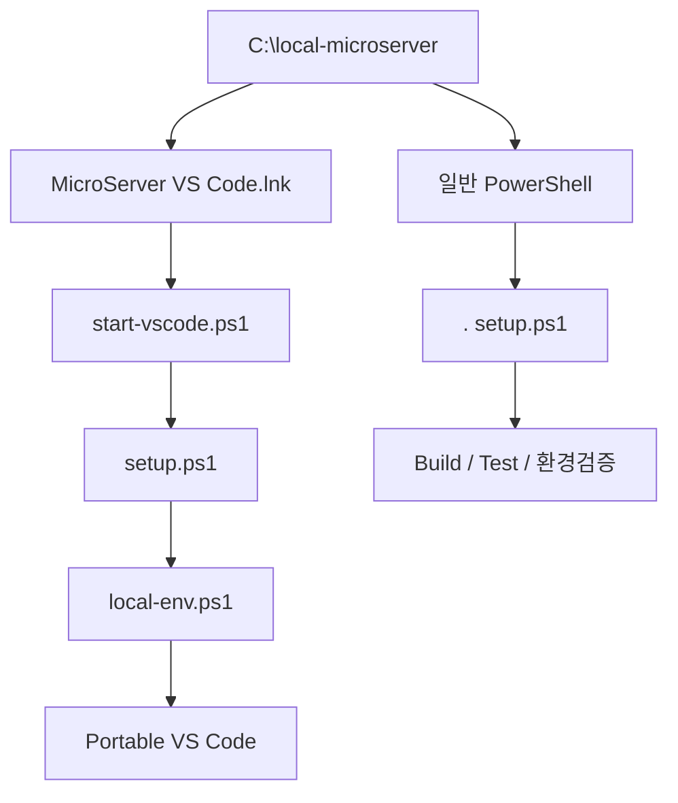
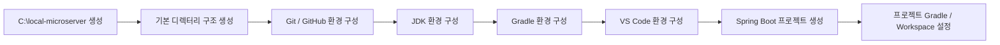

# 프로젝트 로컬 개발환경 구성 가이드

## 1. 개요

MicroServer 프로젝트의 개발환경은 개발자 PC의 전역 설정에 최대한 의존하지 않고, 프로젝트에서 사용하는 개발 도구와 소스코드, 워크스페이스를 **하나의 기준 경로 아래에서 일관되게 관리**하는 것을 목표로 한다.

Windows 개발환경의 기준 루트 경로는 다음과 같이 사용한다.

```text
C:\local-microserver
```

이 경로 아래에 JDK, Gradle 관련 데이터, VS Code Workspace, Git 로컬 저장소 등을 배치하여 프로젝트에 필요한 주요 개발환경을 한곳에서 관리한다.

이 방식의 핵심 목적은 다음과 같다.

- 개발자마다 서로 다른 개발도구 설치 위치를 사용하는 문제를 줄인다.
- Windows 시스템 전역 환경변수에 대한 의존성을 최소화한다.
- 프로젝트 관련 파일과 개발 도구의 관리 위치를 표준화한다.
- 신규 개발자가 동일한 디렉터리 구조로 빠르게 개발환경을 구성할 수 있도록 한다.
- 개발환경 전달 시 경로 차이로 발생하는 설정 오류를 줄인다.
- 필요할 경우 개발환경 폴더를 압축하여 동일한 구조로 전달할 수 있도록 한다.

!!! info "이 문서의 범위"
    이 문서는 JDK, Gradle, VS Code 각각의 상세 설치 방법을 설명하는 문서가 아니다.

    현재 단계에서는 **MicroServer 프로젝트의 로컬 개발환경을 어떤 디렉터리 구조로 관리할 것인지**,  
    그리고 각 개발도구와 Git Repository, Workspace를 **어디에 배치할 것인지에 대한 기준을 정의**한다.

    JDK 설치, Gradle 설치 및 설정, VS Code Extension / Workspace 구성 등 실제 설정 절차는 이후 각 전용 가이드에서 단계별로 진행한다.

!!! tip "권장 방향"
    `C:\local-microserver` 자체를 하나의 Git 저장소로 만드는 것이 아니라,
    실제 프로젝트별 Git 로컬 저장소를 하위 `workspace` 디렉터리에서 각각 관리하는 방식을 권장한다.

---

## 2. 권장 디렉터리 구조

MicroServer 프로젝트의 Windows 로컬 개발환경은 다음 구조를 기본으로 한다.

```text
C:\local-microserver                       ← Git Repository 아님
│
├─ tools
│  ├─ jdk
│  │  └─ <project-jdk>
│  ├─ gradle
│  │  └─ <gradle-version>
│  └─ vscode
│     ├─ Code.exe
│     └─ data
│
├─ gradle-home
│
├─ workspace
│  ├─ microserver.code-workspace
│  ├─ microserver                         ← Git Repository
│  │  └─ .git
│  └─ microserver-docs                    ← 별도 Git Repository
│     └─ .git
│
├─ env
│  ├─ setup.ps1
│  ├─ start-vscode.ps1
│  ├─ create-vscode-shortcut.ps1
│  ├─ local-env.example.ps1
│  └─ local-env.ps1
│
├─ icons
│  └─ microserver.ico
│
├─ MicroServer VS Code.lnk
│
└─ README.md
```

각 디렉터리와 파일은 다음 역할을 담당한다.

| 경로 | 역할 |
| --- | --- |
| `tools` | 프로젝트에서 사용하는 로컬 개발 도구 보관 |
| `tools\jdk` | 프로젝트 표준 JDK 배치 |
| `tools\gradle` | 프로젝트 환경에서 사용할 Gradle 배포본 배치 |
| `tools\vscode` | Windows ZIP Portable VS Code 배치 |
| `gradle-home` | Gradle 사용자 캐시와 관련 데이터 저장 |
| `workspace` | VS Code Workspace 파일과 실제 Git Repository 보관 |
| `env` | PowerShell 기반 개발환경 Script 보관 |
| `icons` | 개발환경 Shortcut 등에 사용할 공통 Icon 보관 |
| `MicroServer VS Code.lnk` | 개발환경이 적용된 Portable VS Code 실행 바로가기 |
| `README.md` | 개발환경 기본 사용 방법 및 전달 시 안내사항 |

!!! important "PowerShell을 Windows 표준 Script로 사용"
    환경 초기화와 VS Code 실행 Script는 `.ps1`을 기본으로 한다.

    기본 Package에서는 동일 기능의 `.cmd` Script를 별도로 제공하지 않는다.

!!! important "MicroServer Root와 workspace Root는 Git Repository가 아님"
    `.git`은 다음과 같은 실제 프로젝트 Directory에만 존재한다.

    ```text
    C:\local-microserver\workspace\microserver\.git
    C:\local-microserver\workspace\microserver-docs\.git
    ```

    따라서 `C:\local-microserver` 및 `C:\local-microserver\workspace` 자체에는
    프로젝트용 `.gitignore`를 둘 필요가 없다.

---

## 3. 하나의 루트 디렉터리로 관리하는 이유

일반적인 Windows 개발환경에서는 개발도구와 소스코드가 다음과 같이 여러 위치에 분산되는 경우가 많다.

```text
C:\Program Files\Java\...
C:\gradle\...
C:\Users\<사용자>\.gradle
C:\Users\<사용자>\source\repos\...
C:\Users\<사용자>\AppData\...
```

이렇게 구성하면 개발자마다 다음과 같은 차이가 발생할 수 있다.

```text
개발자 A
 ├─ JDK 설치 위치 A
 ├─ Gradle 설정 A
 └─ Source Repository 위치 A

개발자 B
 ├─ JDK 설치 위치 B
 ├─ Gradle 설정 B
 └─ Source Repository 위치 B
```

프로젝트 자체에는 문제가 없더라도 개발자 PC마다 경로와 버전이 달라지면서 다음과 같은 문제가 발생할 수 있다.

- `JAVA_HOME` 차이
- Gradle 실행 버전 차이
- VS Code Workspace 절대경로 차이
- 프로젝트 실행 Script 경로 차이
- 신규 개발환경 구성 시 반복적인 수동 설정
- 다른 개발자에게 환경을 전달할 때 재설정 필요

MicroServer 프로젝트에서는 이러한 차이를 줄이기 위해 기준 루트 경로를 다음과 같이 통일한다.

```text
C:\local-microserver
```

즉 개발자의 개인 PC 환경을 기준으로 프로젝트를 맞추는 것이 아니라,

**프로젝트가 요구하는 표준 개발환경 구조를 먼저 정의하고 개발자가 그 구조를 사용하도록 한다.**

---

## 4. JDK 배치 기준

JDK는 다음 위치에서 관리하는 것을 기본 방향으로 한다.

```text
C:\local-microserver\tools\jdk\<project-jdk>
```

예를 들어 프로젝트 표준 JDK가 준비되면 다음과 같은 형태가 된다.

```text
C:\local-microserver
└─ tools
   └─ jdk
      └─ <project-jdk>
```

현재 문서에서는 **JDK를 프로젝트 로컬 개발환경의 어느 위치에서 관리할 것인지**만 정의한다.

실제 JDK 배포판 선택, 다운로드, 설치 또는 압축 해제 방식, 버전 확인, 환경변수 적용 방법 등은 JDK 전용 가이드에서 진행한다.

!!! tip "JDK 상세 설정은 다음 가이드에서 진행"
    JDK 설치 및 실제 개발환경 설정은 다음 문서에서 자세히 설명한다.

    **[JDK 설치 및 설정](java/jdk_setup.md)**

    해당 문서에서는 프로젝트 표준 JDK 준비, 설치 위치, 버전 확인 및 Java 실행환경 구성을 단계별로 진행한다.

### 4.1 시스템 전역 설정 최소화

MicroServer 프로젝트에서는 가능하면 개발자 PC 전체에 영향을 주는 전역 설정을 최소화한다.

예를 들어 시스템 전체 `JAVA_HOME`을 프로젝트마다 변경하면 다른 Java 프로젝트에 영향을 줄 수 있다.

따라서 프로젝트 로컬 JDK를 사용하고, 이후 필요에 따라 다음 방식으로 프로젝트에 연결한다.

- VS Code에서 프로젝트 JDK 지정
- 프로젝트 실행 환경에서 JDK 경로 지정
- 개발PowerShell 환경 Script에서 세션 단위 환경변수 적용

현재 단계에서는 이러한 구성 방향만 이해하고, 실제 설정은 이후 전용 가이드에서 수행한다.

---

## 5. Gradle 관리 기준

Gradle은 JDK와 동일하게 단순히 특정 폴더에 프로그램을 설치하는 개념보다는 **프로젝트 Build Tool과 Wrapper를 어떻게 일관되게 관리할 것인지**가 중요하다.

MicroServer 프로젝트에서는 다음 두 영역을 구분한다.

```text
개발환경 단계
 └─ Gradle 기본 환경 이해 및 준비

프로젝트 생성 이후
 └─ Gradle Wrapper를 이용한 프로젝트 Gradle 버전 고정
```

현재 로컬 개발환경 구조에서는 Gradle 관련 사용자 데이터를 다음 위치에 모아서 관리할 수 있도록 한다.

```text
C:\local-microserver\gradle-home
```

이 디렉터리는 필요에 따라 Gradle Wrapper 다운로드 파일, 캐시 등 Gradle 사용자 데이터를 프로젝트 루트 하위에서 관리하기 위한 위치로 사용한다.

!!! tip "Gradle 설치 및 기본 환경은 다음 가이드에서 진행"
    Gradle 자체의 설치 방식, 전역 Gradle과 프로젝트 Gradle의 차이,
    Gradle 실행 확인 및 기본 환경 구성은 다음 문서에서 자세히 설명한다.

    **[Gradle 설치 및 기본 환경 구성](gradle/gradle_setup.md)**

    현재 문서에서는 Gradle 관련 데이터를 `C:\local-microserver` 내부에서 관리할 수 있도록
    디렉터리 구조만 정의한다.

### 5.1 Gradle Wrapper는 프로젝트 생성 이후 적용

실제 MicroServer 프로젝트를 생성한 이후에는 Gradle Wrapper를 프로젝트 Repository 내부에 포함한다.

개념적인 구조는 다음과 같다.

```text
workspace
└─ microserver
   ├─ gradlew
   ├─ gradlew.bat
   └─ gradle
      └─ wrapper
```

Wrapper를 사용하면 개발자 PC에 설치된 전역 Gradle보다 **프로젝트에서 지정한 Gradle 버전을 기준으로 Build 환경을 통일**할 수 있다.

현재 단계에서는 Wrapper의 역할만 이해하고 실제 생성, 버전 고정, `build.gradle`, `settings.gradle` 구성 등은 프로젝트 생성 이후 별도 가이드에서 수행한다.

!!! tip "프로젝트 Gradle 설정은 프로젝트 생성 이후 진행"
    Spring Boot 프로젝트 생성 이후의 Gradle Wrapper 설정은 다음 문서에서 진행한다.

    **[Gradle Wrapper 및 프로젝트 Gradle 설정](../03_project_creation/project_environment/project_gradle_setup.md)**

    해당 단계에서는 Wrapper 버전 고정, 프로젝트 Gradle 실행, Build 설정 등을 실제 프로젝트를 대상으로 구성한다.

---

## 6. Git 로컬 저장소 구성

### 6.1 루트 디렉터리 전체를 Git 저장소로 만들지 않는다

`C:\local-microserver` 전체를 하나의 Git Repository로 만들지 않는다.

잘못된 구조:

```text
C:\local-microserver
├─ .git
├─ tools
├─ gradle-home
├─ workspace
├─ env
└─ icons
```

이렇게 구성하면 JDK, Gradle Cache, Portable VS Code, Local Secret 등
Git으로 관리할 필요가 없는 개발환경 파일까지 하나의 Work Tree에 포함될 수 있다.

실제 Git Repository는 `workspace` 아래 프로젝트별로 관리한다.

```text
C:\local-microserver
└─ workspace
   ├─ microserver
   │  ├─ .git
   │  ├─ build.gradle
   │  ├─ settings.gradle
   │  ├─ gradlew
   │  ├─ gradlew.bat
   │  └─ src
   │
   └─ microserver-docs
      ├─ .git
      ├─ mkdocs.yml
      └─ docs
```

### 6.2 `workspace`의 의미

`workspace`는 여러 Repository와 VS Code Workspace 파일을 함께 보관하는 상위 Directory이다.

```text
workspace
├─ microserver.code-workspace
├─ microserver
└─ microserver-docs
```

`workspace` 자체를 GitHub에 Push하는 것이 아니다.

각 프로젝트 Directory가 독립적인 Git Repository로 동작한다.

### 6.3 `.gitignore` 위치

`.gitignore`는 실제 Git Repository Root에서 관리한다.

예:

```text
C:\local-microserver\workspace\microserver\.gitignore
C:\local-microserver\workspace\microserver-docs\.gitignore
```

다음 위치에는 프로젝트용 `.gitignore`가 필요하지 않다.

```text
C:\local-microserver
C:\local-microserver\workspace
```

!!! tip "Git / GitHub 상세 구성"
    Git 설치, GitHub 연결, Clone / Commit / Push, Repository별 `.gitignore` 정책은 다음 가이드에서 진행한다.

    **[Git / GitHub 환경 구성](git_github_setup.md)**

---

## 7. VS Code Workspace 배치 기준

VS Code Workspace 파일은 다음 위치에서 관리한다.

```text
C:\local-microserver\workspace\microserver.code-workspace
```

실제 Repository도 같은 `workspace` 아래에서 관리하므로
Workspace 파일에서는 상대경로로 각 Repository를 연결할 수 있다.

예:

```json
{
  "folders": [
    {
      "path": "microserver"
    },
    {
      "path": "microserver-docs"
    }
  ]
}
```

이 구조는 개발자 개인 사용자 경로에 대한 의존성을 줄이고
`C:\local-microserver` 구조만 동일하게 유지하면 Workspace 관계도 일정하게 유지할 수 있다.

!!! tip "VS Code 실행은 공통 Shortcut 사용"
    Windows에서는 다음 바로가기를 VS Code 개발의 기본 진입점으로 사용한다.

    ```text
    C:\local-microserver\MicroServer VS Code.lnk
    ```

    필요하면 이 바로가기를 Windows 바탕화면으로 복사하여 사용한다.

    Shortcut은 다음 Icon을 계속 참조한다.

    ```text
    C:\local-microserver\icons\microserver.ico
    ```

!!! tip "VS Code 상세 구성은 다음 가이드에서 진행"
    **[VS Code 개발환경 구성 개요](vscode/vscode_setup.md)**

    **[JDK 연계 및 개발환경 운영](vscode/jdk_workspace_environment_setup.md)**

---

## 8. PowerShell 환경 Script 관리

Windows 환경 Script는 다음 위치에서 관리한다.

```text
C:\local-microserver\env
```

구성:

```text
env
├─ setup.ps1
├─ start-vscode.ps1
├─ create-vscode-shortcut.ps1
├─ local-env.example.ps1
└─ local-env.ps1
```

### 8.1 `setup.ps1`

일반 PowerShell에서 직접 Build, Test, 개발도구 검증을 수행할 때
현재 Session에 MicroServer 환경을 적용한다.

```powershell
. C:\local-microserver\env\setup.ps1
```

주요 환경:

```text
LOCAL_MICROSERVER
JAVA_HOME
GRADLE_HOME
GRADLE_USER_HOME
PATH
개발자별 Local 환경변수
```

### 8.2 `start-vscode.ps1`

일상적인 VS Code 개발용 Launcher이다.

```text
start-vscode.ps1
        ↓
setup.ps1
        ↓
local-env.ps1
        ↓
Portable VS Code
```

개발자가 매번 `setup.ps1`을 직접 실행하지 않아도
VS Code 실행 시 필요한 Process 환경을 먼저 구성한다.

### 8.3 `local-env.example.ps1`과 `local-env.ps1`

배포용 Sample:

```text
local-env.example.ps1
```

개발자 개인 파일:

```text
local-env.ps1
```

예:

```powershell
$env:ORACLE_PWD = '<개발자-개인-로컬-비밀번호>'
```

`local-env.ps1`은 개발환경 Package를 다른 개발자에게 전달할 때 제외한다.

### 8.4 `create-vscode-shortcut.ps1`

한 번 실행하면 MicroServer Root에 Windows 바로가기를 생성한다.

```powershell
& C:\local-microserver\env\create-vscode-shortcut.ps1
```

생성 결과:

```text
C:\local-microserver\MicroServer VS Code.lnk
```

사용 Icon:

```text
C:\local-microserver\icons\microserver.ico
```

개발자는 생성된 `.lnk` 파일을 Windows 바탕화면으로 복사하여 사용한다.

```text
MicroServer Root의 기준 Shortcut
        ↓ 복사
Windows 바탕화면
        ↓ 더블클릭
MicroServer VS Code 실행
```

!!! note "PowerShell Script 실행이 차단되는 경우"
    회사 보안정책 또는 PowerShell 실행정책으로 인해 `.ps1` 실행이 제한될 수 있다.

    본 문서에서는 보안정책 변경이나 실행정책 우회 방법을 별도로 설명하지 않는다.

    **실행이 차단되거나 권한 관련 경고가 발생하면 개발환경을 배포하거나 운영하는 팀에 문의한다.**

### 8.5 Script 역할 정리



PowerShell Script는 Windows 시스템 환경변수를 영구 변경하는 용도가 아니다.

현재 Process와 그 하위 Process에 프로젝트 개발환경을 제공하는 방식으로 사용한다.

---

## 9. 개발환경 전달 방식

MicroServer 프로젝트의 로컬 개발환경을 하나의 기준 디렉터리 아래에서 관리하는 가장 큰 이유 중 하나는
신규 개발자에게 동일한 디렉터리 구조를 쉽게 전달하기 위해서다.

기본적인 전달 흐름은 다음과 같다.

```text
개발환경 기준 구조 준비
        ↓
C:\local-microserver 구성
        ↓
필요 파일 및 설정 정리
        ↓
개발환경 패키지 압축
        ↓
신규 개발자에게 전달
        ↓
동일한 기준 경로에 압축 해제
        ↓
개발환경 확인
        ↓
VS Code Workspace 실행
        ↓
프로젝트 Build / 실행
```

### 9.1 기본 전달 대상

개발환경 패키지에는 필요에 따라 다음 항목을 포함할 수 있다.

```text
tools
workspace
env
icons
MicroServer VS Code.lnk
README.md
```

실제 프로젝트 Source는 일반적으로 `workspace` 아래 각 Git Repository에서 Clone하여 구성한다.

개발환경 Package에는 `local-env.example.ps1`은 포함하되 실제 개발자의 `local-env.ps1`은 제외한다.

### 9.2 Gradle 캐시 포함 여부

`gradle-home`은 개발환경 전달 시 선택적으로 포함한다.

Gradle 캐시까지 포함하면 초기 Build에서 일부 다운로드 시간을 줄일 수 있지만 다음과 같은 단점이 있다.

- 압축 파일 크기가 매우 커질 수 있다.
- 오래된 캐시가 함께 전달될 수 있다.
- 불필요한 Build Cache가 포함될 수 있다.
- 개발자별 환경 차이가 캐시에 남을 수 있다.

따라서 일반적인 개발환경 패키지에서는 `gradle-home`을 제외하는 것을 우선 고려한다.

반대로 다음과 같은 환경에서는 포함 여부를 검토할 수 있다.

- 외부 인터넷 연결이 제한된 사내망
- 폐쇄망 개발환경
- Gradle Distribution 또는 Dependency 다운로드가 제한되는 환경

---

## 10. Git 저장소와 개발환경 패키지의 차이

Git Repository와 개발환경 패키지는 목적이 다르다.

### 10.1 Git Repository

Git으로 관리해야 하는 대표적인 항목은 다음과 같다.

```text
소스코드
build.gradle
settings.gradle
gradlew
gradlew.bat
gradle/wrapper
공유가 필요한 VS Code 프로젝트 설정
프로젝트 문서
```

Git으로 관리하지 않는 대표적인 항목은 다음과 같다.

```text
JDK Binary
Gradle Cache
IDE 임시파일
Build 결과물
Log
개발자 개인 설정
```

### 10.2 개발환경 패키지

개발환경 패키지는 **개발환경 표준화와 전달**이 목적이므로 필요에 따라 Git에서 관리하지 않는 항목도 포함할 수 있다.

예:

```text
JDK
PowerShell 환경 Script
VS Code Workspace
MicroServer VS Code Shortcut / Icon
프로젝트 기본 디렉터리 구조
```

필요한 경우 다음 항목도 선택적으로 포함할 수 있다.

```text
프로젝트 Source
Gradle Cache
```

따라서 두 개념은 다음과 같이 구분한다.

| 구분 | 목적 |
| --- | --- |
| Git Repository | 소스코드와 프로젝트 설정의 형상관리 |
| 개발환경 패키지 | 동일한 로컬 개발환경 구조의 구성 및 전달 |

---

## 11. 경로 구성 원칙

### 11.1 개발자 사용자 경로 사용 최소화

설정 파일이나 Script에 다음과 같은 개발자 개인 경로를 직접 작성하지 않는 것을 권장한다.

```text
C:\Users\kim\...
```

대신 다음 기준을 사용한다.

```text
C:\local-microserver
```

또는 환경변수:

```text
%LOCAL_MICROSERVER%
```

VS Code Workspace에서는 가능하면 상대경로를 사용한다.

```text
microserver
```

이렇게 하면 개발자 계정명이 변경되어도 프로젝트 경로 구조를 유지할 수 있다.

### 11.2 프로젝트 기준 경로와 상대경로

프로젝트 환경을 다른 개발자에게 전달할 수 있도록 만들려면 가능한 한 다음과 같은 관계를 유지하는 것이 중요하다.

```text
local-microserver
├─ workspace
│  ├─ microserver.code-workspace
│  └─ microserver
├─ tools
├─ env
└─ icons
```

즉 특정 개발자의 사용자 홈 디렉터리에 의존하기보다
`local-microserver` 내부의 상대적인 디렉터리 관계를 기준으로 환경을 구성한다.

---

## 12. 보안 및 전달 시 주의사항

개발환경 디렉터리를 압축하여 전달하는 경우 개인 계정 또는 보안 정보가 포함되지 않도록 반드시 확인해야 한다.

다음 정보는 개발환경 패키지에 포함하지 않는다.

```text
GitHub Access Token
DB 계정 비밀번호
API Key
인증서 개인키
사내 시스템 계정정보
개인 SSH Private Key
local-env.ps1
```

이러한 값은 별도의 보안 기준에 따라 관리한다.

또한 Git Repository에서 다음과 같은 Build 및 Cache 디렉터리는 일반적으로 형상관리 대상에서 제외한다.

```gitignore
.gradle/
build/
```

단, Gradle Wrapper에 필요한 파일은 프로젝트 형상관리 대상에 포함한다.

```text
gradlew
gradlew.bat
gradle/wrapper/gradle-wrapper.jar
gradle/wrapper/gradle-wrapper.properties
```

Wrapper 관련 상세 내용은 프로젝트 Gradle 설정 가이드에서 다시 설명한다.

---

## 13. 개발환경 구성 진행 순서

이 문서가 정의하는 디렉터리 구조를 기준으로 실제 개발환경 구성은 다음 순서로 진행한다.



현재 문서는 다음 영역을 담당한다.

```text
[ C:\local-microserver 기본 구조 정의 ]   ← 현재 문서
                ↓
Git / GitHub 환경 구성
                ↓
JDK 설치 및 설정
                ↓
Gradle 설치 및 기본 환경 구성
                ↓
VS Code 개발환경 구성
                ↓
Spring Boot 프로젝트 생성
                ↓
프로젝트 Gradle / Workspace 설정
```

즉 이 문서에서 모든 개발도구를 실제로 설치하는 것이 아니다.

먼저 **개발환경이 들어갈 그릇과 관리 기준을 정의한 후**, 이후 문서에서 각 개발도구를 순서대로 구성한다.

---

## 14. 최종 권장 구조

MicroServer Windows 로컬 개발환경은 다음 구성을 기본으로 한다.

```text
C:\local-microserver
│
├─ tools
│  ├─ jdk
│  │  └─ <project-jdk>
│  ├─ gradle
│  │  └─ <gradle-version>
│  └─ vscode
│     ├─ Code.exe
│     └─ data
│
├─ gradle-home
│
├─ workspace
│  ├─ microserver.code-workspace
│  ├─ microserver
│  │  ├─ .git
│  │  ├─ gradlew
│  │  ├─ gradlew.bat
│  │  ├─ gradle
│  │  ├─ settings.gradle
│  │  ├─ build.gradle
│  │  └─ src
│  └─ microserver-docs
│     └─ .git
│
├─ env
│  ├─ setup.ps1
│  ├─ start-vscode.ps1
│  ├─ create-vscode-shortcut.ps1
│  ├─ local-env.example.ps1
│  └─ local-env.ps1
│
├─ icons
│  └─ microserver.ico
│
├─ MicroServer VS Code.lnk
│
└─ README.md
```

개발환경 관리 기준:

| 구분 | 기본 원칙 |
| --- | --- |
| 개발환경 기준 경로 | `C:\local-microserver` |
| JDK | `tools\jdk` 하위에서 프로젝트 전용으로 관리 |
| Gradle | `tools\gradle` + 프로젝트 Gradle Wrapper 기준 |
| Gradle 사용자 데이터 | `gradle-home`으로 통합 가능 |
| Git Repository | `workspace` 하위 프로젝트별 관리 |
| VS Code Workspace | `workspace\microserver.code-workspace` |
| Windows 환경 Script | PowerShell(`.ps1`) 사용 |
| Local Secret | `env\local-env.ps1`, 배포 Package에서 제외 |
| 실행 진입점 | `MicroServer VS Code.lnk` |
| Shortcut Icon | `icons\microserver.ico` |
| 바탕화면 사용 | Root의 Shortcut을 바탕화면으로 복사 |
| 프로젝트 전달 | 동일한 Directory 구조를 기준으로 Package 구성 |

!!! note "권한 문제 처리 원칙"
    PowerShell Script 실행이 회사 정책에 의해 제한되는 경우
    개발자가 임의로 정책을 변경하거나 우회하는 방식으로 해결하지 않는다.

    **개발환경을 배포하거나 운영하는 팀에 문의한다.**

---

## 15. 관련 가이드

현재 문서 이후에는 다음 순서로 개발환경을 구성한다.

1. **[Git / GitHub 환경 구성](git_github_setup.md)**
2. **[JDK 설치 및 설정](java/jdk_setup.md)**
3. **[Gradle 설치 및 기본 환경 구성](gradle/gradle_setup.md)**
4. **[VS Code 개발환경 구성 개요](vscode/vscode_setup.md)**
5. **[JDK 연계 및 개발환경 운영](vscode/jdk_workspace_environment_setup.md)**
6. **[Gradle Wrapper 및 프로젝트 Gradle 설정](../03_project_creation/project_environment/project_gradle_setup.md)**

각 가이드에서는 현재 문서에서 정의한 `C:\local-microserver` 디렉터리 구조를 기준으로 실제 설치와 설정을 진행한다.

---

## 16. 정리

MicroServer 프로젝트의 로컬 개발환경은 다음과 같은 기준으로 관리한다.

```text
C:\local-microserver
        │
        ├─ 개발 Tool
        ├─ Gradle 사용자 환경
        ├─ VS Code Workspace
        ├─ Git Repository
        └─ PowerShell 환경 Script
```

현재 문서의 핵심은 특정 JDK나 Gradle의 설치 방법을 설명하는 것이 아니다.

**프로젝트와 관련된 개발환경을 하나의 기준 경로 아래에서 관리하고,
개발자마다 동일한 디렉터리 구조를 사용할 수 있도록 표준을 정의하는 것**이 목적이다.

JDK, Gradle, VS Code와 같은 개발도구의 실제 설치 및 설정은 이후 각 전용 가이드에서 자세히 진행한다.

또한 개발환경 사용 방식은 다음 원칙으로 구분한다.

```text
일상적인 VS Code 개발
→ MicroServer VS Code.lnk 더블클릭
→ start-vscode.ps1
→ setup.ps1
→ Portable VS Code

일반 PowerShell 사용
→ . setup.ps1
→ 현재 Session에 동일한 개발환경 적용
```

**Windows 환경 Script는 PowerShell로 통일하고,
일상적인 VS Code 실행은 바탕화면 Shortcut을 통해 단순화한다.**

이 구조를 기준으로 개발환경을 구성하면 신규 개발자가 프로젝트에 참여하거나
다른 PC로 개발환경을 이전할 때 경로 차이와 개발자별 설정 차이로 발생하는 문제를 줄일 수 있다.
