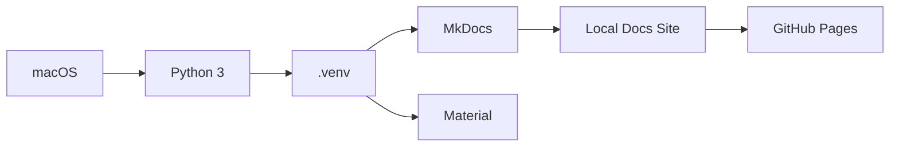

# macOS Python 가상환경 / MkDocs 구성 가이드

## 1. 문서 목적

본 문서는 macOS 개발환경에서 MicroServer 기술문서 사이트를 작성하고 실행하기 위한 **Python, venv, MkDocs, Material for MkDocs** 환경을 구성한다.

프로젝트는 시스템 Python에 직접 패키지를 설치하지 않고 프로젝트 루트의 `.venv`를 사용한다.

---

## 2. 구성 구조



---

## 3. Python 확인

터미널에서 실행한다.

```bash
python3 --version
```

pip 확인:

```bash
python3 -m pip --version
```

macOS 개발환경에서는 명령을 명확하게 구분하기 위해 `python3`를 사용하는 것을 권장한다.

Python이 설치되어 있지 않거나 별도 버전 관리가 필요한 경우 Python 공식 설치 패키지 또는 Homebrew 등을 사용할 수 있다.

Homebrew를 사용하는 경우 예:

```bash
brew install python
```

설치 후 새 터미널을 열고 다시 확인한다.

```bash
python3 --version
```

---

## 4. 문서 저장소로 이동

예:

```bash
cd ~/workspace/microserver-docs
```

현재 위치:

```bash
pwd
```

저장소 상태:

```bash
git status
```

---

## 5. Python 가상환경 생성

프로젝트 루트에서 실행한다.

```bash
python3 -m venv .venv
```

구조 예:

```text
microserver-docs/
 ├─ .venv/
 ├─ docs/
 ├─ mkdocs.yml
 └─ ...
```

`.venv`는 Git에 Commit하지 않는다.

```gitignore
.venv/
```

---

## 6. 가상환경 활성화

```bash
source .venv/bin/activate
```

정상 활성화 예:

```text
(.venv) user@mac microserver-docs %
```

현재 Python 경로 확인:

```bash
which python
which python3
```

가상환경 활성화 후 `python`이 `.venv/bin/python`을 가리키면 정상이다.

> 새 Terminal 세션을 열면 가상환경을 다시 활성화해야 한다.

---

## 7. pip 업그레이드

```bash
python -m pip install --upgrade pip
```

가상환경 활성화 후에는 `python` 명령을 사용해도 된다.

---

## 8. MkDocs 설치

```bash
python -m pip install mkdocs
python -m pip install mkdocs-material
python -m pip install mkdocs-redirects
```

프로젝트 `mkdocs.yml`에서 `redirects` 플러그인을 사용하므로 `mkdocs-redirects`도 함께 설치한다.

확인:

```bash
mkdocs --version
```

추가 Markdown 확장이 필요한 경우:

```bash
python -m pip install pymdown-extensions
```

---

## 9. 문서 의존성 파일 관리

예: `requirements-docs.txt`

```text
mkdocs
mkdocs-material
mkdocs-redirects
pymdown-extensions
```

다른 개발자가 동일 환경을 구성할 때:

```bash
python -m pip install -r requirements-docs.txt
```

현재 전체 설치 버전을 기록하려면:

```bash
python -m pip freeze > requirements-docs-lock.txt
```

---

## 10. MkDocs 프로젝트 구조

```text
microserver-docs/
 ├─ docs/
 │   ├─ index.md
 │   └─ 01_project_start/
 │       └─ 02_environment/
 ├─ mkdocs.yml
 ├─ requirements-docs.txt
 └─ .venv/
```

`mkdocs.yml`은 MkDocs 사이트의 메뉴, 테마, Markdown 확장 기능을 정의한다.

---

## 11. MkDocs 로컬 서버 실행

```bash
mkdocs serve
```

실행 상태에서 Markdown 파일을 저장하면 변경 내용이 자동으로 반영된다.

종료:

```text
Control + C
```

---

## 12. 포트 변경

```bash
mkdocs serve -a 127.0.0.1:8001
```

동일한 Mac에서 다른 개발 서버가 8000 포트를 사용하는 경우 활용할 수 있다.

---

## 13. 문서 빌드 검증

배포 전에 전체 문서 빌드 검증을 수행한다.

```bash
mkdocs build --strict
```

정상 완료되면 기본적으로 다음 디렉터리가 생성된다.

```text
site/
```

`site/`는 일반적으로 Git에서 제외한다.

```gitignore
site/
```

---

## 14. GitHub Pages 배포

MkDocs의 `gh-pages` 배포 방식을 사용하는 경우:

```bash
mkdocs gh-deploy
```

권장 절차:

```bash
git status
mkdocs build --strict
git add .
git commit -m "docs: update project environment guide"
git push
mkdocs gh-deploy
```

GitHub Actions 기반 자동 배포를 적용한 저장소라면 해당 Workflow를 우선한다.

---

## 15. 매번 문서 작업을 시작할 때

```bash
cd ~/workspace/microserver-docs
source .venv/bin/activate
mkdocs serve
```

작업 종료:

```text
Control + C
```

가상환경 종료:

```bash
deactivate
```

---

## 16. VS Code로 열기

```bash
code ~/workspace/microserver-docs
```

VS Code Terminal에서도:

```bash
source .venv/bin/activate
```

Python 확장을 설치한 경우 VS Code에서 `.venv` 인터프리터를 선택할 수 있다.

---

## 17. Apple Silicon 환경 확인

Apple Silicon Mac에서는 현재 Terminal 아키텍처를 확인할 수 있다.

```bash
uname -m
```

일반적인 Apple Silicon 환경:

```text
arm64
```

Python과 패키지는 가능하면 동일 아키텍처 환경에서 사용한다.

Rosetta 기반 x86 터미널과 arm64 터미널을 혼합하면 일부 네이티브 패키지 설치에서 혼선이 생길 수 있다.

---

## 18. 문제 해결

### `python3: command not found`

Python 설치 여부를 확인하고 새 Terminal을 연다.

Homebrew 사용 시:

```bash
brew --version
brew install python
```

### `mkdocs: command not found`

가상환경 활성화 여부 확인:

```bash
which python
python -m pip show mkdocs
```

직접 모듈로 실행할 수도 있다.

```bash
python -m mkdocs --version
python -m mkdocs serve
```

### `No module named mkdocs`

```bash
source .venv/bin/activate
python -m pip install -r requirements-docs.txt
```

### `mkdocs.yml` 오류

```bash
mkdocs build --strict
```

YAML은 들여쓰기가 문법이므로 Tab보다 Space를 사용한다.

### nav 경로 오류

`mkdocs.yml`의 파일 경로는 `docs/`를 기준으로 작성한다.

예:

```yaml
nav:
  - 프로젝트 환경 구성:
      - 개발 장비 구성: 01_project_start/02_environment/development_device.md
```

실제 파일:

```text
docs/01_project_start/02_environment/development_device.md
```

---

## 19. 권장 `.gitignore`

```gitignore
.venv/
site/
__pycache__/
*.pyc
.DS_Store
```

---

## 20. 최종 확인

```bash
python3 --version
source .venv/bin/activate
python --version
python -m pip --version
mkdocs --version
mkdocs build --strict
```

체크리스트:

- [ ] Python 3가 정상 실행된다.
- [ ] `.venv`가 생성되어 있다.
- [ ] 가상환경을 활성화할 수 있다.
- [ ] MkDocs가 설치되어 있다.
- [ ] Material 테마가 설치되어 있다.
- [ ] `mkdocs-redirects`가 설치되어 있다.
- [ ] `mkdocs serve`가 정상 실행된다.
- [ ] `mkdocs build --strict`가 성공한다.
- [ ] `.venv/`, `site/`, `.DS_Store`가 Git에서 제외된다.
