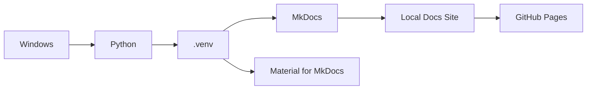

# Windows Python 가상환경 / MkDocs 구성 가이드

## 1. 문서 목적

본 문서는 Windows 개발 PC에서 MicroServer 기술문서를 작성하고 로컬에서 확인하기 위한 **Python, 가상환경(venv), MkDocs, Material for MkDocs** 개발환경을 구성한다.

Python은 MicroServer 애플리케이션 개발 언어로 사용하는 것이 아니라 **MkDocs 문서 실행 환경을 독립적으로 관리하기 위한 도구**로 사용한다.

---

## 2. 구성 구조



프로젝트별로 `.venv`를 사용하면 다른 Python 프로젝트의 패키지 버전과 충돌하지 않는다.

---

## 3. Python 설치 확인

PowerShell을 실행한다.

```powershell
python --version
```

또는 Python Launcher가 설치된 경우:

```powershell
py --version
```

Python이 설치되어 있지 않으면 Python 공식 배포판을 설치한다.

설치 과정에서 가능하면 다음 항목을 확인한다.

- Python Launcher 설치
- PATH 등록
- pip 설치

설치 후 새 PowerShell 창을 열고 다시 확인한다.

```powershell
python --version
pip --version
```

`python` 명령이 Microsoft Store로 연결되는 등 예상과 다르게 동작하면 `py` 명령을 사용한다.

---

## 4. 문서 저장소로 이동

예:

```powershell
cd C:\workspace\microserver-docs
```

현재 위치 확인:

```powershell
Get-Location
```

Git 저장소 상태도 확인한다.

```powershell
git status
```

---

## 5. Python 가상환경 생성

프로젝트 루트에서 실행한다.

```powershell
python -m venv .venv
```

`python` 명령 대신 `py`를 사용하는 환경에서는:

```powershell
py -m venv .venv
```

생성 후 구조 예:

```text
microserver-docs/
 ├─ .venv/
 ├─ docs/
 ├─ mkdocs.yml
 └─ ...
```

`.venv`는 개발자 PC별 로컬 환경이므로 Git에 Commit하지 않는다.

```gitignore
.venv/
```

---

## 6. PowerShell 실행 정책 설정

Windows에서는 가상환경 활성화 스크립트 실행 시 다음 오류가 발생할 수 있다.

```text
running scripts is disabled on this system
```

현재 사용자 범위에서 PowerShell 스크립트 실행 정책을 설정한다.

```powershell
Set-ExecutionPolicy -ExecutionPolicy RemoteSigned -Scope CurrentUser
```

확인:

```powershell
Get-ExecutionPolicy -List
```

이 설정은 일반적으로 사용자 계정에 1회 적용하면 된다.

회사 보안정책에 의해 실행 정책 변경이 제한된 PC에서는 사내 정책을 우선한다.

---

## 7. 가상환경 활성화

PowerShell:

```powershell
.\.venv\Scripts\Activate.ps1
```

정상 활성화되면 프롬프트 앞에 `(.venv)`가 표시된다.

```text
(.venv) PS C:\workspace\microserver-docs>
```

확인:

```powershell
python --version
where.exe python
```

출력 경로에 `.venv\Scripts\python.exe`가 포함되어 있으면 정상이다.

> 새 PowerShell 창을 열면 가상환경은 다시 활성화해야 한다.

---

## 8. pip 업그레이드

가상환경이 활성화된 상태에서 실행한다.

```powershell
python -m pip install --upgrade pip
```

---

## 9. MkDocs 설치

```powershell
python -m pip install mkdocs
```

Material 테마:

```powershell
python -m pip install mkdocs-material
python -m pip install mkdocs-redirects
```

프로젝트 `mkdocs.yml`에서 `redirects` 플러그인을 사용하므로 `mkdocs-redirects`도 함께 설치한다.

설치 확인:

```powershell
mkdocs --version
```

필요한 확장 기능을 프로젝트에서 추가로 사용하는 경우 패키지를 함께 설치한다.

예:

```powershell
python -m pip install pymdown-extensions
```

---

## 10. 패키지 버전 관리

팀원 간 동일한 문서 실행 환경을 맞추기 위해 설치 패키지를 파일로 관리하는 것을 권장한다.

예: `requirements-docs.txt`

```text
mkdocs
mkdocs-material
mkdocs-redirects
pymdown-extensions
```

설치:

```powershell
python -m pip install -r requirements-docs.txt
```

현재 설치 목록 생성:

```powershell
python -m pip freeze > requirements-docs-lock.txt
```

`requirements-docs.txt`는 사람이 관리하는 최소 의존성 목록으로, lock 파일은 실제 버전 재현이 필요한 경우 활용한다.

---

## 11. MkDocs 프로젝트 확인

프로젝트 루트에 다음 파일이 있는지 확인한다.

```text
mkdocs.yml
```

문서 디렉터리 예:

```text
microserver-docs/
 ├─ docs/
 │   ├─ index.md
 │   └─ 01_project_start/
 ├─ mkdocs.yml
 ├─ requirements-docs.txt
 └─ .venv/
```

---

## 12. MkDocs 로컬 서버 실행

```powershell
mkdocs serve
```

기본적으로 로컬 개발 서버가 실행되며 브라우저에서 문서 사이트를 확인할 수 있다.

실행 중 Markdown 파일을 저장하면 자동으로 변경사항이 반영된다.

종료:

```text
Ctrl + C
```

---

## 13. 다른 포트 사용

기본 포트를 다른 프로그램이 사용 중인 경우:

```powershell
mkdocs serve -a 127.0.0.1:8001
```

외부 장비에서 테스트 목적으로 접근해야 하는 경우 네트워크 정책을 확인한 뒤 별도 bind 주소를 지정한다.

---

## 14. 정적 사이트 빌드

배포 전 전체 문서를 빌드하여 오류를 확인한다.

```powershell
mkdocs build --strict
```

빌드 결과는 기본적으로 `site` 디렉터리에 생성된다.

```text
site/
```

`site/`는 빌드 산출물이므로 일반적으로 Git에 Commit하지 않는다.

```gitignore
site/
```

---

## 15. GitHub Pages 배포

GitHub Pages를 MkDocs의 `gh-pages` 방식으로 운영하는 프로젝트에서는 다음 명령을 사용할 수 있다.

```powershell
mkdocs gh-deploy
```

배포 전 권장 절차:

```powershell
git status
mkdocs build --strict
git add .
git commit -m "docs: update environment guide"
git push
mkdocs gh-deploy
```

프로젝트의 실제 배포 정책이 GitHub Actions 기반이라면 `gh-deploy` 대신 저장소 Workflow 정책을 따른다.

---

## 16. 매번 작업할 때 실행 순서

새 PowerShell을 열었다면:

```powershell
cd C:\workspace\microserver-docs
.\.venv\Scripts\Activate.ps1
mkdocs serve
```

작업 종료:

```text
Ctrl + C
```

가상환경 비활성화:

```powershell
deactivate
```

---

## 17. VS Code에서 문서 프로젝트 열기

```powershell
code C:\workspace\microserver-docs
```

VS Code 내장 Terminal을 사용하는 경우에도 동일하게 가상환경을 활성화한다.

```powershell
.\.venv\Scripts\Activate.ps1
```

---

## 18. 문제 해결

### `python` 명령을 찾을 수 없음

```powershell
py --version
```

`py`는 동작하지만 `python`이 동작하지 않으면 Python 설치 또는 PATH 구성을 확인한다.

### `Activate.ps1 cannot be loaded`

```powershell
Set-ExecutionPolicy -ExecutionPolicy RemoteSigned -Scope CurrentUser
```

PowerShell을 다시 열고 가상환경을 활성화한다.

### `mkdocs` 명령을 찾을 수 없음

가상환경 활성화 여부를 확인한다.

```powershell
where.exe python
python -m pip show mkdocs
```

필요하면:

```powershell
python -m mkdocs --version
python -m mkdocs serve
```

### YAML 오류

MkDocs 실행 시 `mkdocs.yml` 들여쓰기 오류가 가장 흔하다.

```powershell
mkdocs build --strict
```

오류 메시지에 표시된 YAML 위치를 우선 확인한다.

### nav에 등록한 Markdown 파일이 없음

`mkdocs.yml`의 `nav`에 지정한 경로와 실제 `docs` 하위 파일 경로가 동일한지 확인한다.

```text
mkdocs.yml
  nav path
      ↓
docs/<same path>.md
```

---

## 19. 권장 `.gitignore`

```gitignore
.venv/
site/
__pycache__/
*.pyc
```

---

## 20. 최종 확인

```powershell
python --version
python -m pip --version
mkdocs --version
mkdocs build --strict
```

체크리스트:

- [ ] Python이 설치되어 있다.
- [ ] `.venv`를 생성했다.
- [ ] PowerShell에서 가상환경을 활성화할 수 있다.
- [ ] MkDocs가 가상환경에 설치되어 있다.
- [ ] Material 테마가 설치되어 있다.
- [ ] `mkdocs-redirects`가 설치되어 있다.
- [ ] `mkdocs serve`가 정상 실행된다.
- [ ] `mkdocs build --strict`가 성공한다.
- [ ] `.venv/`와 `site/`가 Git에서 제외되어 있다.
