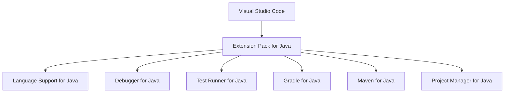
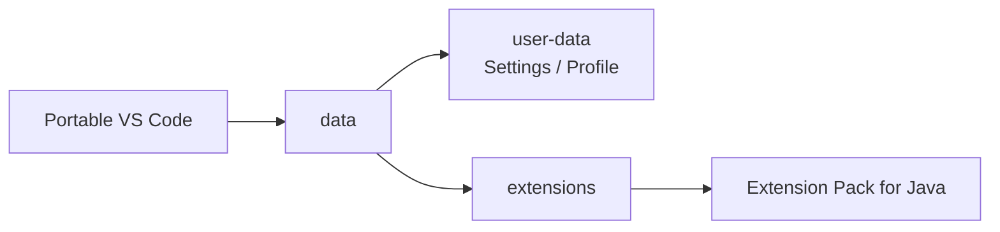
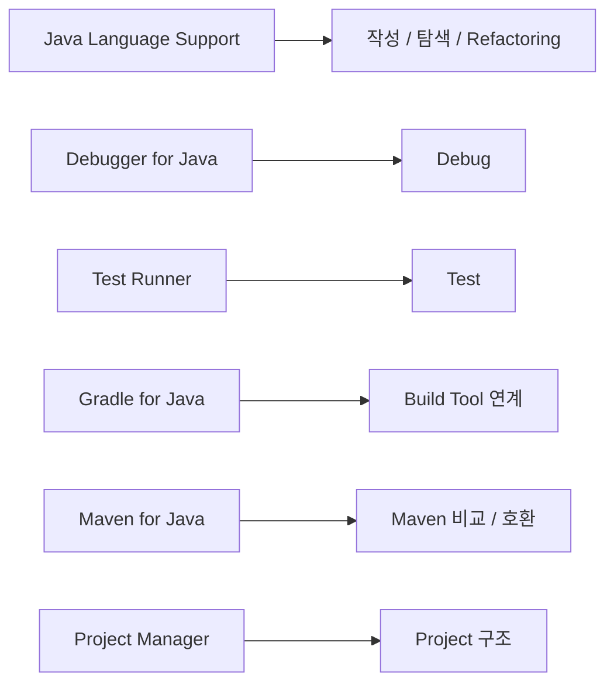

# Java 개발 Extension 구성 가이드

## 1. 문서 목적

본 문서는 VS Code를 Java 개발용 IDE로 사용할 수 있도록 **Extension Pack for Java**를 설치하고, 포함된 주요 Extension이 어떤 역할을 담당하는지 설명한다.

현재 단계에서는 Java 프로젝트나 Spring Boot 프로젝트를 생성하지 않는다.

목표는 다음과 같다.

- Java Extension Pack 설치
- Java 개발 기능의 구성요소 이해
- Extension별 역할 이해
- 이후 MicroServer 프로젝트에서 사용할 기능을 미리 준비
- Java 관련 VS Code 명령이 정상적으로 등록되었는지 확인

---

## 2. Java Extension 구성 방식

VS Code는 기본 상태에서 Java 전용 IDE가 아니다.

Java Source를 분석하고 자동완성, Refactoring, Debug, Test 등의 기능을 사용하려면 Java Extension을 설치해야 한다.

MicroServer에서는 개별 Extension을 하나씩 선택하기보다 **Extension Pack for Java**를 기준으로 설치한다.



Extension Pack을 사용하면 개발자별 필수 Extension 누락을 줄일 수 있다.

> Extension Pack의 실제 포함 구성은 VS Code/Marketplace 업데이트에 따라 변경될 수 있다.
> MicroServer 문서에서는 Java 개발에 필요한 주요 구성요소와 역할을 기준으로 관리한다.

!!! note "2026-08 현재 Extension Pack 구성 기준"
    현재 Visual Studio Marketplace의 **Extension Pack for Java** 페이지에는 다음 6개 Extension이 포함 대상으로 안내된다.

    - Language Support for Java™ by Red Hat
    - Debugger for Java
    - Test Runner for Java
    - Maven for Java
    - Gradle for Java
    - Project Manager for Java

    일부 VS Code Java 문서에는 과거 구성인 **Visual Studio IntelliCode**가 아직 표시될 수 있지만,
    현재 Marketplace의 실제 Extension Pack 구성에는 포함되어 있지 않으므로
    MicroServer 표준 필수 Extension에서는 제외한다.

---


### 2.1 Portable Mode에서 Extension이 저장되는 위치

Windows 일반 설치에서는 Extension이 보통 사용자 Home의 다음 위치에 저장된다.

```text
C:\Users\<사용자>\.vscode\extensions
```

MicroServer의 Windows Portable VS Code에서는 Extension을
Portable `data` Directory 아래에서 관리한다.

```text
C:\local-microserver\tools\vscode\data\extensions
```

즉 Java Extension Pack을 Portable VS Code에 설치하면
Extension Binary도 `C:\local-microserver` 개발환경 Package에 포함할 수 있다.



!!! important "Portable VS Code에서 Extension을 설치해야 함"
    PC에 일반 설치된 다른 VS Code가 있다면
    그 VS Code에 설치한 Extension과 MicroServer Portable VS Code의 Extension은 별개일 수 있다.

    반드시 **MicroServer Portable VS Code를 실행한 상태에서 Extension을 설치**하거나,
    Portable VS Code의 `bin\code.cmd`를 명시적으로 사용한다.


## 3. Extension Pack for Java 설치

VS Code에서 Extensions 화면을 연다.

### Windows / Linux

```text
Ctrl + Shift + X
```

### macOS

```text
Command + Shift + X
```

검색:

```text
Extension Pack for Java
```

Publisher가 Microsoft인지 확인한다.

Extension ID:

```text
vscjava.vscode-java-pack
```

설치 버튼을 선택한다.

Windows Portable 환경에서 CLI를 사용할 경우:

```powershell
& "C:\local-microserver\tools\vscode\bin\code.cmd" --install-extension vscjava.vscode-java-pack
```

`setup.cmd` 또는 `start-vscode.cmd`를 통해 Portable VS Code의 `bin`이 현재 PATH에 포함되어 있다면 다음과 같이 실행할 수도 있다.

```powershell
code --install-extension vscjava.vscode-java-pack
```

macOS에서 `code` 명령이 등록되어 있다면:

```bash
code --install-extension vscjava.vscode-java-pack
```

!!! tip "어느 VS Code에 설치되는지 확인"
    개발 PC에 일반 VS Code와 MicroServer Portable VS Code가 함께 존재한다면
    단순히 `code`만 실행했을 때 어느 VS Code CLI가 선택되는지 확인해야 한다.

    MicroServer 표준 Extension 설치 시에는 위와 같이 Portable `code.cmd`의 절대경로를 사용하면 명확하다.


### 3.1 Portable VS Code에 JDK Runtime 등록

Extension Pack for Java를 설치한 뒤에는 Java Extension이 사용할 JDK 위치를 VS Code에 등록한다.

MicroServer Windows 표준 JDK 위치:

```text
C:\local-microserver\tools\jdk\temurin-25
```

JDK 설치 여부는 PowerShell에서 다음과 같이 확인할 수 있다.

```powershell
C:\local-microserver\tools\jdk\temurin-25\bin\java.exe -version
C:\local-microserver\tools\jdk\temurin-25\bin\javac.exe -version
```

Portable VS Code의 User Settings는 다음 위치에서 관리된다.

```text
C:\local-microserver\tools\vscode\data\user-data\User\settings.json
```

이 설정은 Windows 전체의 전역 설정이 아니라
**해당 Portable VS Code 인스턴스에서 여는 모든 Workspace에 공통 적용되는 User Settings**이다.

Command Palette에서 다음 명령으로 설정 파일을 열 수 있다.

```text
Preferences: Open User Settings (JSON)
```

JDK 25를 기본 Runtime으로 사용할 경우 다음과 같이 등록한다.

```json
{
    "java.jdt.ls.java.home": "C:\\local-microserver\\tools\\jdk\\temurin-25",

    "java.configuration.runtimes": [
        {
            "name": "JavaSE-25",
            "path": "C:\\local-microserver\\tools\\jdk\\temurin-25",
            "default": true
        }
    ]
}
```

`java.configuration.runtimes`는 배열이므로 여러 JDK를 함께 등록할 수 있다.

예를 들어 JDK 21과 JDK 25를 함께 관리한다면:

```json
{
    "java.jdt.ls.java.home": "C:\\local-microserver\\tools\\jdk\\temurin-25",

    "java.configuration.runtimes": [
        {
            "name": "JavaSE-21",
            "path": "C:\\local-microserver\\tools\\jdk\\temurin-21"
        },
        {
            "name": "JavaSE-25",
            "path": "C:\\local-microserver\\tools\\jdk\\temurin-25",
            "default": true
        }
    ]
}
```

각 설정의 역할은 다음과 같이 구분한다.

| 설정 | 역할 |
|---|---|
| `java.jdt.ls.java.home` | Java Language Server 자체를 실행할 JDK |
| `java.configuration.runtimes` | VS Code에서 프로젝트용으로 선택 가능한 JDK 목록 |
| Gradle Toolchain | 실제 프로젝트가 Compile / Build에 사용할 Java Version |

!!! important "JDK 경로는 bin 폴더가 아닌 JDK Home을 지정"
    다음과 같이 `bin`까지 지정하지 않는다.

    ```text
    C:\local-microserver\tools\jdk\temurin-25\bin   ← 잘못된 예
    ```

    JDK Home을 지정한다.

    ```text
    C:\local-microserver\tools\jdk\temurin-25       ← 올바른 예
    ```

설정 변경 후 다음 명령으로 VS Code를 Reload한다.

```text
Developer: Reload Window
```

현재 단계에서는 아직 Java / Spring Boot 프로젝트를 생성하지 않았으므로
`Java: Configure Java Runtime`을 실행했을 때 다음과 같은 메시지가 나타날 수 있다.

```text
There are no Java projects opened in the current workspace.
```

이 메시지는 JDK를 찾지 못했다는 의미가 아니라
**현재 Workspace에 Java 프로젝트가 아직 없다는 의미**이므로 정상이다.

---

## 4. Extension Pack을 사용하는 이유

필요한 Java Extension을 개별적으로 설치할 수도 있다.

그러나 프로젝트 표준 환경에서는 다음 문제를 줄이기 위해 Extension Pack을 사용한다.

```text
개발자 A
 ├─ Language Support 설치
 ├─ Debugger 설치
 └─ Test Runner 누락

개발자 B
 ├─ Language Support 설치
 ├─ Debugger 누락
 └─ Gradle Extension 설치
```

개발자마다 설치된 Extension이 다르면 IDE 기능과 가이드 화면이 달라진다.

Extension Pack을 사용하면 공통 Java 개발환경을 보다 쉽게 맞출 수 있다.

---

## 5. Language Support for Java by Red Hat

Extension ID:

```text
redhat.java
```

Java 개발환경의 가장 핵심적인 Extension이다.

이 Extension은 Java Language Server를 제공하여 VS Code가 Java Source의 의미와 구조를 이해하도록 한다.

주요 역할:

- Java 문법 분석
- Java Source 오류 및 Warning 표시
- 코드 자동완성
- IntelliSense
- Import 관리
- 클래스 / 메서드 탐색
- Definition 이동
- Reference 검색
- Rename 등 Refactoring
- Java 코드 Formatting
- Javadoc 정보 표시
- Java 프로젝트 구조 인식

구조를 단순화하면 다음과 같다.

```text
VS Code
   ↓
Language Support for Java
   ↓
Java Language Server
   ↓
JDK / Java Source / Project Structure 분석
```

즉, VS Code를 Java IDE처럼 동작하도록 만드는 핵심 기반이다.

MicroServer에서는 **필수**로 사용한다.

---

## 6. Debugger for Java

Extension ID:

```text
vscjava.vscode-java-debug
```

Java 애플리케이션 Debug 기능을 제공한다.

주요 역할:

- Breakpoint
- Step Into
- Step Over
- Step Out
- 변수 값 확인
- Call Stack 확인
- Expression 평가
- Java Process Debug 연결

향후 MicroServer 프로젝트가 만들어진 뒤 요청 흐름이나 Business Logic을 분석할 때 사용할 수 있다.

예를 들어 이후 단계에서는 Controller, Service, DAO 등의 실행 흐름을 Debugger를 통해 추적할 수 있다.

현재 단계에서는 실제 Application Class가 없으므로 Debug 실행은 하지 않는다.

MicroServer에서는 **필수**로 사용한다.

---

## 7. Test Runner for Java

Extension ID:

```text
vscjava.vscode-java-test
```

Java Test 실행을 지원하는 Extension이다.

주요 역할:

- JUnit Test 탐색
- Test Explorer 제공
- Test Class 단위 실행
- Test Method 단위 실행
- Test Debug
- 성공 / 실패 결과 확인

MicroServer에서는 이후 공통 모듈 및 Business Logic의 단위 테스트와 통합 테스트에 사용할 예정이다.

현재 단계에서는 Test Class나 Test Code를 작성하지 않는다.

MicroServer에서는 **필수**로 사용한다.

---

## 8. Gradle for Java와 Maven for Java

Extension Pack for Java에는 **Gradle for Java**와 **Maven for Java**가 함께 포함된다.

MicroServer의 주 Build Tool은 Gradle이므로 Gradle for Java를 중심으로 사용하고, Maven for Java는 Maven 프로젝트를 열거나 두 Build Tool을 비교할 때 참고한다.

### 8.1 Gradle for Java

Extension ID:

```text
vscjava.vscode-gradle
```

주요 역할:

- Gradle Project Import
- Gradle Projects / Tasks View
- Gradle Task 실행
- Project Dependency 확인
- Gradle Build Server 연계
- `build.gradle` 작성 지원

```text
Gradle for Java Extension
→ VS Code에서 Gradle Project를 탐색하고 Task를 실행하는 IDE 기능

Gradle Wrapper
→ 실제 프로젝트 Build 수행
```

프로젝트가 생성된 이후에는 다음 명령과 VS Code Task View를 함께 사용한다.

```text
./gradlew tasks
./gradlew test
./gradlew build
./gradlew bootRun
```

### 8.2 Maven for Java

Extension ID:

```text
vscjava.vscode-maven
```

Maven 프로젝트의 `pom.xml`, Lifecycle, Goal을 탐색하고 실행하는 기능을 제공한다.

이번 MicroServer 프로젝트의 실제 Build에는 Maven을 사용하지 않지만, Maven 경험과 Gradle 구성을 비교하기 위해 Extension Pack에 포함된 상태를 유지한다.

예를 들어 다음 대응 관계를 이해할 수 있다.

```text
Maven for Java             Gradle for Java
------------------------------------------------
Maven Projects             Gradle Projects
Lifecycle / Goal           Task
pom.xml                    build.gradle
mvnw                       gradlew
```

현재 단계에서는 아직 실제 Gradle 프로젝트가 없으므로 Project Import와 Task 실행은 진행하지 않는다.

---

## 9. Project Manager for Java

Extension ID:

```text
vscjava.vscode-java-dependency
```

Java 프로젝트의 구조와 Dependency를 VS Code에서 관리할 수 있도록 지원한다.

주요 역할:

- Java Projects View
- Java Project 탐색
- Package 관리
- Java Dependency 확인
- Java Project 생성 기능
- Class / Package 생성 지원

향후 MicroServer 프로젝트를 열면 Java Project 관점의 구조를 확인할 때 사용한다.

현재는 아직 프로젝트가 생성되지 않았으므로 설치 및 기능 이해까지만 진행한다.

---

## 10. Java Extension의 관계

각 Extension은 서로 역할이 다르다.



단순히 Extension Pack을 설치했다고 끝내기보다 각 Extension이 어느 영역을 담당하는지 이해하는 것이 중요하다.

---

## 11. 설치 상태 확인

Extensions 화면에서 다음 검색 조건을 사용할 수 있다.

```text
@installed
```

Java 관련 주요 Extension이 설치되어 있는지 확인한다.
현재 Marketplace의 Extension Pack 구성 기준으로 다음 항목을 확인한다.

```text
Extension Pack for Java
Language Support for Java by Red Hat
Debugger for Java
Test Runner for Java
Gradle for Java
Maven for Java
Project Manager for Java
```

Windows Portable 환경:

```powershell
& "C:\local-microserver\tools\vscode\bin\code.cmd" --list-extensions
```

현재 PATH가 Portable VS Code를 가리키는 경우:

```powershell
code --list-extensions
```

설치 Directory도 함께 확인할 수 있다.

```text
C:\local-microserver\tools\vscode\data\extensions
```

---

## 12. Java 명령 확인

Command Palette를 연다.

### Windows

```text
Ctrl + Shift + P
```

### macOS

```text
Command + Shift + P
```

검색:

```text
Java:
```

Java Extension이 정상적으로 활성화되었다면 여러 Java 관련 명령이 표시된다.

예:

```text
Java: Configure Java Runtime
Java: Clean Java Language Server Workspace
Java: ...
```

현재 단계에서는 명령의 존재 여부만 확인한다.

!!! note "아직 Java 프로젝트가 없는 경우"
    `Java: Configure Java Runtime` 명령 자체는 표시되더라도,
    설정 화면에는 `There are no Java projects opened in the current workspace.` 메시지가 나타날 수 있다.

    현재 단계에서는 Spring Boot / Java 프로젝트를 아직 생성하지 않았으므로 정상이다.

---

## 13. Java Extension 설치 후 주의사항

Extension 설치 직후 Java 관련 명령이 보이지 않는 경우 VS Code를 Reload한다.

Command Palette:

```text
Developer: Reload Window
```

필요하면 Extensions 화면에서 해당 Extension이 Enabled 상태인지 확인한다.

```text
Extensions
→ Installed
→ Extension 선택
→ Enabled
```

---


## 13.1 Java Extension과 개발환경 Package

Portable VS Code에 Java Extension Pack을 설치한 뒤 배포용 Package를 만들면
다른 개발자가 Extension을 하나씩 다시 설치하는 작업을 줄일 수 있다.

배포용 구조 예:

```text
C:\local-microserver\tools\vscode
├─ Code.exe
└─ data
   ├─ user-data
   └─ extensions
      ├─ redhat.java-...
      ├─ vscjava.vscode-java-debug-...
      ├─ vscjava.vscode-java-test-...
      ├─ vscjava.vscode-gradle-...
      └─ ...
```

다만 Extension은 지속적으로 Update되므로
**배포 Package를 만들 때 어떤 VS Code / Extension Version을 기준으로 했는지 기록**하는 것이 좋다.

또한 Java Extension이 설치되어 있어도 JDK Binary 자체가 Extension 안에 포함되는 것은 아니다.

MicroServer에서는 JDK를 별도로 다음 위치에서 관리한다.

```text
C:\local-microserver\tools\jdk\temurin-25
```


## 14. 현재 단계에서 하지 않는 작업

Java Extension이 설치되었더라도 아직 다음 작업은 하지 않는다.

```text
Java Project 생성
Package 생성
Class 생성
build.gradle / settings.gradle 확인
Gradle Build
JUnit Test 작성
Debug 실행
```

현재 단계의 목표는 **Java 개발 기능을 VS Code에 준비하는 것**이다.

---

## 15. 체크리스트

- [ ] MicroServer Portable VS Code에 Extension Pack for Java가 설치되어 있다.
- [ ] Windows에서는 Extension이 `C:\local-microserver\tools\vscode\data\extensions` 아래에서 관리되는 구조를 이해했다.
- [ ] Language Support for Java by Red Hat이 설치되어 있다.
- [ ] Debugger for Java가 설치되어 있다.
- [ ] Test Runner for Java가 설치되어 있다.
- [ ] Gradle for Java가 설치되어 있다.
- [ ] Maven for Java가 함께 설치되어 있음을 확인했다.
- [ ] Project Manager for Java가 설치되어 있다.
- [ ] Portable VS Code User Settings에 JDK 25 Runtime 경로가 등록되어 있다.
- [ ] `java.configuration.runtimes`가 여러 JDK를 등록할 수 있는 배열 설정임을 이해했다.
- [ ] Command Palette에서 `Java:` 명령을 확인할 수 있다.
- [ ] 아직 Java / Spring Boot 프로젝트를 생성하지 않았다.

---

## 16. 다음 단계

Java 개발 Extension 구성이 끝나면 Spring Boot 개발 기능을 추가한다.

```text
JDK 준비
   ↓
Gradle 준비
   ↓
VS Code 설치
   ↓
Extension Pack for Java        ← 현재 완료
   ↓
Spring Boot Extension Pack
   ↓
개발 지원 Extension
```

Gradle 기본 환경은 앞 단계에서 준비했으며, 실제 프로젝트 Build는 프로젝트 생성 이후 Gradle Wrapper로 수행한다.
현재부터는 VS Code 안에서 Java / Spring Boot 개발 기능을 순차적으로 구성한다.

## 참고

- [Visual Studio Marketplace - Extension Pack for Java](https://marketplace.visualstudio.com/items?itemName=vscjava.vscode-java-pack)

- [VS Code Portable Mode](https://code.visualstudio.com/docs/setup/portable)

- VS Code Java Extensions  
  <https://code.visualstudio.com/docs/java/extensions>

- Getting Started with Java in VS Code  
  <https://code.visualstudio.com/docs/java/java-tutorial>

- Managing Java Projects  
  <https://code.visualstudio.com/docs/java/java-project>

- Java build tools in VS Code  
  <https://code.visualstudio.com/docs/java/java-build>
