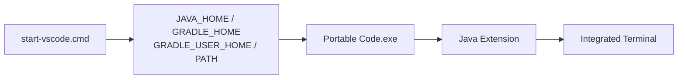
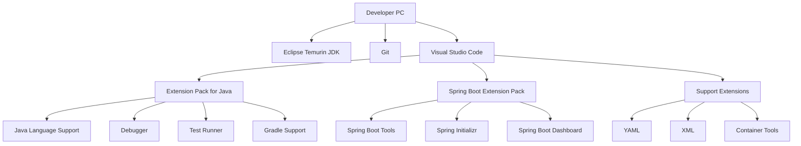

# JDK 연계 및 VS Code 개발환경 운영 가이드

## 1. 문서 목적

본 문서는 앞 단계에서 준비한 **Eclipse Temurin JDK**와 VS Code Java Extension의 관계를 설명하고, MicroServer 프로젝트에서 사용할 **프로젝트별 JDK 운영 방식**과 VS Code 개발환경 점검 방법을 정리한다.

현재는 아직 실제 MicroServer 프로젝트를 생성하기 전이다.

따라서 Workspace 설정 파일을 바로 만들기보다 다음 내용을 이해하고 확인하는 데 집중한다.

- VS Code와 JDK의 관계
- Java Extension이 JDK를 사용하는 구조
- `Java: Configure Java Runtime`
- 프로젝트별 JDK 운영 방향
- 시스템 `JAVA_HOME` 의존 최소화
- Extension 문제 확인 방법
- 현재 환경 구성 단계의 완료 기준

---

## 2. JDK와 VS Code의 관계

JDK는 VS Code에 포함된 개발도구가 아니다.

구성요소의 역할을 구분하면 다음과 같다.

| 구성 | 역할 |
|---|---|
| Eclipse Temurin JDK | Java Compiler와 Java Runtime 제공 |
| VS Code | Editor / IDE UI 제공 |
| Java Extension | VS Code에서 Java 개발 기능 제공 |
| Spring Boot Extension | Java 환경 위에서 Spring Boot 기능 제공 |
| Workspace | 향후 특정 프로젝트의 개발 설정 관리 |

구조:


---

## 3. Portable VS Code와 JDK / Gradle 환경의 관계

Eclipse와 VS Code는 JDK를 연결하는 방식이 다르다.

Eclipse는 `eclipse.ini`의 `-vm` 설정으로 Eclipse 자체가 사용할 JVM을
명시적으로 지정하는 구성이 익숙하다.

반면 VS Code 자체는 Java JDK로 실행되는 프로그램이 아니다.

```text
VS Code 자체 실행
→ Code.exe / Electron Runtime

Java 개발 기능
→ Java Extension이 JDK 사용

Gradle 개발 기능
→ Gradle / Gradle Extension / 향후 Wrapper가 JDK 사용

Integrated Terminal
→ VS Code Process가 상속한 환경변수 사용 가능
```

따라서 VS Code Portable Mode에서 중요한 것은
`Code.exe`의 JVM을 지정하는 것이 아니라 **Java Extension과 개발 Terminal이
MicroServer의 JDK / Gradle을 일관되게 찾을 수 있게 만드는 것**이다.

### 3.1 Windows 개발환경 구조

MicroServer Windows 기준:

```text
C:\local-microserver
│
├─ tools
│  ├─ jdk
│  │  └─ temurin-25
│  │
│  ├─ gradle
│  │  └─ gradle-9.7.1
│  │
│  └─ vscode
│     ├─ Code.exe
│     └─ data
│        ├─ user-data
│        └─ extensions
│
├─ gradle-home
└─ env
   └─ start-vscode.cmd
```

### 3.2 `start-vscode.cmd`에서 Session 환경 주입

VS Code를 실행하기 전에 다음 환경을 현재 Process에 구성할 수 있다.

```cmd
@echo off

set "LOCAL_MICROSERVER=C:\local-microserver"

set "JAVA_HOME=%LOCAL_MICROSERVER%\tools\jdk\temurin-25"
set "GRADLE_HOME=%LOCAL_MICROSERVER%\tools\gradle\gradle-9.7.1"
set "GRADLE_USER_HOME=%LOCAL_MICROSERVER%\gradle-home"

set "PATH=%LOCAL_MICROSERVER%\tools\vscode\bin;%JAVA_HOME%\bin;%GRADLE_HOME%\bin;%PATH%"

start "" "%LOCAL_MICROSERVER%\tools\vscode\Code.exe"
```

이 Script를 통해 시작된 VS Code는 부모 Process의 환경을 상속받는다.



이 방식은 Windows 시스템 환경변수에 MicroServer JDK를 영구 등록하는 것과 다르다.

### 3.3 세 가지 Java 설정 범위를 구분

MicroServer에서는 Java 환경을 다음 세 범위로 구분해서 이해한다.

| 구분 | 역할 | 현재 기준 |
|---|---|---|
| 시스템 전역 `JAVA_HOME` | Windows 전체 기본 Java | 프로젝트용으로 영구 고정하지 않음 |
| Session `JAVA_HOME` | `start-vscode.cmd`에서 시작되는 VS Code / Terminal Bootstrap | Temurin 25 사용 가능 |
| Workspace JDK | 실제 MicroServer Project의 Java Runtime | 프로젝트 생성 이후 명시적으로 설정 |

즉 `start-vscode.cmd`의 `JAVA_HOME`은
**프로젝트 생성 전 VS Code Java 개발환경을 안정적으로 시작하기 위한 Bootstrap 기준**이고,
실제 프로젝트 JDK의 최종 기준은 프로젝트 생성 이후 Workspace에서 다시 확인한다.

### 3.4 이미 실행 중인 VS Code와 환경변수

VS Code는 같은 User Data Instance가 이미 실행 중이면
새로 실행한 Process가 기존 Instance와 연결될 수 있다.

따라서 `start-vscode.cmd`의 JDK / Gradle 경로를 변경한 뒤에는
다음 순서를 권장한다.

```text
MicroServer Portable VS Code 완전 종료
        ↓
start-vscode.cmd 실행
        ↓
새 환경변수를 상속한 VS Code 시작
        ↓
Integrated Terminal 새로 생성
        ↓
java -version / gradle --version 확인
```

현재는 아직 Spring Boot 프로젝트가 없으므로
`gradlew.bat`이나 프로젝트 Build는 실행하지 않는다.

### 3.5 Portable Mode와 프로젝트 Workspace 설정의 역할 차이

Portable Mode:

```text
VS Code Settings / Extension / Profile 저장 위치를 독립화
```

Session Script:

```text
VS Code 시작 시 사용할 JDK / Gradle 환경 제공
```

Workspace Settings:

```text
프로젝트가 생성된 이후 해당 프로젝트의 JDK / IDE 설정 고정
```

세 가지를 함께 사용하면
**개발도구 Package의 이동성**과 **프로젝트 설정의 재현성**을 동시에 확보할 수 있다.

관련 문서:

- [VS Code 설치 및 기본 설정](vscode_install_basic_setup.md)
- [프로젝트 JDK / VS Code Workspace 설정](../../03_project_creation/project_environment/project_jdk_vscode_setup.md)


## 4. MicroServer의 JDK 운영 방향

일반적인 Java 개발환경 구성에서는 다음 방식을 많이 사용한다.

```text
JDK Installer 실행
      ↓
JAVA_HOME 설정
      ↓
PATH 설정
      ↓
PC 전체에서 동일 JDK 사용
```

MicroServer 프로젝트에서는 프로젝트별 개발환경을 분리하기 위해 다음 구조를 기본 방향으로 한다.

```text
Temurin JDK 별도 준비
      ↓
여러 JDK를 개발 PC에 보관
      ↓
VS Code Java Extension 사용
      ↓
프로젝트 생성 이후
      ↓
Workspace에서 프로젝트별 JDK 지정
```

예:

```text
C:\local-microserver
├─ tools
│  └─ jdk
│     ├─ temurin-17
│     ├─ temurin-21
│     └─ temurin-25
│
└─ repos
   ├─ legacy-project      → JDK 17
   └─ microserver         → JDK 25 LTS
```

이 방식은 STS/Eclipse에서 프로젝트별 Installed JRE/JDK를 선택하는 방식과 비슷한 목적을 가진다.

---

## 5. 프로젝트별 JDK 운영의 장점

다음과 같은 장점이 있다.

- 여러 JDK 버전을 동시에 보관할 수 있다.
- 프로젝트별 Java 버전을 독립적으로 관리할 수 있다.
- 다른 Java 프로젝트에 미치는 영향을 줄일 수 있다.
- 시스템 전역 `JAVA_HOME` 변경을 최소화할 수 있다.
- 개발환경 재현성을 높일 수 있다.
- VS Code Workspace 설정으로 프로젝트 기준을 명확히 할 수 있다.

특히 기존 시스템 유지보수와 신규 MicroServer 개발을 동시에 수행하는 개발자에게 유용하다.

---

## 6. VS Code Java Runtime 명령 확인

Java Extension Pack이 설치되어 있으면 Command Palette에서 Java Runtime 관련 명령을 사용할 수 있다.

Command Palette:

### Windows

```text
Ctrl + Shift + P
```

### macOS

```text
Command + Shift + P
```

검색:

```text
Java: Configure Java Runtime
```

이 화면은 Java 개발환경에서 사용하는 JDK Runtime을 확인하거나 구성할 때 사용한다.

현재 단계에서는 **앞 단계에서 준비한 Temurin JDK를 VS Code가 연결할 수 있는 기능이 준비되어 있다는 것**을 확인한다.

---

## 7. Java: Install New JDK

Java Extension 환경에서는 다음과 같은 명령도 확인할 수 있다.

```text
Java: Install New JDK
```

이 기능을 이용해 새로운 JDK 설치를 시작할 수도 있다.

하지만 MicroServer에서는 JDK 배포판과 버전을 프로젝트 기준에 맞춰 통일하기 위해 앞 단계의 **JDK 설치 및 설정 가이드에서 Eclipse Temurin JDK를 먼저 준비하는 방식**을 사용한다.

따라서 개발자가 VS Code에서 임의 Vendor의 JDK를 설치하는 방식은 프로젝트 기본 절차로 사용하지 않는다.

---

## 8. 실제 프로젝트별 JDK 설정 시점

현재는 아직 MicroServer 프로젝트가 없으므로 실제 Workspace JDK 설정을 만들지 않는다.

설정 시점은 다음과 같다.

```text
JDK 준비
   ↓
Gradle 기본 환경 준비
   ↓
VS Code 준비
   ↓
Java / Spring Extension 준비
   ↓
MicroServer Spring Boot 프로젝트 생성
   ↓
VS Code Workspace 열기
   ↓
프로젝트별 JDK / Gradle / Workspace 설정
```

즉, **JDK를 선택할 수 있는 VS Code 환경은 지금 준비하지만 실제 프로젝트 경로와 연결하는 설정은 프로젝트가 생성된 뒤 수행**한다.

---

## 9. 향후 Workspace 구조

프로젝트가 생성되면 다음과 같은 구조를 사용할 수 있다.

```text
microserver/
 ├─ .vscode/
 │   ├─ settings.json
 │   └─ extensions.json
 └─ ...
```

역할:

```text
settings.json
→ 프로젝트별 JDK 및 IDE 공통 설정

extensions.json
→ 프로젝트 권장 Extension 안내
```

현재는 파일의 목적만 이해하고 실제 설정 내용은 이후 프로젝트 가이드에서 작성한다.

---

## 10. JAVA_HOME과 프로젝트 JDK의 관계

시스템 `JAVA_HOME`은 운영체제 Terminal이나 외부 도구가 Java를 찾을 때 사용될 수 있다.

반면 VS Code Java 환경에서는 프로젝트 또는 Workspace 기준으로 Java Runtime을 지정할 수 있다.

따라서 다음 두 개념을 구분해야 한다.

```text
System JAVA_HOME
→ PC 전체 / Terminal 중심 Java 환경

VS Code Workspace JDK
→ 특정 프로젝트의 Java 개발환경
```

MicroServer에서는 후자를 프로젝트 개발환경의 기준으로 삼는다.

다만 Portable VS Code를 시작할 때 사용하는 **Session `JAVA_HOME`**도 구분해야 한다.

```text
System JAVA_HOME
→ Windows 시스템 전체에 영구 등록하는 Java

Session JAVA_HOME
→ start-vscode.cmd에서 현재 VS Code Process에 전달하는 Java

Workspace JDK
→ Spring Boot 프로젝트 생성 이후 해당 프로젝트가 사용할 Java
```

MicroServer는 System `JAVA_HOME`을 프로젝트 전용 값으로 영구 고정하지 않으며,
Portable VS Code 실행 시 Session 환경을 제공하고
프로젝트가 생성되면 Workspace JDK를 명시적으로 확인하는 구조를 사용한다.


Gradle 기본 환경은 앞 단계에서 이미 준비했지만,
**생성된 프로젝트가 사용할 Java 버전, Gradle Wrapper, `build.gradle` / `settings.gradle` Build 설정은 아직 구성하지 않는다.**

이 내용은 Spring Boot 프로젝트 생성 이후의 프로젝트 개발환경 설정 단계에서 다룬다.

---

## 11. Java Language Server와 Project JDK

VS Code의 Java 개발기능은 Java Language Server를 통해 제공된다.

개념적으로 다음 두 Runtime의 역할이 다를 수 있다.

```text
Java Language Server 실행용 Runtime
        ≠
Project Source를 컴파일할 때 사용할 JDK
```

따라서 VS Code Extension 자체가 동작하기 위한 Java 환경과 MicroServer Project가 사용할 Java 버전을 같은 개념으로 생각하지 않는 것이 중요하다.

프로젝트 생성 이후에는 **프로젝트용 JDK를 명시적으로 확인**한다.

---

## 12. Extension 문제 확인

Java나 Spring 관련 메뉴가 정상적으로 보이지 않는 경우 다음 순서로 확인한다.

### 12.1 Extension Enabled 확인

```text
Extensions
→ Installed
→ 해당 Extension 선택
→ Enabled 상태 확인
```

### 12.2 VS Code Reload

Command Palette:

```text
Developer: Reload Window
```

VS Code Window를 Reload한 후 다시 확인한다.

### 12.3 Output 확인

메뉴:

```text
View
→ Output
```

Output 목록에서 관련 Extension 로그를 확인한다.

향후 중요한 로그:

```text
Language Support for Java
Spring Boot Tools
Gradle for Java / Build Server for Gradle
```

### 12.4 Java Command 확인

Command Palette:

```text
Java:
```

Java 관련 명령이 나타나는지 확인한다.

### 12.5 Spring Command 확인

Command Palette:

```text
Spring
```

또는:

```text
Spring Boot
```

---

## 13. Java Language Server 문제 대응

향후 프로젝트를 열었을 때 Java Project 인식이 비정상인 경우 다음 명령을 사용할 수 있다.

```text
Java: Clean Java Language Server Workspace
```

이 명령은 Java Language Server의 Workspace 정보를 정리하고 Java Project를 다시 인식시키는 데 사용할 수 있다.

> 현재 프로젝트 생성 전 단계에서는 실행할 필요가 없다.
> 향후 문제 해결 명령으로 알아둔다.

---

## 14. Extension 업데이트 이후 문제

Java / Spring Extension은 지속적으로 업데이트된다.

업데이트 직후 개발환경에서 문제가 발생하면 다음을 확인한다.

- 최근 Extension Update 여부
- Extension Enabled 상태
- VS Code Reload
- Output Log
- Java Runtime 인식 상태
- 팀 내 동일 문제 발생 여부

문제가 프로젝트 전체에 영향을 준다면 특정 Extension 버전을 팀에서 통일할 수 있다.

---

## 15. 현재 단계에서 하지 않는 작업

본 문서가 끝나더라도 아직 다음 작업은 하지 않는다.

```text
Spring Boot 프로젝트 생성
build.gradle / settings.gradle 작성 / 수정
Gradle Dependency 추가
Java Package 생성
Application Class 작성
application.yml 작성
Database 연결
Application 실행
Debug 실행
JUnit Test 작성
```

현재 목표는 다음 상태이다.

```text
VS Code 설치
        +
Java Extension 준비
        +
Spring Boot Extension 준비
        +
지원 Extension 준비
        +
Temurin JDK 준비
        +
프로젝트별 JDK를 연결할 수 있는 환경 이해
```

---

## 16. VS Code 환경 구성 완료 상태

환경 구성이 완료되면 개발 PC는 다음 상태가 된다.



---

## 17. 최종 체크리스트

### VS Code

- [ ] Windows Portable VS Code가 `C:\local-microserver\tools\vscode`에 준비되어 있다.
- [ ] Portable `data` Directory의 역할을 이해했다.
- [ ] `start-vscode.cmd`를 이용한 Session 환경 주입 방식을 이해했다.
- [ ] VS Code가 정상 설치되어 있다.
- [ ] Command Palette를 사용할 수 있다.
- [ ] Extensions 화면을 사용할 수 있다.
- [ ] Terminal을 사용할 수 있다.
- [ ] Output을 확인할 수 있다.

### Java

- [ ] Eclipse Temurin JDK가 앞 단계에서 준비되어 있다.
- [ ] Extension Pack for Java가 설치되어 있다.
- [ ] `Java: Configure Java Runtime` 명령을 확인할 수 있다.
- [ ] 프로젝트별 JDK 운영 방향을 이해했다.
- [ ] System `JAVA_HOME`, Session `JAVA_HOME`, Workspace JDK의 차이를 이해했다.

### Spring Boot

- [ ] Spring Boot Extension Pack이 설치되어 있다.
- [ ] Spring Boot Tools가 설치되어 있다.
- [ ] Spring Initializr가 설치되어 있다.
- [ ] Spring Boot Dashboard가 설치되어 있다.

### 지원 환경

- [ ] YAML이 설치되어 있다.
- [ ] XML이 설치되어 있다.
- [ ] Container Tools가 설치되어 있다.

### 단계 확인

- [ ] 아직 MicroServer Spring Boot 프로젝트를 생성하지 않았다.
- [ ] 아직 `build.gradle` / `settings.gradle`을 작성하지 않았다.
- [ ] 아직 Application 실행 / Debug를 하지 않았다.
- [ ] 실제 Workspace JDK 설정은 프로젝트 생성 이후 적용한다.

---

## 18. 다음 단계

이 문서까지 완료하면 VS Code 개발환경 구성은 끝난다.

다음 단계에서는 **Spring Boot 프로젝트를 실제로 생성**한다.

**[Spring Boot 프로젝트 생성](../../03_project_creation/spring_boot_project_create.md)**

```text
JDK 설치 및 설정
        ↓
Gradle 설치 및 기본 환경 구성
        ↓
VS Code 개발환경 구성       ← 현재 완료
        ↓
Spring Boot 프로젝트 생성
        ↓
프로젝트 JDK / Gradle / VS Code 설정
        ↓
프로젝트 기본 구조 구성
```

현재까지는 개발 PC에 JDK, Gradle, VS Code와 필요한 Extension을 준비한 상태이다.

실제 `.vscode/settings.json`, `java.configuration.runtimes`,
Gradle Wrapper, `build.gradle` / `settings.gradle`의 Java / Build 설정 등은
Spring Boot 프로젝트 생성 이후의 **프로젝트 개발환경 설정 단계**에서 적용한다.

## 참고

- [VS Code Portable Mode](https://code.visualstudio.com/docs/setup/portable)
- [VS Code Command Line Interface](https://code.visualstudio.com/docs/configure/command-line)

- Managing Java Projects in VS Code  
  <https://code.visualstudio.com/docs/java/java-project>

- Java Extensions for Visual Studio Code  
  <https://code.visualstudio.com/docs/java/extensions>

- Spring Boot in Visual Studio Code  
  <https://code.visualstudio.com/docs/java/java-spring-boot>